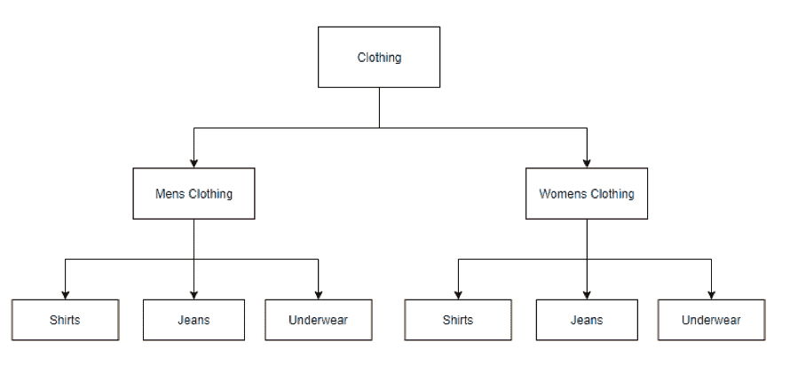
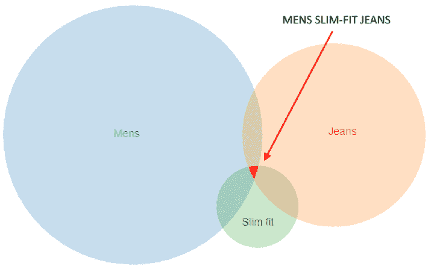
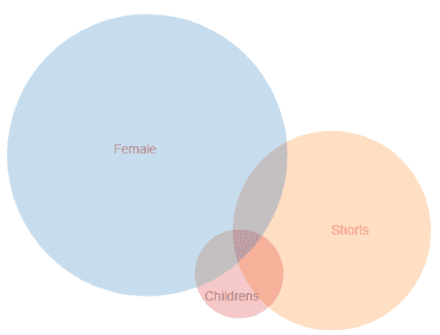
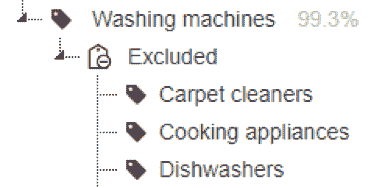
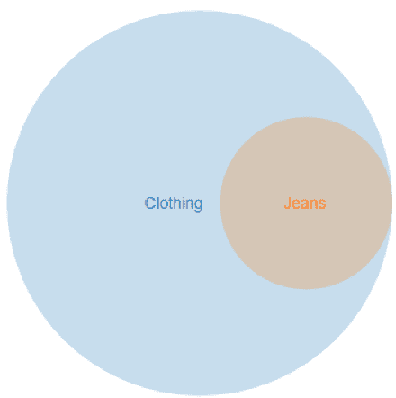
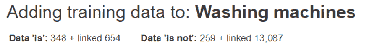

# 如何从训练数据中榨取最大价值

> 原文：[`www.kdnuggets.com/2017/07/squeeze-most-from-training-data.html`](https://www.kdnuggets.com/2017/07/squeeze-most-from-training-data.html)

**由 [David Bishop](https://www.linkedin.com/in/davbis93/?ppe=1)，Love the Sales 的 CTO。**

在许多情况下，获取良好标注的训练数据是开发准确预测系统的巨大障碍。在 [Love the Sales](https://www.lovethesales.com/) ，我们需要将 200 万个产品（主要是时尚和家居用品）的文本元数据分类到 1000 多个不同的类别中——这些类别以层级形式呈现。

为了实现这一点，我们构建了一个层级树，由链式的 2 类线性（正面与负面）支持向量机（LibSVM）组成，每个 SVM 负责每个层级类的二元文档分类。

**数据结构**

一个关键的学习点是，这些 SVM 的结构实际上会对需要应用多少训练数据产生重大影响，例如，一个幼稚的方法可能是：

这种方法要求对于每个额外的子类别，都要训练两个新的 SVM——例如，新增一个“泳装”类别将需要在男性和女性类别下分别增加一个 SVM——更不用说在顶级添加“中性”类别的潜在复杂性。总体而言，深层次的层级结构可能过于僵化，难以处理。

通过将我们的数据结构展平成多个子树，我们能够避免大量的标注和训练工作，如下所示：

通过将我们的分类结构与最终层级解耦，可以通过遍历 SVM 层级和使用简单的基于集合的逻辑来生成最终分类，如：

*男士修身牛仔裤 = (男士 和 牛仔裤 和 修身版) 而不是女士*

这种方法大大减少了分类文档所需的 SVM 数量，因为结果集可以交集以表示最终分类。

现在也应该显而易见，添加新类别会使最终类别的数量呈指数级增长。例如——添加一个顶级的“儿童”类别——会立即允许创建一个新的儿童类别维度（儿童牛仔裤、衬衫、内衣等），只需少量额外的训练数据（仅需一个额外的 SVM）：

**数据重用**

由于我们选择的结构，一个关键的洞察是可以通过链接数据关系重用训练数据。数据链接使我们能够将训练数据重用总因子提高到 9 倍，从而大大降低了成本并提高了预测的准确性。

对于每个单独的类别，我们显然希望拥有尽可能多的训练数据示例，涵盖所有可能的结果。尽管我们构建了一些出色的内部工具来帮助批量手动标注训练数据——标注每种产品的数千个示例可能既费时又昂贵且容易出错。我们确定解决这些问题的最佳方法是尽可能重用不同类别的训练数据。

例如，考虑到对类别的基本领域知识——我们可以确定‘洗衣机’*永远*不能是‘地毯清洗机’

通过添加‘排除数据’的功能，我们可以通过将‘地毯清洗机’SVM 的*‘正面’*训练数据添加到‘洗衣机’SVM，从而大大增加‘负面’训练示例的数量。更简单地说，既然我们知道“地毯清洗机*永远*不能是洗衣机”——我们不妨重用这些数据。

这种方法有一个不错的优势，即每当需要添加一些额外的训练数据以改善‘地毯清洗机’的 SVM 时——它通过链接的负面数据无意中改善了‘洗衣机’类别。

最后，当考虑层次结构时，另一个明显的重用机会是任何子节点的正面训练数据，也*总是*是其父节点的正面训练数据。例如：‘牛仔裤’*总是*‘服装’。

这意味着每当向‘牛仔裤’SVM 添加一个正面示例时——通过链接，也会向‘服装’SVM 添加一个额外的正面示例。

添加链接比手动标注成千上万的例子要高效得多。

当涉及到层次分类系统时，将分类组件与结果层次结构解耦，扁平化数据结构并启用重用或训练数据将有助于尽可能提高效率。上述方法不仅有助于减少我们需要标注的训练数据量，还使我们总体上获得了更大的灵活性。

参考资料：LibSVM –[`www.csie.ntu.edu.tw/~cjlin/libsvm/`](https://www.csie.ntu.edu.tw/~cjlin/libsvm/)

**简历：**[David Bishop](https://www.linkedin.com/in/davbis93/?ppe=1)**** 是 LovetheSales.com 的首席技术官——一个零售销售聚合平台，使消费者能够从数百家零售商那里找到和比较所有销售中的产品，以找到他们想要的品牌和产品的最佳价格。该网站成立于 2013 年，是全球最大的销售平台，覆盖所有区域，提供超过 1,000,000 件销售商品。

**相关：**

+   什么是支持向量机，为什么我会使用它？

+   7 种低成本获取高质量标注训练数据的方法

+   使用支持向量回归在 R 中构建回归模型

* * *

## 我们的前三名课程推荐

 1\. [Google 网络安全证书](https://www.kdnuggets.com/google-cybersecurity) - 快速进入网络安全职业生涯。

 2\. [Google 数据分析专业证书](https://www.kdnuggets.com/google-data-analytics) - 提升你的数据分析技能

 3\. [Google IT 支持专业证书](https://www.kdnuggets.com/google-itsupport) - 支持你在 IT 领域的组织

* * *

### 更多相关话题

+   [使用 TensorFlow 和 Keras 构建和训练你的第一个神经网络](https://www.kdnuggets.com/2023/05/building-training-first-neural-network-tensorflow-keras.html)

+   [如何利用合成数据克服机器学习模型训练中的数据短缺](https://www.kdnuggets.com/2022/03/synthetic-data-overcome-data-shortages-machine-learning-model-training.html)

+   [机器学习中训练数据和测试数据的区别](https://www.kdnuggets.com/2022/08/difference-training-testing-data-machine-learning.html)

+   [来自 Anaconda 的新课程！数据科学培训和云托管笔记本](https://www.kdnuggets.com/2022/11/anaconda-new-anaconda-data-science-training-cloud-hosted-notebooks.html)

+   [Nvidia 的在线培训和研讨会](https://www.kdnuggets.com/2022/07/online-training-workshops-nvidia.html)

+   [如何加速 XGBoost 模型训练](https://www.kdnuggets.com/2021/12/speed-xgboost-model-training.html)
