# Stack Overflow 调查数据科学亮点

> 原文：[`www.kdnuggets.com/2021/08/stack-overflow-survey-data-science-highlights.html`](https://www.kdnuggets.com/2021/08/stack-overflow-survey-data-science-highlights.html)

评论

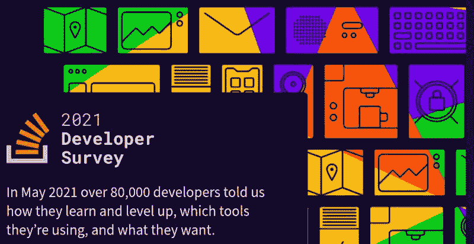

每年，Stack Overflow 都会对其用户进行调查，以帮助开发社区和平台的完善。今年，超过 80,000 名开发者分享了他们的学习方式、使用的工具和语言，并提供了对 Stack Overflow 方向有价值的反馈。结果还呈现了调查时开发者和开发情况的快照。

* * *

## 我们的前三课程推荐

 1\. [谷歌网络安全证书](https://www.kdnuggets.com/google-cybersecurity) - 快速进入网络安全职业道路。

 2\. [谷歌数据分析专业证书](https://www.kdnuggets.com/google-data-analytics) - 提升你的数据分析技能

 3\. [谷歌 IT 支持专业证书](https://www.kdnuggets.com/google-itsupport) - 支持你的组织 IT 工作

* * *

**[2021 年 Stack Overflow 调查](https://insights.stackoverflow.com/survey/2021)**的结果最近公开分享，并附上了 Stack Overflow 提供的评论和见解。我们将查看一些与数据科学、数据科学家及所有相关数据职位和专业人员相关的有趣数据点。

## 开发者资料

调查的第一部分集中于回答开发者自身的特点：如年龄和地理位置等人口统计信息；他们编程的时长；他们如何学习编程；以及更多。

一些快速且有趣的引用，特别是与学习编程以及开发者就业相关的内容，直接来自于调查概述，并附上一些总结关键开发者资料问题的回应频率的图表。

> 例如，今年我们观察到开发者教育方式的显著变化。对于 18 岁以下的新一代编码者来说，在线资源如视频和博客比书籍和学校更受欢迎，而这种统计数据在我们其他年龄段的编码者中并不成立。总体来看，行业中有很多新加入者，超过 50%的人表示他们编程不到十年，超过 35%的人编程经验不足五年。

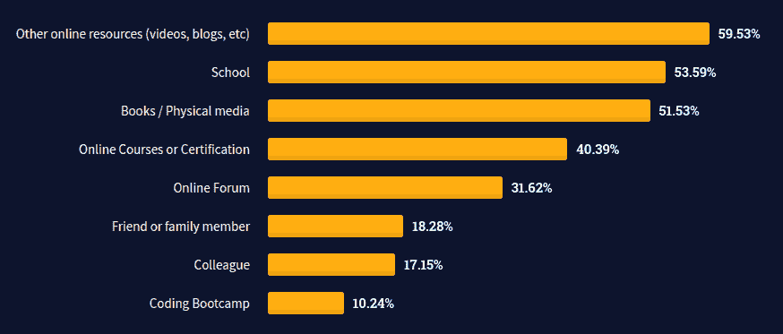

**图 1**. 对 2021 年 Stack Overflow 调查问题“*你是如何学习编程的？*”的回答

> 几乎 60% 的受访者通过在线资源学习编程并不令人惊讶。年轻的受访者倾向于从在线课程、论坛和其他在线资源中学习。另一方面，年长的受访者则通过更传统的媒介如学校和书籍进行学习。
> 
> 81% 的专业开发者全职工作，较 2020 年的 83% 有所下降。专业开发者中表示自己是独立承包商、自由职业者或自雇的比例从 2020 年的 9.5% 增加到 2021 年的 11.2%，这表明可能存在就业不安全或转向更灵活的工作安排的趋势。

现在我们暂时关注开发者的教育水平。

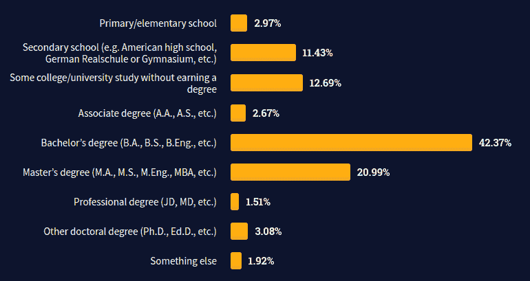

**图 2**。2021 年 Stack Overflow 调查问题的回答“*以下哪项最能描述你已完成的最高正式教育水平？*”

> 所有受访者中有 70% 和 80% 的专业开发者完成了一些形式的高等教育，其中学士学位最为常见。

开发者档案部分讨论的其他话题包括种族、性取向、地理位置等人口统计数据，

## 技术

现在我们转向调查的核心内容，即开发者目前正在使用哪些语言和技术的问题。

### 语言

首先是语言，这是人们在拿到报告时最想看到的无可争议的第一大问题。

那么，受访者在过去一年中使用了哪些编程、脚本和标记语言进行开发？

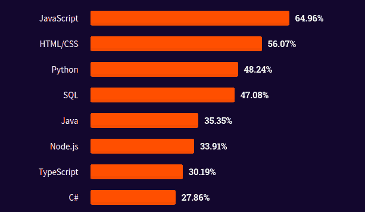

**图 3**。2021 年 Stack Overflow 调查问题的回答“*在过去一年中，你在哪些编程、脚本和标记语言中进行了大量开发工作？在未来一年中，你希望使用哪些语言？*”

对数据科学人士特别重要的是，Python 在 48.24% 的回答中被提到，目前是开发者使用的最常见语言之一。

请注意，虽然数据科学语言 R 在**图 3**的前几名回答中没有出现（由于回答的长尾被截断），但 R 语言被包含在 5.07% 的回答中。

我们已经看到开发者正在使用哪些语言，但关于开发者*想要*使用的语言呢？有多少开发者虽然没有用某种语言或技术进行开发，但对其表达了兴趣。

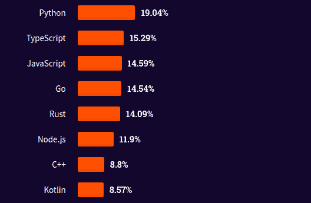

**图 4**。2021 年 Stack Overflow 调查问题的回答“*在过去一年中，你在哪些编程、脚本和标记语言中进行了大量开发工作？在未来一年中，你希望使用哪些语言？*”

再次，正如**图 4**中 R 语言没有出现一样，它被包含在 2.82% 的回答中。

那么更具洞察力的"[工作过 vs 想要工作](https://insights.stackoverflow.com/survey/2021#worked-with-vs-want-to-work-with-language-worked-want)怎么样呢？"

> 这里有很多要深入探讨的内容，但以下是我们发现的一些最显著的趋势。有超过 10,000 名 Javascript 开发者希望开始或继续使用 Go 或 Rust 开发。大多数希望使用 Dart 的开发者目前正在使用 JavaScript。我们还看到，唯一想要使用 PHP 的开发者是 SQL 开发者。

这些信息存储在一个[互动可视化](https://insights.stackoverflow.com/survey/2021#worked-with-vs-want-to-work-with-language-worked-want)中，最佳使用方式是直接访问 Stack Overflow 开发者调查网站。

### 数据库

继续讨论数据库... 这是对等问题的结果，旨在评估数据库产品的使用情况。

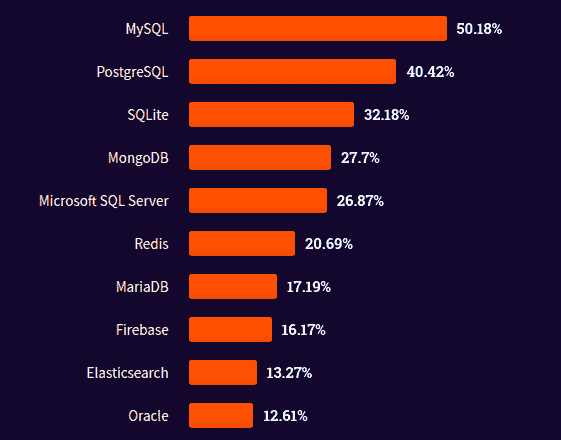

**图 5**。回应 2021 年 Stack Overflow 调查问题"*你在过去一年中在哪些数据库环境中进行了大量开发工作？你希望在未来一年中在哪些环境中工作？*"

这非常直接，但我们可以看到 SQL 数据库占据了前三名，前五名中有四个位置。这似乎是开发者对 SQL 数据库的持续认可。

### 云平台

在云平台方面，AWS 似乎是霸主，Google Cloud 和 Microsoft Azure 也占据了市场的相当份额。

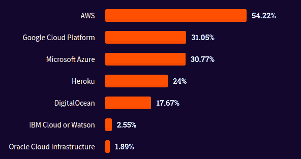

**图 6**。回应 2021 年 Stack Overflow 调查问题"*你在过去一年中在哪些云平台上进行了大量开发工作？你希望在未来一年中在哪些平台上工作？*"

有趣的是，开发者喜欢的云平台与他们害怕的云平台的对比与开发者实际使用的那些平台的回应非常接近。也不无道理地认为，IBM Cloud 和 Oracle Cloud 的低采用率可能与开发者对再次使用它的恐惧相关。

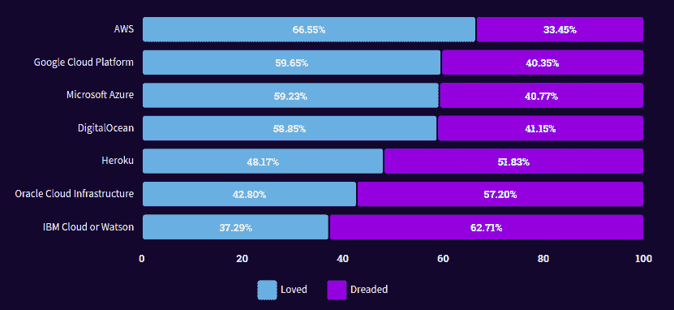

**图 7**。回应 2021 年 Stack Overflow 调查问题"*你在过去一年中在哪些云平台上进行了大量开发工作？你希望在未来一年中在哪些平台上工作？*"

### 其他框架和库

查看最常用和最受欢迎的其他框架和库，你会发现许多专门针对数据科学家和/或机器学习工程师的，或者这些职业人士使用频繁的框架和库。

> 虽然 Tensorflow 是最受欢迎的库，但 Pytorch 更受喜爱。作为 Stack Overflow 上的.NET Core 用户，我们很高兴看到它位居榜首。

很容易争辩说，至少以下 7 个库和框架与从事数据工作的专业人士非常相关，更多的可能性甚至更大。

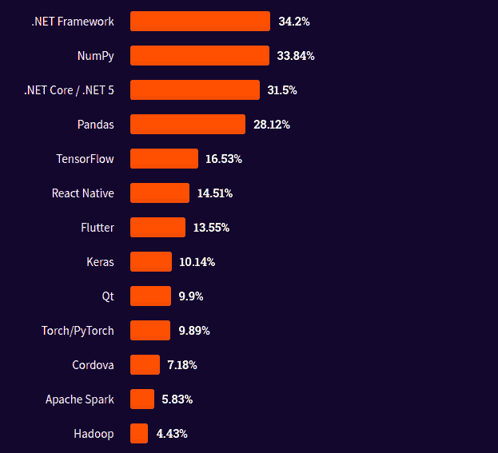

**图 8**. 2021 年 Stack Overflow 调查问题的回应 "*在过去一年中，你在其他哪些框架和库上进行了大量开发工作？你希望在未来一年中使用哪些框架和库？*"

转向开发者希望使用的框架和库时，许多与数据科学相关的工具也会出现在这里。

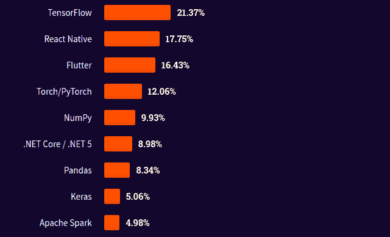

**图 9**. 2021 年 Stack Overflow 调查问题的回应 "*在过去一年中，你在其他哪些框架和库上进行了大量开发工作？你希望在未来一年中使用哪些框架和库？*"

### 学习与问题解决

作为开发者，当你遇到困难时会怎么做？图 10 似乎表明 Google 确实是你的朋友。我们都这样做...

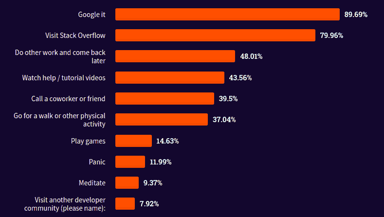

**图 10**. 2021 年 Stack Overflow 调查问题的回应 "*当你在解决问题时遇到困难时，你会怎么做？*"

## 薪资

我们将从报告中最后查看薪资数据。

> 在各个领域，工程经理、SRE、DevOps 专家和数据工程师通常获得最高薪资。当我们关注美国时，薪资范围底部存在一些差异。在美国，与全球开发者人口相比，移动开发者和教育工作者的薪资通常更高。

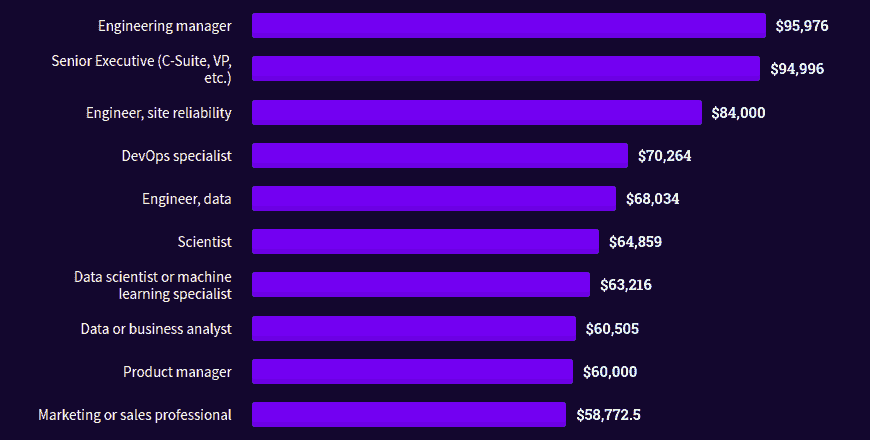

**图 11**. 2021 年 Stack Overflow 调查问题的回应 "*你目前的总薪酬是多少（薪水、奖金和津贴，税前和扣除前）？*"

工具和技术的使用对你赚取收入的能力有何影响？

报告提供了多个变量来关联薪资；尽管这不是一个完美的方法，但我们来看看*其他框架和库*这一类别，它似乎是数据科学家进行调查的一个有趣数据点。看起来这个列表主要由我们可能日常使用的一些库和工具组成。

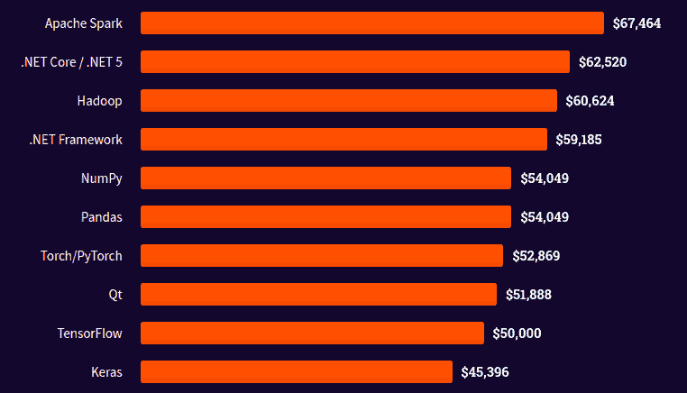

**图 12**. 2021 年 Stack Overflow 调查问题的回应 "*你目前的总薪酬是多少（薪水、奖金和津贴，税前和扣除前）？*"

基于单一技术推测薪资是困难的，但仍然很有趣的是一起查看顶级技术。

**相关**：

+   数据科学家的价值是多少？

+   顶级编程语言及其用途

+   数据科学家的高效 Python 编程指南

### 更多相关话题

+   [本周 AI 资讯，8 月 7 日：生成式 AI 进军 Jupyter & Stack…](https://www.kdnuggets.com/2023/mm/this-week-ai-2023-08-07.html)

+   [如何在预算内建立你的数据科学栈](https://www.kdnuggets.com/2022/01/data-science-stack-budget.html)

+   [全栈一切？数据科学、开发和技术之间的组织交集](https://www.kdnuggets.com/2022/08/full-stack-everything-organizational-intersections-data-science-dev-tech.html)

+   [为什么通用语义层对你的数据栈有好处的 6 个原因](https://www.kdnuggets.com/2024/01/cube-6-reasons-why-a-universal-semantic-layer-is-beneficial)

+   [弹性机器学习栈是模块化的](https://www.kdnuggets.com/2022/06/comet-resilient-ml-stack-modular.html)

+   [免费全栈 LLM 训练营](https://www.kdnuggets.com/2023/06/free-full-stack-llm-bootcamp.html)
