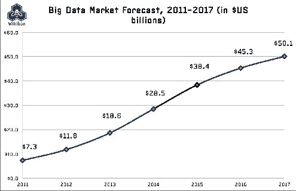
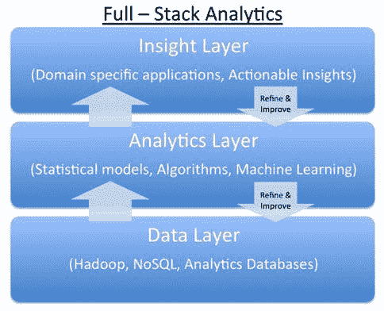

# 堆积牌组：大数据的下一波机会

> 原文：[`www.kdnuggets.com/2014/05/stacking-deck-next-wave-opportunity-big-data.html`](https://www.kdnuggets.com/2014/05/stacking-deck-next-wave-opportunity-big-data.html)

**嘉宾文章，作者：Chip Hazard（Flybridge Capital Partners），2014 年 5 月**。

在最近的分析周大会上，我参加了由 KDnuggets 的 Gregory Piatetsky 主持的小组讨论，在讨论中我被问及我们在哪里看到大数据领域的投资机会。

本文将扩展我在会议上的一些评论。重要的是，我对这些观察的视角来自我们作为种子和早期阶段风险投资者的角色，这意味着我们在关注市场机会将在未来 3-5 年内如何发展，而不一定是当前市场的情况。

近年来，数十亿美元的风险投资资金流入了帮助组织存储、管理和分析前所未有的数据量的大数据基础设施公司。这些资金的接受者包括 Hadoop 供应商如 Cloudera、HortonWorks 和 MapR；NoSQL 数据库提供商如 MongoDB（一个 Flybridge 投资组合公司，我在董事会任职）、DataStax 和 Couchbase；BI 工具、Hadoop 上的 SQL 和分析框架供应商如 Pentaho、Jaspersoft、Datameer 和 Hadapt。

此外，大型现有供应商如 Oracle、IBM、SAP、HP、EMC、TIBCO 和 Informatica 正在将大量研发和并购资源投入到大数据基础设施中。私人公司正在吸引资本，而大型公司则在这一市场上投入资源，因为市场整体规模庞大（2013 年支出为[一个估算](http://wikibon.org/wiki/v/Big_Data_Vendor_Revenue_and_Market_Forecast_2013-2017)为 180 亿美元），并且增长迅速（预计到 2016 年达到 450 亿美元，按相同估算的年均增长率为 35%），如下图所示：

尽管今天大量投资和收入资金流入大数据基础设施市场，但从未来展望来看，我们认为这些市场的赢家已经大致确定并且资本充足，新公司想要利用这些大数据趋势的机会则在其他地方，特别是在我们 Flybridge 称之为全栈分析公司的领域。

**全栈分析公司**可以这样定义：

1.  他们将上述供应商在基础设施层的所有进展和创新结合在一起

1.  一个专有的分析、算法和机器学习层

1.  从数据中提取独特且可操作的洞察，以解决实际业务问题。

1.  从显著的数据“网络效应”中受益，以至于随着积累更多数据和洞察力，其洞察力和解决方案的质量以非线性方式随着时间的推移不断改善。

    以下图形展示了全栈分析平台：

上述标准中特别值得提及的两个要点是**可操作的洞察力**和**数据网络效应**的概念。

关于**可操作的洞察力**的概念，我们从大型公司首席信息官和业务部门负责人那里听到的一个反复出现的主题是，他们被数据淹没，但缺乏能改变他们决策的洞察力。因此，将数据简化为可以在合理时间内采取行动的内容，帮助公司创造更多收入、更好地服务客户或提高运营效率，变得至关重要。

关于**数据网络效应**，全栈分析公司最重要的机会之一是使用机器学习技术（我的合伙人杰夫·布斯根[曾经写过](http://bostonvcblog.typepad.com/vc/2012/05/forget-plastics-its-all-about-machine-learning.html)这方面的内容）来开发一组随着分析更多客户的数据而不断改进的洞察力——实际上，是通过更多的数据暴露来学习业务背景，以推动更好的洞察力，从而做出更好的决策。这既提供了越来越有说服力的解决方案，又使公司能够建立竞争壁垒，随着时间的推移这些壁垒变得越来越难以逾越——即，创建了一个网络效应，数据摄取越多，学习越多，从而导致更好的决策和进一步摄取更多数据的机会。

在 Flybridge Capital 投资组合中，我们支持了包括全栈分析公司在内的多个企业。

+   [DataXu](http://www.dataxu.com/)，其全栈分析程序化广告平台每天做出数十亿次决策，使大型在线广告商能够更有效地管理其营销资源；

+   [ZestFinance](http://www.zestfinance.com/)，其全栈分析承保平台通过解析数千个数据点来识别在风险调整基础上最具吸引力的消费者，以用于其消费者贷款平台；并且

+   [Predilytics](http://www.predilytics.com/)，其全栈分析平台通过学习数百万数据点来帮助医疗保健组织吸引、留住现有会员并为他们提供更高质量的护理。

每家公司都展示了作为全栈分析公司的成功关键标准：

1.  识别出一个具有大量数据的大市场机会；

1.  组建一个对该市场具有独特领域洞察力的团队，并了解数据如何推动差异化决策，并具备开发所需的技术技能组合；

1.  管理一个大规模可扩展的学习平台，该平台具有自我强化的特点。

如果你的公司能遵循这成功的秘诀，你会发现作为全栈分析提供商的未来非常光明！

 是 Flybridge Capital Partners 的普通合伙人，他专注于信息技术领域的公司和技术，包括云计算、大数据和企业 IT。

**相关：**

+   波士顿 AnalyticsWeek 面板亮点：大数据中的下一大事

+   CIOReview 顶级 100 家最具前景的大数据公司

+   大数据格局，v 3.0，分析

+   信息管理 10 家更多的大数据公司

+   2014 年 4 月 Analytics、大数据、数据挖掘并购及初创公司活动

+   Sand Hill 50 在大数据领域迅速而强劲

+   CIO Review 20 家最具前景的大数据公司

+   CIO Review 20 家最具前景的数据分析公司

* * *

## 我们的前三个课程推荐

 1\. [谷歌网络安全证书](https://www.kdnuggets.com/google-cybersecurity) - 快速进入网络安全职业的快车道。

 2\. [谷歌数据分析专业证书](https://www.kdnuggets.com/google-data-analytics) - 提升你的数据分析技能

 3\. [谷歌 IT 支持专业证书](https://www.kdnuggets.com/google-itsupport) - 支持组织的 IT 需求

* * *

### 更多相关话题

+   [提升你的数据科学职业到下一个水平](https://www.kdnuggets.com/2021/12/sas-advance-data-science-career-next-level.html)

+   [初级数据科学家：下一个层次](https://www.kdnuggets.com/2022/02/junior-data-scientist-next-level.html)

+   [数据分析师提升职级所需的技能](https://www.kdnuggets.com/2022/09/data-analyst-skills-need-next-promotion.html)

+   [RAPIDS cuDF 加速你的下一个数据科学工作流](https://www.kdnuggets.com/2023/04/rapids-cudf-speed-next-data-science-workflow.html)

+   [选择下一个数据科学职位前需要考虑的 5 件事](https://www.kdnuggets.com/2022/01/5-things-keep-mind-selecting-next-job.html)

+   [用需求数据技能加速你的下一个职业发展](https://www.kdnuggets.com/2023/01/datacamp-fast-track-next-move-indemand-data-skills.html)
