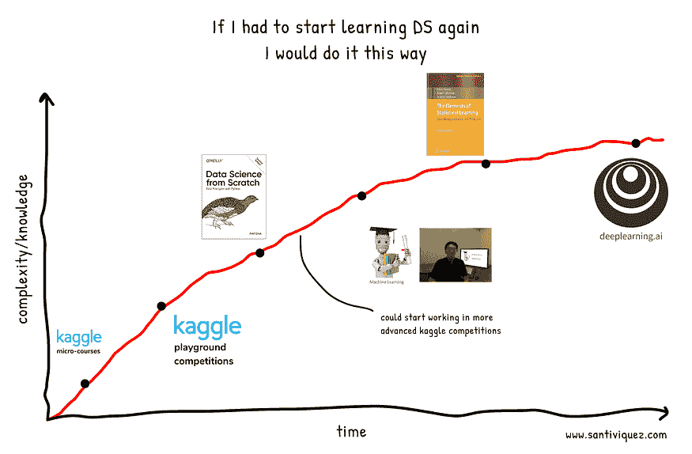

# 如果我必须重新开始学习数据科学，我会怎么做？

> 原文：[`www.kdnuggets.com/2020/08/start-learning-data-science-again.html`](https://www.kdnuggets.com/2020/08/start-learning-data-science-again.html)

不久前，我开始思考如果我必须重新开始学习机器学习和数据科学，我会从哪里开始？有趣的是，我想象的路径与我真正开始时的路径完全不同。

我知道我们每个人的学习方式都不同。有些人喜欢视频，有些人只用书就可以，还有很多人需要支付课程费用才能感受到更多压力。这没关系，因为重要的是学习并享受其中。

* * *

## 我们的前三推荐课程

 1\. [Google 网络安全证书](https://www.kdnuggets.com/google-cybersecurity) - 快速进入网络安全职业生涯。

 2\. [Google 数据分析专业证书](https://www.kdnuggets.com/google-data-analytics) - 提升你的数据分析能力

 3\. [Google IT 支持专业证书](https://www.kdnuggets.com/google-itsupport) - 支持你的组织进行 IT 支持

* * *

所以，从我自身的角度出发，了解自己如何更好地学习，我设计了这个路径，如果我需要重新开始学习数据科学的话。

正如你将看到的，我最喜欢的学习方式是逐渐从简单到复杂。这意味着从实际示例开始，然后转向更抽象的概念。

# Kaggle 微课程

我知道从这里开始可能有些奇怪，因为很多人会更愿意从最基本的基础和数学视频开始，以完全理解每个机器学习模型背后的运作。但从我的角度来看，从一些实用而具体的内容入手有助于更好地了解全貌。

此外，这些微课程每个大约需要 4 小时完成，因此预设这些小目标会带来额外的激励。

## Kaggle 微课程：Python

如果你对 Python 比较熟悉，可以跳过这一部分。在这里，你将学习基础的 Python 概念，这些概念将帮助你开始学习数据科学。关于 Python 的许多东西仍然会是个谜，但随着我们的进步，你将通过实践学习它。

链接：[`www.kaggle.com/learn/python`](https://www.kaggle.com/learn/python)

价格：免费

## Kaggle 微课程：Pandas

Pandas 将为我们提供在 Python 中操作数据的技能。我认为一个包含实际示例的 4 小时微课程足以让你对可以做的事情有个概念。

链接：[`www.kaggle.com/learn/pandas`](https://www.kaggle.com/learn/pandas)

价格：免费

## Kaggle 微课程：数据可视化

数据可视化可能是最被低估的技能之一，但它却是最重要的技能之一。它将帮助你全面理解你将要处理的数据。

链接：[`www.kaggle.com/learn/data-visualization`](https://www.kaggle.com/learn/data-visualization)

价格：免费

## Kaggle 微课程：机器学习导论

这就是激动人心的部分开始的地方。你将学习基本但非常重要的概念，以开始训练机器学习模型。这些概念以后将对你非常重要。

链接：[`www.kaggle.com/learn/intro-to-machine-learning`](https://www.kaggle.com/learn/intro-to-machine-learning)

价格：免费

## Kaggle 微课程：中级机器学习

这与前一个竞赛互补，但在这里你将第一次处理分类变量，并处理数据中的空字段。

链接：[`www.kaggle.com/learn/intermediate-machine-learning`](https://www.kaggle.com/learn/intermediate-machine-learning)

价格：免费

让我们在这里停下来一会儿。应该清楚的是，这五门微课程不会是线性过程，因为你可能需要来回切换它们以刷新概念。当你在学习 Pandas 课程时，可能需要回到 Python 课程以回忆你学到的一些知识，或者查看 pandas 文档以理解你在《机器学习导论》课程中看到的新函数。所有这些都是正常的，真正的学习就是在这里发生的。

现在，你将意识到这前五门课程将为你提供进行探索性数据分析（EDA）和创建基准模型所需的技能，之后你可以进一步改进这些模型。因此，现在是开始简单的 Kaggle 竞赛并实践你所学知识的最佳时机。

## Kaggle Playground 竞赛：泰坦尼克号

在这里，你将实践你在入门课程中学到的内容。刚开始时可能会有些让人紧张，但这没关系，因为这不是关于在排行榜上排第一，而是关于学习。在这个竞赛中，你将学习分类和这些类型问题的相关度量标准，如精确度、召回率和准确性。

链接：[`www.kaggle.com/c/titanic`](https://www.kaggle.com/c/titanic)

**Kaggle Playground 竞赛：房价预测**

在这个竞赛中，你将应用回归模型并学习相关的度量标准，如 RMSE。

链接：[`www.kaggle.com/c/home-data-for-ml-course`](https://www.kaggle.com/c/home-data-for-ml-course)

到这个阶段，你已经有了很多实践经验，你会感觉自己可以解决很多问题，但很可能你还不完全理解每个分类和回归算法背后发生的事情。因此，这时我们需要研究我们所学习的**基础**。

许多课程从这里开始，但至少在我做了一些实际操作之后，我对这些信息的吸收会更好。

# 书籍：从零开始的数据科学

此时，我们将暂时远离 pandas、scikit-learn 和其他 Python 库，以实际的方式学习这些算法“背后”发生了什么。

乔尔·格鲁斯的这本书相当易读，提供了每个主题的 Python 示例，并且没有很多繁重的数学内容，这对这个阶段至关重要。我们希望理解算法的原理，但从实际的角度出发，我们不希望通过阅读大量的数学符号而感到沮丧。

链接：[亚马逊](https://www.amazon.com/Data-Science-Scratch-Principles-Python/dp/1492041130/)

价格：大约$42

如果你已经读到这里，我会说你非常有能力从事数据科学工作，并理解解决方案背后的基本原理。因此，我邀请你继续参与更复杂的 Kaggle 竞赛，参与论坛，探索其他参与者解决方案中发现的新方法。

# 在线课程：安德鲁·吴的机器学习

在这里，我们将看到许多我们已经学过的内容，但我们将看到该领域领导者之一的讲解，他的方法会更具数学性，因此这将是更好地理解我们模型的优秀方式。

链接：[`www.coursera.org/learn/machine-learning`](https://www.coursera.org/learn/machine-learning)

价格：没有证书免费 — 有证书$79

# 书籍：统计学习的要素

现在开始进入繁重的数学部分。想象一下，如果我们从这里开始，那将是一条一路上坡的路，我们可能会更容易放弃。

链接：[亚马逊](https://www.amazon.com/Elements-Statistical-Learning-Prediction-Statistics/dp/0387848576/)

价格：$70，斯坦福大学的[官方免费版本](https://web.stanford.edu/~hastie/ElemStatLearn/printings/ESLII_print12.pdf)。

# 在线课程：安德鲁·吴的深度学习

到现在为止，你可能已经阅读了有关深度学习的内容，并玩过一些模型。但在这里，我们将学习神经网络的基础知识，它们是如何工作的，并学习实现和应用各种存在的架构。

链接：[`www.deeplearning.ai/deep-learning-specialization/`](https://www.deeplearning.ai/deep-learning-specialization/)

价格：$49/月

此时，这很大程度上取决于你自己的兴趣，你可以专注于回归和时间序列问题，或者更深入地研究深度学习。

[原始内容](https://towardsdatascience.com/if-i-had-to-start-learning-data-science-again-how-would-i-do-it-78a72b80fd93)。经许可转载。

**[圣地亚哥·维克斯](https://twitter.com/santiviquez)** 是 datasciencetrivia.com 的创始人，物理学家转数据科学家。

### 了解更多内容

+   [何时使用集成技术是一个好选择？](https://www.kdnuggets.com/2022/07/would-ensemble-techniques-good-choice.html)

+   [R 与 Python 的再对决：人因因素视角](https://www.kdnuggets.com/2022/01/r-python-human-factor-perspective.html)

+   [往返之旅… RAPIDS 的故事](https://www.kdnuggets.com/2023/06/back-again-rapids-tale.html)

+   [LSTM 再次崛起：扩展型 LSTM 模型挑战 Transformer 的优势…](https://www.kdnuggets.com/lstms-rise-again-extended-lstm-models-challenge-the-transformer-superiority)

+   [数据科学基础：开始时需要了解的 10 项必备技能…](https://www.kdnuggets.com/2020/10/data-science-minimum-10-essential-skills.html)

+   [如何开始使用 PyTorch 进行自然语言处理](https://www.kdnuggets.com/2022/04/start-natural-language-processing-pytorch.html)
