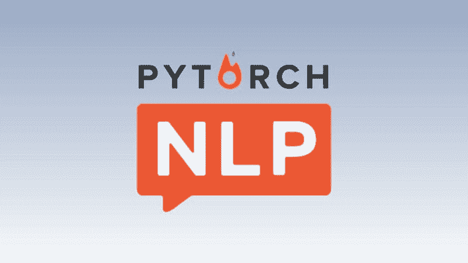
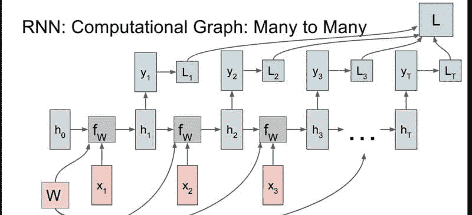
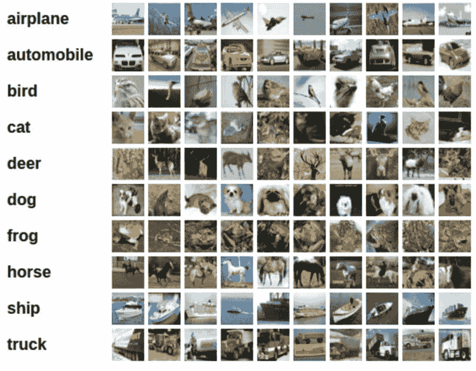

# 如何开始使用 PyTorch 进行自然语言处理

> 原文：[`www.kdnuggets.com/2022/04/start-natural-language-processing-pytorch.html`](https://www.kdnuggets.com/2022/04/start-natural-language-processing-pytorch.html)

随着人工智能和深度学习程序在未来几年中不断增长和发展，自然语言处理 (NLP) 也在不断增长，变得越来越重要。使用 PyTorch 进行自然语言处理是实现这些程序的最佳选择。

* * *

## 我们的 3 个最佳课程推荐

 1\. [谷歌网络安全证书](https://www.kdnuggets.com/google-cybersecurity) - 快速进入网络安全职业道路

 2\. [谷歌数据分析专业证书](https://www.kdnuggets.com/google-data-analytics) - 提升你的数据分析能力

 3\. [谷歌 IT 支持专业证书](https://www.kdnuggets.com/google-itsupport) - 支持你的组织进行 IT 工作

* * *

在本指南中，我们将解答一些在开始深入自然语言处理时可能会出现的明显问题，但我们也会探讨更深层次的问题，并给你提供开始自己 NLP 程序的正确步骤。

# PyTorch 可以用于 NLP 吗？

首先，NLP 是一门应用科学。它是工程学的一个分支，将人工智能、计算语言学和计算机科学结合在一起，以“理解”自然语言，即口语和书面语言。

其次，NLP 并不意味着机器学习或深度学习。相反，这些人工智能程序需要学习如何处理自然语言，然后使用其他系统来利用输入程序的数据。

虽然将一些 AI 程序称为 NLP 程序比较简单，但情况并非完全如此。相反，它们能够理解语言，在经过适当训练之后，但涉及到完全不同的系统和过程来帮助这些程序理解自然语言。

这就是为什么使用 PyTorch 进行自然语言处理非常方便的原因。[PyTorch](https://pytorch.org/) 基于 Python，并具有预先编写的代码（称为类），这些代码都围绕 NLP 设计。这使得整个过程对所有参与者来说都更快、更容易。

有了这些 PyTorch 类和 PyTorch 可用的各种其他 Python 库，自然语言处理没有比这更好的机器学习框架了。

# 我如何开始学习自然语言处理？

要开始使用 PyTorch 进行 NLP，你需要熟悉 Python 编程。

[图片来源](https://www.pexels.com/photo/woman-sitting-in-front-laptop-1181677/)

一旦你熟悉了 Python，你会发现许多其他框架可以用于各种深度学习项目。然而，使用 PyTorch 进行自然语言处理是最优的，因为 PyTorch **张量**。

简而言之，**张量** 允许你使用 GPU 进行计算，这可以显著提高你在 PyTorch 上进行自然语言处理程序的速度和性能。这意味着你可以更快地训练你的深度学习程序，以实现你期望的 NLP 结果。

如上所述，PyTorch 中有不同的 **类**，这些类在自然语言处理及相关程序中表现良好。我们将详细介绍这六个类及其使用场景，以帮助你开始选择合适的类。

## **1\. torch.nn.RNN**

我们将要查看的前三个 **类** 是 **多层类**，这意味着它们可以表示双向递归神经网络。简单来说，它允许深度学习程序从过去的状态中学习，同时在计算和处理继续进行时从新的/未来的状态中学习。这使得这些程序能够学习和处理自然语言输入，甚至理解更深层次的语言特征。

torch.nn.RNN 多对多图示，[图片来源](https://discuss.pytorch.org/t/pytorch-rnn-many-to-many-learning-one-to-many-test/91874)

torch.nn.RNN 代表 **递归神经网络**，这让你知道这个类的基本功能。这是使用 PyTorch 进行自然语言处理时最简单的递归神经网络类。

## **2\. torch.nn.LSTM**

torch.nn.LSTM 是另一个多层 PyTorch 类。它具有与 torch.nn.RNN 相同的所有优点，但增加了 **长短期记忆**。这意味着使用这个类的深度学习程序可以处理超越一对一数据点连接的数据序列。

在使用 PyTorch 进行自然语言处理时，torch.nn.LSTM 是更常用的类之一，因为它不仅可以理解书写或输入的数据，还可以识别语音和其他声音。

能够处理更复杂的数据序列使其成为能够有效执行利用自然语言处理全部潜力的程序的必要组成部分。

## **3\. torch.nn.GRU**

torch.nn.GRU 在 RNN 和 LSTM 类的基础上，通过创建 **门控递归单元** 进行扩展。简而言之，这意味着 torch.nn.GRU 类程序具有门控输出。这使得它们的功能类似于 torch.nn.LSTM，但实际上有处理机制来简单地忘记不符合或与大多数数据集的预期结果或结论不一致的数据集。

torch.nn.GRU 类程序是入门 NLP 的另一个很好的方式，因为它们更简单，但在更短时间内产生与 torch.nn.LSTM 类似的结果。然而，如果程序忽略了可能对学习重要的数据集，在没有仔细监控的情况下，它们可能会准确性较低。

## **4\. torch.nn.RNNCell**

接下来的三个类是其前身的简化版本，因此它们都以不同的好处类似地运行。这些类都是**细胞级类**，基本上一次只运行一个操作，而不是同时处理多个数据集或序列。

使用分配给相应图像的单词输出 PyTorch 的 NLP 结果，[图像来源](https://pytorch.org/tutorials/beginner/blitz/cifar10_tutorial.html)

这种方式进展较慢，但只要时间足够，结果可能会更为准确。作为 RNNCell，这个类程序仍然可以从过去和未来的状态中学习。

## **5\. torch.nn.LSTMCell**

torch.nn.LSTMCell 的功能类似于普通的 torch.nn.LSTM 类，能够处理数据集和序列，但不能同时处理多个。与 RNNCell 程序一样，这意味着进展较慢，负担较轻，但实际上随着时间的推移可以提高准确性。

这些细胞级类与其前身有一些小的变化，但深入探讨这些差异会超出本指南的范围。

## **6\. torch.nn.GRUCell**

在自然语言处理领域，使用 PyTorch 的最有趣的类之一是 torch.nn.GRUCell。它仍然保持有门控输出的功能，这意味着它可以忽略甚至忘记离群的数据集，同时仍然从过去和未来的操作中学习。

可以说，这是那些入门者使用的较受欢迎的 PyTorch 类之一，因为它在需求最少的情况下具有最大的潜力。

这里主要的牺牲是确保程序得到正确训练所需的时间和精力。

# 使用 PyTorch 实现自然语言处理

关于如何开始使用 PyTorch 进行自然语言处理还有很多要说的，但在选择了适合您深度学习模型的 PyTorch 类之后，还需理解一个主要因素，那就是决定如何在模型中实现 NLP。

将单词编码到模型中可能是拥有一个完全优化和操作的深度学习模型的最明显且重要的过程之一。PyTorch 的 NLP 需要某种单词编码方法。

有很多方法可以让模型处理单个字母，但创建 NLP 深度学习模型的关键在于，假设不是关注单个单词和字母，而是这些单词和短语的语义和语言学意义。以下是三个基本的 PyTorch NLP 词嵌入模型：

+   **简单词编码**：训练模型关注序列中的每个单独单词，并让模型自行推导相似性和差异性。这是最简单的方法，但模型可能难以准确理解或预测语义。

+   **N-Gram 语言建模**：模型被训练来学习序列中单词之间的关系。这意味着它们可以学习单词在彼此关系中的作用以及在句子中的作用。

+   **连续词袋模型（CBOW）**：N-Gram 语言建模的扩展版本，该深度学习模型被训练来处理序列中每个单词之前和之后一定数量的单词，以便深入学习单词在周围单词中的作用以及它们在序列中的功能。这是目前使用 PyTorch 进行自然语言处理的最受欢迎的方法。

一旦你选择了 PyTorch 类和词嵌入方法，你就准备好开始在下一个深度学习项目中利用自然语言处理了！

使用 PyTorch 进行自然语言处理来创建像 Siri 这样的最终结果，[图片来源](https://unsplash.com/photos/AGRtDoZlpYw)

# 更多有关自然语言处理和 PyTorch 的信息

自然语言处理是深度学习和人工智能中最热门的话题之一，许多行业正在探索如何利用这种类型的深度学习模型来进行内部和外部应用。

还有很多内容可以了解和学习，但如果你认为我们遗漏了什么，请告诉我们。如果你对如何开始实施 NLP 或 PyTorch 有任何问题，请随时联系！

你怎么看？你准备好使用 PyTorch 处理自然语言处理了吗？如果你有任何问题，请随时在下面留言。

**[Kevin Vu](https://www.kdnuggets.com/author/kevin-vu)** 管理 Exxact Corp 博客，并与许多才华横溢的作者合作，他们撰写有关深度学习各个方面的内容。

[原文](https://www.exxactcorp.com/blog/Deep-Learning/natural-language-processing-with-pytorch)。经许可转载。

### 更多相关话题

+   [自然语言处理中的 N-gram 语言建模](https://www.kdnuggets.com/2022/06/ngram-language-modeling-natural-language-processing.html)

+   [自然语言处理关键术语解释](https://www.kdnuggets.com/2017/02/natural-language-processing-key-terms-explained.html)

+   [自然语言处理任务的数据表示](https://www.kdnuggets.com/2018/11/data-representation-natural-language-processing.html)

+   [用于图像识别和自然语言处理的迁移学习](https://www.kdnuggets.com/2022/01/transfer-learning-image-recognition-natural-language-processing.html)

+   [自然语言处理的温和入门](https://www.kdnuggets.com/2022/06/gentle-introduction-natural-language-processing.html)

+   [使用 spaCy 进行自然语言处理](https://www.kdnuggets.com/2023/01/natural-language-processing-spacy.html)
