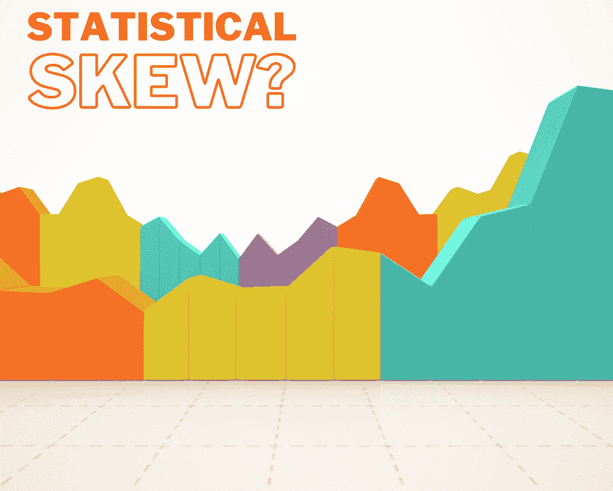
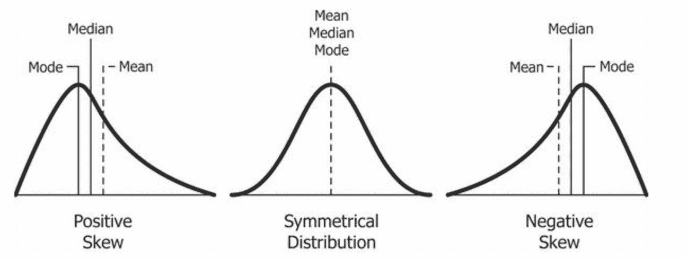
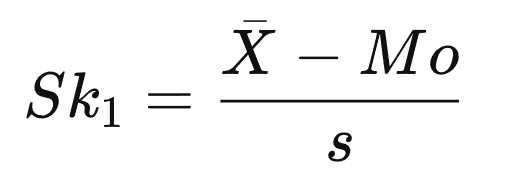
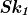
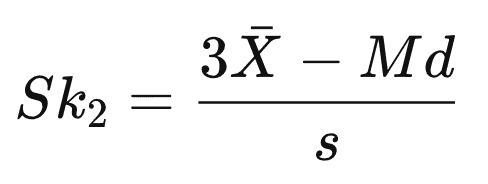

# 统计学中的偏度是什么？

> 原文：[`www.kdnuggets.com/2022/11/statistical-skew.html`](https://www.kdnuggets.com/2022/11/statistical-skew.html)

图片由编辑提供

# 偏度是什么？

* * *

## 我们的前三个课程推荐

 1\. [谷歌网络安全证书](https://www.kdnuggets.com/google-cybersecurity) - 快速进入网络安全职业。

 2\. [谷歌数据分析专业证书](https://www.kdnuggets.com/google-data-analytics) - 提升你的数据分析能力

 3\. [谷歌 IT 支持专业证书](https://www.kdnuggets.com/google-itsupport) - 支持你的组织 IT 部门

* * *

当你听到统计学中提到分布时，我们中的许多人会提到最常见的对称钟形曲线，这种曲线我们很多人都熟悉，它被称为正态分布。

偏度衡量的是分布的非对称性。如果分布向左或向右移动——这意味着它是偏斜的。它表示给定分布与正态分布的差异——正态分布的偏度为零。

分布可以是右偏（正偏）、左偏（负偏）或零偏度。正偏度和负偏度的分布尾部会逐渐远离中位数。

来源：[维基百科](https://en.wikipedia.org/wiki/Skewness#/media/File:Relationship_between_mean_and_median_under_different_skewness.png)

## 零偏度

零偏度是对称的——左右两侧互为镜像。正如我所说，我们中的许多人会将其称为正态分布——然而，正态分布并不是唯一具有零偏度的分布形式。如果分布是对称的，它将具有零偏度——例如均匀分布。

当分布具有零偏度时，这意味着均值和中位数相等。

## 右偏度

没错，右偏度也称为正偏度。正偏度在分布的右侧有更长或更粗的尾部。在正偏度中，均值通常大于中位数——这是因为尾部的值自然会对均值产生更大的影响，而不是中位数。

## 左偏度

左偏度也称为负偏度。负偏度在分布的左侧有更长或更粗的尾部。在负偏度中，均值会小于中位数。

# 如何计算偏度？

计算偏度最常用的方法是使用 Pearson 公式。可以使用两个公式：

Pearson 的第一个偏度系数：

+    = Pearson 的第一个偏度系数

+    = 标准差

+    = 平均值

+    = 中位数值

皮尔逊第二偏度系数：

# 对偏斜数据怎么办？

在处理数据并应用统计工具时，许多人希望数据呈正态分布。然而，这并非总是如此，你可能会遇到偏斜数据。那么，你可以对需要正态分布的偏斜数据做些什么呢？

## 取决于偏斜的强度

根据你的偏斜数据的强度，你可能完全不需要做任何处理。这适用于轻度或中度偏斜的数据。

## 使用不同的模型

你可能需要使用另一种不以数据通常分布为目标的模型。例如，你可以选择非参数检验。这些检验不对数据做出假设。

## 变换

在统计偏度的意义上，变换是指对变量的所有观测值应用相同的函数。你选择变换偏斜数据的方式取决于你所面对的偏斜类型，例如，是中度偏斜还是强烈偏斜？

# 总结

我希望这篇文章能帮助你更好地理解偏度是什么、不同类型的偏度、如何计算它，以及当你遇到偏斜数据时下一步该怎么做。

如果你想了解更多关于统计术语的解释，可以阅读：描述性统计关键术语解析

**[Nisha Arya](https://www.linkedin.com/in/nisha-arya-ahmed/)** 是一名数据科学家和自由技术写作人。她特别感兴趣于提供数据科学职业建议或教程，以及围绕数据科学的理论知识。她还希望探索人工智能如何/可以促进人类生命的持久性。作为一个热衷的学习者，她寻求拓宽自己的技术知识和写作技能，同时帮助引导他人。

### 更多相关话题

+   [Python 中的统计函数](https://www.kdnuggets.com/2022/10/statistical-functions-python.html)

+   [5 个数据科学家应了解的统计悖论](https://www.kdnuggets.com/2023/02/5-statistical-paradoxes-data-scientists-know.html)

+   [统计学习导论，Python 版：免费书籍](https://www.kdnuggets.com/2023/07/introduction-statistical-learning-python-edition-free-book.html)

+   [10 个基本统计概念的简单解释](https://www.kdnuggets.com/10-basic-statistical-concepts-in-plain-english)

+   [10 个 Python 统计函数](https://www.kdnuggets.com/10-python-statistical-functions)

+   [基础知识回顾第 2 周：数据库、SQL、数据管理及…](https://www.kdnuggets.com/back-to-basics-week-2-database-sql-data-management-and-statistical-concepts)
