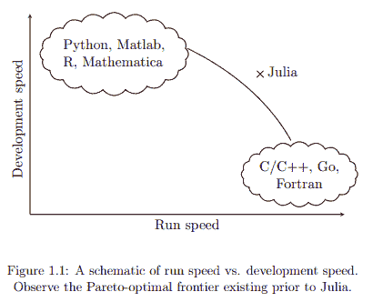
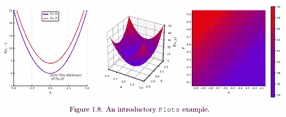

# 使用 Julia 进行统计：免费电子书

> 原文：[`www.kdnuggets.com/2020/09/statistics-julia-free-ebook.html`](https://www.kdnuggets.com/2020/09/statistics-julia-free-ebook.html)

评论

关于数据科学编程语言的大多数辩论、讨论和争论通常集中在[Python 和 R](https://www.kdnuggets.com/tag/python-vs-r)上。尽管这些可能是该领域使用最多的两种语言，但这并不意味着它们是*唯一*的选择，也不意味着它们是“最佳”选择之一。另一个额外的选择是[Julia](https://julialang.org/)，这是一种快速、动态、开源的通用编程语言，被视为一种[值得考虑的数据科学技能](https://www.kdnuggets.com/2020/09/modern-data-science-skills.html)。

* * *

## 我们的前三大课程推荐

 1\. [Google 网络安全证书](https://www.kdnuggets.com/google-cybersecurity) - 快速进入网络安全职业生涯。

 2\. [Google 数据分析专业证书](https://www.kdnuggets.com/google-data-analytics) - 提升你的数据分析技能

 3\. [Google IT 支持专业证书](https://www.kdnuggets.com/google-itsupport) - 支持你的组织的 IT 需求

* * *

我遇到的最佳数据科学语言介绍之一是**[《使用 Julia 进行统计：数据科学、机器学习和人工智能的基础》（Statistics with Julia: Fundamentals for Data Science, Machine Learning and Artificial Intelligence）](https://statisticswithjulia.org/StatisticsWithJuliaDRAFT.pdf)**，由 Yoni Nazarathy 和 Hayden Klok 编写，目前还处于草稿阶段。该书的网站可以在[这里](https://statisticswithjulia.org/)找到，其附带的代码示例可以在[这个](https://github.com/h-Klok/StatsWithJuliaBook) GitHub 仓库中找到。

此时你可能会问的第一个问题是“为什么选择 Julia？”，考虑到还有其他更广泛接受的选项。最好在继续之前解决这个问题，我们通过书中第一章的摘录来解答。

> Julia 首先是一个科学编程语言。它非常适合用于统计、机器学习、数据科学以及轻量级和重型数值计算任务。它也可以集成到用户级应用中，但通常不会用于前端界面或游戏创建。它是一个开源语言和平台，Julia 社区汇聚了来自科学计算、统计和数据科学领域的贡献者。这使得 Julia 语言和包系统在将主流统计方法与科学计算领域的方法和趋势相结合方面处于良好的位置。

在解决了这些问题后，我们可以继续探讨为什么这本书特别适合用于学习 Julia 在数据科学中的应用。再从书的第一章：

> **问题**：阅读本书是否需要具备统计或概率知识？
> 
> **回答**：本书没有预设统计或概率知识。因此，这本书是一个关于概率、统计、机器学习、数据科学和人工智能核心原则的自足指南。它特别适合工程师、数据科学家或科学专业人士，他们希望在探索 Julia 语言的同时，巩固他们在概率、统计和数据科学方面的核心知识。不过，书中使用了常规的数学符号和结果，包括线性代数、微积分和离散数学的基础知识。
> 
> **问题**：使用本书需要什么样的编程经验？
> 
> **回答**：虽然这本书不是一本入门编程书籍，但它并不假设读者是专业的软件开发人员。任何在其他语言中有过基本编码经验的读者，都能够跟随代码示例及其描述。

这解答了你在开始一本关于统计编程的书之前可能会有的两个常见问题：是否需要编程知识作为前提；是否需要统计知识作为前提？这两个问题的答案都是*不需要*，这使得本书真正适合初学者。

本书的目录，包括附录：

1.  介绍 Julia

1.  基本概率

1.  概率分布

1.  数据处理和总结

1.  统计推断概念

1.  置信区间

1.  假设检验

1.  线性回归及其扩展

1.  机器学习基础

1.  动态模型的模拟

1.  Julia 中的操作指南

1.  额外的语言特性

1.  附加包

本书的第 1.3 节，*通过示例快速入门*，是你如果对 Julia 语言不熟悉时开始学习的好地方。在前一节快速了解语言基础之后，你将直接进入编码，进行一些非平凡的示例，包括冒泡排序、字符串处理、JSON 解析和马尔科夫链稳态。

随着本章的深入，书中涵盖了图表和图形、随机数生成和蒙特卡罗模拟，并且介绍了如何将 Julia 与其他语言集成。下一章将涉及统计概念，从这一点起，概念相互递进，逐步引入更高级的主题，如统计推断、置信区间、假设检验、线性回归、机器学习等。

这是我一直在等待的资源，它可以有效地教我用我想要的方式学习 Julia 数据科学。我希望你和我一样，对开始这段旅程感到兴奋。

**相关**：

+   以惊人的速度处理复杂逻辑：尝试 Julia 数据科学

+   数据科学基础：免费的电子书

+   理解机器学习：免费的电子书

### 更多相关话题

+   [学习数据科学统计的顶级资源](https://www.kdnuggets.com/2021/12/springboard-top-resources-learn-data-science-statistics.html)

+   [停止学习数据科学以寻找目标，并通过寻找目标来…](https://www.kdnuggets.com/2021/12/stop-learning-data-science-find-purpose.html)

+   [一个 90 亿美元的 AI 失败案例分析](https://www.kdnuggets.com/2021/12/9b-ai-failure-examined.html)

+   [成功数据科学家的 5 个特征](https://www.kdnuggets.com/2021/12/5-characteristics-successful-data-scientist.html)

+   [是什么让 Python 成为初创公司的理想编程语言](https://www.kdnuggets.com/2021/12/makes-python-ideal-programming-language-startups.html)

+   [每个数据科学家都应该知道的三个 R 库（即使你使用 Python）](https://www.kdnuggets.com/2021/12/three-r-libraries-every-data-scientist-know-even-python.html)
