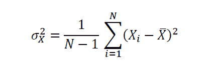
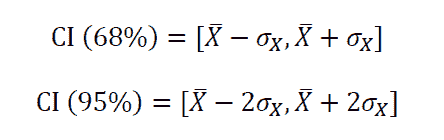
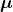
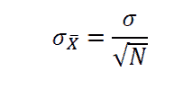
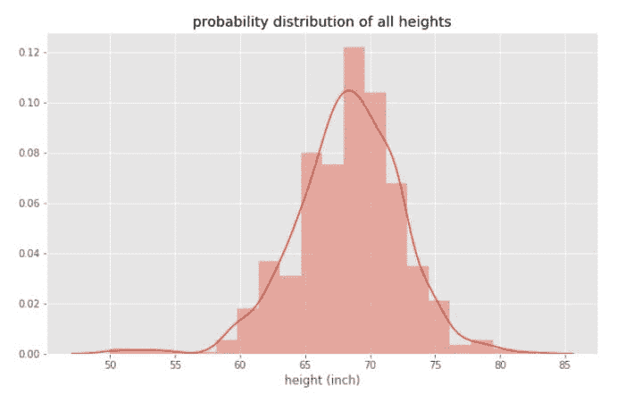
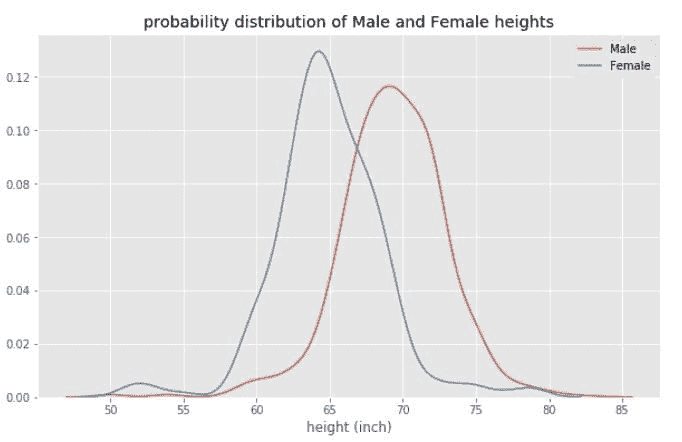

# 数据科学中的统计学和概率论

> 原文：[`www.kdnuggets.com/2022/06/statistics-probability-data-science.html`](https://www.kdnuggets.com/2022/06/statistics-probability-data-science.html)

矢量来源 [iconicbestiary](https://www.freepik.com/free-vector/statistical-data-abstract-paper-tablet_1311213.htm#query=probability&position=0&from_view=search)

## 主要要点

+   大多数对数据科学感兴趣的初学者总是担心数学要求。

+   数据科学是一个非常定量的领域，需要高级数学。

+   但要开始，你只需掌握几个数学主题。

+   在本文中，我们讨论了统计学和概率论在数据科学和机器学习中的重要性。

* * *

## 我们的前三个课程推荐

 1\. [谷歌网络安全证书](https://www.kdnuggets.com/google-cybersecurity) - 快速进入网络安全职业生涯。

 2\. [谷歌数据分析专业证书](https://www.kdnuggets.com/google-data-analytics) - 提升你的数据分析能力

 3\. [谷歌 IT 支持专业证书](https://www.kdnuggets.com/google-itsupport) - 支持你的组织的 IT 工作

* * *

# 统计学和概率论

统计学和概率论用于特征可视化、数据预处理、特征变换、数据填补、降维、特征工程、模型评估等。本文将重点介绍数据科学领域初学者的基本统计学和概率论概念，包括：均值或期望值、方差和标准差、置信区间、中心极限定理、相关性和协方差、概率分布和贝叶斯定理。

# 均值或期望值

设*X*为一个具有*N*观察值的随机变量，则*X*的均值为：

均值或期望值是集中趋势的度量。

# 方差和标准差

设*X*为一个具有*N*观察值的随机变量，则*X*的方差为：

标准差是方差的平方根，是不确定性或波动性的度量。

# 置信区间

假设随机变量*X*服从正态分布，则 68%和 95%置信区间（*CI*）为：

# 中心极限定理（CLT）

中心极限定理（CLT）指出，概率分布样本的样本均值是一个随机变量，其均值由总体均值给出，标准差由总体标准差除以*N*的平方根给出，其中*N*为样本大小。

设为总体均值，为总体标准差。如果我们从总体中抽取一个样本，样本大小为*N*，则根据中心极限定理，样本均值为

样本标准差由以下公式给出

# 相关性和协方差

相关性和协方差是数据集中共同变化的度量。为了量化特征之间的相关程度，我们可以使用以下方程计算协方差矩阵：

# 概率分布

尽管我们总是假设数据集中的变量或特征服从正态分布，但绘制概率分布图来可视化特征的分布仍然很重要。例如，使用 R 的 dslabs 包中的[高度](https://github.com/bot13956/Bayes_theorem)数据集，我们可以计算数据集中所有高度的概率分布，如下图 2 所示。

图 2

从图 2 中，我们观察到高度数据集近似正态分布，均值约为 68 英寸。现在，如果我们分别绘制男性和女性身高的概率分布，我们会观察到两条不同的曲线，如图 3 所示。

图 3

从图 3 中，我们观察到女性的平均身高（约 63 英寸）低于男性的平均身高（约 69 英寸），这表明从统计学角度来看，男性的平均身高高于女性。有关生成图 2 和图 3 所用的更多信息和代码，请参见本文：[贝叶斯定理解释](https://pub.towardsai.net/bayes-theorem-explained-66ebf8285fcc)。

# 贝叶斯定理

[贝叶斯定理](https://pub.towardsai.net/bayes-theorem-explained-66ebf8285fcc) 在二分类问题中扮演了重要角色。它用于解释二分类算法的输出。贝叶斯定理指出，两个事件 A 和 B 的条件概率由以下方程相关：

有关贝叶斯定理在二分类问题中的实现，请参见本文：[贝叶斯定理解释](https://pub.towardsai.net/bayes-theorem-explained-66ebf8285fcc)。

# 总结

总结来说，我们讨论了 7 个对数据科学初学者至关重要的概率和统计概念。其他高级话题包括 AB 测试、假设检验、蒙特卡罗模拟等。

**[本杰明·O·泰约](https://www.linkedin.com/in/benjamin-o-tayo-ph-d-a2717511/)** 是一位物理学家、数据科学教育者和作家，同时也是 DataScienceHub 的创始人。之前，本杰明曾在中奥克拉荷马大学、大峡谷大学和匹兹堡州立大学教授工程和物理课程。

### 更多相关话题

+   [KDnuggets 新闻，7 月 6 日：12 个必备的数据科学 VSCode…](https://www.kdnuggets.com/2022/n27.html)

+   [概率在数据科学中的重要性](https://www.kdnuggets.com/2023/02/importance-probability-data-science.html)

+   [与斯坦福大学一起免费学习计算机科学中的概率](https://www.kdnuggets.com/learn-probability-in-computer-science-with-stanford-university-for-free)

+   [分析未来成功的概率与智能…](https://www.kdnuggets.com/2022/02/analyzing-probability-future-success-intelligence-node-attributes-evolution-model.html)

+   [概率：Statology 入门](https://www.kdnuggets.com/probability-statology-primer)

+   [数据科学、统计学和机器学习词典](https://www.kdnuggets.com/2022/05/data-science-statistics-machine-learning-dictionary.html)
