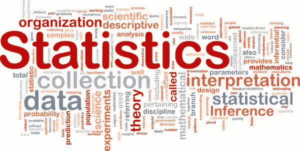

# 哪些统计学主题对于在数据科学中表现出色是必要的？

> 原文：[`www.kdnuggets.com/2016/08/statistics-topics-needed-excelling-data-science.html`](https://www.kdnuggets.com/2016/08/statistics-topics-needed-excelling-data-science.html)

 评论

**由 Sergey Feldman 提供，Data Cowboys。**

“数据科学家”是一个模糊的新职位，你永远不知道成功需要哪些工具。我在工作中做的很多事情以前从未做过，但研究生阶段不仅是学习具体模型和技术，更是学习如何快速学习和数学思维的过程。

总的来说，我建议你能够（a）用数学思维，（b）将这些思维转化为代码。其他的你可以随时自学。但这里有一个大致按复杂程度递增的列表。

**编码。** 精通 Python 和/或 R。虽然还有其他选择，但这两个语言现在非常普及。

**了解你的分布。** 你应该对每种分布的用途有一个良好的直觉。 给定一些数据，你应该能够在许多场景中做到这一点：

问：我的数据是否适合用帕累托分布建模？

*答：不，经验直方图不是单调递减的。*

问：当然是高斯分布！

*答：不，这里没有负值。*

问：那指数分布呢？

*答：不，这里没有零。*

问：嗯，冯·米塞斯分布呢？

*答：别傻了，我很确定这些数据不在圆的表面上...*

问：对数正态分布！

*答：听起来不错。还是把它画出来看看吧...*

**拟合。** 一旦你掌握了分布，你应该知道如何以简洁的方式将它们拟合到数据中。从最大似然估计开始，然后再继续。

**经典假设检验。** 我认为 p 值和频率假设检验一般来说很难解释和理解（例如未能拒绝原假设等），但这两者仍然非常普遍。

**马尔可夫链** + 铃声 + 其他附加功能。

**基本贝叶斯思维与建模。** 学会将一切看作概率分布，而不仅仅是单一值（如果适用的话）。能够组装模型并进行计算。

**一些老派的统计学和概率论。** 例如：“随机变量；变换，条件期望，矩生成函数，收敛，极限定理，估计；克拉美-拉奥下界，最大似然估计，充分性，附属性，完备性。拉奥-布莱克威尔定理。一些决策理论。”

**回归！** 首先是线性回归，然后是***非线性回归。***（惊讶！）

**机器学习。** 我知道你说的是“统计学”，但如果你想成为“数据科学家”，那么机器学习将是一个非常多功能和有用的工具包。而且，机器学习范围广泛，也许这可以成为另一个 Quora 问题。 =)

**写作。** 清晰、简洁、有说服力地传达你的想法。

祝好运！

**个人简介：[谢尔盖·费尔德曼](https://www.quora.com/profile/Sergey-Feldman)** 是一位机器学习和数据科学顾问。他是[数据牛仔](http://www.data-cowboys.com/)的创始人，现居于西雅图。

[原文](https://www.quora.com/What-are-the-topics-courses-in-statistics-that-I-need-to-learn-for-excelling-at-data-science). 经许可转载。

**相关：**

+   为什么大数据陷入困境：他们忘记了应用统计学

+   大数据、圣经密码和邦费罗尼

+   15 个用于数据科学的数学 MOOCs

* * *

## 我们的三大课程推荐

 1\. [谷歌网络安全证书](https://www.kdnuggets.com/google-cybersecurity) - 快速进入网络安全职业生涯。

 2\. [谷歌数据分析专业证书](https://www.kdnuggets.com/google-data-analytics) - 提升你的数据分析技能

 3\. [谷歌 IT 支持专业证书](https://www.kdnuggets.com/google-itsupport) - 支持你的组织的 IT 需求

* * *

### 更多相关话题

+   [成为优秀数据科学家所需的 5 项关键技能](https://www.kdnuggets.com/2021/12/5-key-skills-needed-become-great-data-scientist.html)

+   [在生成式 AI 时代，数据科学家还需要吗？](https://www.kdnuggets.com/2023/06/data-scientists-still-needed-age-generative-ai.html)

+   [低代码：开发者还需要吗？](https://www.kdnuggets.com/2022/04/low-code-developers-still-needed.html)

+   [创建一个 Web 应用程序以使用 Python 从音频中提取主题](https://www.kdnuggets.com/2023/01/creating-web-application-extract-topics-audio-python.html)

+   [回到基础第 4 周：高级主题和部署](https://www.kdnuggets.com/back-to-basics-week-4-advanced-topics-and-deployment)

+   [KDnuggets 新闻，7 月 6 日：12 个必备的数据科学 VSCode…](https://www.kdnuggets.com/2022/n27.html)
