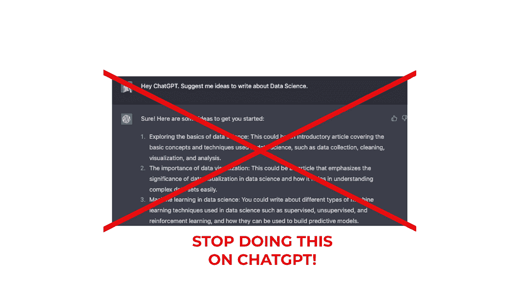
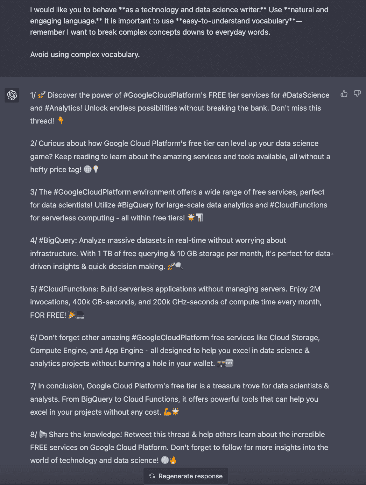

# Stop Doing this on ChatGPT and Get Ahead of the 99% of its Users

> 原文：[`www.kdnuggets.com/2023/05/stop-chatgpt-get-ahead-99-users.html`](https://www.kdnuggets.com/2023/05/stop-chatgpt-get-ahead-99-users.html)

Image by Author

你是否曾对 AI 生成的内容感到沮丧？也许你认为 **ChatGPT 的输出完全糟糕**，没有达到你的期望。

然而，**从像 ChatGPT 这样的 AI 写作工具获得高质量输出的真相是，**这在很大程度上依赖于你的提示质量。

*通过训练 ChatGPT，你可以得到*[*免费的个人写作助手！*](https://medium.com/geekculture/5-features-to-maximize-your-writing-potential-on-medium-with-chatgpt-5ae4a7fa9ac2)

现在是发现 **制定强大提示的艺术** [以充分利用这项尖端技术。](https://medium.com/geekculture/using-chatgpt-to-learn-sql-53067465076e)

让我们一起探索吧！????????

问题通常不在于 AI 本身，而在于提供的输入的局限性和模糊性。

与其期望 AI 为你思考，不如 **你自己进行思考并指导 AI 完成你需要的任务。**

Image by Author

*结果不理想？*

这意味着你给 ChatGPT 提供了 *质量差* 的短提示——**并期望发生一些神奇的输出。**

简而言之，ChatGPT 不擅长从*零开始*提出内容。这意味着如果你仍然给 ChatGPT 提供这样的提示：

> **为我的账户生成一个关于 AI 的 LinkedIn 帖子。**
> 
> **给我写一条关于** 数据科学的 Twitter 线程
> 
> **给我一些编程的写作点子**

**你应该停止！**

给出这样的提示时，ChatGPT 必须做出太多决策——**这会生成一些糟糕的输出。**

*所以一定要记住。*

> **差的指示 = 差的结果。**

*那么你应该怎么做呢？*

有 4 个主要步骤来评估这个问题。让我们逐步解析 ??

# #1\. 理解你的需求和要求

要订购某样东西，你首先需要知道你想要什么。

*对吗？*

所以你需要知道你从 AI 那里想要什么，为什么想要它，以及如何希望它被传递。**这种清晰度将帮助你创建更好的提示并提高输出质量。**

所以首先，开始标准化你从 AI 那里要求的所有类型的输出。

Image by Author

让我们举一些例子。

+   我开始活跃于我的 **Twitter** 账户——所以我想要 **推文点子** 和 **Twitter 线程结构**。

+   我在 **Medium** 上非常活跃——所以我想要 **获得灵感** 来写作并生成 **文章大纲**。

*太好了！*

所以通过这个练习，我意识到我需要 4 种不同类型的输出。

+   **为 Twitter 撰写推文的想法**。

+   **Twitter 的线程结构**。

+   **在 Medium 上写作的想法**。

+   **Medium 的文章框架**。

*让我们以 Twitter 结构作为例子。*

为了进一步了解如何使用 ChatGPT 提高你的写作，我推荐以下文章 :)

## 在 Medium 上使用 ChatGPT 最大化写作潜力的 5 个功能

### 以及如何利用它来提升你的写作

# #2\. 将 AI 视为数字实习生

想象一下你雇佣了一个实习生——你不会只给他们一个简短的解释就期待他们一开始就做得很好，对吧？

图片来源： [unDraw](https://undraw.co/search)。

假设我想在 Twitter 上发布一个关于使用 Google Cloud Platform 的线程。光是告诉我的实习生我明天需要一个关于 GCP 的 Twitter 线程——就这样是不够的。

*如果你这样做……也许你应该改变你的方法，我的朋友 ;)*

**然后 ChatGPT——或任何其他 AI 工具——也是一样的。**

始终向你的 AI 提供详细的检查清单，解释任务背后的目的，并对 AI 可能有的任何疑问持开放态度。

这意味着我不能说：

> 嘿，ChatGPT。给我写一条关于 Google Cloud Platform 的 Twitter 线程。

之前的提示过于模糊。

+   你想要多少条推文？

+   使用什么写作风格？

+   ChatGPT 应该强调哪些子主题？

+   我的语言语气是什么——友好，专业……？

你让 AI 为你做了太多决策——**这就是为什么它的输出会一团糟。**

⚠️ *始终使用 AI 工具来提升你的工作——而不是替代你。*

这将引导我们进入下一步……

# #3\. 创建约束并避免假设

**这是过程的关键。**为了获得具体和准确的输出，向你的 AI 提供清晰且定义明确的信息。当你给出模糊或宽泛的提示时，你不能指望 AI 提供精确的结果。

相反，让 AI 确切知道你想要什么。

+   **良好的背景信息**——你想要什么样的输出？

+   **具体话题**——要强调的子主题。

+   **具体结构**——比如多少条推文，字数……

+   **输出的具体格式**——使用什么写作风格，语气……

+   **避免的具体事项列表**——你不想提及的内容。

所以让我们开始创建自己的提示，以生成 Twitter 线程。

## 1\. 添加一些良好的背景信息

我希望 ChatGPT 为我生成一个 Twitter 线程。*然而，什么是 Twitter 线程？*

**我首先需要确保 ChatGPT 理解我所说的 Twitter 线程的意思。**

这就是为什么任何好的提示需要以良好的背景信息开始的原因。

[ ????????‍???? 首先我让 ChatGPT 知道我将训练它以获得一些特定的输出]

> 嘿，ChatGPT。我将训练你来创建**Twitter 线程**。

[ ???? 然后我解释这个具体输出的内容]

> **推特线程是一系列推文**，概述并突出长文本或特定话题中最重要的观点。

## 2\. 添加一个具体话题

我希望 ChatGPT 撰写一个关于特定话题的推特线程。现在是时候详细说明话题了。

在这种情况下，我希望这个线程讨论[Google Cloud Platform 免费层](https://medium.com/geekculture/having-all-the-power-of-google-in-your-hands-for-free-aws-azure-bigquery-cloud-computing-gcp-python-sql-955bcfb987cd)。

[ ☁️ 我向 ChatGPT 解释了主要话题]

> 推特线程将讨论**Google Cloud Platform 免费层服务**。

[ ⚙️ 我概述了我希望它肯定提到的内容和要强调的内容]

> 我希望你讨论**Google Cloud Platform 环境**、它的所有**服务**和**对数据科学的实用性**。然而，你需要**强调所有这些优势在你的使用限制在某些层级内时是永远免费的**。提到 Google BigQuery 和 Cloud Functions，这两项是分析最重要的服务之一。

## 3\. 添加具体结构

现在轮到让 ChatGPT 知道**输出的结构是什么**。根据你的需要，这部分可以更通用或更详细。我通常尽可能详细，以便从中得到一个好的草稿作为起点。

[ ???? 我指定了我希望从 ChatGPT 收到的完整结构]

> **第一条推文**，内容简洁明了，让人们知道线程的主题。重要的是不要超过 30 个字，使用关键标签，并说服人们阅读整个线程。强调线程对他们的实用性。
> 
> **第二条推文**，简短介绍，让读者了解背景并理解他们为什么还在阅读这个线程。重要的是保持读者的兴趣。
> 
> **4 或 5 条推文**，概述和描述文章中最重要的部分。这些推文应总结我之前解释的主题的主要观点。
> 
> **最后一条推文**包含一些结论，并让人们知道为什么你的线程值得阅读。
> 
> **最后一条推文**，邀请他们转发你的线程并关注你。

## 4\. 输出的具体格式

对生成的输出格式的最终评论。通常，我包括 ChatGPT 应如何表现和使用何种写作风格。

[ ???? 我指定了我希望的输出格式]

> 我希望你**作为技术和数据科学作家**。使用**自然且引人入胜的语言**。使用**易于理解的词汇**——记住，我希望将复杂的概念分解成日常用词。

## 5. 避免的具体事项列表

在这种情况下，如果有你不希望 ChatGPT 提到的内容，请告知它。在我的情况下，我不希望它使用复杂的词汇。

[ ❌ 我总是告诉 ChatGPT 避免使用复杂的语言]

> 避免使用复杂的词汇。

# #4\. 迭代和优化你的输入

如果 AI 生成了不正确的输出，很可能是由于你的输入存在问题。**不要害怕多次修改你的提示。**

请记住，即使你使用自然语言与机器交谈，也应该把它视为为 AI 编写代码。

> 提示编写是一个反复迭代的过程——你不会在第一次尝试时就搞对。但就像培训员工一样，前期的时间投入是值得的。因为一旦你拥有了一个有效且可靠的提示，你就可以永久使用它。
> 
> - 作者：Dickie Bush

*⚠️ 重要的是要考虑到，我们对 ChatGPT 下达的任何任务都不应该需要思考。我们思考，ChatGPT 执行。*

所以，如果我使用刚创建的提示来获取 ChatGPT 的 Twitter 线程，它会直接回复我以下内容。

ChatGPT 界面的截图。ChatGPT 给我一个 Twitter 线程的输出。

你可以重复生成响应多次，直到获得满意的结果。我总是将 ChatGPT 的输出作为初稿，然后得到一个适合我账户的 Twitter 线程。

我的最终结果如下所示。

# 主要结论

总结一下，**并不是 AI 本身不够出色，而是我们与之互动的方式存在问题。**为了充分利用 ChatGPT 及类似工具，我们必须改进我们的方式，专注于成为*思考者*，引导 AI 进行*执行*。

遵循这些提示并对输入内容负责，你会发现 AI 生成的内容可以成为你内容创作工具箱中的宝贵资产 [在你的内容创作工具箱中。](https://medium.com/geekculture/5-chatgpt-features-to-boost-your-daily-work-404478fd70ca)

**所以，让我们开始制定有效的提示，释放 AI 写作的全部潜力吧！**

**[Josep Ferrer](https://www.linkedin.com/in/josep-ferrer-sanchez)** 是来自巴塞罗那的分析工程师。他毕业于物理工程专业，目前在应用于人类流动性的领域工作。他是一位兼职内容创作者，专注于数据科学和技术。你可以通过 [LinkedIn](https://www.linkedin.com/in/josep-ferrer-sanchez/)、[Twitter](https://twitter.com/rfeers) 或 [Medium](https://medium.com/@rfeers) 联系他。

[原文](https://medium.com/geekculture/stop-doing-this-on-chatgpt-get-ahead-99-users-ai-artificial-intelligence-productivity-prompt-engineering-4-f3441bf7a25a)。已获许可转载。

### 更多相关话题

+   [忘掉 ChatGPT，这款新 AI 助手已经领先一大截，将…](https://www.kdnuggets.com/2023/08/forget-chatgpt-new-ai-assistant-leagues-ahead-change-way-work-forever.html)

+   [AI 会拥有自己的蝙蝠侠吗？](https://www.kdnuggets.com/2022/05/ai-get-batman.html)

+   [停止学习数据科学以寻找目标，先找到目标再…](https://www.kdnuggets.com/2021/12/stop-learning-data-science-find-purpose.html)

+   [停止为课程付费，免费学习](https://www.kdnuggets.com/stop-paying-for-courses-and-learn-for-free)

+   [停止在数据科学项目中硬编码 - 使用配置文件](https://www.kdnuggets.com/2023/06/stop-hard-coding-data-science-project-config-files-instead.html)

+   [ChatGPT 在做什么，它为什么有效？](https://www.kdnuggets.com/2023/04/chatgpt-work.html)
