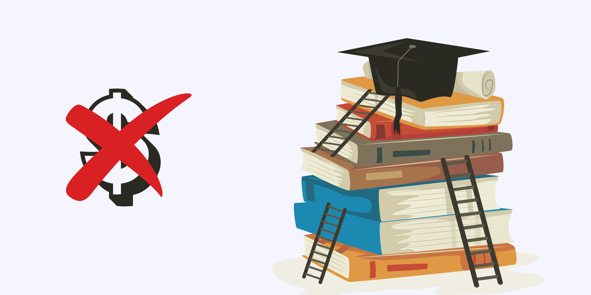

# 停止为课程付费，免费学习

> 原文：[`www.kdnuggets.com/stop-paying-for-courses-and-learn-for-free`](https://www.kdnuggets.com/stop-paying-for-courses-and-learn-for-free)

作者提供的图片 | Canva

在成长过程中，我们很多人被告知教育是一种特权——确实如此。然而，随着时代的变化和技术的普及，对具备这些独特技术技能的专业人士的需求也变得重要。

* * *

## 我们的前三大课程推荐

 1\. [谷歌网络安全证书](https://www.kdnuggets.com/google-cybersecurity) - 快速进入网络安全职业。

 2\. [谷歌数据分析专业证书](https://www.kdnuggets.com/google-data-analytics) - 提升你的数据分析能力

 3\. [谷歌 IT 支持专业证书](https://www.kdnuggets.com/google-itsupport) - 支持你的组织的 IT 工作

* * *

如果你对科技世界感兴趣但因为不确定是否适合自己而犹豫不决，那么这篇博客适合你。我将介绍一系列免费的课程，帮助你掌握计算机科学的基础知识。

## 计算机科学：有目的的编程

链接：[计算机科学：有目的的编程](https://imp.i384100.net/EKoELK)

我们已经从上个世纪教育的基础——“阅读、写作和算术”——转变为“阅读、写作和计算”。学习编程是教育的重要组成部分，因此，理解计算机科学的本质是任何新手都应该具备的。

在不到 4 周的时间里，本课程涵盖了我们书籍《计算机科学：跨学科方法》的前半部分（后半部分在我们的 Coursera 课程《计算机科学：算法、理论与机器》中讲解）。课程开始时介绍了基本编程元素，如变量、条件语句、循环、数组和输入输出，然后深入探讨了函数，介绍了递归、模块化编程和代码重用等关键概念。但这还不是全部——你将进一步深入面向对象编程，使用 Java 编程语言，学习计算问题解决。

## 计算机科学：算法、理论与机器

链接：[计算机科学：算法、理论与机器](https://imp.i384100.net/xk4Lev)

一旦掌握了基础知识，你的下一个目标将是深入探讨算法、相关理论以及对机器整体的理解。该课程包含 11 个模块，你将学习经典算法、评估性能的科学技术，以及经典的理论模型，这些模型帮助我们解决关于计算的基本问题，如可计算性、普遍性和难处理性。掌握这些模块后，你将学习机器架构（包括机器语言编程及其与 Java 编码的关系）和逻辑设计（包括从头开始构建的完整 CPU 设计）。

## 数据科学数学技能

链接：[数据科学数学技能](https://imp.i384100.net/Py3Oee)

很多人低估了在计算机科学中学习数学的必要性。有些人认为这是必需的，而有些人则认为没有必要。就个人而言，我认为学习可以提高理解的东西没有坏处。但事实上，数据科学包含数学。在本课程中，你将学习成为成功的数据科学家、机器学习工程师或软件工程师所需的基本数学知识。

你将学习集合论，包括 Venn 图、实数线的性质、区间符号以及不等式的代数及其对求和和 Sigma 符号的应用。你还将深入了解指数、对数和自然对数函数，以及概率论，包括贝叶斯定理。

## 学习编程：基础知识

链接：[学习编程：基础知识](https://imp.i384100.net/Or2eVW)

学习编程语言实际上是学习一门新语言。这听起来可能很令人生畏，但学习 Python 时情况并非如此。Python 由于其简洁性而成为最受欢迎的编程语言之一。那么为什么不从学习 Python 开始呢？

在本课程中，你将全面了解 Python，从变量和函数到元组和字典。该课程以有趣和实用的方式提供编程的基本构建块。在不到 4 周的时间内，你可能会成为初级 Python 专家。

## 总结

学习不应如此昂贵——尤其是当你是新手时。市场上有很多免费的资源，选择哪一个可能会很困难。这时，KDnuggets 可以提供帮助。我们将提供优质的学习资源，以确保你成功学习并找到理想的工作。

****[Nisha Arya](https://www.linkedin.com/in/nisha-arya-ahmed/)**** 是一名数据科学家、自由撰稿人，以及 KDnuggets 的编辑和社区经理。她特别关注提供数据科学职业建议或教程以及数据科学相关的理论知识。Nisha 涵盖了广泛的主题，并希望探索人工智能如何有助于人类寿命的不同方式。作为一名热衷学习者，Nisha 希望拓宽她的技术知识和写作技能，同时帮助引导他人。

### 更多相关话题

+   [8 个免费谷歌课程，助你获得高薪职位](https://www.kdnuggets.com/8-free-google-courses-to-land-top-paying-jobs)

+   [停止学习数据科学以寻找目标，并通过找到目标来…](https://www.kdnuggets.com/2021/12/stop-learning-data-science-find-purpose.html)

+   [KDnuggets™ 新闻 22:n04, 1 月 26 日: 高薪副业…](https://www.kdnuggets.com/2022/n04.html)

+   [数据科学家的高薪副业](https://www.kdnuggets.com/2022/01/high-paying-side-hustles-data-scientists.html)

+   [数据科学家的 6 家公司中薪资最高](https://www.kdnuggets.com/2022/05/6-highest-paying-companies-data-scientists.html)

+   [数据科学家的 7 个高薪副业](https://www.kdnuggets.com/7-high-paying-side-hustles-for-data-scientists)
