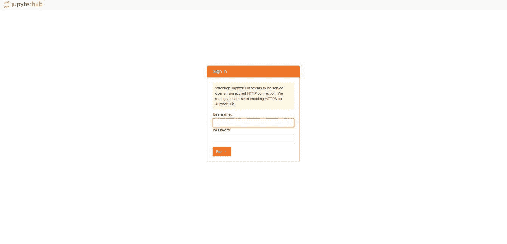
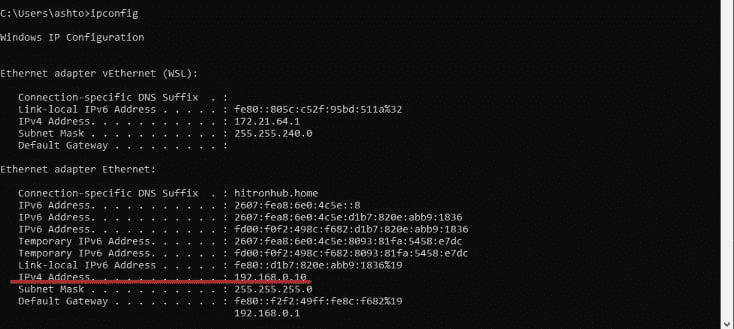
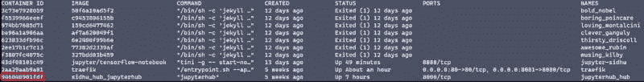

# 停止从命令行运行 Jupyter Notebooks

> 原文：[`www.kdnuggets.com/2020/10/stop-running-jupyter-notebooks-command-line.html`](https://www.kdnuggets.com/2020/10/stop-running-jupyter-notebooks-command-line.html)

评论

**作者：[Ashton Sidhu](https://ashton-sidhu.github.io/blog/)，数据科学家**


照片由 Justin Jairam 拍摄，来自 [@jusspreme](https://www.instagram.com/jusspreme/?hl=en)（已获许可）

* * *

## 我们的前三个课程推荐

 1\. [Google 网络安全证书](https://www.kdnuggets.com/google-cybersecurity) - 快速开启网络安全职业生涯

 2\. [Google 数据分析专业证书](https://www.kdnuggets.com/google-data-analytics) - 提升你的数据分析能力

 3\. [Google IT 支持专业证书](https://www.kdnuggets.com/google-itsupport) - 支持你的组织的 IT 需求

* * *

Jupyter Notebook 提供了一个出色的平台，用于生成包含代码、方程式、分析及其描述的易读文档。有些人甚至认为，当与 NBDev 结合使用时，它是一个强大的开发工具。对于这样一个不可或缺的工具，开箱即用的启动方式并不是最优的。每次使用都需要从命令行启动 Jupyter 网络应用程序，并输入你的令牌或密码。整个网络应用程序依赖于终端窗口的开启。有些人可能会“守护”这个过程，然后使用 [nohup](https://www.computerhope.com/unix/unohup.htm) 将其从终端中分离，但这并不是最优雅和可维护的解决方案。

幸运的是，Jupyter 已经提出了解决这个问题的方案，通过推出一个作为可持续网络应用程序运行的 Jupyter Notebooks 扩展，并且内置了用户身份验证。更棒的是，它可以通过 Docker 进行管理和维护，从而提供隔离的开发环境。

在这篇文章的末尾，我们将利用 JupyterHub 的强大功能，访问一个 Jupyter Notebook 实例，该实例可以在没有终端的情况下访问，支持网络内多个设备，并且采用更友好的身份验证方法。

### 先决条件

对 Docker 和命令行有基本了解将有助于设置此环境。

我建议在你拥有的最强大设备上进行操作，并且这台设备应尽可能全天开启。这样的设置的一个好处是，你可以通过网络上的任何设备使用 Jupyter Notebook，但所有计算都在我们配置的设备上进行。

### 什么是 Jupyter Hub

JupyterHub 将笔记本的强大功能带给用户群体。JupyterHub 的理念是将 Jupyter Notebooks 的使用范围扩展到企业、课堂和大型用户群体。然而，Jupyter Notebook 通常应作为本地实例运行在单个节点上，由单个开发者操作。不幸的是，之前没有折中方案来结合 JupyterHub 的可用性和可扩展性以及本地 Jupyter Notebook 的简易性。直到现在才有了解决办法。

JupyterHub 提供了预构建的 Docker 镜像，我们可以利用这些镜像随时启动单个笔记本，几乎没有技术复杂性。我们将使用 Docker 和 JupyterHub 的组合，以便在任何时间、任何地点通过相同的 URL 访问 Jupyter Notebooks。

### 架构

我们的 JupyterHub 服务器架构将由 2 个服务组成：JupyterHub 和 JupyterLab。JupyterHub 将是入口点，并为任何用户生成 JupyterLab 实例。这些服务将作为 Docker 容器存在于主机上。


JupyterLab 架构图（图像作者提供）

### 构建 Docker 镜像

为了构建我们在家中的 JupyterHub 服务器，我们将使用预构建的 JupyterHub 和 JupyterLab Docker 镜像。

### Dockerfiles

JupyterHub Docker 镜像很简单。

```py
FROM jupyterhub/jupyterhub:1.2# Copy the JupyterHub configuration in the container
COPY jupyterhub_config.py .# Download script to automatically stop idle single-user servers
COPY cull_idle_servers.py .# Install dependencies (for advanced authentication and spawning)
RUN pip install dockerspawner
```

我们使用预构建的 JupyterHub Docker 镜像，并添加自己的配置文件以停止闲置服务器，`cull_idle_servers.py`。最后，我们安装额外的软件包，通过 Docker 启动 JupyterLab 实例。

### Docker Compose

为了整合所有内容，我们创建一个 `docker-compose.yml` 文件来定义我们的部署和配置。

```py
version: '3'services:
  # Configuration for Hub+Proxy
  jupyterhub:
    build: .                # Build the container from this folder.
    container_name: jupyterhub_hub   # The service will use this container name.
    volumes:                         # Give access to Docker socket.
      - /var/run/docker.sock:/var/run/docker.sock
      - jupyterhub_data:/srv/jupyterlab
    environment:                     # Env variables passed to the Hub process.
      DOCKER_JUPYTER_IMAGE: jupyter/tensorflow-notebook
      DOCKER_NETWORK_NAME: ${COMPOSE_PROJECT_NAME}_default
      HUB_IP: jupyterhub_hub
    ports:
      - 8000:8000
    restart: unless-stopped  # Configuration for the single-user servers
  jupyterlab:
    image: jupyter/tensorflow-notebook
    command: echovolumes:
  jupyterhub_data:
```

需要注意的关键环境变量是 `DOCKER_JUPYTER_IMAGE` 和 `DOCKER_NETWORK_NAME`。JupyterHub 将使用环境变量中定义的镜像创建 Jupyter Notebooks。有关选择 Jupyter 镜像的更多信息，您可以访问以下 Jupyter [文档](https://jupyter-docker-stacks.readthedocs.io/en/latest/using/selecting.html)。

`DOCKER_NETWORK_NAME` 是服务使用的 Docker 网络名称。该网络由 Docker Compose 自动命名，但 Hub 需要知道这个名称，以便将 Jupyter Notebook 服务器连接到它。为了控制网络名称，我们使用一个小技巧：我们将环境变量 COMPOSE_PROJECT_NAME 传递给 Docker Compose，网络名称通过在其后附加 _default 获得。

在与 `docker-compose.yml` 文件相同的目录中创建一个名为 `.env` 的文件，并添加以下内容：

```py
COMPOSE_PROJECT_NAME**=**jupyter_hub
```

### 停止闲置的服务器

由于这是我们的家庭设置，我们希望能够停止闲置的实例以节省计算机的内存。JupyterHub 有可以与之并行运行的服务，其中之一是 [jupyterhub-idle-culler](https://github.com/jupyterhub/jupyterhub-idle-culler)。该服务会停止任何闲置时间过长的实例。

要添加这个服务，创建一个名为 `cull_idle_servers.py` 的新文件，并将[jupyterhub-idle-culler 项目](https://raw.githubusercontent.com/jupyterhub/jupyterhub-idle-culler/master/jupyterhub_idle_culler/__init__.py)的内容复制到其中。

> 确保 `cull_idle_servers.py` 与 Dockerfile 在同一文件夹中。

要了解更多关于 JupyterHub 服务的信息，请查看他们的官方[文档](https://jupyterhub.readthedocs.io/en/stable/reference/services.html)。

### Jupyterhub 配置

最后，我们需要为 JupyterHub 实例定义配置选项，如卷挂载、Docker 镜像、服务、身份验证等。

以下是我使用的简单`jupyterhub_config.py`配置文件。

```py
import os
import sysc.JupyterHub.spawner_class **=** 'dockerspawner.DockerSpawner'
c.DockerSpawner.image **=** os.environ['DOCKER_JUPYTER_IMAGE']
c.DockerSpawner.network_name **=** os.environ['DOCKER_NETWORK_NAME']
c.JupyterHub.hub_connect_ip **=** os.environ['HUB_IP']
c.JupyterHub.hub_ip **=** "0.0.0.0" *# Makes it accessible from anywhere on your network*c.JupyterHub.admin_access **=** Truec.JupyterHub.services **=** [
    {
        'name': 'cull_idle',
        'admin': True,
        'command': [sys.executable, 'cull_idle_servers.py', '--timeout=42000']
    },
]c.Spawner.default_url **=** '/lab'notebook_dir **=** os.environ.get('DOCKER_NOTEBOOK_DIR') **or** '/home/jovyan/work'
c.DockerSpawner.notebook_dir **=** notebook_dir
c.DockerSpawner.volumes **=** {
    '/home/sidhu': '/home/jovyan/work'
}
```

请注意以下配置选项：

+   `'command': [sys.executable, 'cull_idle_servers.py', '--timeout=42000']`：超时时间是指闲置 Jupyter 实例关闭的秒数。

+   `c.Spawner.default_url = '/lab'`：使用 Jupyterlab 替代 Jupyter Notebook。注释掉此行以使用 Jupyter Notebook。

+   `'/home/sidhu': '/home/jovyan/work'`：我将我的主目录挂载到 JupyterLab 主目录，以便访问我桌面上的任何项目和笔记本。这还允许我们在创建新笔记本时实现持久性，保存到本地机器上，如果 Jupyter Notebook Docker 容器被删除，也不会被删除。

如果你不希望挂载你的主目录，请移除此行，并记得将`sidhu`更改为你的用户名。

### 启动服务器

要启动服务器，只需运行`docker-compose up -d`，在浏览器中导航到`localhost:8000`，你应该能够看到 JupyterHub 登陆页面。



JupyterHub 登陆页截图（图片由作者提供）

要在网络上的其他设备如笔记本电脑、iPad 等上访问它，通过在 Unix 机器上运行`ifconfig`或在 Windows 上运行`ipconfig`来识别主机的 IP。



Ipconfig（图片由作者提供）

从你的其他设备上，导航到你在端口 8000 找到的 IP：`http://IP:8000`，你应该会看到 JupyterHub 登陆页面！

### 身份验证

剩下的最后任务是对服务器进行身份验证。由于我们没有设置 LDAP 服务器或 OAuth，JupyterHub 将使用 PAM（可插拔认证模块）身份验证来验证用户。这意味着 JupyterHub 使用主机机器的用户名和密码进行身份验证。

要利用这一点，我们需要在 JupyterHub Docker 容器上创建一个用户。还有其他方法可以做到这一点，例如在容器上放置一个脚本并在容器启动时执行，但我们将作为练习手动完成。如果你拆除或重建容器，你将需要重新创建用户。

> 我不建议将用户凭证硬编码到任何脚本或 Dockerfile 中。

1) 查找 JupyterLab 容器 ID：`docker ps -a`



JupyterLab 容器 ID（图像来源：作者）

2) “SSH” 进入容器：`docker exec -it $YOUR_CONTAINER_ID bash`

3) 创建一个用户，并按照终端提示创建密码：`useradd $YOUR_USERNAME`

4) 使用凭据登录，你就完成了！

你现在有了一个随时可用的 Jupyter Notebook 服务器，可以从任何设备上访问，掌握在你手中！祝编程愉快！

### 反馈

我欢迎关于我所有文章和教程的任何反馈。你可以在[twitter](https://twitter.com/ashtonasidhu)上给我发消息，或者通过电子邮件联系我，地址是 sidhuashton@gmail.com。

**个人简介：[Ashton Sidhu](https://ashton-sidhu.github.io/blog/)** (**[@ashtonasidhu](https://twitter.com/ashtonasidhu)**) 是一名专注于网络安全领域的数据科学家。他是一名工程师，拥有应用科学与工程学士学位和信息系统及预测与处方分析硕士学位。

[原文](https://towardsdatascience.com/tutorial-stop-running-jupyter-notebooks-from-your-command-line-b3af93265230)。已获许可转载。

**相关内容：**

+   Google Colab 完全指南用于深度学习

+   这里是最受欢迎的 Python IDE/编辑器

+   Netflix 的 Polynote 是一个新的开源框架，用于构建更好的数据科学笔记本

### 了解更多相关话题

+   [ChatGPT CLI: 将你的命令行界面转变为 ChatGPT](https://www.kdnuggets.com/2023/07/chatgpt-cli-transform-commandline-interface-chatgpt.html)

+   [命令行的数据科学: 免费电子书](https://www.kdnuggets.com/2022/03/data-science-command-line-free-ebook.html)

+   [数据科学的 5 种更多命令行工具](https://www.kdnuggets.com/2023/03/5-command-line-tools-data-science.html)

+   [通过这个 GitHub 仓库掌握命令行的艺术](https://www.kdnuggets.com/master-the-art-of-command-line-with-this-github-repository)

+   [用 Python 轻松完成命令行应用程序的 7 个步骤](https://www.kdnuggets.com/build-a-command-line-app-with-python-in-7-easy-steps)

+   [2022 年的 5 个最佳免费云笔记本](https://www.kdnuggets.com/2022/04/top-5-free-cloud-notebooks-2022.html)
