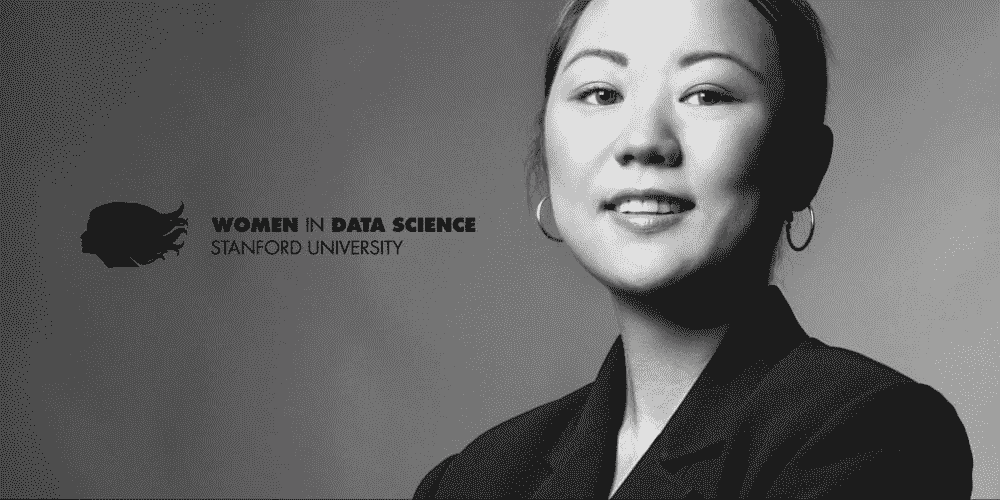
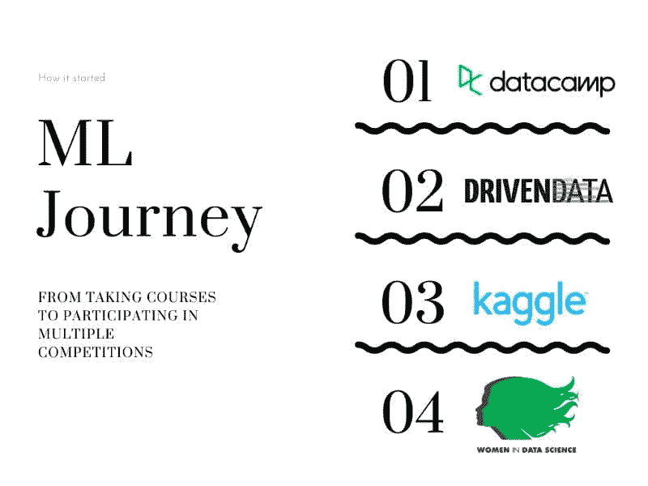
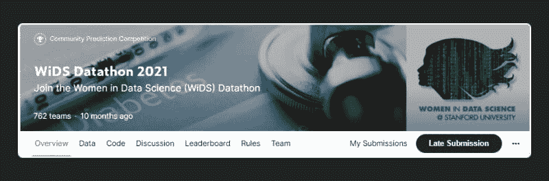
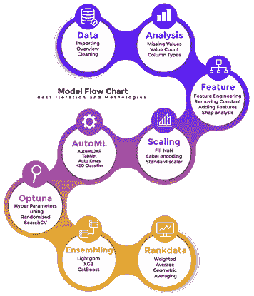
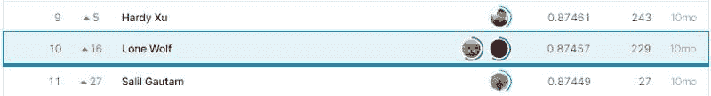
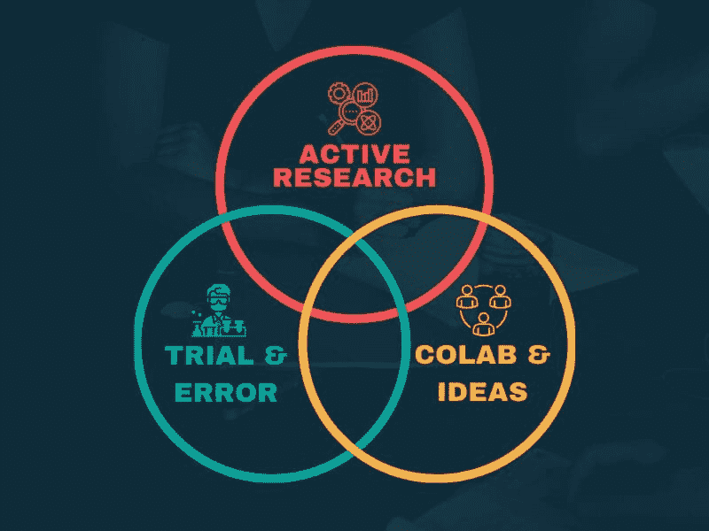
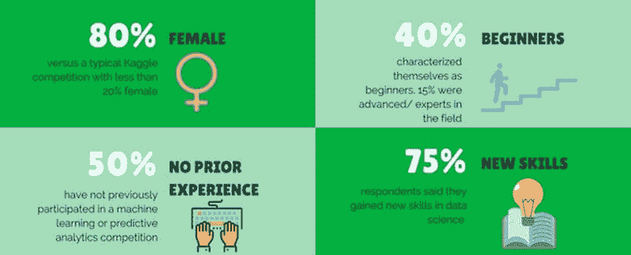
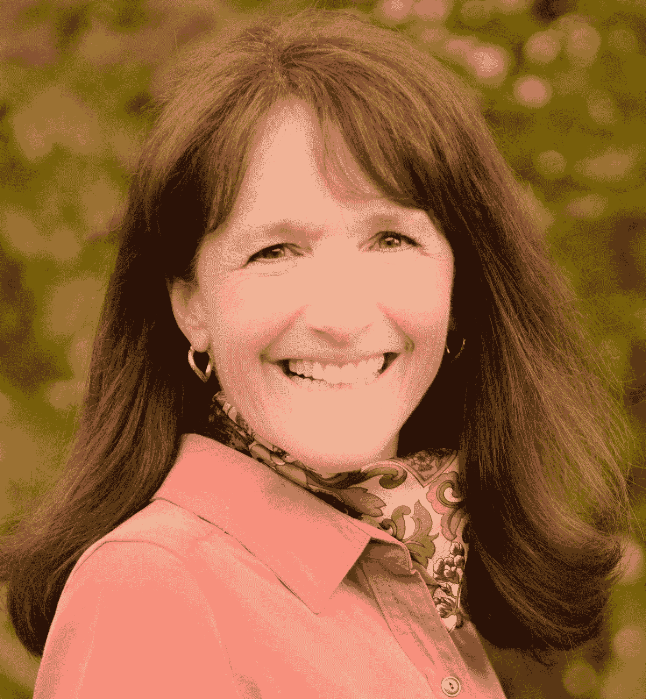
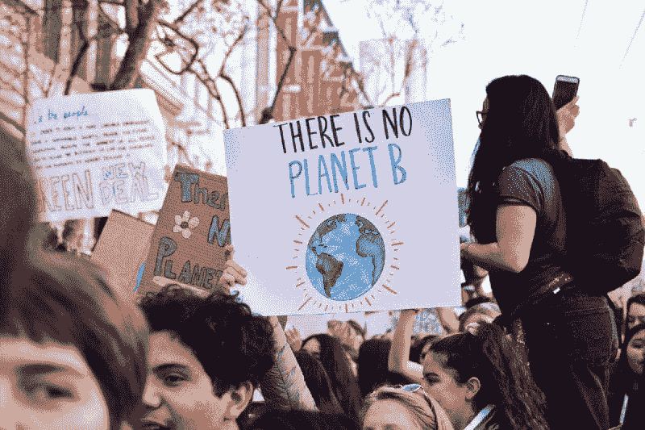

# 女性数据科学家（WiDS）Datathon 的故事

> 原文：[`www.kdnuggets.com/2022/01/story-women-data-science-wids-datathon.html`](https://www.kdnuggets.com/2022/01/story-women-data-science-wids-datathon.html)

图片由作者提供

## 事情是如何开始的...

* * *

## 我们的三大课程推荐

 1\. [Google 网络安全证书](https://www.kdnuggets.com/google-cybersecurity) - 快速进入网络安全职业生涯。

 2\. [Google 数据分析专业证书](https://www.kdnuggets.com/google-data-analytics) - 提升你的数据分析能力

 3\. [Google IT 支持专业证书](https://www.kdnuggets.com/google-itsupport) - 支持你的组织进行 IT 管理

* * *

这一切开始于对做一些不同而有意义的事情的好奇。我听说了很多关于数据科学的事情，但从未完全理解其含义，于是有一天我的朋友给我发了一篇关于[**GPT3**](https://openai.com/blog/gpt-3-apps/)的文章，这就是开始。我决心学习这个神奇的数据科学世界，因此决定参加[Python 数据科学家课程 - DataCamp Learn](https://app.datacamp.com/learn/career-tracks/data-scientist-with-python?version=5)。学习路径教会了我 Python 编程和统计思维。

要完成数据科学课程，我们需要解决[案例研究：使用机器学习进行学校预算](https://app.datacamp.com/learn/courses/case-study-school-budgeting-with-machine-learning-in-python)并参加[DrivenData 竞赛](https://www.drivendata.org/competitions/46/box-plots-for-education-reboot/)。这是我第一次构建分类模型，它彻底改变了我的思维方式。我日夜努力，试图登上[排行榜](https://www.drivendata.org/competitions/46/box-plots-for-education-reboot/leaderboard/)，最终获得了第 8 名。

图片由作者提供

进入前十名激励我参与其他竞赛，最终我发现了[Kaggle](https://www.kaggle.com/)。Kaggle 组织了最激动人心和具有挑战性的机器学习竞赛。我特别寻找初学者级别的竞赛，并找到了[WiDS Datathon 2021](https://www.kaggle.com/c/widsdatathon2021/overview)。这个竞赛有一个严格要求，即团队中至少要有 50%的女性参与者，这也是我找到[**Penguin**](https://www.kaggle.com/qypeng12)的原因。

## WiDS Datathon 2021

每年的挑战赛[WiDS Datathon](https://www.widsconference.org/datathon.html)鼓励女性通过关注社会影响的机器学习挑战来提升她们的数据科学技能。竞赛允许来自不同地区的四千名参与者合作构建糖尿病的最先进预测模型。

[WiDS Datathon 2021](https://www.kaggle.com/c/widsdatathon2021) 专注于患者健康，通过提供 [MIT 的 GOSSIS](https://gossis.mit.edu/) 表格数据集。为了在排行榜上取得最高位置，我们将专注于模型指标 AUC：**接收者操作特征** (ROC) 曲线下的面积（预测与观察目标之间的糖尿病诊断）。

[WiDS Datathon 2021](https://www.kaggle.com/c/widsdatathon2021)封面

在初步介绍之后，我们开始工作于各种机器学习模型，并花费大部分时间解决构建基线模型的方案。我们分别处理不同的任务，并通过 Discord 通话每周讨论进展。几个月后，我们成功构建了一个有效的机器学习管道，使我们进入了第十名。

下图展示了我们构建高性能模型所采取的所有步骤。

图片由作者提供

+   **数据：** 数据获取和清洗。

+   **分析：** 探索性数据分析。

+   **特征工程：** 删除多个高相关特征，添加新特征，和初步模型 shap 分析。

+   **缩放：** 填补缺失值、标签编码和标准缩放。

+   **AutoML：** 试验了多个开源 AutoML 工具，如 AutoMLJar、Tabnet、Auto Keras 和 H2O。

+   **Optuna：** 使用 Optuna 和随机搜索 CV 进行超参数优化。

+   **集成方法：** 基于模型表现的加权集成。

+   **排名数据：** 使用几何平均法对多个实验结果进行排序，以获得更好的模型性能指标。

我们进行了**229**次实验，最终获得了**0.8746**的 AUC 分数。

> **“努力和专注是成功的关键。”**

Kaggle 排行榜 — [WiDS Datathon 2021](https://www.kaggle.com/c/widsdatathon2021/leaderboard)

## 胜利公式

在本节中，我们将深入了解**“对我们有效的东西”**，以及你如何运用这些技巧赢得下一个数据科学竞赛。

图片由作者提供

### 活跃的研究

在 Kaggle 上，大多数团队都分享他们的代码，因此你可以简单地分叉得分最高的笔记本并提交 .csv 文件。这种技术无法使你进入前十名甚至前一百名。最糟糕的是，私人数据集发布后，你的排名会下降。

> **“复制笔记本，了解他们是如何解决问题的，然后进行更改以获得更好的分数。”**

要赢得比赛，你需要制定自己的策略和模型管道。我们的策略是利用 AutoML 进行特征工程来解决问题。我们阅读了多个笔记本、博客和类似主题的研究论文，以了解在大多数情况下有效的解决方案。

> **“不断寻找新的模型、工具和框架，以提升你的分数。”**

### 尝试与错误

实验多种模型和技术是我们成功的主要因素。我们从未认为使用神经网络处理简单数据集是一种愚蠢的方法。我们测试了所有自动化机器学习框架、深度学习模型、梯度提升、集成技术、超参数优化和特征工程技术。

> **“利用你的时间进行实验和学习解决相同问题的新方法。”**

不要仅仅局限于 Kaggle 笔记本，搜索 GitHub 项目、技术博客、研究论文和其他代码共享平台。如果你打算用于学习目的，复制代码是可以的，如果你想将代码分享给公众，只需添加作者署名。

> **“不要害怕大胆思考，去寻求不寻常的解决方案。”**

### 合作

起初，我们完全不理解分享想法或代码的概念。但随着时间的推移，Kaggle 社区教会了我们数据增强、特征工程和模型集成技术。简而言之，他们是我们能够登上顶峰的真正原因。

> **“去**讨论标签**查看其他参与者的讨论或提问。”**

合作不仅限于 Kaggle 上的讨论标签，你需要与团队成员合作，向工作场所的人请教，或者在其他论坛上提问，例如创建**Reddit** 线程。沟通你的问题和想法将帮助你找到适合你的解决方案。

### 比赛的结果

比赛旨在通过帮助女性获得必要的工具来开启数据科学职业生涯，从而推动女性的整体参与。在典型的 Kaggle 比赛中，由于缺乏鼓励和支持，女性参与有限，而在 WiDS 比赛中情况完全相反，女性参与者占主导地位。Datathon 还为初学者提供了处理实际项目的学习经验。了解更多信息请访问 [结果与影响](https://www.widsconference.org/blog_archive/wids-datathon-2021-results-and-impact)。

[WiDS Datathon 2021 结果和影响](https://www.widsconference.org/blog_archive/wids-datathon-2021-results-and-impact)

我与**Karen Ebert Matthys**进行了非常精彩的采访，她是 Women in Data Science 的联合创始人兼联合主任，同时也是斯坦福大学计算与数学工程研究所（ICME）的执行主任/外部合作伙伴。完成工程学学位后，她在一个男性主导的职业中工作，有时她是唯一一个参加技术相关活动的女性。这激励她启动 WiDS 会议，为女性提供平等的机会参与并为职场带来多样性。

除了组织 datathon，WiDS 还包括年度技术会议和全球各地的 WiDS 区域活动。WiDS 还通过在线专业研讨会提供职业支持。最近，他们主动向中学生普及数据科学。总之，他们在各个层面上工作，为全球的女性提供支持。

> **“WiDS Datathon 欢迎从初学者到经验丰富的 Kagglers 的所有人。 这是提升数据科学技能并结识全球 WiDS 社区其他成员的绝佳方式。 我们对 WiDS datathon 参与者的多样性感到非常高兴——包括来自各种学科（商业、科学、农业、工程、计算机科学等）的学生，以及行业、学术界、政府和非政府组织的专业人士。”**

了解更多关于 WiDS Datathon 2021 的结果和影响[这里](https://www.widsconference.org/blog_archive/wids-datathon-2021-results-and-impact)。

## WiDS 下一次挑战

[WiDS Datathon 2022](http://widsconference.org/datathon)将从 2022 年 1 月初持续到 2 月末在 Kaggle 上进行。注册链接在[这里](https://airtable.com/shrmG1SOK8lb4jNzZ)，要参与，你还需要创建一个 Kaggle 账户。我强烈建议你以团队形式参与而非个人，并加入所有的研讨会。下一个 Datathon 专注于气候变化，你将为全球事业做出贡献。

由[Li-An Lim](https://unsplash.com/@li_anlim?utm_source=medium&utm_medium=referral)拍摄，来源于[Unsplash](https://unsplash.com?utm_source=medium&utm_medium=referral)

参赛者将分析建筑能效的区域差异，并建立模型预测建筑能耗。此次竞赛将帮助政府或城市管理部门最大化能源效率。了解更多信息请访问[WiDS Datathon 2022 挑战赛：利用数据科学缓解气候变化](https://www.widsconference.org/blog_archive/announcing-the-5th-annual-wids-datathon-2022-challenge-using-data-science-to-mitigate-climate-change)。

Karen Ebert Matthys 的留言：

> **“请[在这里注册](https://airtable.com/shrmG1SOK8lb4jNzZ)并加入我们 1 月 7 日的启动网络研讨会！同时，也请在 1 月期间查看[这里](https://www.widsconference.org/datathon-workshops-2022.html)，了解全球范围内提供的 datathon 工作坊，您可以获得指导并寻找团队成员。”**

## 致谢

我们感谢 Kaggle 和数据科学领域女性的支持性社区。我们特别感谢那些分享他们的解决方案和想法的人们。

**我们想在 Kaggle 上提到的一些名字：**

+   [Siavash](https://www.kaggle.com/siavrez)

+   [Bogdan Ivanyuk](https://www.kaggle.com/bogdanbaraban)

+   [Tensor Girl](https://www.kaggle.com/usharengaraju)

+   [Kim Montgomery](https://www.kaggle.com/robertmontgomery)

+   [Andrada Olteanu](https://www.kaggle.com/andradaolteanu)

## 学习资源

+   [如何构建能源消耗预测模型 | Viridis](https://viridis.energy/en/blog/how-build-energy-consumption-prediction-model)

+   [用于能源消耗预测和智能建筑调度的机器学习 | SpringerLink](https://link.springer.com/article/10.1007/s42452-020-2024-9)

+   [Power-Laws-Forecasting：Power Laws 预测比赛的获胜者 (github.com)](https://github.com/drivendataorg/power-laws-forecasting)

+   [初学者机器学习简介 | Ayush Pant | Towards Data Science](https://towardsdatascience.com/introduction-to-machine-learning-for-beginners-eed6024fdb08)

+   [Python 基础机器学习课程 — DataCamp Learn](https://app.datacamp.com/learn/skill-tracks/machine-learning-fundamentals-with-python)

+   [向 WiDS Datathon 2021 的获胜者学习，包括一位 Kaggle 大师 (widsconference.org)](https://www.widsconference.org/blog_archive/learn-from-wids-datathon-2021-winners-including-a-kaggle-grandmaster)

**[Abid Ali Awan](https://www.polywork.com/kingabzpro) ([@1abidaliawan](https://twitter.com/1abidaliawan)) 是一名认证数据科学专业人员，热衷于构建机器学习模型。目前，他专注于内容创作和撰写有关机器学习和数据科学技术的技术博客。Abid 拥有技术管理硕士学位和电信工程学士学位。他的愿景是使用图神经网络为那些在精神健康方面挣扎的学生构建一个 AI 产品。**

### 更多相关话题

+   [我的数据科学六个月成功故事](https://www.kdnuggets.com/2023/04/data-science-six-months-success-story.html)

+   [讲述一个伟大的数据故事：可视化决策树](https://www.kdnuggets.com/2021/02/telling-great-data-story-visualization-decision-tree.html)

+   [KDnuggets™ 新闻 22:n09，3 月 2 日：讲述一个伟大的数据故事：一个…](https://www.kdnuggets.com/2022/n09.html)

+   [数据世界中的女性](https://www.kdnuggets.com/2022/03/women-world-data.html)

+   [8 位在人工智能领域努力使世界更具人性化的女性](https://www.kdnuggets.com/2021/03/8-women-ai-striving-humanize-world.html)

+   [庆祝女性在科技行业领导角色中的成就](https://www.kdnuggets.com/2022/07/celebrating-women-leadership-roles-tech-industry.html)
