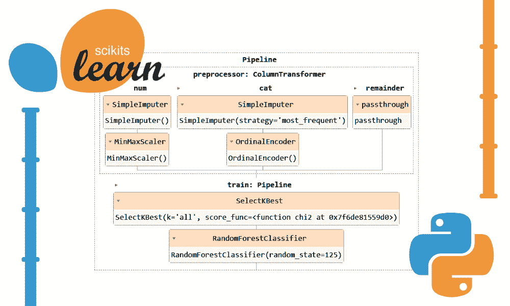
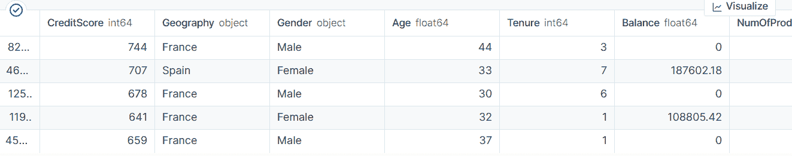
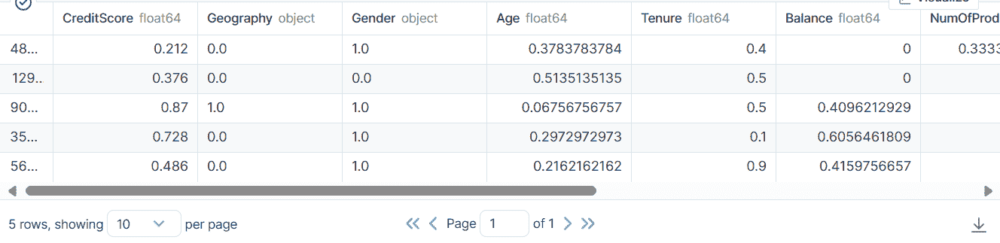
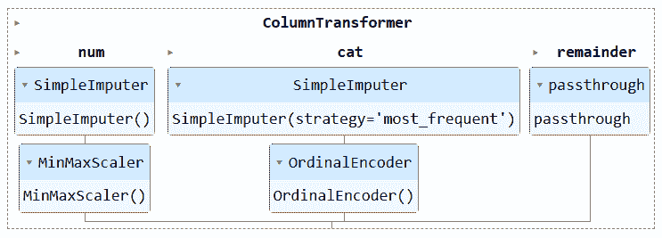
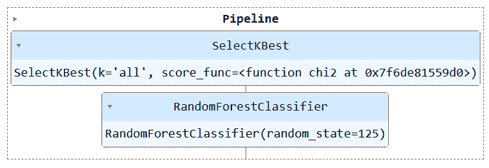
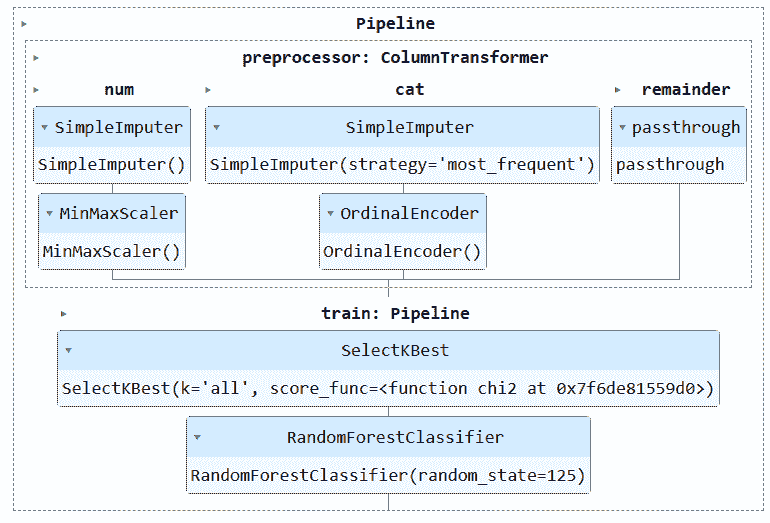
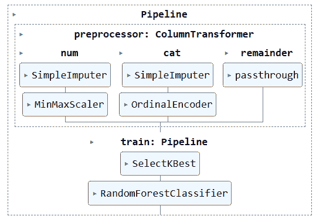

# 使用 Scikit-learn 管道简化你的机器学习工作流程

> 原文：[`www.kdnuggets.com/streamline-your-machine-learning-workflow-with-scikit-learn-pipelines`](https://www.kdnuggets.com/streamline-your-machine-learning-workflow-with-scikit-learn-pipelines)



作者提供的图片

使用 Scikit-learn 管道可以简化你的预处理和建模步骤，减少代码复杂性，确保数据预处理的一致性，帮助超参数调整，并使你的工作流程更加有序且易于维护。通过将多个转换和最终模型集成到一个单一实体中，管道提高了可重复性，使一切变得更高效。

* * *

## 我们的前三个课程推荐

 1\. [Google 网络安全证书](https://www.kdnuggets.com/google-cybersecurity) - 快速进入网络安全职业

 2\. [Google 数据分析专业证书](https://www.kdnuggets.com/google-data-analytics) - 提升你的数据分析技能

 3\. [Google IT 支持专业证书](https://www.kdnuggets.com/google-itsupport) - 支持你的组织 IT

* * *

在本教程中，我们将使用来自 Kaggle 的 [Bank Churn](https://www.kaggle.com/datasets/rangalamahesh/bank-churn?select=train.csv) 数据集来训练一个随机森林分类器。我们将比较传统的数据预处理和模型训练方法与使用 Scikit-learn 管道和 ColumnTransformers 的更高效的方法。

# 数据处理管道

在数据处理管道中，我们将学习如何单独转换分类和数值列。我们将从传统的代码风格开始，然后展示一种更好的处理方式。

从 zip 文件中提取数据后，加载 `train.csv` 文件，将“id”作为索引列。删除不必要的列并打乱数据集。

```py
import pandas as pd

bank_df = pd.read_csv("train.csv", index_col="id")
bank_df = bank_df.drop(['CustomerId', 'Surname'], axis=1)
bank_df = bank_df.sample(frac=1)
bank_df.head()
```

我们有分类、整数和浮点列。数据集看起来相当干净。



## 简单的 Scikit-learn 代码

作为数据科学家，我已经多次编写了这段代码。我们的目标是填充分类特征和数值特征中的缺失值。为此，我们将使用 `SimpleImputer`，对每种特征使用不同的策略。

在填充缺失值之后，我们将把分类特征转换为整数，并对数值特征应用最小-最大缩放。

```py
from sklearn.impute import SimpleImputer
from sklearn.preprocessing import OrdinalEncoder, MinMaxScaler

cat_col = [1,2]
num_col = [0,3,4,5,6,7,8,9]

# Filling missing categorical values
cat_impute = SimpleImputer(strategy="most_frequent")
bank_df.iloc[:,cat_col] = cat_impute.fit_transform(bank_df.iloc[:,cat_col])

# Filling missing numerical values
num_impute = SimpleImputer(strategy="median")
bank_df.iloc[:,num_col] = num_impute.fit_transform(bank_df.iloc[:,num_col])

# Encode categorical features as an integer array.
cat_encode = OrdinalEncoder()
bank_df.iloc[:,cat_col] = cat_encode.fit_transform(bank_df.iloc[:,cat_col])

# Scaling numerical values.
scaler = MinMaxScaler()
bank_df.iloc[:,num_col] = scaler.fit_transform(bank_df.iloc[:,num_col])

bank_df.head()
```

结果是，我们得到了一个干净且转化后的数据集，只有整数或浮点值。



## Scikit-learn 管道代码

让我们使用`Pipeline`和`ColumnTransformer`转换上述代码。我们将创建两个管道：一个用于数值列，一个用于分类列。

1.  在数值管道中，我们使用了简单的插补“mean”策略，并应用了最小-最大缩放器进行归一化。

1.  在分类管道中，我们使用了简单插补器的“most_frequent”策略和原始编码器将类别转换为数值。

我们使用 ColumnTransformer 结合了两个管道，并为每个管道提供了列索引。这将帮助你将这些管道应用于特定的列。例如，分类转换器管道将仅应用于列 1 和 2。

**注意：**  remainder="passthrough" 表示未处理的列将最终添加进来。在我们的例子中，它是目标列。

```py
from sklearn.impute import SimpleImputer
from sklearn.preprocessing import OrdinalEncoder, MinMaxScaler
from sklearn.compose import ColumnTransformer
from sklearn.pipeline import Pipeline

# Identify numerical and categorical columns
cat_col = [1,2]
num_col = [0,3,4,5,6,7,8,9]

# Transformers for numerical data
numerical_transformer = Pipeline(steps=[
    ('imputer', SimpleImputer(strategy='mean')),
    ('scaler', MinMaxScaler())
])

# Transformers for categorical data
categorical_transformer = Pipeline(steps=[
    ('imputer', SimpleImputer(strategy='most_frequent')),
    ('encoder', OrdinalEncoder())
])

# Combine transformers into a ColumnTransformer
preproc_pipe = ColumnTransformer(
    transformers=[
        ('num', numerical_transformer, num_col),
        ('cat', categorical_transformer, cat_col)
    ],
    remainder="passthrough"
)

# Apply the preprocessing pipeline
bank_df = preproc_pipe.fit_transform(bank_df)
bank_df[0]
```

经过转换后，结果数组包含了数值转换值在开始部分和分类转换值在结束部分，这取决于管道在列转换器中的顺序。

```py
array([0.712     , 0.24324324, 0.6       , 0\.        , 0.33333333,
       1\.        , 1\.        , 0.76443485, 2\.        , 0\.        ,
       0\.        ])
```

你可以在 Jupyter Notebook 中运行管道对象以可视化管道。确保你拥有最新版本的 Scikit-learn。

```py
preproc_pipe
```



# 数据训练管道

要训练和评估我们的模型，我们需要将数据集拆分为两个子集：训练集和测试集。

为此，我们将首先创建依赖变量和自变量，并将其转换为 NumPy 数组。然后，我们将使用`train_test_split`函数将数据集拆分为两个子集。

```py
from sklearn.model_selection import train_test_split

X = bank_df.drop("Exited", axis=1).values
y = bank_df.Exited.values

X_train, X_test, y_train, y_test = train_test_split(
    X, y, test_size=0.3, random_state=125
)
```

## 简单的 Scikit-learn 代码

传统的训练代码编写方式是首先使用`SelectKBest`进行特征选择，然后将新特征提供给我们的随机森林分类器模型。

我们将首先使用训练集训练模型，并使用测试数据集评估结果。

```py
from sklearn.feature_selection import SelectKBest, chi2
from sklearn.ensemble import RandomForestClassifier

KBest = SelectKBest(chi2, k="all")
X_train = KBest.fit_transform(X_train, y_train)
X_test = KBest.transform(X_test)

model = RandomForestClassifier(n_estimators=100, random_state=125)

model.fit(X_train,y_train)

model.score(X_test, y_test)
```

我们达到了相当不错的准确率。

```py
0.8613035487063481
```

## Scikit-learn 管道代码

让我们使用`Pipeline`函数将两个训练步骤合并到一个管道中。然后我们可以在训练集上拟合模型，并在测试集上评估。

```py
KBest = SelectKBest(chi2, k="all")
model = RandomForestClassifier(n_estimators=100, random_state=125)

train_pipe = Pipeline(
    steps=[
        ("KBest", KBest),
        ("RFmodel", model),
    ]
)

train_pipe.fit(X_train,y_train)

train_pipe.score(X_test, y_test)
```

我们取得了类似的结果，但代码看起来更高效、更简洁。添加或移除训练管道中的新步骤非常简单。

```py
0.8613035487063481
```

运行管道对象以可视化管道。

```py
train_pipe
```



# 结合处理与训练管道

现在，我们将通过创建另一个管道并将两个管道相结合来整合预处理和训练管道。

这是完整的代码：

```py
import pandas as pd
from sklearn.model_selection import train_test_split
from sklearn.impute import SimpleImputer
from sklearn.preprocessing import OrdinalEncoder, MinMaxScaler
from sklearn.compose import ColumnTransformer
from sklearn.pipeline import Pipeline
from sklearn.feature_selection import SelectKBest, chi2
from sklearn.ensemble import RandomForestClassifier

#loading the data
bank_df = pd.read_csv("train.csv", index_col="id")
bank_df = bank_df.drop(['CustomerId', 'Surname'], axis=1)
bank_df = bank_df.sample(frac=1)

# Splitting data into training and testing sets
X = bank_df.drop(["Exited"],axis=1)
y = bank_df.Exited

X_train, X_test, y_train, y_test = train_test_split(
    X, y, test_size=0.3, random_state=125
)

# Identify numerical and categorical columns
cat_col = [1,2]
num_col = [0,3,4,5,6,7,8,9]

# Transformers for numerical data
numerical_transformer = Pipeline(steps=[
    ('imputer', SimpleImputer(strategy='mean')),
    ('scaler', MinMaxScaler())
])

# Transformers for categorical data
categorical_transformer = Pipeline(steps=[
    ('imputer', SimpleImputer(strategy='most_frequent')),
    ('encoder', OrdinalEncoder())
])

# Combine pipelines using ColumnTransformer
preproc_pipe = ColumnTransformer(
    transformers=[
        ('num', numerical_transformer, num_col),
        ('cat', categorical_transformer, cat_col)
    ],
    remainder="passthrough"
)

# Selecting the best features
KBest = SelectKBest(chi2, k="all")

# Random Forest Classifier
model = RandomForestClassifier(n_estimators=100, random_state=125)

# KBest and model pipeline
train_pipe = Pipeline(
    steps=[
        ("KBest", KBest),
        ("RFmodel", model),
    ]
)

# Combining the preprocessing and training pipelines
complete_pipe = Pipeline(
    steps=[

        ("preprocessor", preproc_pipe),
        ("train", train_pipe),
    ]
)

# running the complete pipeline
complete_pipe.fit(X_train,y_train)

# model accuracy
complete_pipe.score(X_test, y_test)
```

输出：

```py
0.8592837955201874
```

可视化完整的管道。

```py
complete_pipe
```



# 保存和加载模型

使用管道的一个主要优势是你可以与模型一起保存管道。在推理过程中，你只需加载管道对象，它将准备好处理原始数据并提供准确的预测。你不需要在应用程序文件中重新编写处理和转换函数，因为它可以直接使用。这使得机器学习工作流程更高效，并节省了时间。

首先，使用 [skops-dev/skops](https://github.com/skops-dev/skops) 库保存管道。

```py
import skops.io as sio

sio.dump(complete_pipe, "bank_pipeline.skops")
```

然后，加载保存的管道并显示管道。

```py
new_pipe = sio.load("bank_pipeline.skops", trusted=True)
new_pipe
```

如我们所见，我们已成功加载管道。



为了评估我们加载的管道，我们将对测试集进行预测，然后计算准确率和 F1 分数。

```py
from sklearn.metrics import accuracy_score, f1_score

predictions = new_pipe.predict(X_test)
accuracy = accuracy_score(y_test, predictions)
f1 = f1_score(y_test, predictions, average="macro")

print("Accuracy:", str(round(accuracy, 2) * 100) + "%", "F1:", round(f1, 2))
```

事实证明，我们需要关注少数类以提高我们的 f1 分数。

```py
Accuracy: 86.0% F1: 0.76
```

项目文件和代码可以在 [**Deepnote Workspace**](https://deepnote.com/workspace/abid-5efa63e7-7029-4c3e-996f-40e8f1acba6f/project/Streamline-Your-Machine-Learning-workflow-with-Scikit-learn-Pipelines-a2088a14-c9d1-490e-a610-c0e505b14282/notebook/With%20SKlearn%20Pipelines-49b6e41b5f1142fb8982dfbec4b1fb18) 上找到。该工作区有两个笔记本：一个包含 Scikit-learn 管道，另一个不包含。

# 结论

在本教程中，我们学习了 Scikit-learn 管道如何通过将数据转换和模型序列链接在一起来简化机器学习工作流程。通过将预处理和模型训练结合到一个 Pipeline 对象中，我们可以简化代码，确保一致的数据转换，并使我们的工作流程更有组织、更具可重复性。

[](https://www.polywork.com/kingabzpro)****[Abid Ali Awan](https://www.polywork.com/kingabzpro)**** ([@1abidaliawan](https://www.linkedin.com/in/1abidaliawan)) 是一位认证的数据科学专家，他热爱构建机器学习模型。目前，他专注于内容创作和撰写关于机器学习和数据科学技术的技术博客。Abid 拥有技术管理硕士学位和电信工程学士学位。他的愿景是利用图神经网络为遭受心理疾病困扰的学生构建一个 AI 产品。

### 更多相关主题

+   [轻松将 LLM 集成到您的 Scikit-learn 工作流程中](https://www.kdnuggets.com/easily-integrate-llms-into-your-scikit-learn-workflow-with-scikit-llm)

+   [7 个 GPT 帮助改善您的数据科学工作流程](https://www.kdnuggets.com/7-gpts-to-help-improve-your-data-science-workflow)

+   [5 门来自 Google 的 MLOps 课程提升您的 ML 工作流程](https://www.kdnuggets.com/5-mlops-courses-from-google-to-level-up-your-ml-workflow)

+   [RAPIDS cuDF 加速您的下一个数据科学工作流程](https://www.kdnuggets.com/2023/04/rapids-cudf-speed-next-data-science-workflow.html)

+   [数据科学工作流的 7 款最佳人工智能工具](https://www.kdnuggets.com/the-7-best-ai-tools-for-data-science-workflow)

+   [统一批处理和机器学习系统的特征/训练/推断流水线](https://www.kdnuggets.com/2023/09/hopsworks-unify-batch-ml-systems-feature-training-inference-pipelines)
