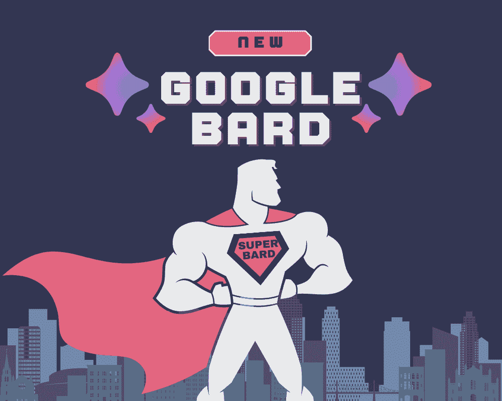
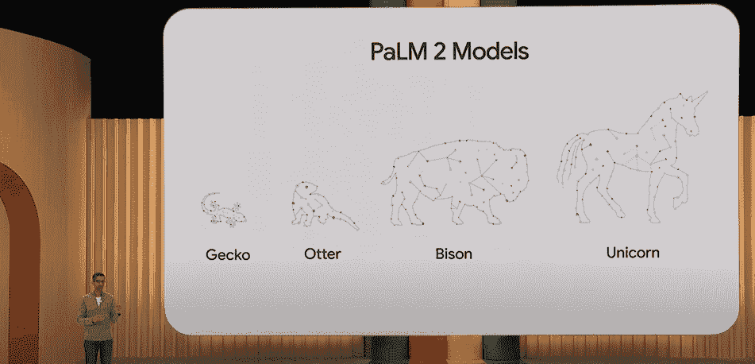
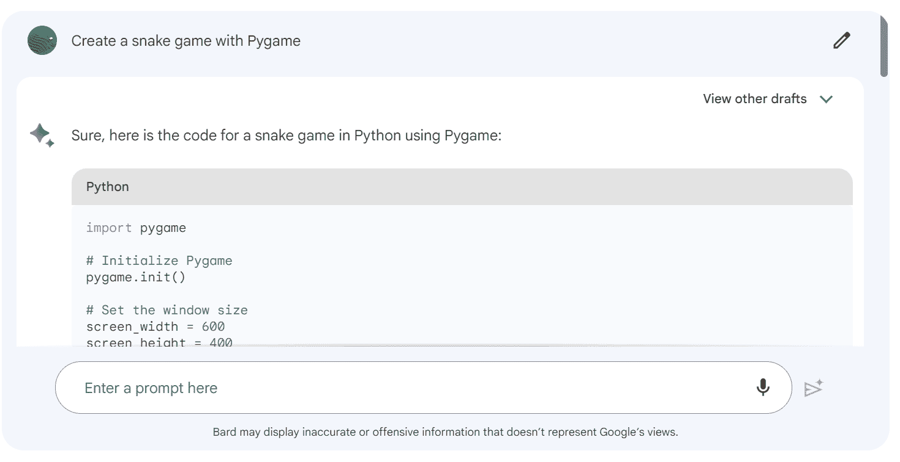
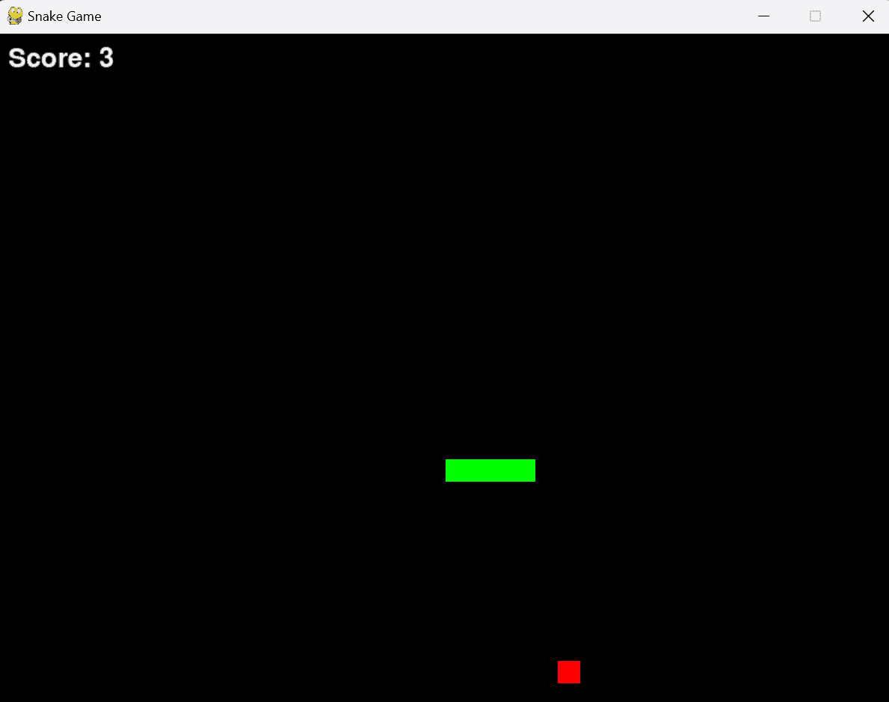
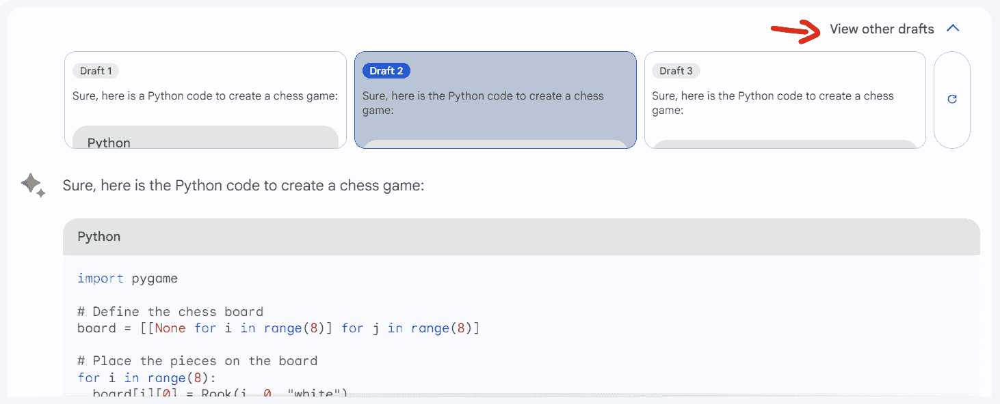
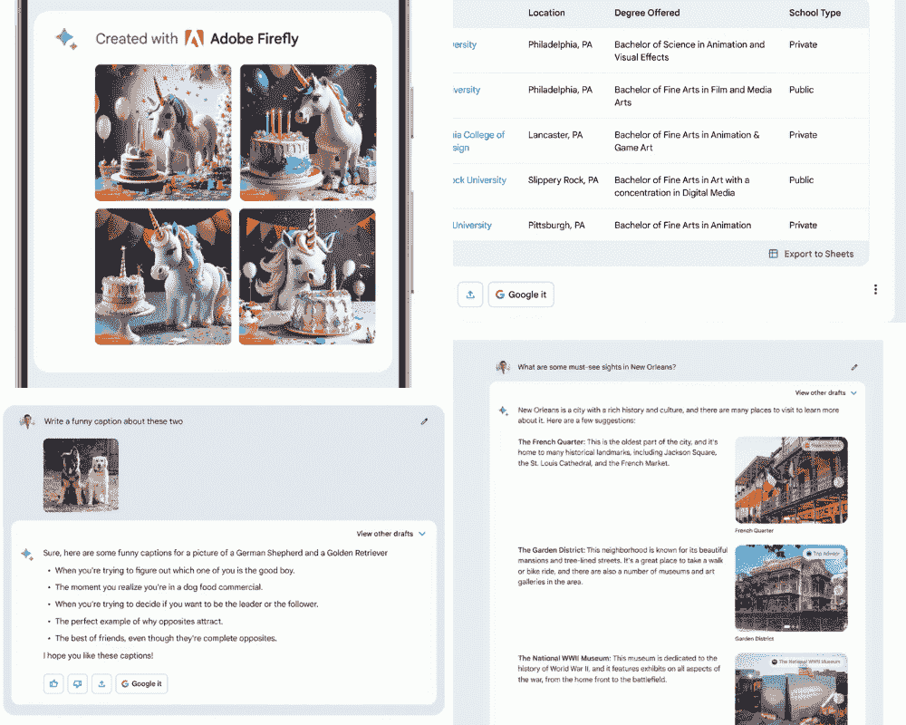

# 超级 Bard：可以做到一切且更好的 AI

> 原文：[`www.kdnuggets.com/2023/05/super-bard-ai-better.html`](https://www.kdnuggets.com/2023/05/super-bard-ai-better.html)

图片由作者提供

# 介绍 PaLM 2

* * *

## 我们的三大课程推荐

 1\. [Google 网络安全证书](https://www.kdnuggets.com/google-cybersecurity) - 快速进入网络安全职业轨道。

 2\. [Google 数据分析专业证书](https://www.kdnuggets.com/google-data-analytics) - 提升你的数据分析技能

 3\. [Google IT 支持专业证书](https://www.kdnuggets.com/google-itsupport) - 支持你的组织的 IT

* * *

Pathways 语言模型（PaLM）已更新，改进了多语言、推理和编码能力。这个新模型更能理解和生成多种语言的文本，并且在推理和编码方面更有能力。

[PaLM 2](https://ai.google/discover/palm2) 在超过 100 种语言的大型文本和代码数据集上进行训练。为了提高其推理能力，开发者包括了包含数学表达式的科学论文和网页。PaLM 2 还在各种编程语言的公开源代码上进行了预训练。因此，它是一个顶级的下一代语言模型，正在驱动各种 Google 服务。

# PaLM 2 上的 Bard

根据 [Google 主题演讲 (Google I/O ‘23)](https://www.youtube.com/watch?v=cNfINi5CNbY)，Bard 现在运行在 PaLM 2 模型上。它在编码、推理和创意写作问题上的表现远胜于 [LaMDA](https://blog.google/technology/ai/lamda/)。

图片来自 [Google 主题演讲 (Google I/O ‘23)](https://www.youtube.com/watch?v=cNfINi5CNbY)

我使用了旧版 Bard (LaMDA) 30 天和新版 Bard (PaLM 2) 7 天。我发现 Bard 在处理编码问题方面发生了显著变化。Bard 并不完美，但我认为 Google 正在走在正确的道路上。

例如，当我要求 Bard 使用 Pygame 创建一个贪吃蛇游戏时，旧版 Bard 能够创建游戏，但存在几个错误和减少的功能。新版 Bard 能够创建一个具有所有预期功能的正常运行的贪吃蛇游戏。

我仍然看到新版 Bard 有一些错误，但总体上我对 Google 所取得的进展感到满意。

图片来自 Bard

我让 ChatGPT 和 HuggingChat 生成代码来解决类似的问题。ChatGPT 生成了无错误的代码，并且功能更多，而 HuggingChat 生成的代码有几个错误，缺少库，并存在安全漏洞。

作者提供的图片 | 使用 ChatGPT

## Bard 与 ChatGPT 有何不同？

每当你写一个提示时，它会提供三个草稿供你选择。它生成结果的速度很快，并且集成了 Google 服务。

要访问草稿，你需要点击“查看其他草稿”。

来自 Bard 的图片

要访问 Google 集成，请点击左下角的向上箭头。这是一个代码响应。你将获得在 Google Colab 上运行代码的选项。

来自 Bard 的图片

# Bard 用于数据科学

我一直在使用 Bard 处理各种数据科学任务，从理解项目到生成高质量的数据报告。我相信 Bard 是最好的大型语言模型，原因如下：

+   **语法和写作：** Bard 擅长改善语法，并生成可以整体提升你写作的现实文本。在这方面，它比 ChatGPT 更优秀，后者可能过于戏剧化。

+   **机器学习研究：** Bard 擅长研究机器学习主题。它可以为你提供广泛主题的准确资料，甚至是最新的研究成果。

+   **翻译：** Bard 擅长翻译。它可以在多种语言之间进行翻译，包括将 Python 代码翻译成 JavaScript 或将英语翻译成日语。

+   **头脑风暴、项目规划和理解上下文：** Bard 擅长头脑风暴、项目规划和理解上下文。它会评估聊天记录以提供适当的答案，而不是给出随机响应。

+   **生成 DALL-E 2、Midjourney 和 Stable Diffusion 提示：** Bard 擅长生成 DALL-E 2、Midjourney 和 Stable Diffusion 提示。它可以帮助你从文本描述中创建现实的图像和艺术作品。

+   **提供外部资源链接：** Bard 擅长提供外部资源链接。如果你想深入了解某个话题或查看 Bard 生成的示例，这会很有帮助。

来自 Bard 的图片

> “除了代码生成，我还在使用 Bard 来做其他所有事情。”

# 超级 Bard：Bard + 工具

现在，让我们谈谈能做一切的超级 Bard。下个月，谷歌宣布了谷歌服务和第三方集成。这意味着你可以在 Bard 中输入提示，并将最终响应移动到 Google Docs、Colab、Email 或你用于工作的任何第三方软件。

到目前为止，我们知道你可以使用 Bard 执行研究，将其转换为表格，修改表格，并将响应导出到 Google Sheets。此外，你可以使用 Google Lens 服务与图像互动。例如，“你能详细描述一下这张图片吗？” 类似于 GPT-4。

**但它比 GPT-4 更好。**

将来，你将能够直接从 Bard 使用 Adobe Firefly 生成图像。你只需输入提示，就能自动完成大部分任务。

图片由作者提供，自 Google I/O ‘23

# 结论

总结而言，我认为 Bard 有潜力成为你所有工作相关任务的一站式解决方案。团队正在不断努力改进模型并添加新功能，他们走在超越 GPT-4 的正确轨道上。然而，Bard 仍有一些需要改进的地方，例如处理代码相关问题的能力以及与 Google 搜索的集成。如果 Bard 能够解决这些问题，我相信它将成为一款真正具有革命性的工具，改变我们的工作方式。

**[Abid Ali Awan](https://www.polywork.com/kingabzpro)**（[@1abidaliawan](https://twitter.com/1abidaliawan)）是一位认证的数据科学专业人士，热爱构建机器学习模型。目前，他专注于内容创作，并撰写有关机器学习和数据科学技术的技术博客。Abid 拥有技术管理硕士学位和电信工程学士学位。他的愿景是利用图神经网络为有心理健康问题的学生开发人工智能产品。

### 更多相关话题

+   [8 款开源替代 ChatGPT 和 Bard 的工具](https://www.kdnuggets.com/2023/04/8-opensource-alternative-chatgpt-bard.html)

+   [检测 ChatGPT、GPT-4、Bard 和 Claude 的十大工具](https://www.kdnuggets.com/2023/05/top-10-tools-detecting-chatgpt-gpt4-bard-llms.html)

+   [为何数据科学家对 Google Bard 的建议持怀疑态度](https://www.kdnuggets.com/2023/02/data-scientists-expect-flawed-advice-google-bard.html)

+   [Bard 数据科学备忘单](https://www.kdnuggets.com/2023/05/bard-data-science-cheat-sheet.html)

+   [什么是 Google AI Bard？](https://www.kdnuggets.com/2023/03/google-ai-bard.html)

+   [ChatGPT 与 Google Bard 的技术差异对比](https://www.kdnuggets.com/2023/03/chatgpt-google-bard-comparison-technical-differences.html)
