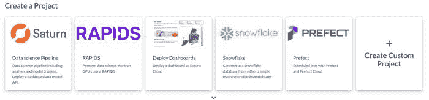
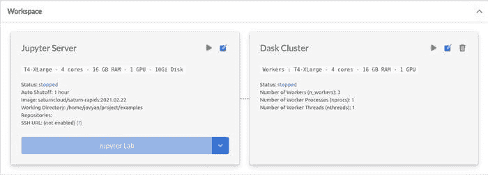

# 使用 Saturn Cloud 在 GPU 上超级充电 Python 和 Pandas

> 原文：[`www.kdnuggets.com/2021/05/super-charge-python-pandas-gpus-saturn-cloud.html`](https://www.kdnuggets.com/2021/05/super-charge-python-pandas-gpus-saturn-cloud.html)

评论

**由 [Tyler Folkman](https://www.linkedin.com/in/tylerfolkman/)，BEN Group 人工智能负责人**


由 [Guillaume Jaillet](https://unsplash.com/@i_am_g?utm_source=medium&utm_medium=referral) 提供的照片，来源于 [Unsplash](https://unsplash.com/?utm_source=medium&utm_medium=referral)

我曾在 LinkedIn 上询问，人们在首次打开 Jupyter Notebook 时最可能导入哪些库。

你知道最常见的回答是什么吗？

### Pandas

Pandas 库被数据科学家广泛使用，但事实是，它往往**相当慢**。如果数据处理速度慢，可能会导致项目的延迟。如果每次生成模型的新特征都需要 10 分钟，你会发现自己只是坐在那儿等待（或者做其他事情 :) ）。


来源：[`xkcd.com/303/`](https://xkcd.com/303/)

数据处理和模型训练的时间类似于程序员的编译时间。虽然你可能会因为处理时间长而享受一些数据处理的休息时间，但我想给你展示一种更好的方法。

我想展示如何**轻松避免慢速超过 1,000,000%**的 Pandas 使用情况。

### 设置

在我们深入实验之前，先谈谈我们将使用的硬件。

为了让你跟随起来非常简单，我们将使用 [Saturn Cloud](https://www.google.com/url?q=https://www.saturncloud.io/s/freehosted/?utm_source%3DSuper%2520Charge%2520Python%2520with%2520Pandas%2520on%2520GPUs%2520using%2520Saturn%2520Cloud%26utm_medium%3Dsaturn%2520hosted%2520free&sa=D&source=editors&ust=1619151968592000&usg=AOvVaw2RRkUYh5nLiKYEOmrk-GvU)。



来源：Saturn Cloud

Saturn Cloud 是一个非常流畅的平台，提供以下功能：

+   每月 10 小时免费使用 Jupyter（包括 GPU）

+   每月 3 小时的 Dask（包括 GPU）

+   部署仪表盘

你可以在 [这里](https://www.google.com/url?q=https://www.saturncloud.io/s/freehosted/?utm_source%3DSuper%2520Charge%2520Python%2520with%2520Pandas%2520on%2520GPUs%2520using%2520Saturn%2520Cloud%26utm_medium%3Dsaturn%2520hosted%2520free&sa=D&source=editors&ust=1619151968592000&usg=AOvVaw2RRkUYh5nLiKYEOmrk-GvU) 免费使用它，使其成为实验大规模数据处理的绝佳场所！

当你在 Saturn 上启动一个项目时，你将获得两个非常重要的硬件：Jupyter 服务器和 Dask 集群。



来源：Saturn Cloud

我们的 Jupyter 服务器运行在 4 个核心、16 GB 内存和一个 GPU 上。Dask 集群有 3 个工作节点，每个节点配有 4 个核心、16GB 内存和一个 GPU。

另一个选择 RAPIDS 基础项目时你会获得的惊人功能是一个包含所有 NVIDIA RAPIDs 库的 Python 内核，包括 CUDF，这允许我们在 GPU 上运行 Pandas 处理。

使用几次点击完成这项设置并不是小胜利。即使你有一台配有 GPU 的计算机，安装 RAPIDs 库也可能需要时间，因为你必须确保有正确的驱动程序和 CUDA 库。

### 数据

好了 — 现在我们已经设置好硬件，我们需要讨论我们将使用的数据集。

我们将使用 Yellow Taxi 行程记录数据。

这些数据有 7,667,792 行和 18 列。运行*info()*在数据框上的结果如下：

```py
<class 'pandas.core.frame.DataFrame'>
RangeIndex: 7667792 entries, 0 to 7667791
Data columns (total 18 columns):
 #   Column                 Dtype         
---  ------                 -----         
 0   VendorID               int64         
 1   tpep_pickup_datetime   datetime64[ns]
 2   tpep_dropoff_datetime  datetime64[ns]
 3   passenger_count        int64         
 4   trip_distance          float64       
 5   RatecodeID             int64         
 6   store_and_fwd_flag     object        
 7   PULocationID           int64         
 8   DOLocationID           int64         
 9   payment_type           int64         
 10  fare_amount            float64       
 11  extra                  float64       
 12  mta_tax                float64       
 13  tip_amount             float64       
 14  tolls_amount           float64       
 15  improvement_surcharge  float64       
 16  total_amount           float64       
 17  congestion_surcharge   float64       
dtypes: datetime64ns, float64(9), int64(6), object(1)
memory usage: 1.0+ GB
```

所以，这是一个相当大的数据集，但还算不上太疯狂。它的内存使用量大约为 1GB。

### 函数

最后，对于我们的实验，我们需要一个在数据上运行的函数。我选择了一个相当简单的函数，它为潜在的模型创建了一个新特征。我们的函数将计算总支付金额除以旅行距离。

```py
def calculate_total_per_mile(row):
 try:
     total_per_mile = row.total_amount / row.trip_distance
 except ZeroDivisionError:
     total_per_mile = 0
 return total_per_mile
```

当我们找到 trip_distance 为零的值时，我们将返回零值。

> 注意：你可以很容易地将这个函数矢量化为 taxi_df[“total_per_mile”] = taxi_df.total_amount / taxi_df.trip_distance，这会快得多。我们使用函数是为了能够比较我们实验中的 apply 速度。如果你感兴趣，矢量化版本大约花费 50 ms。

### 实验 #1 — 原始 Pandas

在第一次实验中，我们只是使用原始 Pandas 读取数据。这里是代码：

```py
taxi_df = pd.read_csv(
 “s3://nyc-tlc/trip data/yellow_tripdata_2019–01.csv”,
 parse_dates=[“tpep_pickup_datetime”, “tpep_dropoff_datetime”]
)
```

数据读取完毕后，我们可以将我们的函数应用于所有行：

```py
taxi_df[‘total_per_mile’] = taxi_df.apply(lambda x: calculate_total_per_mile(x), axis=1)
```

运行这个计算花费了**159,198 ms**（2 分钟 39.21 秒）。

虽然这并不是特别慢，但绝对足够慢到让你注意到所花的时间，并且打乱了你的工作流程。我发现自己坐在那里等待，这段等待时间很容易让你被电子邮件、Slack 或社交媒体分散注意力。这些类型的干扰会严重影响生产力，超出了这次计算运行所需的将近 3 分钟时间。

我们能做得更好吗？

### 实验 #2 — 并行 Pandas

Swifter 是一个库，使得在运行 Pandas *apply* 时，利用 CPU 的所有线程变得极其简单。

由于*apply*容易并行化，因为你可以将数据框拆分为每个线程的块，这应该有所帮助。这里是代码：

```py
taxi_df[‘total_per_mile’] = taxi_df.swifter.apply(lambda x: calculate_total_per_mile(x), axis=1)
```

添加 swifter 后，我们的处理时间变为**88,690 ms**（1 分钟 28.69 秒）。原生 pandas 慢了 1.795 倍，你在运行代码时会明显感觉到加速。然而，你仍然会发现自己在等待其完成。

### 实验 #3 — 在 GPU 上使用 Pandas

这就是事情开始变得有趣的地方。得益于 cuDF 库，它允许我们在 GPU 上运行函数。cuDF 库，“提供了一个类似 pandas 的 API，对数据工程师和数据科学家来说非常熟悉，因此他们可以轻松加速他们的工作流程，而无需深入了解 CUDA 编程。”

不过，要使用 cuDF 库，我们必须稍微改变一下函数的格式：

```py
def calculate_total_per_mile(total_amount, trip_distance, out):
 for i, (ta, td) in enumerate(zip(total_amount, trip_distance)):
     total_per_mile = ta / td
     out[i] = total_per_mile
```

现在我们的函数接受 *total_amount*、*trip_distance* 和 *out*。*Out* 是我们将存储结果的数组。我们的函数随后会遍历数据框中的所有 *total_amount* 和 *trip_distance* 的值，计算 *total_per_mile*，并将结果存储在 *out* 中。

我们还必须改变将此函数应用于数据框的方式：

```py
taxi = taxi.apply_rows(calculate_total_per_mile,
     incols={‘total_amount’:’total_amount’,   ‘trip_distance’:’trip_distance’},
     outcols={‘out’: np.float64},
     kwargs={}
 )
```

我们现在指定数据框中的输入列是什么，以及它们如何映射到函数参数。我们还指定哪个参数是输出 (*outcols*) 和它的值类型 (*np.float64*)。

> 注意：读取数据的方式保持不变，只是使用 cudf.read_csv() 代替 pd.read_csv()。

使用 cuDF 库并利用 GPU 将处理时间降至 **43 ms**！这意味着原始 Pandas 慢了 3,702 倍！太疯狂了！此时，处理时间感觉不到任何延迟。你运行函数，结果很快就会出来。老实说，我对在 GPU 上运行我们的处理速度如此之快感到惊讶。

但是！我们还有一个实验要做，看看是否可以让速度更快。

### 实验 #4— 多 GPU 上的 Pandas

Dask_cuDF 是一个我们可以使用的库，以利用我们拥有的 3 个工作节点的 dask 集群，每个工作节点都配备了 GPU。实质上，我们将在分布于 dask 集群的 3 个 GPU 上运行我们的函数。

这可能听起来很复杂，但 Saturn 让它变得非常简单。使用以下代码，你可以连接到你的 dask 集群：

```py
from dask.distributed import Client, wait
from dask_saturn import SaturnClustern_workers = 3
cluster = SaturnCluster(n_workers=n_workers)
client = Client(cluster)
client.wait_for_workers(n_workers)
```

一旦连接，你可以这样读取数据：

```py
import dask_cudftaxi_dc = dask_cudf.read_csv(
 “s3://nyc-tlc/trip data/yellow_tripdata_2019–01.csv”,
 parse_dates=[“tpep_pickup_datetime”, “tpep_dropoff_datetime”],
 storage_options={“anon”: True},
 assume_missing=True,
)
```

最后，你可以以与 cuDF 完全相同的方式运行函数。唯一的区别是我们现在运行的是通过 dask_cudf 库读取的数据框，因此我们将利用我们的 dask 集群。

花了多长时间？

**12 ms**

这比原始 Pandas 快了 13,267 倍，或者你也可以说 Pandas 比在 3 个 GPU 集群上运行要慢 1,326,650%。

哇。那真是太快了。你可以处理更大的数据集，函数的运行速度仍然足够快，不会感到明显的延迟。

> 注意：这比我们函数的 Pandas 矢量化版本快了 4 倍以上！

### 速度很重要

希望我已经说服你现在就放下手头的一切，尝试在 Saturn Cloud 上使用 GPU 运行 Pandas。

你可以争辩说，等待一个函数运行近 3 分钟其实不算太长，但当你专注于编程并进入状态时，3 分钟真的感觉像是永恒。这段时间足够让你开始分心，可能会浪费更多时间。

如果你有更大的数据，这些等待时间只会更长。

所以，自己去尝试一下吧。我认为当你在 GPU 上运行时，12 毫秒甚至 43 毫秒相比于超过 159,000 秒的感觉会让你惊讶。

此外，感谢[Saturn Cloud](https://www.google.com/url?q=https://www.saturncloud.io/s/freehosted/?utm_source%3DSuper%2520Charge%2520Python%2520with%2520Pandas%2520on%2520GPUs%2520using%2520Saturn%2520Cloud%26utm_medium%3Dsaturn%2520hosted%2520free&sa=D&source=editors&ust=1619151968594000&usg=AOvVaw2JCPkeMfcMZKVLdtIsbtjm)与我合作撰写这篇文章！这是我第一次深入了解这个平台，真的让我印象深刻。

**简介: [Tyler Folkman](https://www.linkedin.com/in/tylerfolkman/)** 是 BEN Group 的人工智能主管。他的工作探索了机器学习在颠覆和转变娱乐与营销行业中的应用。Tyler 在实体解析和从非结构化数据中提取知识方面获得了多项专利。

**相关内容:**

+   将 Python 的 Explode 函数应用于 Pandas DataFrames

+   如何通过 Modin 加速 Pandas

+   云中的 ETL：利用数据仓库自动化转型大数据分析

* * *

## 我们的前三个课程推荐

 1\. [Google 网络安全证书](https://www.kdnuggets.com/google-cybersecurity) - 快速入门网络安全职业。

 2\. [Google 数据分析专业证书](https://www.kdnuggets.com/google-data-analytics) - 提升你的数据分析技能

 3\. [Google IT 支持专业证书](https://www.kdnuggets.com/google-itsupport) - 支持你所在的组织的 IT 工作

* * *

### 更多相关话题

+   [掌握 GPU：Python 中 GPU 加速 DataFrames 的初学者指南](https://www.kdnuggets.com/2023/07/mastering-gpus-beginners-guide-gpu-accelerated-dataframes-python.html)

+   [在 Python 中利用 CuPy 发挥 GPU 的力量](https://www.kdnuggets.com/leveraging-the-power-of-gpus-with-cupy-in-python)

+   [从 Google Colab 到 Ploomber 管道：使用 GPU 的规模化 ML](https://www.kdnuggets.com/2022/03/google-colab-ploomber-pipeline-ml-scale-gpus.html)

+   [云原生超级计算](https://www.kdnuggets.com/2022/03/nvidia-cloud-native-super-computing.html)

+   [迁移到 AWS 云的 11 个最佳实践](https://www.kdnuggets.com/2023/04/11-best-practices-cloud-data-migration-aws-cloud.html)

+   [7 个超级备忘单，助你在机器学习面试中取得成功](https://www.kdnuggets.com/2022/12/7-super-cheat-sheets-need-ace-machine-learning-interview.html)
