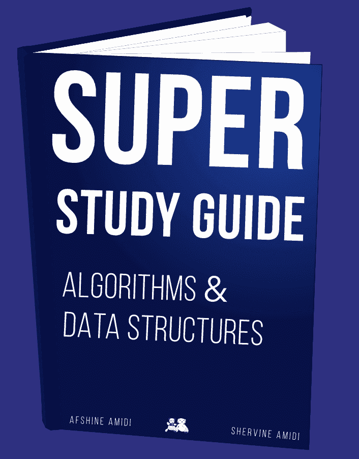
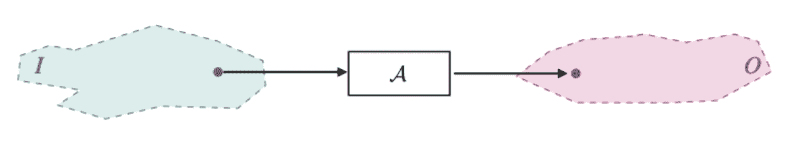
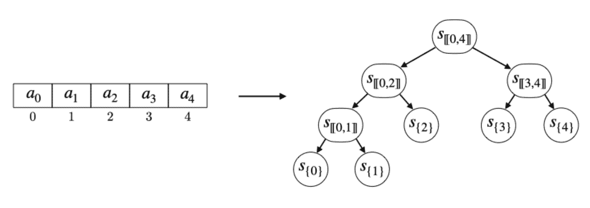
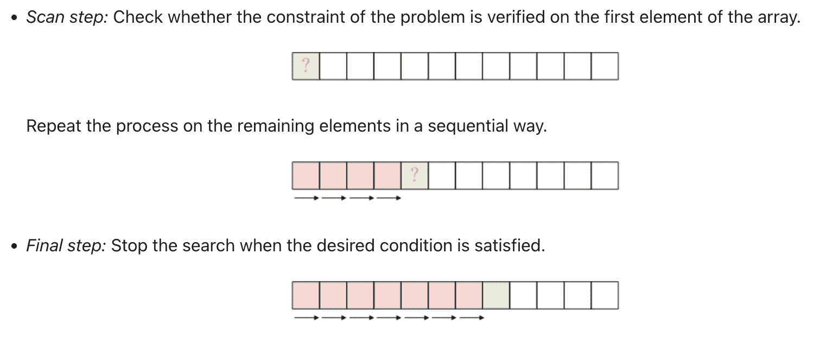

# 超级学习指南：免费算法与数据结构电子书

> 原文：[`www.kdnuggets.com/2022/06/super-study-guide-free-algorithms-data-structures-ebook.html`](https://www.kdnuggets.com/2022/06/super-study-guide-free-algorithms-data-structures-ebook.html)

双胞胎兄弟 [Afshine Amidi](https://www.mit.edu/~amidi/) 和 [Shervine Amidi](https://stanford.edu/~shervine/) 联手为我们带来了 [关于算法与数据结构的超级学习指南](https://superstudy.guide/)。

* * *

## 我们的前三个课程推荐

 1. [Google 网络安全证书](https://www.kdnuggets.com/google-cybersecurity) - 快速进入网络安全职业生涯。

 2. [Google 数据分析专业证书](https://www.kdnuggets.com/google-data-analytics) - 提升你的数据分析能力

 3. [Google IT 支持专业证书](https://www.kdnuggets.com/google-itsupport) - 支持组织的 IT 需求

* * *

两位兄弟都是谷歌的软件工程师；Afshine Amidi 拥有麻省理工学院的商业分析和数据科学硕士学位，Shervine Amidi 拥有斯坦福大学的计算与数学工程硕士学位。他们曾经并且现在仍在麻省理工学院和斯坦福大学使用他们之前的学习指南进行教学。

他们的新学习指南：《超级学习指南：算法与数据结构》分为四个主要部分：

1.  基础

1.  数据结构

1.  图与树

1.  排序与搜索

每个部分都进一步深入每个领域。

# 基础

基础章节涵盖了算法概念、数学概念和经典问题。这些内容都经过简化，以便你能够更好地理解其余学习指南，并帮助你学习。

举个例子，这就是双胞胎兄弟如何解释“算法”：

> *“给定一个问题，算法 *A* 是一组定义明确的指令，这些指令在有限的时间和空间内运行。它接收一个输入 *I* 并返回一个输出 *O*，满足问题的约束。例如，一个问题可以是检查一个数字是否为偶数。为此，算法可以是检查该数字是否能被 2 整除。”*

你难道找不到比这更好的算法可视化解释了吗？

# 数据结构

在数据结构部分，兄弟们深入探讨了：

+   数组与字符串

+   栈与队列

+   哈希表

+   高级哈希表

+   链表

每个部分都进行了简化，提供了你需要的信息，而不会让你信息超载。

# 图与树

下一部分将更深入地探讨图和树，仅包含三部分：

+   图

+   高级图算法

+   树

+   高级树

每一部分都提供了逐步的可视化，以帮助你更好地理解每种算法。

例如，这是段树的定义：

> *“段树 S 是一种由节点 s[i,j] 组成的二叉树数据结构，旨在支持对数组 A=[a0,...,an?1] 的主要范围查询类型（最小值、最大值、求和）。它的更新时间复杂度为 *O*(log(*n*)）。”*

通过可视化来表示这个定义：

# 排序和搜索

最后但同样重要的是，最后一部分讲解了排序和搜索，并深入探讨了这两种算法的不同。

在排序部分，你将学习更多不同的排序算法，如冒泡排序、归并排序和基数排序。

在搜索部分，你将学习基本搜索、二分搜索和子串搜索。下面是解释线性搜索的可视化：

# 这是你需要的书籍

如果你想进入数据科学领域或提升当前知识，这本学习指南适合你。学习数据科学背后的理论可能会非常令人困惑；然而，[Afshine Amidi](https://www.mit.edu/~amidi/) 和 [Shervine Amidi](https://stanford.edu/~shervine/) 提供了简化的解释和可视化，帮助我们继续前进。

**[Nisha Arya](https://www.linkedin.com/in/nisha-arya-ahmed/)** 是一位数据科学家和自由职业技术作家。她特别感兴趣于提供数据科学职业建议或教程，以及围绕数据科学的理论知识。她还希望探索人工智能在延长人类寿命方面的不同方式。作为一个渴望学习的人，她寻求拓宽她的技术知识和写作技能，同时帮助指导他人。

### 更多相关内容

+   [数据科学家认知偏差指南：免费电子书](https://www.kdnuggets.com/2023/05/data-scientist-guide-cognitive-biases-free-ebook.html)

+   [KDnuggets 新闻，12 月 14 日：3 个免费机器学习课程…](https://www.kdnuggets.com/2022/n48.html)

+   [人工智能和机器学习数据结构入门指南](https://www.kdnuggets.com/guide-data-structures-ai-and-machine-learning)

+   [KDnuggets 新闻，8 月 31 日：完整的数据科学学习路线图…](https://www.kdnuggets.com/2022/n35.html)

+   [完整的数据科学学习路线图](https://www.kdnuggets.com/2022/08/complete-data-science-study-roadmap.html)

+   [完整的数据工程学习路线图](https://www.kdnuggets.com/2022/11/complete-data-engineering-study-roadmap.html)
