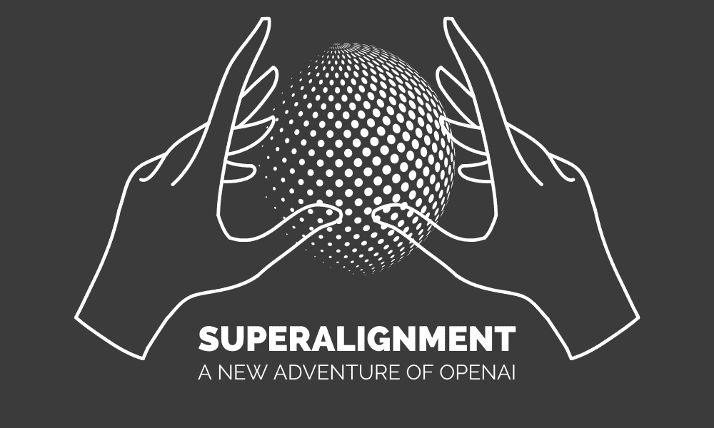

# 什么是超级对齐以及它为何重要？

> 原文：[`www.kdnuggets.com/2023/07/superalignment-important.html`](https://www.kdnuggets.com/2023/07/superalignment-important.html)

作者提供的图片

超级智能有可能成为人类历史上最重要的技术进步。它可以帮助我们应对一些人类面临的最紧迫的挑战。尽管它可以带来新的进步时代，但它也带来了一些固有的风险，必须谨慎处理。如果不恰当地处理或对齐，超级智能可能会削弱人类的力量，甚至导致人类灭绝。

* * *

## 我们的前 3 个课程推荐

 1\. [谷歌网络安全证书](https://www.kdnuggets.com/google-cybersecurity) - 快速进入网络安全职业轨道。

 2\. [谷歌数据分析专业证书](https://www.kdnuggets.com/google-data-analytics) - 提升你的数据分析能力

 3\. [谷歌 IT 支持专业证书](https://www.kdnuggets.com/google-itsupport) - 支持你的组织进行 IT

* * *

尽管超级智能似乎还遥远，但许多专家认为它可能在未来几年内成为现实。为了管理潜在的风险，我们必须创建新的管理机构，并解决超级智能对齐的关键问题。这意味着确保即将超越人类智能的人工智能系统与人类目标和意图保持一致。

在本博客中，我们将学习关于超级对齐的内容，并了解 OpenAI 解决超级智能对齐核心技术挑战的方法。

# 什么是超级对齐

超级对齐指的是确保超级人工智能（AI）系统在所有领域超越人类智能时，其行为符合人类的价值观和目标。这是 AI 安全和治理领域中的一个重要概念，旨在应对开发和部署高度先进 AI 相关的风险。

随着 AI 系统变得越来越智能，人类可能会越来越难以理解它们如何做出决策。如果 AI 的行为违背了人类的价值观，这可能会导致问题。因此，必须解决这一问题，以防止任何有害的后果。

超级对齐确保超级智能 AI 系统的行为与人类的价值观和意图一致。它需要准确地指定人类偏好，设计能够理解这些偏好的 AI 系统，并创建机制以确保 AI 系统追求这些目标。

# 我们为什么需要超级对齐

超级对齐在应对超级智能可能带来的风险中发挥着至关重要的作用。让我们深入探讨一下为什么我们需要超级对齐：

1.  **减轻流氓 AI 场景：** 超对齐确保超智能 AI 系统与人类意图保持一致，降低不受控行为和潜在伤害的风险。

1.  **保护人类价值观：** 通过将 AI 系统与人类价值观对齐，超对齐防止了超智能 AI 可能优先考虑与社会规范和原则不一致的目标的冲突。

1.  **避免意外后果：** 超对齐研究识别并减轻可能从高级 AI 系统中出现的意外不利结果，最小化潜在的不利影响。

1.  **确保人类自主性：** 超对齐专注于将 AI 系统设计为增强人类能力的宝贵工具，保持我们自主性，防止对 AI 决策过度依赖。

1.  **建设有益的 AI 未来：** 超对齐研究旨在创造一个未来，超智能 AI 系统积极贡献于人类福祉，解决全球挑战，同时最小化风险。

# OpenAI 方法

OpenAI 正在构建一个人类级别的自动对齐研究员，它将利用大量计算资源来扩展努力，并迭代性地对齐超智能 - [介绍超对齐 (openai.com)](https://openai.com/blog/introducing-superalignment)。

要使第一个自动对齐研究员与人类意图对齐，OpenAI 需要：

+   **开发可扩展的训练方法：** OpenAI 可以利用 AI 系统来帮助评估其他 AI 系统在难以评估的复杂任务上的表现。

+   **验证最终模型：** OpenAI 将自动化搜索问题行为和问题内部机制。

+   **对抗性测试：** 通过故意训练不对齐的模型来测试 AI 系统，验证所用方法是否能识别流程中最严重的不对齐问题。

## 团队

OpenAI 正在组建一个团队来应对超智能对齐的挑战。他们将在接下来的四年里分配 20% 的计算资源。该团队将由 Ilya Sutskever 和 Jan Leike 领导，包括来自之前对齐团队和公司其他部门的成员。

OpenAI 目前正在寻找杰出的研究人员和工程师来贡献于其使命。超智能对齐的问题主要与机器学习相关。即使他们目前未从事对齐工作，机器学习领域的专家也将在寻找解决方案中发挥关键作用。

## 目标

OpenAI 设定了在四年内解决超智能对齐技术挑战的目标。虽然这是一个雄心勃勃的目标，成功并非 guaranteed，但 OpenAI 对于通过集中和坚定的努力找到解决方案持乐观态度。

要解决问题，他们必须向机器学习和安全社区提供有说服力的证据和论据。对提议解决方案有高度的信心至关重要。如果这些解决方案不可靠，社区仍然可以利用这些发现进行相应的规划。

# 结论

OpenAI 的 Superalignment 计划在解决超级智能对齐挑战方面具有巨大潜力。通过初步实验中涌现出的有前途的想法，团队获得了越来越有用的进展指标，并可以利用现有的 AI 模型对这些问题进行实证研究。

需要注意的是，Superalignment 团队的努力得到了 OpenAI 不断改进现有模型安全性的支持，包括广泛使用的 ChatGPT。OpenAI 仍致力于理解和缓解与 AI 相关的各种风险，如误用、经济扰动、虚假信息、偏见和歧视、成瘾及过度依赖。

OpenAI 旨在通过专注的研究、合作和积极的态度为更安全、更有益的 AI 未来铺平道路。

**[Abid Ali Awan](https://www.polywork.com/kingabzpro)** ([@1abidaliawan](https://twitter.com/1abidaliawan)) 是一位认证的数据科学专业人士，热衷于构建机器学习模型。目前，他专注于内容创作和撰写关于机器学习和数据科学技术的技术博客。Abid 拥有技术管理硕士学位和电信工程学士学位。他的愿景是利用图神经网络构建一个 AI 产品，帮助那些面临心理健康困扰的学生。

### 更多相关话题

+   [介绍 OpenAI 的 Superalignment](https://www.kdnuggets.com/2023/08/introducing-superalignment-openai.html)

+   [数据管理对数据科学为何如此重要？](https://www.kdnuggets.com/2022/08/data-management-important-data-science.html)

+   [什么是向量数据库，它们为什么对 LLMs 很重要？](https://www.kdnuggets.com/2023/06/vector-databases-important-llms.html)

+   [领域知识对机器学习重要吗？](https://www.kdnuggets.com/2022/07/domain-knowledge-important-machine-learning.html)

+   [KDnuggets 新闻，8 月 3 日：10 个最常用的 Tableau 函数 • 是否…](https://www.kdnuggets.com/2022/n31.html)

+   [你的特征很重要？这并不意味着它们是好的](https://www.kdnuggets.com/your-features-are-important-it-doesnt-mean-they-are-good)
