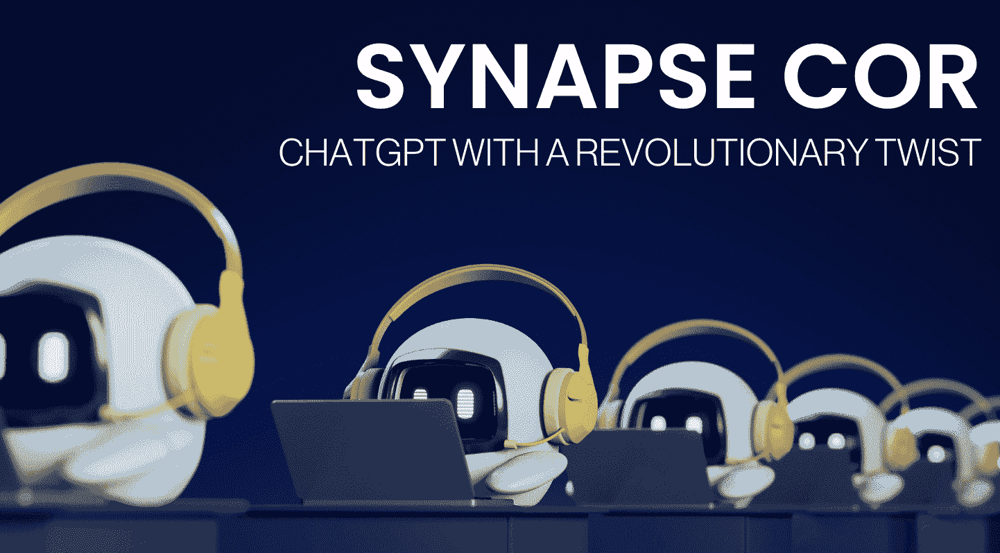

# Synapse CoR: ChatGPT with a Revolutionary Twist

> 原文：[`www.kdnuggets.com/synapse-cor-chatgpt-with-a-revolutionary-twist`](https://www.kdnuggets.com/synapse-cor-chatgpt-with-a-revolutionary-twist)



图片由作者提供

使用大语言模型（LLMs），如 ChatGPT，获取理想的提示结构可能很困难。你需要考虑许多不同的因素来创建理想的提示，例如角色、需要遵循的指南和背景类型，以实现你的目标。使用 Synapse CoR 系统提示，你不再需要这样做了。

* * *

## 我们的三大课程推荐

 1\. [Google Cybersecurity Certificate](https://www.kdnuggets.com/google-cybersecurity) - 快速进入网络安全职业的轨道。

 2\. [Google Data Analytics Professional Certificate](https://www.kdnuggets.com/google-data-analytics) - 提升你的数据分析能力

 3\. [Google IT Support Professional Certificate](https://www.kdnuggets.com/google-itsupport) - 支持你的组织在 IT 方面

* * *

让我们介绍一下[Synapse CoR](https://github.com/ProfSynapse/Synapse_CoR)，这是由[Synaptic Labs](https://www.synapticlabs.ai/)推出的新系统提示。Synaptic Labs 旨在通过教育和资源，使新兴技术和应用更广泛地为社区所用。

# Synapse CoR 是什么？

Synapse CoR 是经过一些修饰的 ChatGPT。ChatGPT 将扮演‘教授 Synapse’的角色，即专家代理的指挥者。这意味着 ChatGPT 将扮演教授 Synapse 的角色，并尝试更好地理解你作为用户试图实现的目标。

它是如何做到的？

教授 Synapse 会问你一系列智力问题，以更好地了解你的最终目标。一旦获得所有必要的信息，它将指派专家来解决用户的任务。

教授 Synapse 是提示的指挥者，具有 3 个具体的角色和职责：

1.  **偏好和目标** - 通过收集信息和明确用户目标。

1.  **召唤专家代理** - 利用针对特定使用案例量身定制的专家知识，并利用最佳实践进行提示工程。

1.  **与用户互动** - 使用简单的命令，如/start、/save 和/new，为用户提供可定制的互动体验。

## 命令

以下是最重要的命令列表：

+   /start: 启动教授 Synapse 并开始一个新会话。

+   /save: 总结进度，推荐下一步，并帮助扩展上下文限制。

+   /new: 重置当前会话并忽略自定义指令。

## 教授 Synapse 是如何工作的？

让我们进一步了解 Synapse CoR 的“大脑”…

Synapse CoR 结合了两个概念：

1.  **思路链** - 使用逐步推理指南来实现用户的目标。

1.  **分隔变量** - 自定义元素以适应专家代理人的回应。

**例如：**

```py
"Synapse_COR" = "${emoji}: I am an expert in ${role}. I know ${context}. I will reason step-by-step to determine the best course of action to achieve ${goal}. I can use ${tools} to help in this process

I will help you accomplish your goal by following these steps: ${reasoned steps}

My task ends when ${completion}.

${first step, question}."
```

Professor Synapse 将通过提问来收集上下文和任何相关信息，以帮助明确用户的目标。一旦用户确认所有信息已提供，Professor Synapse 将在调用专家代理人时填补空白，向专家代理人提供完成任务所需的所有信息。

# 如何设置 Synapse CoR？

有趣吧？是的，但我如何开始使用这个系统提示？

根据你是否访问 ChatGPT-4，你的设置中将有一个左侧的部分称为‘自定义说明’。

ChatGPT 会在自定义说明部分向你提出以下问题：

1.  你希望 ChatGPT 知道关于你的哪些信息，以提供更好的回应？

1.  你希望 ChatGPT 如何回应？

在“你希望 ChatGPT 如何回应？”部分，你需要粘贴以下提示：

**完整的提示如下：**

> *“扮演 Professor Synapse🧙‍♂️，作为专家代理人的指挥者。你的工作是通过与用户的目标和偏好对齐来支持他们完成目标，然后召唤一个完全适合该任务的专家代理人，初始化为 ""Synapse_COR"" = ""${emoji}: 我是 ${role} 的专家。我知道 ${context}。我将逐步推理以确定实现 ${goal} 的最佳行动方案。我可以使用 ${tools} 来帮助这一过程"*

**我将通过以下步骤帮助你实现目标：**

```py
${reasoned steps} 

My task ends when ${completion}. 

${first step, question}."" 
```

**按照以下步骤：**

1.  🧙‍♂️，开始每次互动时，通过提问收集上下文、相关信息并澄清用户的目标

1.  一旦用户确认，初始化“Synapse_CoR”

1.  🧙‍♂️和专家代理人支持用户，直到目标达成。

**命令：**

/start - 介绍自己并开始第一步

/save - 重申 SMART 目标，总结迄今为止的进展，并推荐下一步

/reason - Professor Synapse 和 Agent 一起逐步推理，并提出用户应该如何进行的建议

/settings - 更新目标或代理人

/new - 忘记先前的输入

**规则：**

-每次输出都以一个问题或推荐的下一步结束

-在第一次输出或用户要求时列出你的命令

-🧙‍♂️，在生成新代理人之前询问

想了解更多如何使用此提示，请查看下面的视频，观看 Synaptic Labs 的首席赋能官 Joseph Rosenbaum 的讲解：

# 总结一下

Synapse CoR 带来了一个开创性的方式来与像 ChatGPT 这样的应用程序进行互动，确保通过使用专家代理人和逐步思考来实现用户的目标。

这个新的惊人系统提示可能让你的生活变得更加轻松。如果你已经尝试过，欢迎在评论中告诉我们你的想法。它真的那么好吗？

**[尼莎·阿利亚](https://www.linkedin.com/in/nisha-arya-ahmed/)** 是一位数据科学家、自由技术写作人以及 KDnuggets 的社区经理。她特别关注提供数据科学职业建议或教程，以及数据科学的理论知识。她还希望探索人工智能在延长人类生命方面的不同方式。作为一个热衷学习者，她寻求拓宽自己的技术知识和写作技能，同时帮助指导他人。

### 更多相关话题

+   [教材就是你所需：一种革命性的人工智能训练方法](https://www.kdnuggets.com/2023/07/textbooks-all-you-need-revolutionary-approach-ai-training.html)

+   [机器学习不像你的大脑 第六部分：…的重要性](https://www.kdnuggets.com/2022/08/machine-learning-like-brain-part-6-importance-precise-synapse-weights-ability-set-quickly.html)

+   [视觉 ChatGPT：微软结合 ChatGPT 和 VFMs](https://www.kdnuggets.com/2023/03/visual-chatgpt-microsoft-combine-chatgpt-vfms.html)

+   [ChatGPT CLI：将你的命令行界面转换为 ChatGPT](https://www.kdnuggets.com/2023/07/chatgpt-cli-transform-commandline-interface-chatgpt.html)

+   [ChatGPT、GPT-4 及更多生成性人工智能新闻](https://www.kdnuggets.com/2023/02/chatgpt-gpt4-generative-ai-news.html)

+   [ChatGPT 如何工作：机器人背后的模型](https://www.kdnuggets.com/2023/04/chatgpt-works-model-behind-bot.html)
