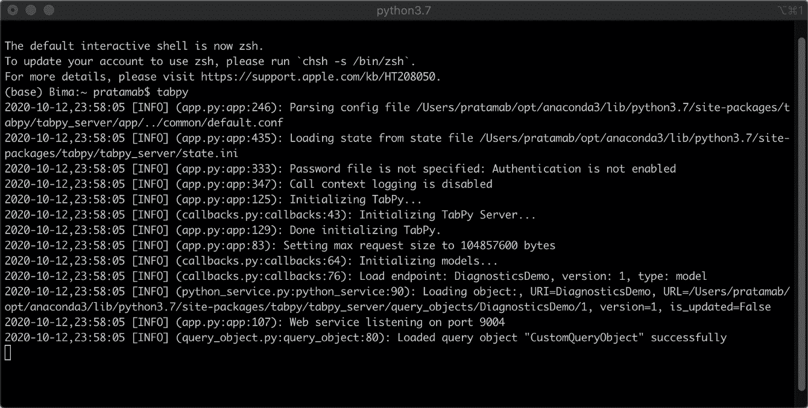
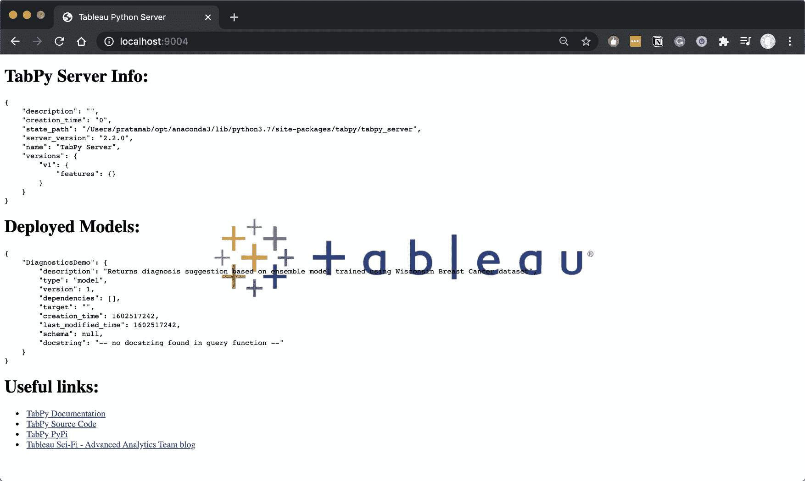
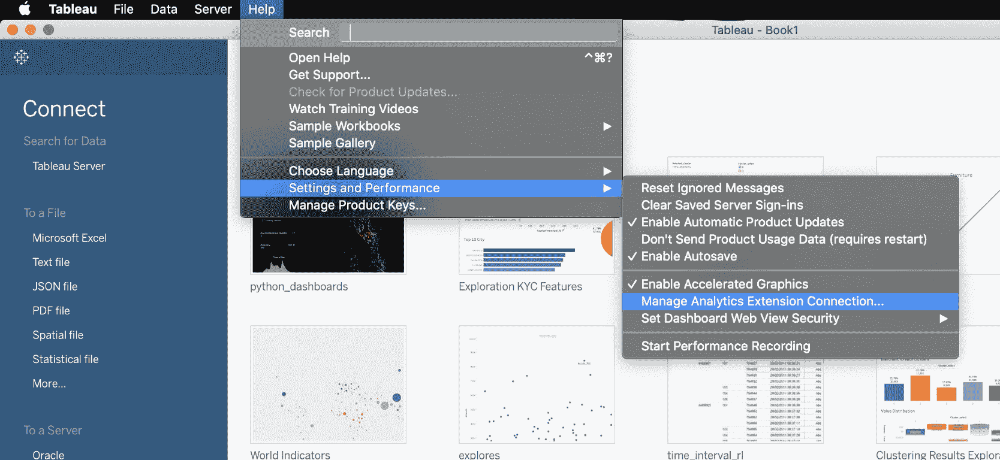
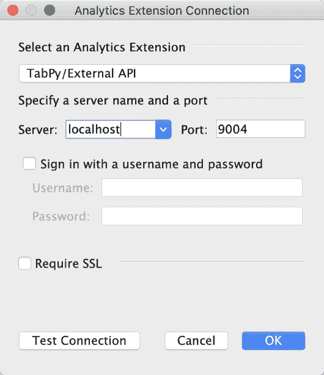
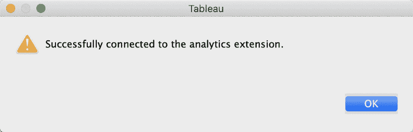
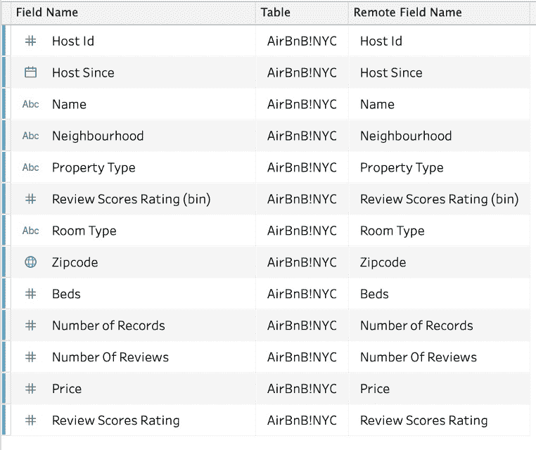
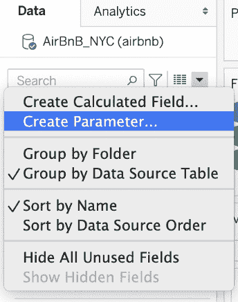
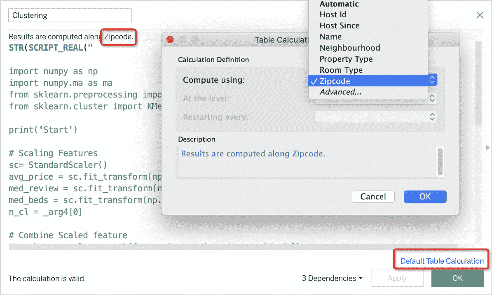

# TabPy：结合 Python 和 Tableau

> 原文：[`www.kdnuggets.com/2020/11/tabpy-combining-python-tableau.html`](https://www.kdnuggets.com/2020/11/tabpy-combining-python-tableau.html)

评论

**由 [Bima Putra Pratama](https://www.linkedin.com/in/bpratama/), 数据科学家**


图片来源：[Paweł Czerwiński](https://unsplash.com/@pawel_czerwinski?utm_source=medium&utm_medium=referral) 在 [Unsplash](https://unsplash.com/?utm_source=medium&utm_medium=referral)

* * *

## 我们的前三个课程推荐

 1\. [谷歌网络安全证书](https://www.kdnuggets.com/google-cybersecurity) - 快速进入网络安全职业的快车道。

 2\. [谷歌数据分析专业证书](https://www.kdnuggets.com/google-data-analytics) - 提升你的数据分析技能

 3\. [谷歌 IT 支持专业证书](https://www.kdnuggets.com/google-itsupport) - 支持组织的 IT

* * *

> 我们可以将 Python 计算的强大功能与 Tableau 集成吗？

那个问题促使我开始探索在 Tableau 中使用 Python 计算的可能性，最终我选择了 TabPy。

那么，什么是 TabPy？我们如何使用 TabPy 将 Python 和 Tableau 集成？

在本文中，我将介绍 TabPy，并通过一个例子说明如何使用它。

### TabPy 介绍

TabPy 是 Tableau 的一个分析扩展，它使用户能够使用 Tableau 执行 Python 脚本和保存的函数。使用 TabPy，Tableau 可以实时运行 Python 脚本并将结果显示为可视化。用户可以通过在 Tableau 工作表、仪表板或故事中使用参数与 TabPy 交互，从而控制发送给 TabPy 的数据。

你可以在官方 GitHub 仓库中阅读更多关于 TabPy 的信息：

[**tableau/TabPy**](https://github.com/tableau/TabPy)

实时执行 Python 代码并在 Tableau 可视化中显示结果： — tableau/TabPy

### 安装 TabPy

我假设你的系统中已经安装了 Python。如果没有，你可以先访问 [`www.python.org/`](https://www.python.org/) 下载 Python 安装程序，然后安装到系统中。

接下来，我们可以使用 `pip` 安装 TabPy 作为一个 Python 包：

```py
pip install tabpy
```

### 运行 TabPy

安装成功后，我们可以使用以下命令运行服务：

```py
tabpy
```

如果一切顺利，你应该看到这个：



运行 TabPy。图片来源：作者

默认情况下，该服务将在本地主机的 9004 端口运行。你也可以通过在网页浏览器中打开它来验证。



TabPy 服务器信息。图片来源：作者

### 启用 TabPy

现在，让我们进入 Tableau 并设置服务。我使用的是 Tableau Desktop 版本 2020.3.0。以前的版本也没有区别。

首先，转到帮助，然后选择设置和性能，并选择管理分析扩展连接。



Analytics Extension Connection Location. 图片由作者提供

然后，您可以设置服务器和端口。您可以将用户名和密码留空，因为我们没有在 TabPy 服务中设置凭据。



完成后，点击测试连接。如果成功，您将看到以下消息：



恭喜！！现在，我们的 Tableau 已经连接到 TabPy 并准备使用。

### 使用 TabPy

我们可以使用两种方式来进行 Python 计算：

+   直接将代码写成 Tableau 计算字段。代码将立即在 TabPy 服务器上执行。

+   将一个函数部署到 TabPy 服务器，使其可以作为 REST API 端点访问。

在本文中，我将仅展示如何做第一种方法，我们将直接编写代码作为 Tableau 计算字段。

例如，我们将对通过 Tableau 网站公开的 Airbnb 数据集进行聚类，您可以通过这个 [链接](https://public.tableau.com/s/sites/default/files/media/airbnb.xlsx)下载它。我们将使用几种流行的聚类算法基于住房特征对每个邮政编码进行聚类。

### 步骤 1 导入数据

在第一步中，让我们将数据集导入 Tableau。该数据集有 13 列。



由于我们的主要目标是查看如何使用 TabPy，我们不会专注于制作最佳模型。因此，我们将只使用数据集中的以下变量进行聚类：

+   每个邮政编码的床位中位数

+   每个邮政编码的平均价格

+   每个邮政编码的评级中位数

### 步骤 2 创建控制参数

我们需要创建两个参数，用于选择我们的聚类方法和聚类数，分别是：

+   聚类数量

+   聚类算法



创建一个参数。图片由作者提供！图示

聚类数量参数。图片由作者提供！图示

聚类算法参数。图片由作者提供

### 步骤 3 创建脚本

我们将创建一个 Python 脚本作为 Tableau 中的计算字段。


创建一个计算字段。图片由作者提供

然后，您可以在计算字段中插入以下脚本。

这段代码被包装在 Tableau 的 SCRIPT_REAL() 函数中，将执行以下操作：

+   导入所需的 Python 库。

+   使用标准缩放器缩放特征

+   结合缩放特征和处理空值

+   条件检查使用哪种算法并执行以下操作

+   返回聚类结果列表。

然后，我们将结果转换为字符串数据类型，以便将其作为分类数据。

还有一点需要注意的是，我们需要在 Zipcode 中进行表计算。因此，我们需要将默认的表计算更改为 Zipcode，以使此代码生效。



更改默认表计算。图像由作者提供。

### 第 4 步 可视化结果

现在，是时候可视化结果了。我使用 Zipcode 创建了一个地图来可视化聚类结果。我们可以使用参数来改变聚类的数量。


### 总结


图片由[Elisha Terada](https://unsplash.com/@elishaterada?utm_source=medium&utm_medium=referral)在[Unsplash](https://unsplash.com/?utm_source=medium&utm_medium=referral)提供

让我们为这一阶段的完成而庆祝吧！如果你按照步骤操作，你已经成功地将 Python 与 Tableau 集成。这一集成是使用 Tableau 和 Python 的更高级用例的起点。

我期待看到你用这个集成创建的东西！

### 作者介绍

**[Bima Putra Pratama](https://www.linkedin.com/in/bpratama/)** 是一名拥有 Tableau Desktop Specialist 认证的数据科学家，他总是渴望扩展自己的知识和技能。他毕业于矿业工程专业，并通过 HardvardX、IBM、Udacity 等多个在线项目开始了他的数据科学之旅。目前，他正与 DANA Indonesia 一起为印尼建设无现金社会做出贡献。

如果你有任何反馈或讨论的话题，请通过[LinkedIn](https://www.linkedin.com/in/bpratama/)联系 Bima。我很高兴与您建立联系！

### 参考文献

+   [`tableaumagic.com/tableau-and-python-an-introduction/`](https://tableaumagic.com/tableau-and-python-an-introduction/)

+   [`github.com/tableau/TabPy`](https://github.com/tableau/TabPy)

+   [`public.tableau.com/en-us/s/resources`](https://public.tableau.com/en-us/s/resources)

+   [`www.tableau.com/about/blog/2017/1/building-advanced-analytics-applications-tabpy-64916`](https://www.tableau.com/about/blog/2017/1/building-advanced-analytics-applications-tabpy-64916)

+   [`www.tableau.com/about/blog/2016/11/leverage-power-python-tableau-tabpy-62077`](https://www.tableau.com/about/blog/2016/11/leverage-power-python-tableau-tabpy-62077)

+   [`towardsdatascience.com/tableau-python-tabpy-and-geographical-clustering-219b0583ded3`](https://towardsdatascience.com/tableau-python-tabpy-and-geographical-clustering-219b0583ded3)

[原始文章](https://towardsdatascience.com/tabpy-combining-python-and-tableau-511b10da8175)。经许可转载。

**相关：**

+   在 Tableau 中创建强大的动画可视化

+   比较顶级商业智能工具：Power BI vs Tableau vs Qlik vs Domo

+   使用 R、SQL 和 Tableau 进行地理时间序列预测简介

### 相关主题

+   [使用管道编写干净的 Python 代码](https://www.kdnuggets.com/2021/12/write-clean-python-code-pipes.html)

+   [构建一个稳固的数据团队](https://www.kdnuggets.com/2021/12/build-solid-data-team.html)

+   [是什么让 Python 成为初创企业的理想编程语言](https://www.kdnuggets.com/2021/12/makes-python-ideal-programming-language-startups.html)

+   [每个数据科学家都应该知道的三款 R 库（即使你使用 Python）](https://www.kdnuggets.com/2021/12/three-r-libraries-every-data-scientist-know-even-python.html)

+   [停止学习数据科学来寻找目标，并通过寻找目标来……](https://www.kdnuggets.com/2021/12/stop-learning-data-science-find-purpose.html)

+   [成为一名优秀数据科学家所需的 5 项关键技能](https://www.kdnuggets.com/2021/12/5-key-skills-needed-become-great-data-scientist.html)
