# 如何将表格数据与 HuggingFace Transformers 结合使用

> 原文：[`www.kdnuggets.com/2020/11/tabular-data-huggingface-transformers.html`](https://www.kdnuggets.com/2020/11/tabular-data-huggingface-transformers.html)

评论

**由 [Ken Gu](https://www.linkedin.com/in/ken-gu/)，乔治亚应用研究科学家实习生**。

基于变换器的模型在使用非结构化文本数据时是一个颠覆性的变化。截至 2020 年 9 月，通用语言理解评估（GLUE）基准中的顶级模型都是 BERT 变换器模型。在 [Georgian](http://georgian.io/) ，我们发现自己在处理支持表格特征信息和非结构化文本数据。我们发现，通过在 [我们的模型](http://georgian.io/platform/research-at-georgian/) 中使用表格数据，可以进一步提高性能，因此我们着手构建一个工具包，使其他人也能轻松做到这一点。

* * *

## 我们的前三个课程推荐

 1\. [Google 网络安全证书](https://www.kdnuggets.com/google-cybersecurity) - 快速进入网络安全职业生涯。

 2\. [Google 数据分析专业证书](https://www.kdnuggets.com/google-data-analytics) - 提升你的数据分析技能

 3\. [Google IT 支持专业证书](https://www.kdnuggets.com/google-itsupport) - 支持你在 IT 领域的组织

* * *

*GLUE 基准中的 9 项任务。*

### 基于变换器的构建

使用变换器的主要好处是它们可以学习文本之间的长期依赖关系，并且可以并行训练（与序列到序列模型相比），这意味着它们可以在大量数据上进行预训练。

鉴于这些优势，BERT 现在成为许多实际应用中的主流模型。同样，借助如 [HuggingFace Transformers](https://huggingface.co/transformers/) 等库，构建高性能的变换器模型来解决常见的 NLP 问题变得容易。

使用非结构化文本数据的变换器模型已经被很好地理解。然而，在实际应用中，文本数据通常会得到丰富的结构化数据或其他非结构化数据（如音频或视觉信息）的支持。每一种数据类型可能会提供单独的数据所没有的信号。我们称这些不同的数据体验方式——音频、视觉或文本——为模态。

以电子商务评论为例。除了评论文本本身，我们还有有关卖家、买家和产品的数值和分类特征信息。

我们开始探索如何将文本和表格数据结合使用，以便在我们的项目中提供更强的信号。我们从探索被称为多模态学习的领域开始，它专注于如何在机器学习中处理不同的模态。

### 多模态文献综述

当前的多模态学习模型主要集中在从感觉模态如音频、视觉和文本中学习。

在多模态学习中，有几个研究分支。卡内基梅隆大学的 MultiComp 实验室提供了一个很好的 [分类法](http://multicomp.cs.cmu.edu/research/taxonomy/)。我们的问题属于 **多模态融合 — ** 将来自两个或多个模态的信息结合起来进行预测。

由于文本数据是我们的主要模态，我们的综述重点关注将文本作为主要模态并引入利用 transformer 架构的模型的文献。

**结构化数据的简单解决方案**

在深入文献之前，值得提及的是，有一种简单的解决方案可以将结构化数据视为普通文本，并将其附加到标准文本输入中。以电子商务评论为例，输入可以按以下方式结构化：评论。买家信息。卖家信息。数字/标签。等等。然而，这种方法的一个警告是，它受限于 transformer 可以处理的最大令牌长度。

### 图像和文本上的 Transformer

在过去的几年里，图像和文本的 transformer 扩展取得了很大进展。[用于分类图像和文本的监督多模态双向变换器](https://arxiv.org/pdf/1909.02950.pdf) 由 Kiela 等人（2019）提出，利用在单模态图像和文本上预训练的 ResNet 和 BERT 特征，并将其输入到双向 transformer 中。关键创新是将图像特征作为额外令牌适应到 transformer 模型中。

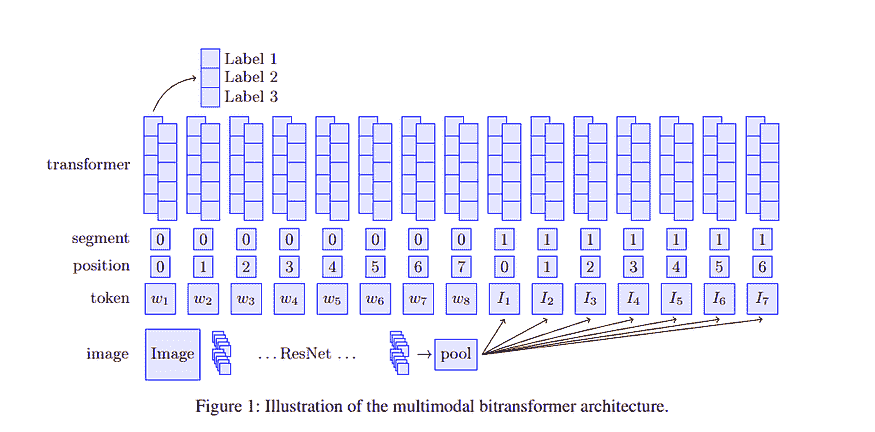

*多模态 transformer 的示意图。该模型将 ResNet 对图像子区域的输出作为输入图像令牌。*

此外，还有模型 — [ViLBERT](https://arxiv.org/abs/1908.02265) (Lu et al. 2019) 和 [VLBert](https://arxiv.org/pdf/1908.08530.pdf) (Su et al. 2020) — 它们定义了图像和文本的预训练任务。两个模型都在 [Conceptual Captions 数据集](https://ai.google.com/research/ConceptualCaptions) 上进行预训练，该数据集包含大约 330 万个图像-描述对（带有 alt 文本的网页图像）。在这两种情况下，对于任何给定的图像，像 Faster R-CNN 这样的预训练对象检测模型会获取图像区域的向量表示，这些表示作为输入令牌嵌入到 transformer 模型中。

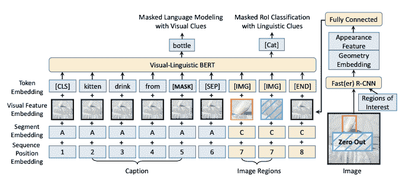

*VLBert 模型图示。它将 Faster R-CNN 输出的图像区域作为输入图像令牌。*

例如，ViLBert 在以下训练目标上进行预训练：

1.  **掩蔽的多模态建模：**掩蔽输入图像和词令牌。对于图像，模型尝试预测一个捕捉图像特征的向量用于对应的图像区域，而对于文本，它则基于文本和视觉线索预测被掩蔽的文本。

1.  **多模态对齐：**图像和文本对是否实际上来自同一图像和说明对。

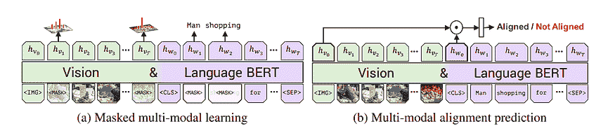

*ViLBert 的两个预训练任务。*

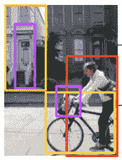

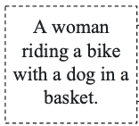

*掩蔽的多模态学习示例。给定图像和文本，如果我们掩蔽掉*dog*，那么模型应该能够利用未掩蔽的视觉信息正确预测被掩蔽的词为*dog*。*

所有这些模型都使用双向变换器模型，这也是 BERT 的基础。不同之处在于模型所训练的预训练任务以及对变换器的细微调整。在 ViLBERT 的情况下，作者还引入了一个共注意力变换器层（如下所示）来明确地定义模态之间的注意力机制。

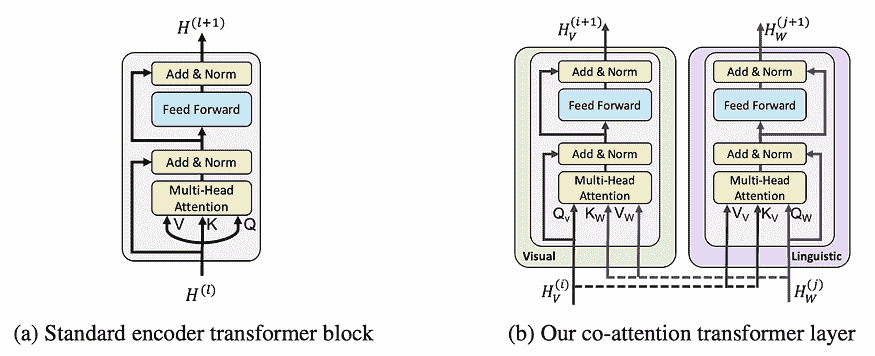

*标准变换器块与共注意力变换器块。共注意力块将另一模态（例如语言）的注意力加权向量注入当前模态（视觉）的隐藏表示中。*

最后，还有[LXMERT](https://arxiv.org/abs/1908.07490)（Tan 和 Mohit 2019），另一个预训练的变换器模型，截至[变换器版本 3.1.0](https://pypi.org/project/transformers/3.1.0/)，已作为库的一部分实现。LXMERT 的输入与 ViLBERT 和 VLBERT 相同。然而，LXMERT 在聚合数据集上进行预训练，其中还包括视觉问答数据集。总的来说，LXMERT 在 918 万对图像文本上进行预训练。

### 对齐音频、视觉和文本的变换器

除了用于结合图像和文本的变换器外，还有用于音频、视频和文本模态的多模态模型，其中存在自然的真实时间对齐。这种方法的论文包括 MulT，[*Multimodal Transformer for Unaligned Multimodal Language Sequences*](https://arxiv.org/pdf/1906.00295.pdf)（Tsai 等人 2019），以及来自[*Integrating Multimodal Information in Large Pretrained Transformers*](https://www.aclweb.org/anthology/2020.acl-main.214.pdf)（Rahman 等人 2020）的多模态适应门（MAG）。

MuIT 类似于 ViLBert，其中在模态对之间使用共注意力。与此同时，MAG 通过门控机制在某些变换器层中注入其他模态信息。

### 带有文本和知识图谱嵌入的变换器

一些研究还发现知识图谱除了文本数据外也是关键信息的一部分。[用知识图谱嵌入增强 BERT 以进行文档分类](https://arxiv.org/pdf/1909.08402.pdf)（Ostendorff 等人，2019 年）除了使用书籍类别分类的元数据特征外，还使用了来自 Wikidata 知识图谱的作者实体特征。在这种情况下，模型是这些特征与 BERT 输出的书名和描述文本特征的简单拼接，最后通过一些分类层进行处理。

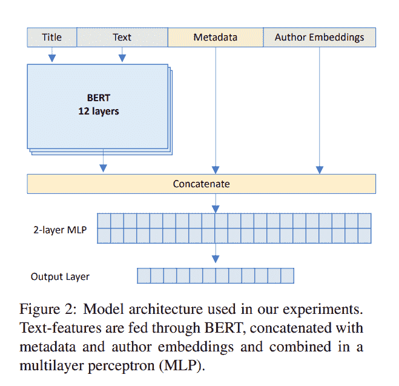

*将知识图谱嵌入和表格元数据纳入简单模型架构。*

另一方面，[ERNIE](https://arxiv.org/abs/1905.07129)（Zhang 等人，2019 年）将输入文本中的标记与知识图谱中的实体进行匹配。他们将这些嵌入融合以产生实体感知文本嵌入和文本感知实体嵌入。

### 关键要点

将变换器适应于多模态数据的主要要点是确保不同模态之间有注意力或加权机制。这些注意力机制可以出现在变换器架构的不同位置，如编码的输入嵌入、注入中间层，或在变换器编码文本数据后结合起来。

### 多模态变换器工具包

利用我们从文献综述和全面的[HuggingFace](https://huggingface.co/)最先进变换器库中学到的知识，我们开发了一个工具包。**multimodal-transformers**包扩展了任何 HuggingFace 变换器以处理表格数据。要查看代码、文档和工作示例，请查看[项目仓库](https://github.com/georgianpartners/Multimodal-Toolkit)。

在高级层面，变换器模型对文本数据和包含分类及数值数据的表格特征的输出被组合在一个结合模块中。由于我们的数据没有对齐，我们选择在变换器输出后结合文本特征。结合模块实现了几种整合模态的方法，包括受文献综述启发的注意力和门控方法。有关这些方法的更多细节可在[这里](https://multimodal-toolkit.readthedocs.io/en/latest/notes/combine_methods.html)找到。

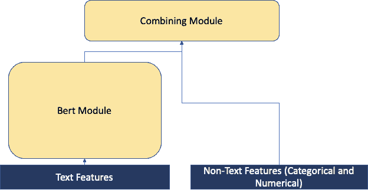

*多模态变换器的高级图示。变换器的适配以纳入数据都包含在结合模块中。*

### 演练

让我们通过一个例子来处理分类服装评论推荐。我们将使用在 Colab 笔记本中包含的简化版本。我们将使用来自 Kaggle 的[女性电子商务服装评论](https://www.kaggle.com/nicapotato/womens-ecommerce-clothing-reviews)，其中包含 23,000 条客户评论。

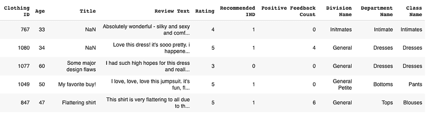

*服装评论数据集的示例。*

在这个数据集中，我们在标题和评论文本列中有文本数据。我们还从*Clothing ID, Division Name, Department Name, 和 Class Name*列中获得分类特征，并从*Rating 和 Positive Feedback Count*中获得数值特征。

### 加载数据集

我们首先将数据加载到**TorchTabularTextDataset**中，该数据集与 PyTorch 的数据加载器配合使用，包括 HuggingFace Transformers 的文本输入以及我们指定的分类特征列和数值特征列。为此，我们还需要加载 HuggingFace 的分词器。

### 使用表格模型加载 Transformer

现在我们将 Transformer 与表格模型加载在一起。首先，我们在**TabularConfig**对象中指定我们的表格配置。然后，将此配置设置为 HuggingFace transformer 配置对象的**tabular_config**成员变量。在这里，我们还指定了如何将表格特征与文本特征结合。在这个例子中，我们将使用加权求和的方法。

一旦我们设置了**tabular_config**，我们可以使用与 HuggingFace 相同的 API 加载模型。请参阅[文档](https://multimodal-toolkit.readthedocs.io/en/latest/modules/model.html#module-multimodal_transformers.model.tabular_transformers)了解当前支持的包含表格组合模块的 Transformer 模型列表。

### 训练

对于训练，我们可以使用 HuggingFace 的[trainer](https://huggingface.co/transformers/master/main_classes/trainer.html?highlight=trainer#transformers.Trainer)类。我们还需要指定训练参数，在这种情况下，我们将使用默认值。

让我们看看我们正在训练的模型吧！

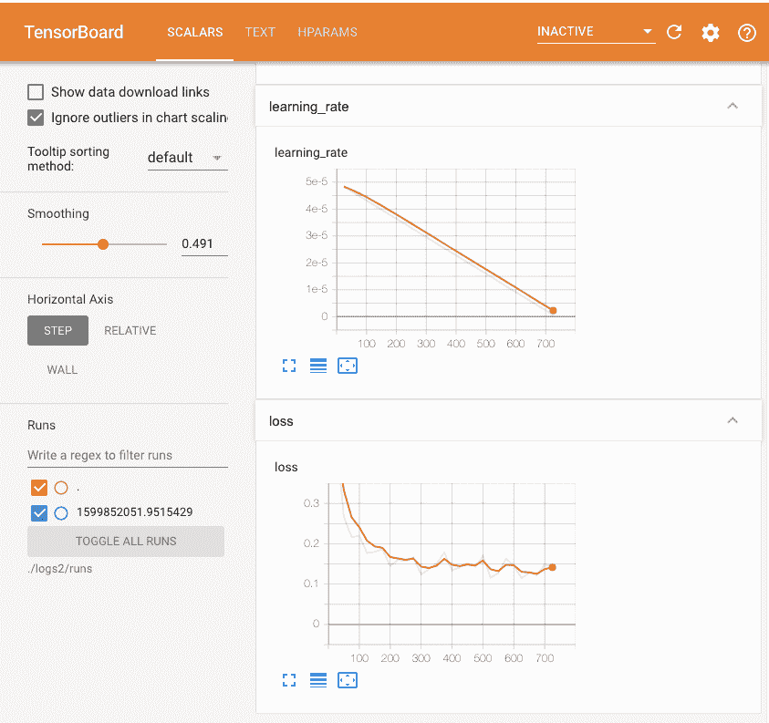

*上面实验的 Tensorboard 日志。你还可以在这个 Tensorboard [这里](https://tensorboard.dev/experiment/pzG4qrcJTyGhjENIKzE9Dw/#scalars)查看。*

### 结果

使用这个工具包，我们还在[Women’s E-Commerce Clothing Reviews](https://www.kaggle.com/nicapotato/womens-ecommerce-clothing-reviews)数据集上进行推荐预测实验，并在[Melbourne Airbnb Open Data](https://www.kaggle.com/tylerx/melbourne-airbnb-open-data)数据集上进行价格预测实验。前者是分类任务，而后者是回归任务。我们的结果见下表。**text_only**结合方法是一个仅使用 Transformer 的基线，实质上与 HuggingFace 的**forSequenceClassification**模型相同。

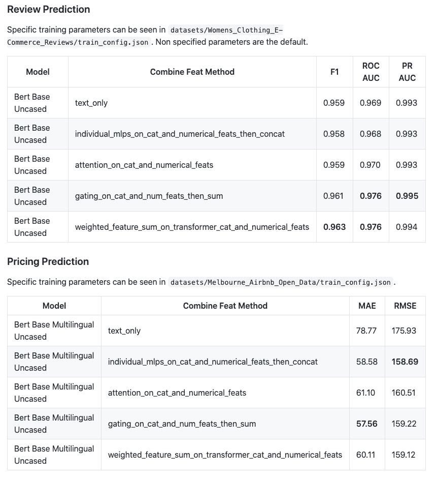

我们可以看到，加入表格特征比**text_only**方法提高了性能。性能提升取决于表格数据中的训练信号强度。例如，在评论推荐案例中，**text_only**模型已经是一个强大的基线。

### 下一步

我们已经在项目中成功使用了这个工具包。欢迎在下一个机器学习项目中尝试使用！

查看 [文档](https://multimodal-toolkit.readthedocs.io/en/latest/) 和包含的 [主](https://github.com/georgianpartners/Multimodal-Toolkit/blob/master/main.py) 脚本，了解如何进行评估和推理。如果你希望支持你喜欢的 Transformer，随时在 [这里](https://github.com/georgianpartners/Multimodal-Toolkit/blob/master/multimodal_transformers/model/tabular_transformers.py) 添加 Transformer 支持。

### 附录

读者可以查看 [图解 Transformer](http://jalammar.github.io/illustrated-transformer/) 和 [图解 BERT](http://jalammar.github.io/illustrated-bert/) 以获得对 Transformer 和 BERT 的精要概述。

以下是我们审阅的论文的简要分类。

**图像与文本上的 Transformer**

+   用于图像和文本分类的监督式多模态双向 Transformer（Kiela 等，2019 年）

+   ViLBERT: 预训练任务无关的视觉语言表示用于视觉与语言任务（Lu 等，2019 年）

+   VL-BERT: 通用视觉语言表示的预训练（Su 等，ICLR 2020 年）

+   LXMERT: 从 Transformers 学习跨模态编码器表示（Tan 等，EMNLP 2019 年）

**对齐音频、视觉和文本的 Transformers**

+   用于未对齐多模态语言序列的多模态 Transformer（Tsai 等，ACL 2019 年）

+   在大规模预训练 Transformers 中整合多模态信息（Rahman 等，ACL 2020 年）

**带有知识图谱嵌入的 Transformers**

+   用知识图谱嵌入增强 BERT 以进行文档分类（Ostendorff 等，2019 年）

+   ERNIE: 带有信息实体的增强语言表示（Zhang 等，2019 年）

[原文](https://medium.com/georgian-impact-blog/how-to-incorporate-tabular-data-with-huggingface-transformers-b70ac45fcfb4)。经许可转载。

**简介：** [Ken Gu](https://www.linkedin.com/in/ken-gu/) 是 Georgian 的应用研究实习生，他正在从事各种应用机器学习的工作。他在加州大学洛杉矶分校获得计算机科学学士学位和数学学位。在 UCLA，Ken 参与了以生物医学互动网络为重点的图深度学习研究项目。

**相关：**

+   [深入探讨 Transformer 架构 – Transformer 模型的发展](https://www.kdnuggets.com/2020/08/transformer-architecture-development-transformer-models.html)

+   [每一个复杂数据框操作，直观解释与可视化](https://www.kdnuggets.com/2020/11/dataframe-manipulation-explained-visualized.html)

+   [Transformers 研究指南](https://www.kdnuggets.com/2019/10/research-guide-transformers.html)

### 更多主题

+   [使用 HuggingFace Transformers 的简单 NLP 流程](https://www.kdnuggets.com/2023/02/simple-nlp-pipelines-huggingface-transformers.html)

+   [数据中心 AI 和表格数据](https://www.kdnuggets.com/2022/09/datacentric-ai-tabular-data.html)

+   [如何生成合成的表格数据集](https://www.kdnuggets.com/2022/03/generate-tabular-synthetic-dataset.html)

+   [使用 HuggingFace Pipelines 和 Streamlit 回答问题](https://www.kdnuggets.com/2021/10/simple-question-answering-web-app-hugging-face-pipelines.html)

+   [使用 HuggingFace 对 BERT 进行微调以分类推文](https://www.kdnuggets.com/2022/01/finetuning-bert-tweets-classification-ft-hugging-face.html)

+   [使用 HuggingFace 实现的简单端到端项目](https://www.kdnuggets.com/a-simple-to-implement-end-to-end-project-with-huggingface)
