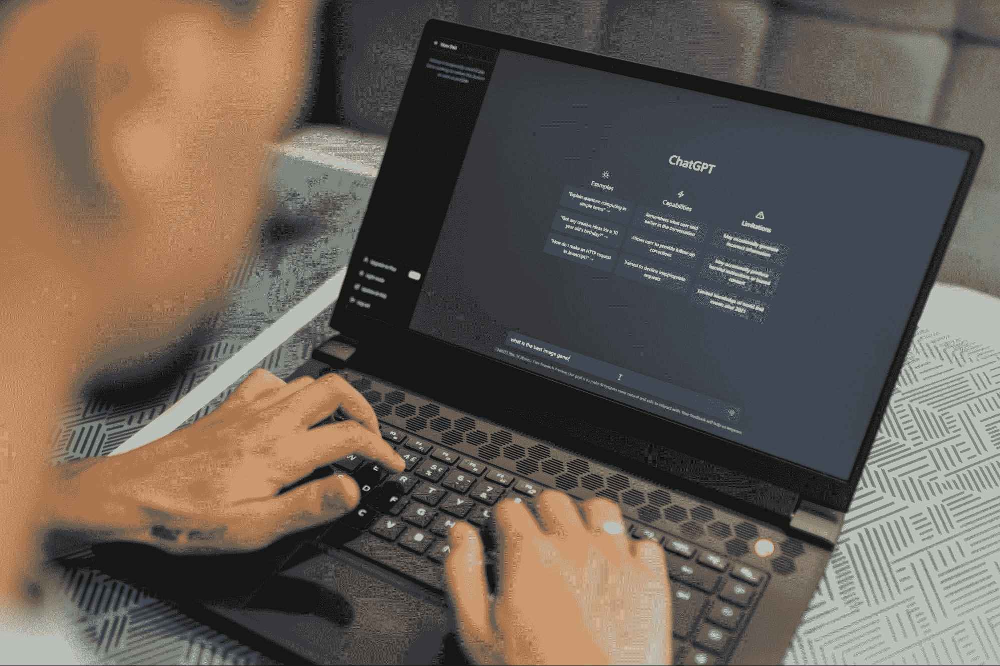
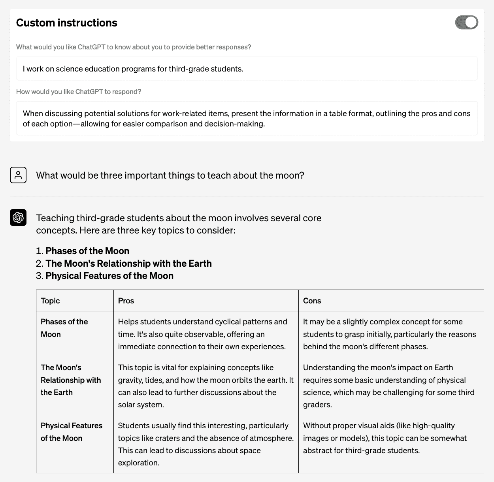

# 用自定义指令将 ChatGPT 调整为满足您的需求

> 原文：[`www.kdnuggets.com/2023/08/tailor-chatgpt-fit-needs-custom-instructions.html`](https://www.kdnuggets.com/2023/08/tailor-chatgpt-fit-needs-custom-instructions.html)

图片由 [Matheus Bertelli](https://www.pexels.com/photo/woman-laptop-working-internet-16094040/) 提供。许多人已经使用 ChatGPT 几个月了，取得了许多成功故事。凭借 [来自 22 个国家的众多用户](https://openai.com/blog/insights-from-global-conversations)，OpenAI 一直致力于微调其模型，以理解不同的上下文并提供独特的用户响应。他们考虑了用户反馈，例如重新开始 ChatGPT 对话的能力，并在寻找解决方案。

* * *

## 我们的前三大课程推荐

 1\. [谷歌网络安全证书](https://www.kdnuggets.com/google-cybersecurity) - 快速进入网络安全职业。

 2\. [谷歌数据分析专业证书](https://www.kdnuggets.com/google-data-analytics) - 提升您的数据分析技能

 3\. [谷歌 IT 支持专业证书](https://www.kdnuggets.com/google-itsupport) - 支持您的组织 IT

* * *

7 月 20 日，OpenAI [宣布](https://openai.com/blog/custom-instructions-for-chatgpt)他们正在引入带有自定义指令的新流程，以将 ChatGPT 调整为满足您的特定需求。

# 什么是自定义指令？

新的 beta 版自定义指令功能旨在帮助用户最大限度地利用 ChatGPT，通过防止他们在聊天会话之间重复常见指令。未来，ChatGPT 将在每次生成响应时考虑用户的自定义指令。用户不需要重复自己，也不需要在对话过程中不断调整他们的偏好。

ChatGPT 将根据过去的多个交互记住特定用户的偏好，并允许用户设置他们的个人偏好。设置偏好将提供特定的独特响应，而无需每次都重新开始对话。

让我们来看一个 OpenAI 提供的示例。

假设你是一名教师，并且正在尝试制定一份课程计划。你想根据以下问题来创建一份课程计划：“关于月球，有哪三件重要的事情需要教授？”。

如果不使用自定义指令，ChatGPT 将会回应：

来自[OpenAI](https://openai.com/blog/custom-instructions-for-chatgpt)的截图，上述响应非常笼统，可能未能针对你的具体需求进行调整。现在，让我们看看自定义指令如何改善这一点。

ChatGPT 将在自定义指令部分向你提问如下：

1.  你希望 ChatGPT 了解你什么，以提供更好的回应？

1.  你希望 ChatGPT 如何回应？

这些问题将允许你指定你的偏好，从而使 ChatGPT 在响应时能够使用这些偏好。

如下图所示，ChatGPT 已经考虑到用户的偏好，并根据这些偏好调整了响应。

来自[OpenAI](https://openai.com/blog/custom-instructions-for-chatgpt)的截图，是不是好得多了？那么，这一新功能的可用性和访问步骤是什么？

## 自定义指令的可用性

自定义指令目前在 ChatGPT Plus 会员中提供测试版，OpenAI 将在接下来的几周内将其扩展到所有用户。截至目前，自定义指令功能在英国和欧盟尚不可用。

在测试阶段，OpenAI 表示 ChatGPT 可能无法总是完美解释自定义指令。

## 自定义指令访问

如果你拥有 ChatGPT Plus，你可以通过网页和 iOS 访问自定义指令。

1.  **网页**

点击你的名字，进入‘设置’。然后你将看到‘测试功能’，需要选择加入‘自定义指令’。完成后，自定义指令将出现在菜单中。

1.  **iOS**

在 ChatGPT 应用程序中，进入‘设置’。然后需要点击‘新功能’，并开启‘自定义指令’。完成后，自定义指令将出现在设置中。

# 总结一下

OpenAI 正在不断探索改进 ChatGPT 的新方法，通过倾听用户反馈来提升模型性能，用户的自定义指令可能会帮助 OpenAI 改进模型性能，不过，这可以通过[数据控制](https://help.openai.com/en/articles/7730893-data-controls-faq)禁用。

ChatGPT 似乎在不断改进。你还希望 ChatGPT 做些什么，请在下方评论中告诉我们！

**[妮莎·阿亚](https://www.linkedin.com/in/nisha-arya-ahmed/)**是一位数据科学家、自由技术写作人员以及 KDnuggets 的社区经理。她特别感兴趣于提供数据科学职业建议或教程以及数据科学相关的理论知识。她还希望探索人工智能如何在延长人类寿命方面发挥作用。她是一个热衷于学习的人，寻求扩展她的技术知识和写作技能，同时帮助指导他人。

### 关于此主题的更多信息

+   [如何优化 Dockerfile 指令以加快构建时间](https://www.kdnuggets.com/how-to-optimize-dockerfile-instructions-for-faster-build-times)

+   [为什么仅使用 LLMs 无法满足您公司的预测需求](https://www.kdnuggets.com/2024/01/pecan-llms-used-alone-cant-address-companys-predictive-needs)

+   [未来数据游戏：2023 年每个数据科学家需要掌握的顶级技能](https://www.kdnuggets.com/futureproof-your-data-game-top-skills-every-data-scientist-needs-in-2023)

+   [ChatGPT CLI：将您的命令行界面转换为 ChatGPT](https://www.kdnuggets.com/2023/07/chatgpt-cli-transform-commandline-interface-chatgpt.html)

+   [介绍 OpenChat：一个免费的简单平台，用于在几分钟内构建自定义聊天机器人](https://www.kdnuggets.com/2023/06/introducing-openchat-free-simple-platform-building-custom-chatbots-minutes.html)

+   [如何在 Python 中创建自定义上下文管理器](https://www.kdnuggets.com/how-to-create-custom-context-managers-in-python)
