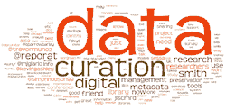
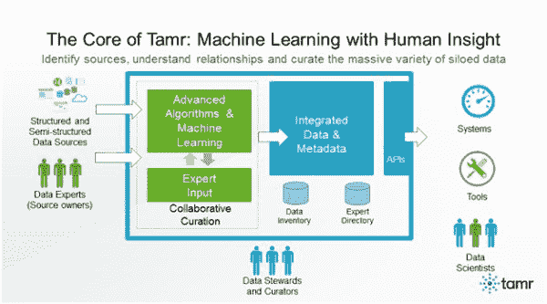
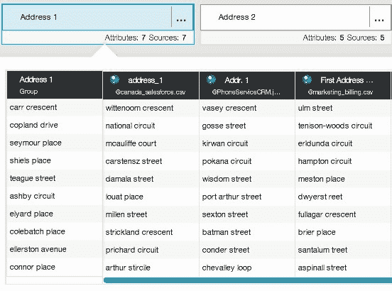
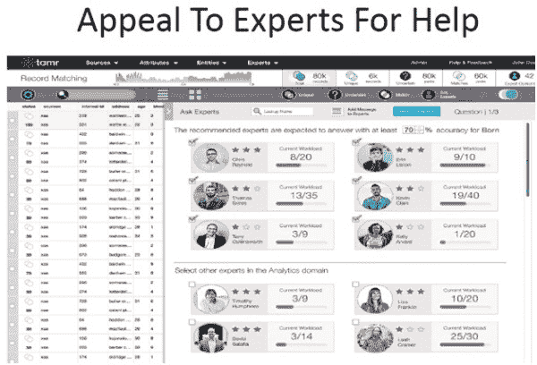

# 独家：Tamr 在大数据管理的新前沿

> 原文：[`www.kdnuggets.com/2014/05/tamr-new-frontier-big-data-curation.html`](https://www.kdnuggets.com/2014/05/tamr-new-frontier-big-data-curation.html)

作者**[格雷戈里·皮亚特斯基](https://www.kdnuggets.com/author/gregory-piatetsky "Posts by Gregory Piatetsky")**，KDnuggets，2014 年 5 月 19 日，[安迪·帕尔默](https://www.kdnuggets.com/tag/andy-palmer)、[数据管理](https://www.kdnuggets.com/tag/data-curation)、[机器学习](https://www.kdnuggets.com/tag/machine-learning)、[迈克尔·布罗迪](https://www.kdnuggets.com/tag/michael-brodie)、[迈克尔·斯通布雷克](https://www.kdnuggets.com/tag/michael-stonebraker)、[初创公司](https://www.kdnuggets.com/tag/startups)、[Tamr](https://www.kdnuggets.com/tag/tamr)数据正成为许多公司的最有价值资产，但[研究](http://www.prnewswire.com/news-releases/voltdb-survey-finds-that-big-data-goes-to-waste-at-most-organizations-259049401.html)表明，大多数组织仅使用他们收集的少量数据。随着数据量的指数增长，以及数据源的多样性和异质性增加，企业如何利用更多的数据？

 帮助来自新兴的热门领域——数据管理。与数据整合不同，数据整合采用自上而下的方法将不同的数据源整合到一个模型中（这对于大数据不可扩展），数据管理则采用自下而上的数据驱动方法。正如 Michael Brodie（Tamr 的顾问）在近期的 KDnuggets 采访中所说的那样，

**数据管理对于大数据就像数据整合对于小数据一样重要。**

 是一个令人兴奋的新创公司，旨在解决数据管理问题。它于 2012 年秋季由两位连续创业者共同创立，最初名为 Data Tamer——**迈克尔·斯通布雷克**（[Michael Stonebraker](https://en.wikipedia.org/wiki/Michael_Stonebraker)），一位传奇数据库研究员，这是他创办的第九家公司，以及[安迪·帕尔默](http://www.linkedin.com/in/andypalmer)，他曾参与创办和/或资助超过 50 家创新公司。凭借这样的创始人，该公司吸引了大量融资——超过 1600 万美元来自包括 Google Ventures 和 New Enterprise Associates (NEA)在内的投资者，并且获得了很多关注，包括一篇 KDnuggets 文章来自迈克尔·斯通布雷克的数据管理初创公司，仍在隐形模式中。

5 月 19 日，Data Tamer 已经脱离隐形模式，并[更名](http://www.tamr.com/tamr-inc-enables-enterprises-connect-leverage-data/)为 Tamr。

上周，我拜访了他们位于剑桥哈佛广场中心的办公室，并接受了 Tamr 首席执行官安迪·帕尔默及其年轻团队的简报，包括艾伦·瓦格纳和尼迪·阿加瓦尔。

Tamr 解决数据管理问题的方法设计为可扩展，并随着数据的增多而改进。关键思想是：

**1\. 可扩展性通过自动化**：集成问题的规模排除了以人为中心的解决方案。需要使用机器学习方法。

**2\. 数据清理**：企业数据源不可避免地相当脏乱。

**3\. 非程序员导向**：当前的提取、转换和加载（ETL）系统具有适合专业程序员的脚本语言。下一代问题的规模要求技能较低的员工能够执行集成任务。

**4\. 增量**：新数据源必须在被发现时逐步集成。数据管理**永远不会完成**！

Tamr 还巧妙地结合了自动化和人类专业知识。

它从使用机器学习和数据分析算法开始，寻找数据元素之间的关系，并尝试自动化**大多数**数据管理任务。在机器学习不够时，它具有明确的流程和用户界面来请求人工专家的帮助，并使用智能奖励结构来鼓励专家。

Tamr 采用持续学习的方法，随着使用的增加而不断学习，帮助建立机构记忆和企业数据清单。

Tamr 支持 RESTful API，使公司能够在 Tamr 上使用现有的可视化和数据科学工具包。Postgres 被用作后端数据库。

它使用的一些机器学习方法包括：

+   使用三元组余弦相似度对属性名称进行模糊字符串比较。

+   将一列数据视为文档，并使用标准的全文解析器对其值进行标记化。然后，测量列之间的 TF-IDF 余弦相似度。这种方法适用于文本字段。

+   使用最小描述长度（MDL）比较两个属性的值。计算两个列数据交集的大小与它们并集大小的比率。这种方法适合于值数量较少的分类字段。

+   计算包含数值的列对的 Welch t 检验，并获得这些列来自相同分布的概率。

在下方截图中，Tamr 识别了几个包含相似地址信息的字段，这些字段是合并的候选项。

Tamr 管理员有一个友好的界面，可以选择能帮助解决特定问题的领域专家，包括按专家的专业知识和当前负载对专家进行排名。

Tamr 已经与几个大型客户合作。在一个案例中，它帮助一家主要的制药公司整合了来自生物学家和化学家的 15,000 个电子表格的数据，这些电子表格中有约 1M 行和 100K 个属性名称。

在另一个案例中，Tamr 帮助 Verisk Health 整合了 300 家保险公司，共计 2000 万条记录的索赔记录。目标是按医疗提供者整合索赔数据，而 Tamr 的解决方案在改进方面显著优于之前需要大量人工干预的方法。

有关 Data Tamer 的更多技术细节，请参阅 [大规模数据策展：Data Tamer 系统](http://cs.uwaterloo.ca/~ilyas/papers/StonebrakerCIDR2013.pdf)，作者 Stonebraker 等，CIDR 会议论文集，2013。

KDnuggets 还覆盖了数据策展领域的其他公司 - 见

+   Paxata 为大数据分析自动化数据准备

+   Trifacta - 通过自动化和机器学习处理数据整理

**相关：**

+   Andy Palmer 推荐的最佳大数据初创公司

+   KDnuggets 采访：Michael Brodie 谈数据策展、云计算、初创公司质量、Verizon（第二部分）

+   CIO Review 20 家最具潜力的大数据公司

+   来自 Michael Stonebraker 的 Data Tamer 初创公司，仍处于隐身模式

+   2014 年 4 月的分析、大数据、数据挖掘收购和初创公司活动

* * *

## 我们的前三大课程推荐

 1\. [Google 网络安全证书](https://www.kdnuggets.com/google-cybersecurity) - 快速进入网络安全职业道路。

 2\. [Google 数据分析专业证书](https://www.kdnuggets.com/google-data-analytics) - 提升你的数据分析水平

 3\. [Google IT 支持专业证书](https://www.kdnuggets.com/google-itsupport) - 支持你的组织 IT

* * *

### 更多相关内容

+   [Inflection-1：个人 AI 的下一个前沿](https://www.kdnuggets.com/2023/08/inflection1-next-frontier-personal-ai.html)

+   [超越天网：塑造 AI 进化的下一个前沿](https://www.kdnuggets.com/beyond-skynet-crafting-the-next-frontier-in-ai-evolution)

+   [庆祝 Devart 的 26 周年，并享受独家 20% 折扣…](https://www.kdnuggets.com/2023/08/devart-celebrating-26th-birthday-exclusive-discount-data-connectivity-tools.html)

+   [最佳数据科学资源、训练营和课程…](https://www.kdnuggets.com/2023/12/springboard-best-data-science-resources-bootcamp-courses-learn-data-science-new-year)

+   [数据科学家的新代码块分享方式](https://www.kdnuggets.com/2022/03/new-ways-sharing-code-blocks.html)

+   [DataLang: 一种为数据科学家创造的新编程语言…](https://www.kdnuggets.com/2023/04/datalang-new-programming-language-data-scientists-chatgpt.html)
