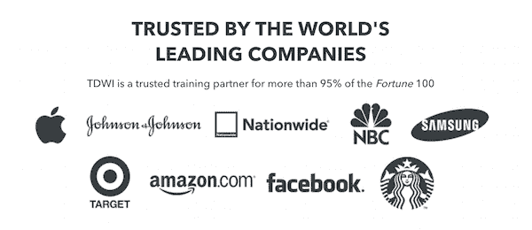

# 实践：数据分析的 Python 入门

> 原文：[`www.kdnuggets.com/2018/05/tdwi-intro-python-data-analysis.html`](https://www.kdnuggets.com/2018/05/tdwi-intro-python-data-analysis.html)

|

&#124;

&#124;   &#124;

&#124; 预览新 TDWI 在线学习课程  &#124;

&#124;   &#124;

&#124;

&#124;

&#124;

&#124;   &#124;

&#124;  &#124;

&#124;   &#124;

&#124;      &#124;

&#124;   &#124;

&#124;

&#124;   &#124;

&#124;

&#124;  &#124;

&#124;   &#124;

&#124;

&#124;   &#124;

&#124;

&#124;  &#124;

&#124;   &#124;

&#124; **窥探数据分析的 Python** 新手编程或只是想学习 Python？通过 TDWI 在线学习的这个新实践课程，学习数据科学和机器学习中的顶级语言之一。

在这个八小时的课程中，学生将使用 Jupyter notebook 学习和编写 Python 代码。到课程结束时，你将掌握 Python 的基础知识，并拥有自己的代码 notebook，其中包括导入和可视化数据的示例，可以在自己的工作中使用。

测试一下，看这个课程是否适合你。 **免费试用前两个章节**：了解讲师 William Henry，浏览“理解变量”模块。如果你喜欢这门课程，我们会给你提供剩余部分的折扣码。

**完整课程包括：**

+   如何使用 Python 基础知识，如列表、字典和字符串。

+   如何使用 for 循环、while 循环和 if/else 语句。

+   如何编写自己的函数。

+   如何使用 Python 读取和写入数据文件。

+   如何使用 Pandas 从 CSV 和 MySQL、PostgreSQL 数据库加载数据

+   如何选择和分组数据子集。

+   如何使用内置和自定义函数分析和转换数据。

+   如何使用 Pandas 高效处理日期/时间数据（包括时区转换）

+   如何创建折线图、直方图和条形图。

&#124;

&#124;

&#124;   &#124;

&#124;

&#124;

&#124;   &#124;

&#124;  &#124;

&#124;   &#124;

&#124;  &#124;

&#124;   &#124;

&#124;

&#124; [查看课程](https://online-learning.tdwi.org/courses/hands-on-intro-to-python-for-data-analysis-free-preview?utm_source=KDnuggets&utm_medium=email&utm_campaign=KD050218)  &#124;

&#124;

&#124;

&#124;   &#124;

&#124;

&#124;   &#124;

&#124;  &#124;

&#124;   &#124;

&#124;

&#124;   &#124;

&#124;

&#124;   &#124;

&#124;          &#124;

&#124;   &#124;

&#124;  &#124;

&#124;   &#124;

&#124; 让我们在社交媒体上互动！  &#124;

&#124;   &#124;

&#124;

&#124;

&#124;   &#124;

&#124;

&#124;  &#124;

&#124;   &#124;

&#124;   &#124;

&#124; 想了解更多或联系我们的服务，请通过 info@tdwi.org. 给我们发邮件。 &#124;

&#124;   &#124;

&#124; ©2018 TDWI. 版权所有。 &#124; [联系我们](https://tdwi.org/pages/about-tdwi/questions-or-comments-for-tdwi.aspx)  &#124;  [隐私政策](https://1105media.com/privacy.aspx) &#124;

&#124;

&#124;   &#124;

&#124;

&#124;

|

* * *

## 我们的三大课程推荐

 1\. [谷歌网络安全证书](https://www.kdnuggets.com/google-cybersecurity) - 快速开启网络安全职业生涯。

 2\. [谷歌数据分析专业证书](https://www.kdnuggets.com/google-data-analytics) - 提升你的数据分析技能

 3\. [谷歌 IT 支持专业证书](https://www.kdnuggets.com/google-itsupport) - 支持组织的 IT 工作

* * *

### 更多相关主题

+   [实用强化学习课程第三部分：SARSA](https://www.kdnuggets.com/2022/01/handson-reinforcement-learning-course-part-3-sarsa.html)

+   [实用强化学习课程，第一部分](https://www.kdnuggets.com/2021/12/hands-on-reinforcement-learning-course-part-1.html)

+   [实用强化学习课程，第二部分](https://www.kdnuggets.com/2021/12/hands-on-reinforcement-learning-part-2.html)

+   [生成式 AI 与大型语言模型：实用培训](https://www.kdnuggets.com/2023/07/generative-ai-large-language-models-handson-training.html)

+   [实用监督学习：线性回归](https://www.kdnuggets.com/handson-with-supervised-learning-linear-regression)

+   [实用无监督学习：K-Means 聚类](https://www.kdnuggets.com/handson-with-unsupervised-learning-kmeans-clustering)
