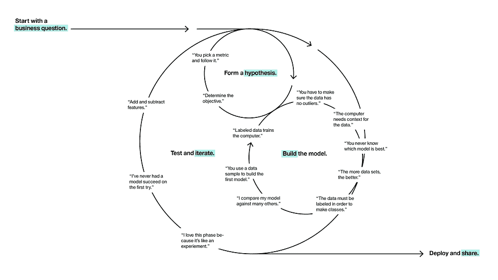
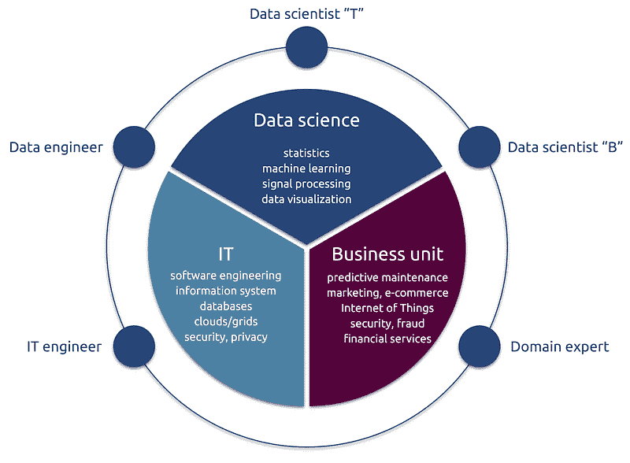
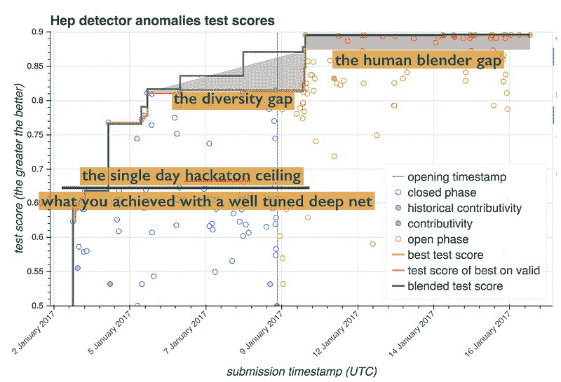
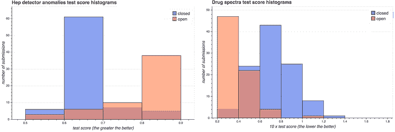
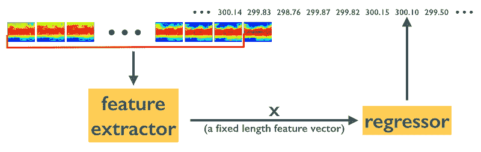
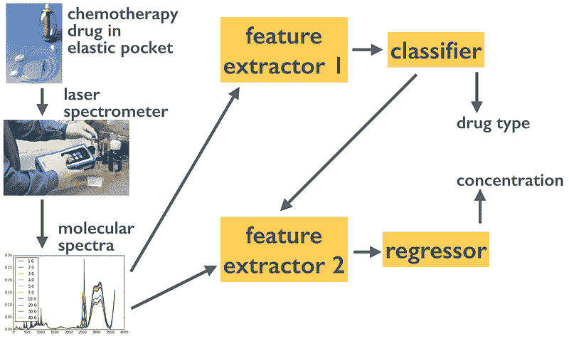

# 教授数据科学过程

> 原文：[`www.kdnuggets.com/2017/05/teaching-data-science-process.html`](https://www.kdnuggets.com/2017/05/teaching-data-science-process.html)

**由 Balázs Kégl，数据科学家，[RAMP](http://www.ramp.studio/)的共同创始人。**

数据科学的循环过程（[来源](http://datascience.ibm.com/blog/finding-the-user-in-data-science/)）。

* * *

## 我们的前三个课程推荐

 1\. [Google 网络安全证书](https://www.kdnuggets.com/google-cybersecurity) - 快速迈向网络安全职业。

 2\. [Google 数据分析专业证书](https://www.kdnuggets.com/google-data-analytics) - 提升您的数据分析能力

 3\. [Google IT 支持专业证书](https://www.kdnuggets.com/google-itsupport) - 在 IT 领域支持您的组织

* * *

教授机器学习的课程大纲存在几十年，甚至更近期的技术学科（深度学习或大数据架构）几乎有标准的课程大纲和线性化的故事情节。另一方面，**数据科学*过程*的教学支持一直很难以找到**，尽管[过程的大纲](https://en.wikipedia.org/wiki/Cross_Industry_Standard_Process_for_Data_Mining)自 90 年代以来就存在。理解该过程不仅需要广泛的机器学习技术背景，还需要对企业管理基本概念的了解。我已经在一篇[先前的文章](https://medium.com/@balazskegl/the-data-science-ecosystem-industrial-edition-938582427466)中详细阐述了由于这些复杂性而产生的数据科学转型的组织困难；在这里，我将分享我在教授数据科学过程方面的经验。

数据科学生态系统。数据科学家“B”在正式化业务问题和设计数据科学工作流程方面处于关键位置。

### 围绕工作流程构建

最近，我有机会尝试一些实验性的教学技术，这些技术应用于来自 Ecole Polytechnique 的一百名顶尖工程学生。课程的**核心概念是数据科学工作流程**。

1.  ***设计*工作流程**，其元素，优化分数，将工作流程连接到商业数据科学家一侧。

1.  ***优化*工作流程**，将其连接到技术数据科学家一侧。

这两者都不能通过线性叙述的幻灯片讲座来教授。我围绕我们的[RAMP](https://drive.google.com/file/d/0BzwKr6zuOkdRNmQ0Q3djMTBzY2s/view?usp=sharing)概念建立了课程，使用我们的[平台](http://www.ramp.studio/)。为了学习工作流程优化，学生参与了五次 RAMP，这些 RAMP 旨在**挑战他们不同的科学工作流程和不同的数据科学问题**。为了学习工作流程设计，我涵盖了一些**数据驱动的商业案例**，给学生提供了带有具体问题的线性指南，并要求他们在小组项目中建立商业案例和数据科学工作流程。我使用 RAMP 起始套件作为样本：限制无限设计空间帮助学生结构化项目。

### 使用 RAMP 作为教学支持

[RAMP](https://drive.google.com/file/d/0BzwKr6zuOkdRNmQ0Q3djMTBzY2s/view)最初设计为一种**协作原型**工具，旨在高效利用数据科学家解决领域科学或商业问题的数据分析部分的时间。我们很快意识到，这对**培训新手数据科学家**同样**非常有价值**。我们需要改变的主要设计特性是完全开放。为了根据个人表现对学生进行评分，我们需要关闭排行榜。在封闭阶段，学生可以看到彼此的分数，但看不到彼此的代码。我们使用一个上限线性函数来对他们进行评分。这个通常持续 1–2 周的封闭阶段之后是一个“经典的”开放 RAMP，我们根据学生的活动、生成多样性和提高自己封闭阶段得分的能力来对学生进行评分。

学生们的**集体**表现**令人惊叹**。在所有五次 RAMP 中，他们不仅超越了基准线，还超越了我们为测试工作流程而组织的单日黑客马拉松分数，通常有 30–50 位顶尖数据科学家和领域科学家参与其中。

第一课堂 RAMP 的得分与提交时间戳。蓝色和红色圆圈分别代表封闭和开放阶段的提交。粉色曲线是当前最佳得分，绿色曲线是最佳模型融合的表现。即使在封闭阶段，前 10%的学生也超越了数据科学研究人员（单日黑客马拉松）和最佳深度神经网络。然后，他们在开放阶段结合彼此的解决方案时超越了最先进的自动模型融合。

我也很高兴看到，在开放阶段，**新手/普通学生通过学习和重用来自前 10–20%学生的解决方案赶上了顶尖学生**。另一个令人愉快的惊喜是**直接盲目复制非常少见**：学生们真心尝试改进彼此的代码。

课堂 RAMP 的分数分布。蓝色和红色直方图分别表示封闭阶段和开放阶段的提交（较深颜色的直方图是重叠部分）。直方图显示，初学者/平均水平的学生通过利用开放代码，在开放阶段赶上了前 10%。

我们将分析这些丰富的结果，并撰写关于**领域科学**（有关第一个示例，请参见[这篇论文](https://www.overleaf.com/read/ntrsnyvpqnsg)）、**数据科学**和**管理科学**的论文。这份[技术报告](https://drive.google.com/file/d/0BzwKr6zuOkdRNmQ0Q3djMTBzY2s/view)包含了一些更多的细节，以下是最近的[DALI 工作坊关于数据科学过程的演示文稿](https://www.slideshare.net/balazskegl/ramp-data-challenges-with-modularization-and-code-submission)（见[这里](http://dalimeeting.org/dali2017/the-data-science-process.html)）。

### 使用业务案例来设计教学工作流程

正如我在[之前的文章](https://medium.com/@balazskegl/the-data-science-ecosystem-industrial-edition-938582427466)中解释的那样，非 IT 公司启动数据科学项目的主要障碍不是数据准备不足，不是基础设施问题，也不是缺乏训练有素的数据科学家，而是**缺乏明确的数据驱动的业务案例**。更糟的是：这个问题通常在对数据湖、Hadoop 服务器和数据科学团队的初始投资之后才会发现。一个准备充分的数据（过程）科学家能够早早进入这一过渡期并颠覆项目，可能为甚至中型公司节省数百万。

为了培训学生担任这一角色，我开始通过对[模拟预测维护案例](https://docs.google.com/document/d/1FKsnUy-nJgBd4DC1yoNQwq7y6gS27dQ5twI7HkSPWN4/edit?usp=sharing)的扩展讨论来进行课程。所有人需要在项目中回答的标准化问题帮助学生从广泛描述的业务案例过渡到明确的预测分数、误差度量和数据收集策略。

1.  我们想要预测什么，以及如何衡量预测的质量？

1.  更好的预测如何改善选定的 KPI？

1.  你想要决策支持、一个完全自动化的系统，还是仅仅了解哪些因素很重要？代理将如何使用这个系统？

1.  定量预测应该是什么？

1.  我们如何（使用什么分数）来衡量成功？（可能不对称的）预测误差如何转化为成本或降低的 KPI？

1.  我们需要什么数据来开发预测器？

1.  我们需要多大努力来收集这些数据？

1.  根据数据来源和预测目标，工作流程和工作流程元素会是什么？

1.  模型需要多频繁地重新训练？

我进一步结构化他们的项目，要求他们制作一个起始包，模仿他们遇到的五个 RAMP。每个起始包包含

1.  一个数据集，

1.  例子工作流程元素填充设计的工作流程，

1.  一个实现工作流程的单元测试，可以用来测试工作流程元素，以及

1.  一个 Jupyter notebook，描述科学或商业问题（回答上述问题），读取、处理、探索和可视化数据，解释数据分析工作流程，并为每个工作流程元素提供和解释初步工作解决方案。

课程包含了大量的问答，讨论了其他商业案例（成功的和失败的），并解释了各种可能的工作流程和工作流程元素。

一个用于预测厄尔尼诺的时间序列预测工作流程。

一个多标准工作流程，用于对化疗药物进行非侵入性质量控制的分类和量化。

由于学生可以自由选择任何可用的数据集，数据收集大多不是问题。工作流程相对简单，因此几乎所有团队都交付了有效的起始工具包。另一方面，许多时候学生会陷入为“漂亮”的数据集寻找商业案例的陷阱。约一半的团队至少尝试设计一个有意义的商业案例。前 3 名团队（共 22 个）交付了顶尖的产品。

1.  一个**制造过程控制**产品，通过使用良好校准的维护成本、生产成本、满意度成本和利润来计算虚假正例和虚假负例的非对称成本。团队在几个基准（检查无、检查全、随机检查）上显示了改进。

1.  一个销售给**大规模多人在线游戏**的产品。目标是预测一个玩家是人类还是机器人。这些游戏在机器人与其自己的离线业务竞争时会亏损，该离线业务出售真实货币的角色和功能，通过自动在游戏中收集这些角色并在黑市上出售。团队通过考虑非对称分类错误来制定商业案例。

1.  一个可以销售给出租车公司或 Uber 的产品，**预测曼哈顿每小时和每个区域的出租车需求**。团队通过估算可用乘车次数乘以每次乘车的利润，将预测转换为价值。

**简介：[Balázs Kégl](https://twitter.com/balazskegl)**是 CNRS 的高级研究科学家，也是巴黎萨克雷大学数据科学中心的负责人。他是 RAMP（[www.ramp.studio](http://www.ramp.studio)）的共同创建者。

[原文](https://medium.com/towards-data-science/teaching-the-data-science-process-f1e9d6f87ad5)。经许可转载。

**相关：**

+   数据科学流程，重新发现

+   数据科学流程

+   拥抱随机：随机接受边缘论文的理由

### 更多相关主题

+   [强化学习：教计算机做出最佳决策](https://www.kdnuggets.com/2023/07/reinforcement-learning-teaching-computers-make-optimal-decisions.html)

+   [如何在几秒钟内处理数百万行的 DataFrame](https://www.kdnuggets.com/2022/01/process-dataframe-millions-rows-seconds.html)

+   [接近机器学习过程的框架](https://www.kdnuggets.com/2018/05/general-approaches-machine-learning-process.html)

+   [在 Python 中处理 CSV 文件的 3 种方法](https://www.kdnuggets.com/2022/10/3-ways-process-csv-files-python.html)

+   [KDnuggets™ 新闻 22:n06, 2 月 9 日：数据科学编程…](https://www.kdnuggets.com/2022/n06.html)

+   [数据科学定义幽默：奇趣名言合集…](https://www.kdnuggets.com/2022/02/data-science-definition-humor.html)
