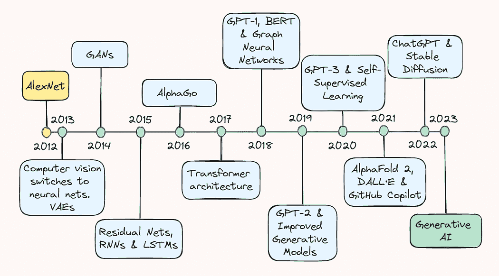
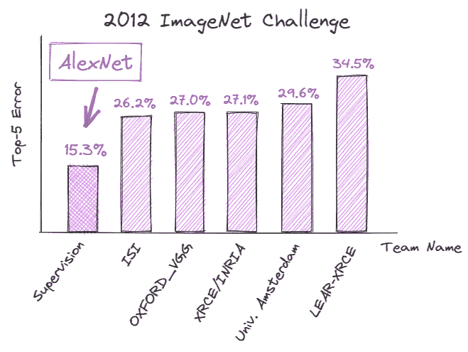
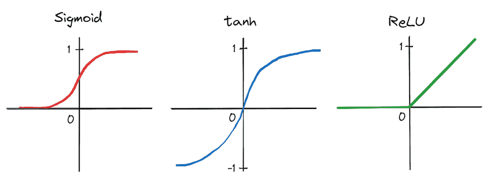
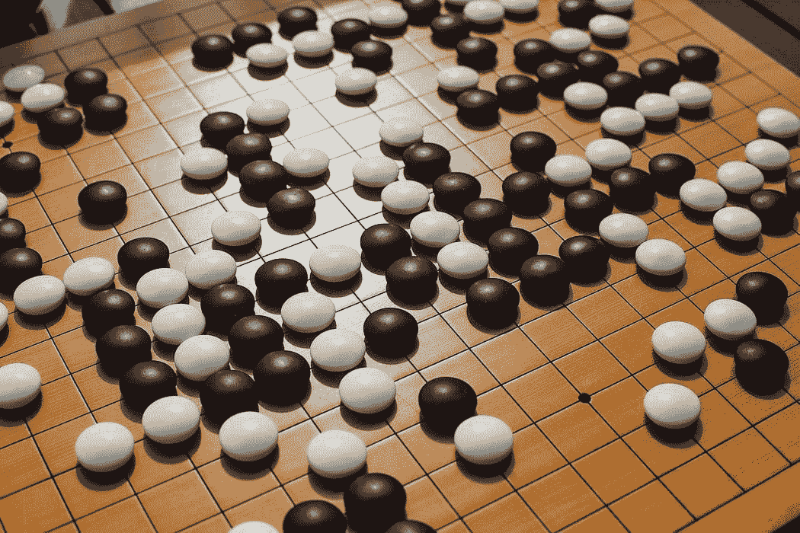
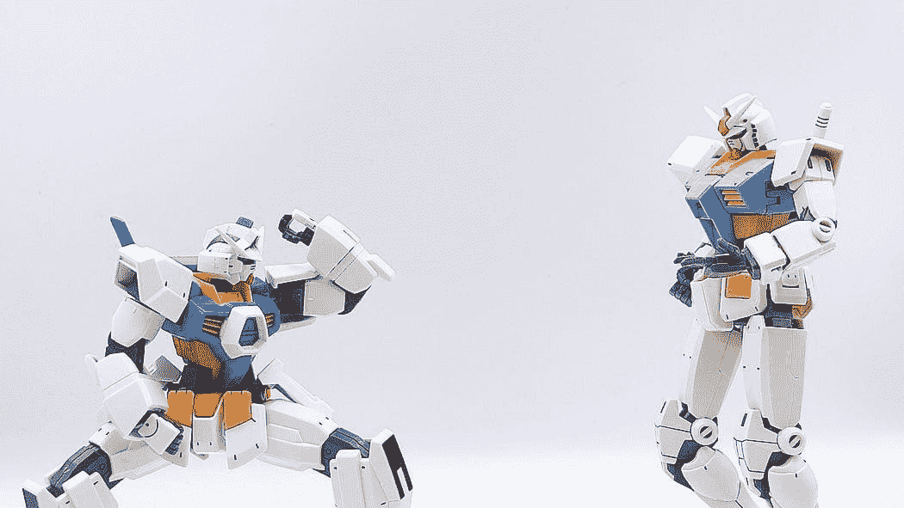
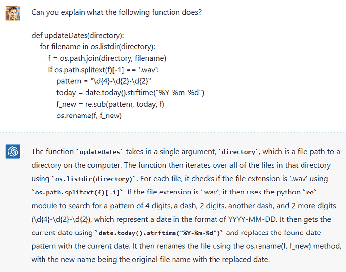
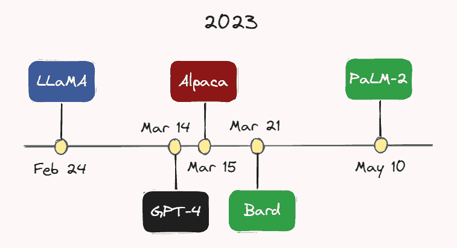

# 过去十年的人工智能回顾

> 原文：[`www.kdnuggets.com/2023/06/ten-years-ai-review.html`](https://www.kdnuggets.com/2023/06/ten-years-ai-review.html)

图片由作者提供。

过去十年对于人工智能（AI）领域来说是一段激动人心且充满事件的旅程。对深度学习潜力的初步探索转变为一个爆炸性增长的领域，现在包括从电子商务中的推荐系统到自动驾驶车辆的目标检测以及能够生成从逼真图像到连贯文本的生成模型。

* * *

## 我们的前三个课程推荐

 1\. [谷歌网络安全证书](https://www.kdnuggets.com/google-cybersecurity) - 快速进入网络安全职业生涯。

 2\. [谷歌数据分析专业证书](https://www.kdnuggets.com/google-data-analytics) - 提升您的数据分析技能

 3\. [谷歌 IT 支持专业证书](https://www.kdnuggets.com/google-itsupport) - 支持您的组织的 IT 工作

* * *

在本文中，我们将回顾一些关键的突破，带您走一趟记忆之旅，了解我们如何走到今天。不论您是经验丰富的人工智能从业者还是对领域最新发展感兴趣的读者，本文将为您提供对人工智能取得显著进展的全面概述。

## 2013 年：AlexNet 和变分自编码器

2013 年被广泛认为是深度学习的“成长期”，这一变化由计算机视觉的重大进展引发。根据对 Geoffrey Hinton 的最新[采访](https://venturebeat.com/ai/10-years-on-ai-pioneers-hinton-lecun-li-say-deep-learning-revolution-will-continue/)，到 2013 年*“几乎所有的计算机视觉研究都转向了神经网络”*。这一繁荣主要是由于一年前图像识别领域的一个相当意外的突破。

2012 年 9 月，[AlexNet](https://proceedings.neurips.cc/paper_files/paper/2012/file/c399862d3b9d6b76c8436e924a68c45b-Paper.pdf)，一个深度卷积神经网络（CNN），在 ImageNet 大规模视觉识别挑战赛（ILSVRC）中创下了破纪录的成绩，展示了深度学习在图像识别任务中的潜力。它达到了 15.3%的[top-5 error](https://machinelearning.wtf/terms/top-5-error-rate/)，比其最近的竞争对手低 10.9%。

图片由作者提供。

这种成功背后的技术改进对 AI 的未来轨迹至关重要，并且极大地改变了对*深度*学习的看法。

首先，作者们应用了一个由五层卷积层和三层全连接线性层组成的深度 CNN —— 这种架构设计在当时被许多人视为不切实际。此外，由于网络深度产生的大量参数，训练是在两块图形处理单元（GPU）上并行进行的，展示了在大数据集上显著加速训练的能力。通过将传统的激活函数，如 sigmoid 和 tanh，替换为更高效的整流线性单元（[ReLU](https://www.cs.toronto.edu/~fritz/absps/reluICML.pdf)），训练时间进一步缩短。

作者提供的图片。

这些进展共同促成了 AlexNet 的成功，标志着人工智能历史的一个转折点，并激发了学术界和科技界对深度学习的强烈兴趣。因此，许多人认为 2013 年是深度学习真正起飞的拐点。

虽然 2013 年的变化在 AlexNet 的喧嚣中稍显被淹没，但变分自编码器（[VAEs](https://arxiv.org/abs/1312.6114)）的发展也同样值得关注 —— 这些生成模型可以学习表示和生成数据，如图像和声音。它们通过学习输入数据在低维空间中的压缩表示，即 *潜在空间*，来工作。这使得它们能够通过从学习到的潜在空间中采样来生成新数据。后来，VAEs 证明开辟了生成建模和数据生成的新途径，应用于艺术、设计和游戏等领域。

## 2014: 生成对抗网络

在接下来的一年，即 2014 年 6 月，深度学习领域见证了另一个重大进展，Ian Goodfellow 和同事们引入了生成对抗网络，即 [GANs](https://proceedings.neurips.cc/paper_files/paper/2014/file/5ca3e9b122f61f8f06494c97b1afccf3-Paper.pdf)。

GANs 是一种能够生成与训练集相似的新数据样本的神经网络类型。基本上，两个网络同时训练：（1）生成器网络生成虚假的或合成的样本，（2）判别器网络评估这些样本的真实性。这种训练在类似游戏的设置中进行，生成器试图创建欺骗判别器的样本，而判别器则试图正确识别虚假样本。

当时，GANs 代表了一个强大而新颖的数据生成工具，不仅用于生成图像和视频，还用于音乐和艺术。它们还推动了无监督学习的发展，这是一个被普遍认为发展不充分且具有挑战性的领域，展示了在不依赖显式标签的情况下生成高质量数据样本的可能性。

## 2015: ResNets 和自然语言处理突破

2015 年，人工智能领域在计算机视觉和自然语言处理（NLP）方面取得了显著进展。

何凯明及其同事发表了一篇题为《深度残差学习用于图像识别》的[论文](https://arxiv.org/abs/1512.03385)，在其中他们引入了残差神经网络（ResNets）的概念——这种架构通过添加捷径，使信息在网络中流动更加顺畅。与普通神经网络不同的是，ResNet 在每一层的输入中增加了*残差*连接，这些连接跳过一层或多层，直接连接到网络中的更深层次。

因此，ResNets 能够解决[梯度消失](https://en.wikipedia.org/wiki/Vanishing_gradient_problem)问题，这使得训练比当时认为可能的更深层次的神经网络成为可能。这反过来在图像分类和物体识别任务中带来了显著的改进。

在同一时期，研究人员在递归神经网络（[RNNs](https://en.wikipedia.org/wiki/Recurrent_neural_network)）和长短期记忆（[LSTM](https://pubmed.ncbi.nlm.nih.gov/9377276/)）模型的发展上取得了显著进展。尽管这些模型自 1990 年代以来已经存在，但它们直到 2015 年才开始引起关注，这主要由于以下因素：（1）可用于训练的更大且更多样化的数据集，（2）计算能力和硬件的改进，使得训练更深层次和更复杂的模型成为可能，以及（3）在此过程中进行的改进，如更复杂的门控机制。

这些架构使得语言模型能够更好地理解文本的上下文和意义，从而在语言翻译、文本生成和情感分析等任务中取得了巨大的进步。那时 RNNs 和 LSTMs 的成功为我们今天看到的大型语言模型（LLMs）的发展铺平了道路。

## 2016 年：AlphaGo

在 1997 年加里·卡斯帕罗夫被 IBM 的 Deep Blue 击败之后，2016 年另一场*人类与机器*的对决震撼了游戏界：谷歌的 AlphaGo 战胜了围棋世界冠军李世石。

图片由[Elena Popova](https://unsplash.com/@elenapopova)提供，来源于[Unsplash](https://unsplash.com/photos/xdXxY5C9PUo)。

Sedol 的[失败](https://en.wikipedia.org/wiki/AlphaGo_versus_Lee_Sedol)标志着人工智能发展轨迹上的另一个重大里程碑：它展示了机器可以超越即使是最熟练的人类玩家，在一个曾经被认为过于复杂以至于计算机无法处理的游戏中。AlphaGo 使用了[深度强化学习](https://en.wikipedia.org/wiki/Deep_reinforcement_learning)和[蒙特卡罗树搜索](https://en.wikipedia.org/wiki/Monte_Carlo_tree_search)的组合，分析了数百万个先前游戏中的位置，并评估最佳的可能走法——这一策略远远超越了人类在这一背景下的决策能力。

## 2017 年：变压器架构和语言模型

可以说，2017 年是奠定了我们今天所见生成式 AI 突破基础的最关键的一年。

2017 年 12 月，Vaswani 及其同事发布了基础性的[论文](https://arxiv.org/abs/1706.03762)《Attention is all you need》，介绍了利用[self-attention](https://en.wikipedia.org/wiki/Attention_(machine_learning))概念处理序列输入数据的变压器架构。这使得处理长距离依赖变得更加高效，这曾经是传统 RNN 架构面临的挑战。

照片由[Jeffery Ho](https://unsplash.com/@jefferyho)拍摄，发布于[Unsplash](https://unsplash.com/photos/x22UAIdif_k)。

变压器由两个基本组件组成：编码器和解码器。编码器负责对输入数据进行编码，例如，这可以是一个单词序列。它然后对输入序列应用多个自注意力层和前馈神经网络，以捕捉句子中的关系和特征，并学习有意义的表示。

本质上，自注意力使模型能够理解句子中不同单词之间的关系。与传统模型按固定顺序处理单词不同，变压器实际上同时检查所有单词。它们为每个单词分配一种称为*注意力*的分数，基于其与句子中其他单词的相关性。 

解码器则从编码器那里获取编码表示并生成输出序列。在机器翻译或文本生成等任务中，解码器根据从编码器接收到的输入生成翻译序列。与编码器类似，解码器也由多个自注意力层和前馈神经网络组成。然而，它包含一个额外的注意力机制，使其能够关注编码器的输出。这使得解码器在生成输出时可以考虑输入序列中的相关信息。

transformer 架构从此成为 LLMs 开发中的关键组件，并在自然语言处理领域如机器翻译、语言建模和问答等方面取得了显著改进。

## 2018 年：GPT-1、BERT 和图神经网络

几个月后，Vaswani 等人发布了他们的基础论文，**G**enerative **P**retrained **T**ransformer，或 [GPT-1](https://cdn.openai.com/research-covers/language-unsupervised/language_understanding_paper.pdf)，在 2018 年 6 月由 OpenAI 推出，利用 transformer 架构有效地捕捉文本中的长程依赖关系。GPT-1 是最早展示无监督预训练然后在特定 NLP 任务上进行微调的有效性的模型之一。

Google 也利用了仍然相当新颖的 transformer 架构，在 2018 年底发布并开源了他们自己的预训练方法，称为**B**idirectional **E**ncoder **R**epresentations from **T**ransformers，或 [BERT](https://ai.googleblog.com/2018/11/open-sourcing-bert-state-of-art-pre.html)。与以前以单向方式处理文本的模型（包括 GPT-1）不同，BERT 同时考虑每个词的前后文。为了说明这一点，作者提供了一个非常直观的例子：

> *…在句子*“I accessed the bank account”*中，单向上下文模型会根据*“I accessed the”*来表示*“bank”*，而不是*“account”*。然而，BERT 使用其前后的上下文来表示*“bank”*——*“I accessed the … account”*——从深层神经网络的最底层开始，使其深度双向。*

双向性的概念如此强大，以至于使 BERT 在各种基准任务上超越了最先进的 NLP 系统。

除了 GPT-1 和 BERT 之外，图神经网络，或 [GNNs](https://en.wikipedia.org/wiki/Graph_neural_network)，在那一年也引起了一些关注。它们属于一种专门设计用于处理图数据的神经网络类别。GNNs 利用消息传递算法在图的节点和边之间传播信息。这使得网络能够以一种更直观的方式学习数据的结构和关系。

这项工作使得从数据中提取更深层次的洞察成为可能，并因此拓宽了深度学习可以应用的领域。通过 GNNs，社会网络分析、推荐系统和药物发现等领域取得了重大进展。

## 2019 年：GPT-2 和改进的生成模型

2019 年标志着生成模型的几项显著进展，特别是[GPT-2](https://openai.com/research/gpt-2-1-5b-release)的推出。该模型在许多自然语言处理任务中实现了最先进的性能，并且能够生成高度真实的文本，这在回顾中给我们预示了这一领域即将到来的进展。

该领域的其他改进包括 DeepMind 的[BigGAN](https://www.deepmind.com/open-source/big-gan)，该模型生成的高质量图像几乎无法与真实图像区分开来，以及 NVIDIA 的[StyleGAN](https://github.com/NVlabs/stylegan)，该模型允许对生成图像的外观进行更好的控制。

总体来看，这些现在被称为生成式人工智能的进展进一步推动了这一领域的边界，而且…

## 2020 年：GPT-3 和 自监督学习

…不久之后，另一种模型诞生了，即使在技术圈外也已成为家喻户晓的名字：[GPT-3](https://arxiv.org/abs/2005.14165)。该模型代表了 LLM 规模和能力的重大飞跃。为了说明情况，GPT-1 仅拥有 117 百万个参数，而 GPT-2 增加到了 15 亿个参数，而 GPT-3 则达到了 1750 亿个参数。

这种庞大的参数空间使得 GPT-3 能够在各种提示和任务中生成异常连贯的文本。它还在文本完成、问答甚至创意写作等多种自然语言处理任务中展示了令人印象深刻的表现。

此外，GPT-3 再次突显了使用自监督学习的潜力，这使得模型能够在大量未标注的数据上进行训练。这种方法的优势在于，这些模型能够在没有广泛任务特定训练的情况下获得对语言的广泛理解，从而使其成本更为经济。

Yann LeCun 在推特上讨论了关于自监督学习的纽约时报文章。

## 2021 年：AlphaFold 2、DALL·E 和 GitHub Copilot

从蛋白质折叠到图像生成和自动编码辅助，2021 年因 AlphaFold 2、DALL·E 和 GitHub Copilot 的发布而变得尤为重要。

[AlphaFold 2](https://www.nature.com/articles/s41586-021-03819-2) 被誉为解决了困扰了几十年的蛋白质折叠问题的长期期待的解决方案。DeepMind 的研究人员扩展了变压器架构，创建了*evoformer blocks* —— 利用进化策略进行模型优化的架构 —— 以构建一个能够根据蛋白质的 1D 氨基酸序列预测其 3D 结构的模型。这一突破有着巨大的潜力，能够革新药物发现、生物工程以及我们对生物系统的理解等领域。

OpenAI 今年再次登上新闻头条，推出了[DALL·E](https://openai.com/product/dall-e-2)。本质上，这个模型结合了 GPT 风格语言模型和图像生成的概念，使得从文本描述中生成高质量图像成为可能。

为了说明这个模型的强大，请看下面的图像，这幅图像是根据“未来世界的油画，飞行汽车”这一提示生成的。

DALL·E 生成的图像。

最后，GitHub 发布了后来成为每个开发者最佳朋友的[Copilot](https://github.com/features/copilot)。这项成就与 OpenAI 合作实现，OpenAI 提供了基础语言模型 Codex，该模型经过大量公开代码的训练，从而学会理解和生成各种编程语言的代码。开发者只需提供一个代码注释说明他们试图解决的问题，模型就会建议实现解决方案的代码。其他功能包括用自然语言描述输入代码以及在编程语言之间转换代码。

## 2022 年：ChatGPT 与 Stable Diffusion

在过去十年里，人工智能的迅速发展 culminated in 一项突破性的进展：OpenAI 的[ChatGPT](https://openai.com/blog/chatgpt)，这款聊天机器人于 2022 年 11 月正式发布。该工具代表了自然语言处理领域的尖端成就，能够对各种查询和提示生成连贯且具有上下文相关的回答。此外，它还可以进行对话、提供解释、提出创意建议、协助解决问题、编写和解释代码，甚至模拟不同的个性或写作风格。

作者提供的图像。

通过与机器人互动的简单直观界面也刺激了可用性的急剧提升。以前，主要是科技界在尝试最新的人工智能发明。然而，现在，人工智能工具已渗透到几乎每个专业领域，从软件工程师到作家、音乐家和广告商。许多公司也在使用这一模型来自动化服务，例如客户支持、语言翻译或回答常见问题。实际上，我们看到的自动化浪潮重新点燃了一些担忧，并激发了关于哪些工作可能面临自动化风险的讨论。

尽管 ChatGPT 在 2022 年占据了许多焦点，但图像生成领域也取得了重要进展。[Stable diffusion](https://stability.ai/blog/stable-diffusion-public-release)，一种能够从文本描述生成逼真图像的潜在文本到图像扩散模型，由 Stability AI 发布。

稳定扩散是传统扩散模型的扩展，这些模型通过反复向图像添加噪声，然后逆转过程以恢复数据。它的设计旨在通过不直接处理输入图像，而是处理其低维表示或潜在空间，从而加速这一过程。此外，通过将用户提供的嵌入变换器的文本提示添加到网络中，扩散过程也得到了修改，使其能够在每次迭代过程中引导图像生成过程。

总体而言，2022 年 ChatGPT 和稳定扩散的发布突显了多模态生成 AI 的潜力，并激发了这一领域进一步发展的巨大推动力和投资。

## 2023：LLMs 和聊天机器人

今年无疑成为了 LLMs 和聊天机器人的一年。越来越多的模型正在快速开发和发布。

图片由作者提供。

例如，2 月 24 日，Meta AI 发布了 [LLaMA](https://ai.facebook.com/blog/large-language-model-llama-meta-ai/)——一个在大多数基准测试中优于 GPT-3 的 LLM，尽管其参数数量要少得多。不到一个月后，3 月 14 日，OpenAI 发布了 [GPT-4](https://openai.com/product/gpt-4)——一个比 GPT-3 更大、更强大且多模态的版本。虽然 GPT-4 的确切参数数量尚不清楚，但推测在万亿级别。

3 月 15 日，斯坦福大学的研究人员发布了 [Alpaca](https://crfm.stanford.edu/2023/03/13/alpaca.html)，这是一个从 LLaMA 上经过微调的轻量级语言模型，专注于跟随指令的演示。几天后，3 月 21 日，Google 推出了其 ChatGPT 竞争对手：[Bard](https://blog.google/technology/ai/bard-google-ai-search-updates/)。Google 还在本月 5 月 10 日 发布了其最新的 LLM，[PaLM-2](https://ai.google/discover/palm2)。鉴于这一领域发展的迅猛，阅读本文时很可能又会出现另一个模型。

我们还看到越来越多的公司将这些模型融入到他们的产品中。例如，Duolingo 宣布了其 GPT-4 驱动的 [Duolingo Max](https://blog.duolingo.com/duolingo-max/)，这是一个新的订阅层，旨在为每个人提供量身定制的语言课程。Slack 也推出了一个名为 [Slack GPT](https://slack.com/blog/news/introducing-slack-gpt) 的 AI 驱动的助手，可以进行草拟回复或总结线程。此外，Shopify 向公司的 Shop 应用程序引入了一个 ChatGPT 驱动的助手，能够通过各种提示帮助客户识别所需的产品。

Shopify 在 Twitter 上宣布了其 ChatGPT 驱动的助手。

有趣的是，如今人工智能聊天机器人甚至被视为人类治疗师的替代品。例如，[Replika](https://replika.com/)是一款美国的聊天机器人应用，它为用户提供了一个“*关心你的 AI 伴侣，总是愿意倾听和交谈，总是站在你这边*”。其创始人尤金妮亚·库伊达表示，该应用拥有各种各样的用户，从将其作为“*在与人互动之前热身*”的自闭症儿童，到只是需要一个朋友的孤独成年人。

在我们总结之前，我想强调一下过去十年人工智能发展的高潮：人们实际上在使用 Bing！今年早些时候，微软[推出了](https://blogs.microsoft.com/blog/2023/02/07/reinventing-search-with-a-new-ai-powered-microsoft-bing-and-edge-your-copilot-for-the-web/)其基于 GPT-4 的“*网络副驾驶*”，该工具经过定制用于搜索，并且在……永远（？）中第一次成为了谷歌在搜索业务中长期主导地位的严肃竞争者。

## 回顾与展望

当我们回顾过去十年的人工智能发展时，显而易见的是，我们见证了一场对工作、商业和相互互动产生深远影响的变革。最近在生成模型，特别是 LLMs（大型语言模型）方面取得的大量进展，似乎遵循了“更大更好”的普遍信念，指的是模型的参数空间。这一点在 GPT 系列中尤为明显，该系列从 117 百万参数的 GPT-1 起步，每个后续模型的参数数量增加了约一个数量级，最终在 GPT-4 中达到可能的万亿级参数。

然而，根据最近的[采访](https://techcrunch.com/2023/04/14/sam-altman-size-of-llms-wont-matter-as-much-moving-forward/?guccounter=1&guce_referrer=aHR0cHM6Ly93d3cuZ29vZ2xlLmNvbS8&guce_referrer_sig=AQAAAANxF1G0qEgpUn-9mD7CxuZrc77IDr8t-QvyX3Do6Koa10eGy5DYiq3lzXDAJRakptl0Jy49OkuxXU8zD-3-8l-h3YJxFgKRwk5HqIHdhG2BIXavq5Tfn1HHz6IKk8-y86xZbyHXZJwE_Q_OFXr4nrHygrl48-WxX7vdgTft_lhw)，OpenAI CEO Sam Altman 认为我们已经迎来了“更大更好”时代的终结。他认为，尽管未来模型的参数数量仍会增长，但未来模型改进的主要焦点将是提升模型的能力、实用性和安全性。

后者尤为重要。考虑到这些强大的人工智能工具现在已经进入了公众手中，不再仅限于受控的研究实验室环境，我们现在比以往任何时候都更需要谨慎行事，确保这些工具是安全的，并符合人类的最佳利益。希望我们在人工智能安全方面能够看到与其他领域相同的开发和投资。

> **附注：** 如果我遗漏了你认为应该包含在本文中的核心 AI 概念或突破，请在下方评论中告知我！

**[托马斯·A·多弗](https://www.linkedin.com/in/thomasdorfer/)** 是微软的数据与应用科学家。在担任现职之前，他曾在生物技术行业担任数据科学家，并在神经反馈领域从事研究工作。他拥有整合神经科学硕士学位，并在业余时间在 Medium 上撰写有关数据科学、机器学习和 AI 的技术博客。

[原文](https://medium.com/towards-data-science/ten-years-of-ai-in-review-85decdb2a540)。经授权转载。

### 更多相关话题

+   [数据科学 30 年：一位数据科学从业者的回顾](https://www.kdnuggets.com/30-years-of-data-science-a-review-from-a-data-science-practitioner)

+   [实施推荐系统在业务中的十大关键教训](https://www.kdnuggets.com/2022/07/ten-key-lessons-implementing-recommendation-systems-business.html)

+   [我如何在 14 年内将薪水提高 14 倍，作为数据分析/科学专业人士](https://www.kdnuggets.com/2021/12/14x-salary-in-14-years-data-professional.html)

+   [3 年内 40%的劳动力将受到 AI 的影响](https://www.kdnuggets.com/40-of-labour-force-will-be-affected-by-ai-in-3-years)

+   [机器学习的 Python：电子书评测](https://www.kdnuggets.com/2022/06/python-machine-learning-ebook-review.html)

+   [2023 年 Google 数据分析认证评测](https://www.kdnuggets.com/2023/01/google-data-analytics-certification-review-2023.html)
