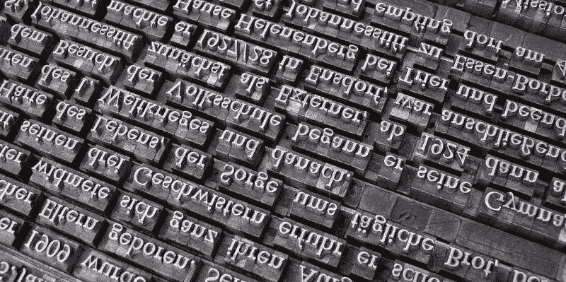
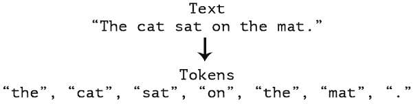

# 使用 TensorFlow 和 Keras 进行分词和文本数据准备

> 原文：[`www.kdnuggets.com/2020/03/tensorflow-keras-tokenization-text-data-prep.html`](https://www.kdnuggets.com/2020/03/tensorflow-keras-tokenization-text-data-prep.html)

评论

图片来自[Willi Heidelbach](https://pixabay.com/users/wilhei-883152/?utm_source=link-attribution&utm_medium=referral&utm_campaign=image&utm_content=705667) [Pixabay](https://pixabay.com/?utm_source=link-attribution&utm_medium=referral&utm_campaign=image&utm_content=705667)

* * *

## 我们的前三个课程推荐

 1\. [谷歌网络安全证书](https://www.kdnuggets.com/google-cybersecurity) - 快速进入网络安全职业生涯

 2\. [谷歌数据分析专业证书](https://www.kdnuggets.com/google-data-analytics) - 提升你的数据分析技能

 3\. [谷歌 IT 支持专业证书](https://www.kdnuggets.com/google-itsupport) - 支持你的组织的 IT

* * *

之前我们查看了一个通用文本数据预处理方法，重点关注了分词、标准化和噪声去除。然后我们概述了使用 Python 进行文本数据预处理的内容，这本质上是前一篇文章中框架的实际应用，涵盖了主要的手动文本数据预处理方法。我们还探讨了如何使用 Python 构建基础文本数据词汇。

不过，自动化许多这种预处理和文本数据准备的工具是存在的。这些工具在这些文章发表之前就已存在，但其普及程度自那时以来激增。由于许多 NLP 工作现在通过神经网络完成，使用神经网络实现库如 TensorFlow——以及同时使用 Keras——来实现这些准备任务是很自然的。

本文将探讨如何使用 TensorFlow 和 Keras 预处理工具对文本数据进行分词和进一步准备，以便输入神经网络。虽然前几篇文章没有涉及为神经网络创建和填充编码数据序列的附加概念，但本文将予以补充。相反，虽然噪声去除在之前的文章中有所涵盖，但本文不再涉及。文本数据中的噪声是什么可能是任务特定的，前文对这一主题的处理依然具有参考价值。

为了实现今天的目标，我们将使用两个 Keras 预处理工具: [`Tokenizer`](https://www.tensorflow.org/api_docs/python/tf/keras/preprocessing/text/Tokenizer) 类和 [`pad_sequences`](https://www.tensorflow.org/api_docs/python/tf/keras/preprocessing/sequence/pad_sequences) 模块。

我们使用一些示例句子代替真实数据集或来自现实世界的数据，来完成编码工作。下次我们可以扩展代码，使用真实数据集并执行一些有趣的任务，例如分类或类似任务。一旦理解了这个过程，扩展到更大的数据集将很简单。

让我们开始进行必要的导入和一些“数据”演示。

```py
from tensorflow.keras.preprocessing.text import Tokenizer
from tensorflow.keras.preprocessing.sequence import pad_sequences

train_data = [
  "I enjoy coffee.",
  "I enjoy tea.",
  "I dislike milk.",
  "I am going to the supermarket later this morning for some coffee."
]

test_data = [
  "Enjoy coffee this morning.",
  "I enjoy going to the supermarket.",
  "Want some milk for your coffee?"
]
```

接下来，一些执行分词和准备标准化数据表示的超参数，下面有解释。

```py
num_words = 1000
oov_token = '<UNK>'
pad_type = 'post'
trunc_type = 'post'
```

+   `num_words = 1000`

    这将是从结果分词数据词汇表中使用的最多词数，在我们的例子中是截断到前 1000 个最常见的词。虽然在我们的小数据集中这不会成为问题，但为了演示目的，这里展示了。

+   `oov_token = <UNK>`

    这是用于处理在测试数据序列分词和编码过程中遇到的词汇表外的词汇的标记，使用在训练数据分词过程中构建的词索引创建的。

+   `pad_type = 'post'`

    当我们对文本数据进行数字序列编码时，我们的句子（或任意文本块）的长度将不一致，因此我们需要选择一个最大长度，并用填充字符填补较短句子的未使用位置。在我们的例子中，最大句子长度将通过搜索最长的句子来确定，填充字符将是'0'。

+   `trunc_type = 'post'`

    与上面一样，当我们对文本数据进行数字序列编码时，我们的句子（或任意文本块）的长度将不一致，因此我们需要选择一个最大长度，并用填充字符填补较短句子的未使用位置。我们选择在句子的末尾进行填充（'post'），意味着我们的句子序列数字表示中的词索引条目将出现在结果句子向量的最左侧位置，而填充字符（'0'）将出现在实际数据之后，位于结果句子向量的最右侧位置。



来源: [Manning](https://freecontent.manning.com/deep-learning-for-text/)

现在我们来进行分词、序列编码和序列填充。我们将逐块讲解这段代码。

```py
# Tokenize our training data
tokenizer = Tokenizer(num_words=num_words, oov_token=oov_token)
tokenizer.fit_on_texts(train_data)

# Get our training data word index
word_index = tokenizer.word_index

# Encode training data sentences into sequences
train_sequences = tokenizer.texts_to_sequences(train_data)

# Get max training sequence length
maxlen = max([len(x) for x in train_sequences])

# Pad the training sequences
train_padded = pad_sequences(train_sequences, padding=pad_type, truncating=trunc_type, maxlen=maxlen)

# Output the results of our work
print("Word index:\n", word_index)
print("\nTraining sequences:\n", train_sequences)
print("\nPadded training sequences:\n", train_padded)
print("\nPadded training shape:", train_padded.shape)
print("Training sequences data type:", type(train_sequences))
print("Padded Training sequences data type:", type(train_padded))
```

下面是逐块发生的情况：

+   `# Tokenize our training data`

    这很简单；我们使用 TensorFlow（Keras）的 [`Tokenizer`](https://www.tensorflow.org/api_docs/python/tf/keras/preprocessing/text/Tokenizer) 类来自动化我们的训练数据的标记化。首先，我们创建 `Tokenizer` 对象，提供最大保留的词汇数量，以及一个用于编码测试数据中未见过的词汇的超出词汇表的标记，否则这些之前未见过的词汇将被简单地从我们的词汇表中删除，且神秘地未被计算在内。要了解更多有关 TensorFlow 标记化器的其他参数，请查看 [文档](https://www.tensorflow.org/api_docs/python/tf/keras/preprocessing/text/Tokenizer)。创建 `Tokenizer` 后，我们将其拟合在训练数据上（我们稍后也会用它来拟合测试数据）。

+   `# 获取我们的训练数据单词索引`

    标记化过程的副产品是创建了一个单词索引，将词汇表中的单词映射到其数字表示，这一映射对于编码我们的序列至关重要。由于我们稍后会引用这个映射以进行打印，因此我们在这里为其分配一个变量以简化操作。

+   `# 将训练数据句子编码为序列`

    现在我们已经将数据标记化，并且有了词汇表的单词到数字表示的映射，让我们利用这个映射来编码序列。在这里，我们将文本句子从类似“我的名字是马修”的形式转换为类似“6 8 2 19”的形式，其中每个数字在索引中与相应的单词匹配。由于神经网络通过对数字进行计算来工作，直接传入一堆单词是不行的。因此，我们使用序列。并且记住，这仅仅是我们目前处理的训练数据；测试数据在之后会被标记化和编码。

+   `# 获取最大训练序列长度`

    记得我们之前提到过需要为编码的句子设置一个最大序列长度吗？我们可以自己设置这个限制，但在我们的案例中，我们将找到最长的编码序列，并以此作为最大序列长度。在实际操作中，确实有不想这样做的原因，但也有时这样做是合适的。接下来，在实际训练序列填充中，将使用`maxlen`变量。

+   `# 填充训练序列`

    如上所述，我们需要确保编码序列的长度一致。我们刚刚找出了最长序列的长度，并将使用该长度对所有其他序列进行填充，填充额外的‘0’在末尾（‘post’），并且也会从末尾（‘post’）截断任何超出最大长度的序列。这里我们使用 TensorFlow（Keras）的 [`pad_sequences`](https://www.tensorflow.org/api_docs/python/tf/keras/preprocessing/sequence/pad_sequences) 模块来完成这一任务。你可以查看文档以获取其他填充选项。

+   `# 输出我们工作的结果`

    现在让我们看看我们所做的工作。我们期望注意到最长的序列以及填充较短序列的情况。还要注意，当进行填充时，我们的序列会从 Python 列表转换为 Numpy 数组，这很有帮助，因为这就是我们最终会送入神经网络的内容。我们的训练序列矩阵的形状是训练集中句子（序列）的数量（4）与最长序列的长度（`maxlen`，或 12）。

```py
Word index:
 {'<UNK>': 1, 'i': 2, 'enjoy': 3, 'coffee': 4, 'tea': 5, 'dislike': 6, 'milk': 7, 'am': 8, 'going': 9, 'to': 10, 'the': 11, 'supermarket': 12, 'later': 13, 'this': 14, 'morning': 15, 'for': 16, 'some': 17}

Training sequences:
 [[2, 3, 4], [2, 3, 5], [2, 6, 7], [2, 8, 9, 10, 11, 12, 13, 14, 15, 16, 17, 4]]

Padded training sequences:
 [[ 2  3  4  0  0  0  0  0  0  0  0  0]
 [ 2  3  5  0  0  0  0  0  0  0  0  0]
 [ 2  6  7  0  0  0  0  0  0  0  0  0]
 [ 2  8  9 10 11 12 13 14 15 16 17  4]]

Padded training shape: (4, 12)
Training sequences data type: <class 'list'>
Padded Training sequences data type: <class 'numpy.ndarray'>
```

现在让我们使用我们的分词器对测试数据进行分词，然后类似地编码我们的序列。这些操作与上述内容非常相似。请注意，我们使用的是为训练创建的相同分词器，以便在两个数据集之间实现一致，使用相同的词汇表。我们还按照与训练序列相同的长度和规格进行填充。

```py
test_sequences = tokenizer.texts_to_sequences(test_data)
test_padded = pad_sequences(test_sequences, padding=pad_type, truncating=trunc_type, maxlen=maxlen)

print("Testing sequences:\n", test_sequences)
print("\nPadded testing sequences:\n", test_padded)
print("\nPadded testing shape:",test_padded.shape)
```

```py
Testing sequences:
 [[3, 4, 14, 15], [2, 3, 9, 10, 11, 12], [1, 17, 7, 16, 1, 4]]

Padded testing sequences:
 [[ 3  4 14 15  0  0  0  0  0  0  0  0]
 [ 2  3  9 10 11 12  0  0  0  0  0  0]
 [ 1 17  7 16  1  4  0  0  0  0  0  0]]

Padded testing shape: (3, 12)
```

例如，你能看到训练集和测试集之间的填充序列长度不同会造成什么问题吗？

最后，让我们检查编码后的测试数据。

```py
for x, y in zip(test_data, test_padded):
  print('{} -> {}'.format(x, y))

print("\nWord index (for reference):", word_index)
```

```py
Enjoy coffee this morning. -> [ 3  4 14 15  0  0  0  0  0  0  0  0]
I enjoy going to the supermarket. -> [ 2  3  9 10 11 12  0  0  0  0  0  0]
Want some milk for your coffee? -> [ 1 17  7 16  1  4  0  0  0  0  0  0]

Word index (for reference): {'<UNK>': 1, 'i': 2, 'enjoy': 3, 'coffee': 4, 'tea': 5, 'dislike': 6, 'milk': 7, 'am': 8, 'going': 9, 'to': 10, 'the': 11, 'supermarket': 12, 'later': 13, 'this': 14, 'morning': 15, 'for': 16, 'some': 17}
```

请注意，由于我们在测试数据中编码了一些在训练数据中未见过的单词，我们现在有一些词汇外的标记，这些标记被编码为<UNK>（例如，‘want’）。

现在我们有了填充序列，更重要的是知道如何使用不同的数据再次获取它们，我们可以开始做一些事情了。下一次，我们将用实际数据替代这次使用的玩具数据，并且只需对代码做很小的更改（除非我们需要为训练和测试数据添加分类标签），我们将继续进行某种 NLP 任务，最有可能是分类。

**相关**：

+   10 个 Python 字符串处理技巧与窍门

+   自动文本摘要入门

+   如何在 Python 中为 NLP 任务创建词汇表

### 更多相关主题

+   [使用 TensorFlow 和 Keras 构建并训练第一个神经网络](https://www.kdnuggets.com/2023/05/building-training-first-neural-network-tensorflow-keras.html)

+   [机器学习中的数据准备和原始数据](https://www.kdnuggets.com/2022/07/data-preparation-raw-data-machine-learning.html)

+   [SQL 中的数据准备备忘单](https://www.kdnuggets.com/2021/05/data-preparation-sql-cheat-sheet.html)

+   [R 中的数据准备备忘单](https://www.kdnuggets.com/2021/10/data-preparation-r-dplyr-cheat-sheet.html)

+   [Keras 3.0：你需要知道的一切](https://www.kdnuggets.com/2023/07/keras-30-everything-need-know.html)

+   [TensorFlow 用于计算机视觉 - 简化的迁移学习](https://www.kdnuggets.com/2022/01/tensorflow-computer-vision-transfer-learning-made-easy.html)
