# 提升 TensorFlow 模型的 4 种方法——你需要了解的关键正则化技术

> 原文：[`www.kdnuggets.com/2020/08/tensorflow-model-regularization-techniques.html`](https://www.kdnuggets.com/2020/08/tensorflow-model-regularization-techniques.html)

评论


*照片由 [Jungwoo Hong](https://unsplash.com/@oowgnuj?utm_source=medium&utm_medium=referral) 提供，发布于 [Unsplash](https://unsplash.com/?utm_source=medium&utm_medium=referral)。*

### 正则化

根据维基百科，

> *在数学、统计学和计算机科学，特别是机器学习和逆问题中，**正则化**是为了在解决一个不适定问题或防止过拟合时添加额外信息的过程。*

这意味着我们添加一些额外的信息以解决问题并防止过拟合。

过拟合意味着我们的机器学习模型在某些数据上训练良好，在这些数据上表现极佳，但在新的未见过的样本上则会失败。

我们可以在这个简单的例子中看到过拟合现象

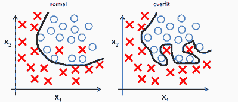

*[`mlwiki.org/index.php/Overfitting`](http://mlwiki.org/index.php/Overfitting)*

当我们的数据严格附着于训练样本时，这会导致测试/开发集上的性能较差，而训练集上的性能良好。

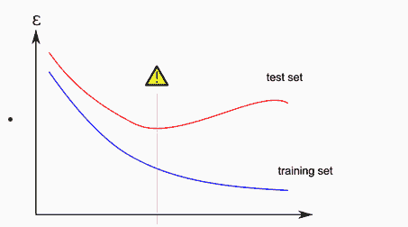

*[`mlwiki.org/index.php/Overfitting`](http://mlwiki.org/index.php/Overfitting)*

因此，为了提高模型性能，我们使用不同的正则化技术。虽然有几种技术，但我们将讨论 4 种主要技术。

1.  **L1 正则化**

1.  **L2 正则化**

1.  **丢弃法**

1.  **批量归一化**

我将简要解释这些技术是如何工作的，以及如何在 Tensorflow 2 中实现它们。

为了更好地理解这些技术如何及其工作原理，我推荐你观看 Andrew NG 教授的讲座，这些讲座在 Youtube 上很容易找到。

*首先，我将编写一个没有正则化的模型，然后展示如何通过添加不同的正则化技术来改进它。我们将使用 IRIS 数据集来展示正则化如何显著改善模型。*

### 无正则化的模型

**代码：**

+   **基本预处理**

+   **模型构建**

**model1.summary()**

```py
Model: "sequential"
_________________________________________________________________
Layer (type)                 Output Shape              Param #   
=================================================================
dense_6 (Dense)              (None, 512)               2560      
_________________________________________________________________
dense_7 (Dense)              (None, 256)               131328    
_________________________________________________________________
dense_8 (Dense)              (None, 128)               32896     
_________________________________________________________________
dense_9 (Dense)              (None, 64)                8256      
_________________________________________________________________
dense_10 (Dense)             (None, 32)                2080      
_________________________________________________________________
dense_11 (Dense)             (None, 3)                 99        
=================================================================
Total params: 177,219
Trainable params: 177,219
Non-trainable params: 0
_________________________________________________________________

```

训练模型后，如果我们使用以下代码在 Tensorflow 中评估模型，我们可以找到测试集上的*准确率*、*损失*和*mse*。

```py
loss1, acc1, mse1 = model1.evaluate(X_test, y_test)
print(f"Loss is {loss1},\nAccuracy is {acc1*100},\nMSE is {mse1}")

```

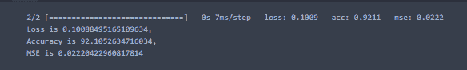

让我们检查验证损失和训练损失的图表。

```py
import matplotlib.pyplot as plt
plt.style.use('ggplot')
plt.plot(hist.history['loss'], label = 'loss')
plt.plot(hist.history['val_loss'], label='val loss')
plt.title("Loss vs Val_Loss")
plt.xlabel("Epochs")
plt.ylabel("Loss")
plt.legend()
plt.show()

```


在这里，我们可以看到验证损失在**≈ 60**个周期后逐渐增加，而训练损失保持稳定。这表明我们的模型发生了过拟合。

同样地，对于模型准确率图，

```py
plt.plot(hist.history['acc'], label = 'acc')
plt.plot(hist.history['val_acc'], label='val acc')
plt.title("acc vs Val_acc")
plt.xlabel("Epochs")
plt.ylabel("acc")
plt.legend()
plt.show()

```

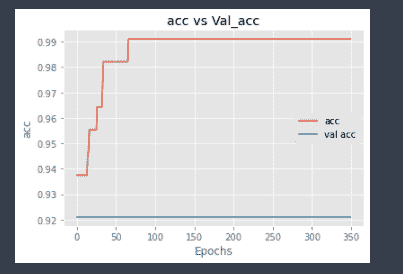

这再次表明，与训练准确率相比，验证准确率较低，这再次显示出过拟合的迹象。

### L1 正则化：

一种常用的正则化技术是 L1 正则化，也称为 Lasso 正则化。

L1 正则化的主要概念是我们必须通过将权重的绝对值添加到损失函数中，乘以正则化参数 lambda **λ**，其中**λ**是手动调节为大于 0 的。

L1 的方程是

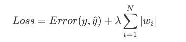

*图片来源: [数据科学前沿](https://towardsdatascience.com/intuitions-on-l1-and-l2-regularisation-235f2db4c261#2a1f)。*

**Tensorflow 代码：**

这里，我们添加了一个额外的参数*kernel_regularizer*，我们将其设置为‘l1’，用于 L1 正则化。

现在我们来评估并绘制模型。

```py
loss2, acc2, mse2 = model2.evaluate(X_test, y_test)
print(f"Loss is {loss2},\nAccuracy is {acc2 * 100},\nMSE is {mse2}")

```

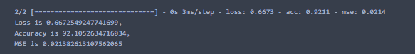

嗯，准确率差不多一样，我们来看一下图表以获得更好的直观感觉。

```py
plt.plot(hist2.history[‘loss’], label = ‘loss’)
plt.plot(hist2.history[‘val_loss’], label=’val loss’)
plt.title(“Loss vs Val_Loss”)
plt.xlabel(“Epochs”)
plt.ylabel(“Loss”)
plt.legend()
plt.show()

```

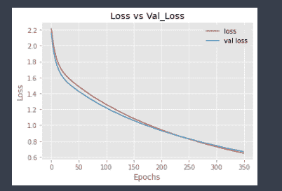

对于准确率，

```py
plt.figure(figsize=(15,8))
plt.plot(hist2.history['acc'], label = 'acc')
plt.plot(hist2.history['val_acc'], label='val acc')
plt.title("acc vs Val_acc")
plt.xlabel("Epochs")
plt.ylabel("acc")
plt.legend()
plt.show()

```

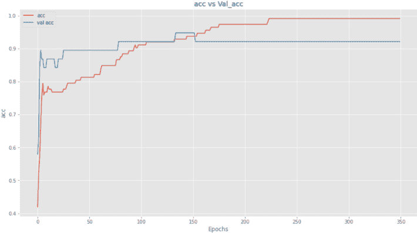

好吧，相当大的改进，我想，因为过拟合的验证损失没有像之前那样增加，但验证准确率提升不大。让我们在更多层中添加 l1 以检查是否能改善模型。

```py
model3 = Sequential([
    Dense(512, activation='tanh', input_shape = X_train[0].shape, kernel_regularizer='l1'),
    Dense(512//2, activation='tanh', kernel_regularizer='l1'),
    Dense(512//4, activation='tanh', kernel_regularizer='l1'),
    Dense(512//8, activation='tanh', kernel_regularizer='l1'),
    Dense(32, activation='relu', kernel_regularizer='l1'),
    Dense(3, activation='softmax')
])
model3.compile(optimizer='sgd',loss='categorical_crossentropy', metrics=['acc', 'mse'])
hist3 = model3.fit(X_train, y_train, epochs=350, batch_size=128, validation_data=(X_test,y_test), verbose=2)

```

训练后，我们来评估模型。

```py
loss3, acc3, mse3 = model3.evaluate(X_test, y_test)
print(f"Loss is {loss3},\nAccuracy is {acc3 * 100},\nMSE is {mse3}")

```


好了，准确率现在有了相当大的提高，从 92 跳升到了 94。我们来看看图表。

**损失**

```py
plt.figure(figsize=(15,8))
plt.plot(hist3.history['loss'], label = 'loss')
plt.plot(hist3.history['val_loss'], label='val loss')
plt.title("Loss vs Val_Loss")
plt.xlabel("Epochs")
plt.ylabel("Loss")
plt.legend()
plt.show()

```

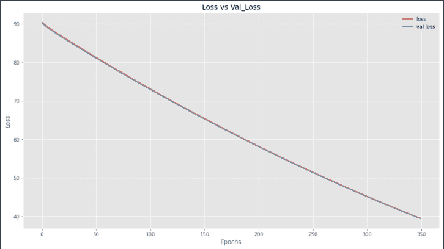

现在，两条线大致重叠，这意味着我们的模型在测试集上的表现与在训练集上的表现相同。

**准确率**

```py
plt.figure(figsize=(15,8))
plt.plot(hist3.history['acc'], label = 'ACC')
plt.plot(hist3.history['val_acc'], label='val acc')
plt.title("acc vs Val_acc")
plt.xlabel("Epochs")
plt.ylabel("acc")
plt.legend()
plt.show()

```

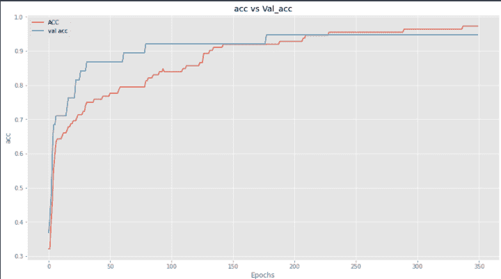

我们可以看到，与训练损失相比，模型的验证损失没有增加，验证准确率也在上升。

### L2 正则化

L2 正则化是另一种正则化技术，也称为**岭回归**。在 L2 正则化中，我们将权重的平方大小添加到损失函数中以惩罚我们的损失。


*图片来源: [数据科学前沿](https://towardsdatascience.com/intuitions-on-l1-and-l2-regularisation-235f2db4c261#2a1f)。*

**Tensorflow 代码：**

```py
model5 = Sequential([
    Dense(512, activation='tanh', input_shape = X_train[0].shape, kernel_regularizer='l2'),
    Dense(512//2, activation='tanh'),
    Dense(512//4, activation='tanh'),
    Dense(512//8, activation='tanh'),
    Dense(32, activation='relu'),
    Dense(3, activation='softmax')
])
model5.compile(optimizer='sgd',loss='categorical_crossentropy', metrics=['acc', 'mse'])
hist5 = model5.fit(X_train, y_train, epochs=350, batch_size=128, validation_data=(X_test,y_test), verbose=2)

```

训练后，我们来评估模型。

```py
loss5, acc5, mse5 = model5.evaluate(X_test, y_test)
print(f"Loss is {loss5},\nAccuracy is {acc5 * 100},\nMSE is {mse5}")

```

输出结果是

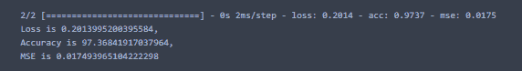

在这里我们可以看到验证准确率为 97%，这是相当不错的。我们来绘制更多图表以获得更直观的感觉。

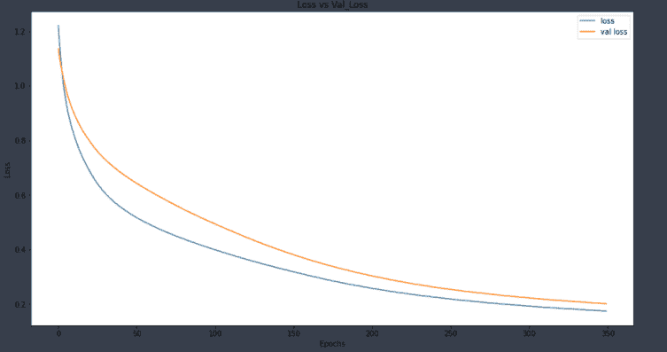

在这里我们可以看到，我们没有过拟合数据。让我们绘制准确率。

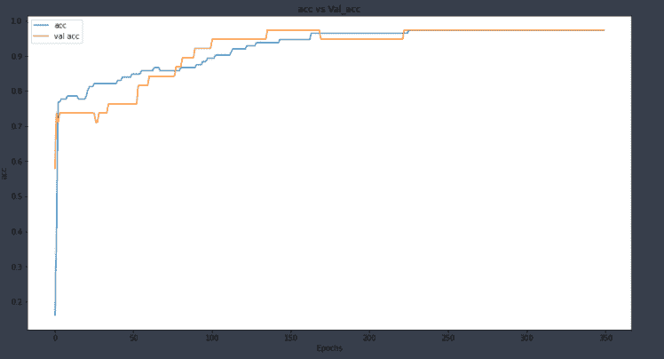

在仅一层中添加“L2”正则化大大改善了我们的模型。

现在让我们在所有其他层中添加**L2**。

```py
model6 = Sequential([
    Dense(512, activation='tanh', input_shape = X_train[0].shape, kernel_regularizer='l2'),
    Dense(512//2, activation='tanh', kernel_regularizer='l2'),
    Dense(512//4, activation='tanh', kernel_regularizer='l2'),
    Dense(512//8, activation='tanh', kernel_regularizer='l2'),
    Dense(32, activation='relu', kernel_regularizer='l2'),
    Dense(3, activation='softmax')
])
model6.compile(optimizer='sgd',loss='categorical_crossentropy', metrics=['acc', 'mse'])
hist6 = model6.fit(X_train, y_train, epochs=350, batch_size=128, validation_data=(X_test,y_test), verbose=2)

```

现在我们在所有层中添加了 L2。训练后，我们来评估一下。

```py
loss6, acc6, mse6 = model6.evaluate(X_test, y_test)
print(f"Loss is {loss6},\nAccuracy is {acc6 * 100},\nMSE is {mse6}")

```

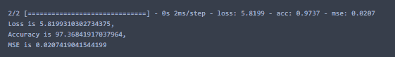

让我们绘图以获得更多直观感受。

```py
plt.figure(figsize=(15,8))
plt.plot(hist6.history['loss'], label = 'loss')
plt.plot(hist6.history['val_loss'], label='val loss')
plt.title("Loss vs Val_Loss")
plt.xlabel("Epochs")
plt.ylabel("Loss")
plt.legend()
plt.show()

```

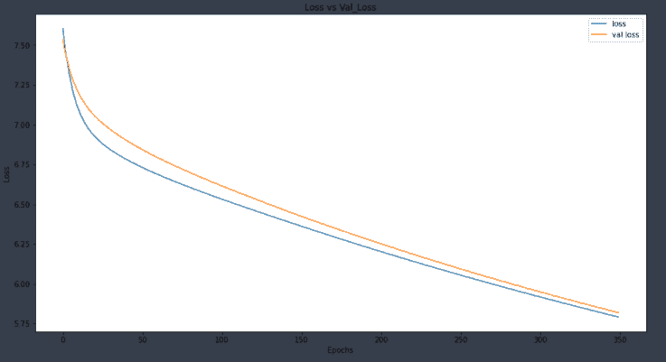

对于准确率

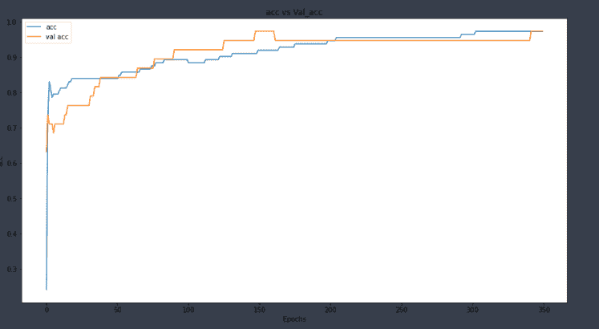

我们可以看到这个模型也表现良好，并没有过拟合数据集。

### 丢弃法

另一种常见的正则化方法是使用丢弃法。使用丢弃法的主要思想是根据一定的概率随机关闭我们层中的一些神经元。你可以通过教授 NG 的视频了解更多关于它的工作原理，[这里](https://www.youtube.com/watch?v=ARq74QuavAo)。

让我们在 TensorFlow 中编写代码。

之前的导入都是一样的，我们这里只是添加了一个额外的导入。

为了实现丢弃法，我们只需从*tf.keras.layers*中添加一个*Dropout*层并设置丢弃率。

```py
import tensorflow as tf
model7 = Sequential([
    Dense(512, activation='tanh', input_shape = X_train[0].shape),
    tf.keras.layers.Dropout(0.5), #dropout with 50% rate
    Dense(512//2, activation='tanh'),

    Dense(512//4, activation='tanh'),
    Dense(512//8, activation='tanh'),
    Dense(32, activation='relu'),
    Dense(3, activation='softmax')
])
model7.compile(optimizer='sgd',loss='categorical_crossentropy', metrics=['acc', 'mse'])
hist7 = model7.fit(X_train, y_train, epochs=350, batch_size=128, validation_data=(X_test,y_test), verbose=2)

```

训练之后，让我们在测试集上进行评估。

```py
loss7, acc7, mse7 = model7.evaluate(X_test, y_test)
print(f"Loss is {loss7},\nAccuracy is {acc7 * 100},\nMSE is {mse7}")

```

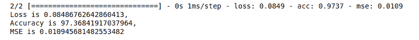

哇，我们的结果非常有希望，我们在测试集上的表现达到了 97%。让我们绘制损失和准确率图，以获得更好的直观感受。

```py
plt.figure(figsize=(15,8))
plt.plot(hist7.history['loss'], label = 'loss')
plt.plot(hist7.history['val_loss'], label='val loss')
plt.title("Loss vs Val_Loss")
plt.xlabel("Epochs")
plt.ylabel("Loss")
plt.legend()
plt.show()

```

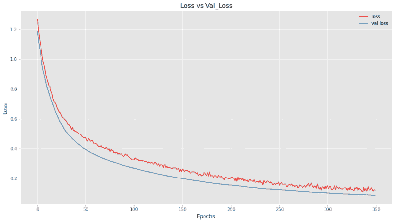

在这里，我们可以看到我们的模型在验证数据上的表现优于训练数据，这真是好消息。

现在让我们绘制准确率图。

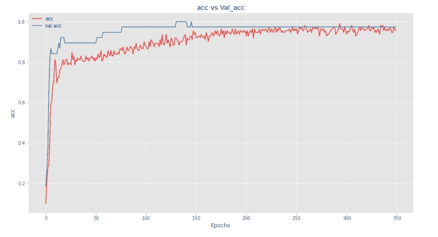

我们可以看到，我们的模型在验证数据集上的表现优于训练集。

让我们添加更多丢弃层来查看我们的模型表现如何。

```py
model8 = Sequential([
    Dense(512, activation='tanh', input_shape = X_train[0].shape),
    tf.keras.layers.Dropout(0.5),
    Dense(512//2, activation='tanh'),
    tf.keras.layers.Dropout(0.5),
    Dense(512//4, activation='tanh'),
    tf.keras.layers.Dropout(0.5),
    Dense(512//8, activation='tanh'),
    tf.keras.layers.Dropout(0.3),
    Dense(32, activation='relu'),
    Dense(3, activation='softmax')
])
model8.compile(optimizer='sgd',loss='categorical_crossentropy', metrics=['acc', 'mse'])
hist8 = model8.fit(X_train, y_train, epochs=350, batch_size=128, validation_data=(X_test,y_test), verbose=2)

```

让我们评估一下。

```py
loss8, acc8, mse8 = model8.evaluate(X_test, y_test)
print(f"Loss is {loss8},\nAccuracy is {acc8 * 100},\nMSE is {mse8}")

```


这个模型也非常好，因为它在测试集上的表现达到了 98%。让我们绘图以获得更好的直观感受。

```py
plt.figure(figsize=(15,8))
plt.plot(hist8.history['loss'], label = 'loss')
plt.plot(hist8.history['val_loss'], label='val loss')
plt.title("Loss vs Val_Loss")
plt.xlabel("Epochs")
plt.ylabel("Loss")
plt.legend()
plt.show()

```

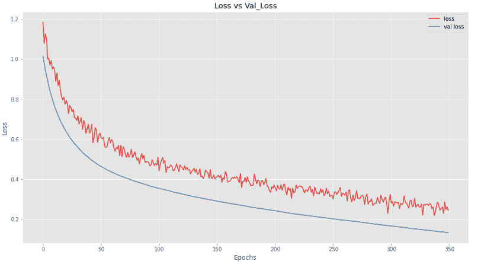

我们可以看到，添加更多丢弃层会使模型在训练时表现稍逊，但在验证集上，它表现得非常好。

现在让我们绘制准确率图。

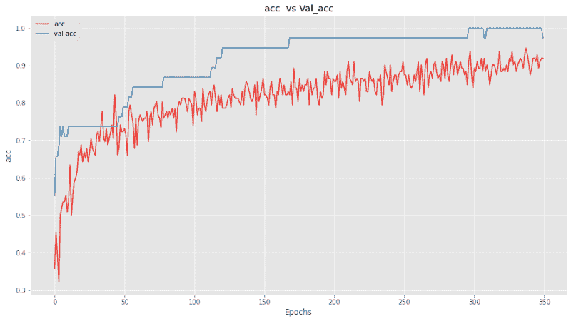

我们在这里看到相同的模式，即我们的模型在训练时表现不佳，但在评估时表现非常好。

### 批量归一化

批量归一化的主要思想是我们通过使用几种技术（在我们的案例中是*sklearn.preprocessing.StandardScaler*）对输入层进行归一化，从而提高模型性能。如果输入层通过归一化受益，那为何不对隐藏层进行归一化，以进一步提高和加快学习呢？

要学习数学并获得更多直观感受，我会再次引导你到教授 NG 的讲座，[这里](https://www.youtube.com/watch?v=tNIpEZLv_eg)和[这里](https://www.youtube.com/watch?v=nUUqwaxLnWs)。

要在你的 TensorFlow 模型中添加它，只需在你的层后面添加*tf.keras.layers.BatchNormalization()*。

让我们看看代码。

```py
model9 = Sequential([
    Dense(512, activation='tanh', input_shape = X_train[0].shape),
    Dense(512//2, activation='tanh'),
    tf.keras.layers.BatchNormalization(),
    Dense(512//4, activation='tanh'),
    Dense(512//8, activation='tanh'),
    Dense(32, activation='relu'),
    Dense(3, activation='softmax')
])
model9.compile(optimizer='sgd',loss='categorical_crossentropy', metrics=['acc', 'mse'])
hist9 = model9.fit(X_train, y_train, epochs=350,  validation_data=(X_test,y_test), verbose=2)

```

在这里，如果你注意到我已经去掉了*batch_size*选项。这是因为在仅使用*tf.keras.BatchNormalization()*作为正则化时，添加*batch_size*参数会导致模型性能非常差。我尝试在网上寻找原因，但未能找到。如果你真的想在训练时使用*batch_size*，也可以将优化器从*sgd*更改为*rmsprop*或*adam*。

训练后，让我们评估模型。

```py
loss9, acc9, mse9 = model9.evaluate(X_test, y_test)
print(f"Loss is {loss9},\nAccuracy is {acc9 * 100},\nMSE is {mse9}")

```

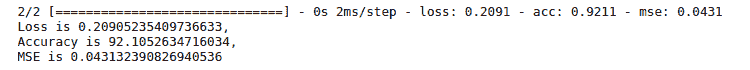

对于一个批量归一化的准确性，其验证准确性不如其他技术。让我们绘制损失和准确性图，以获得更好的直观感受。

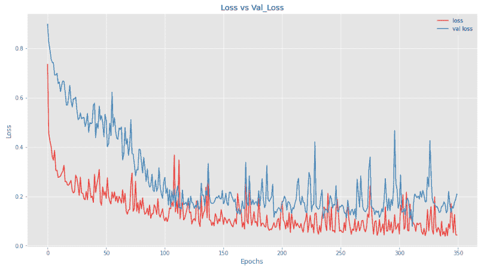

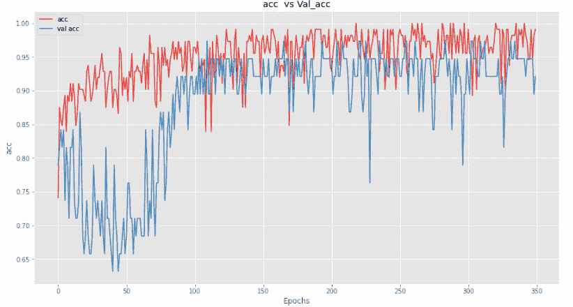

在这里，我们可以看到我们的模型在验证集上的表现不如在测试集上的表现。让我们将归一化添加到所有层中以查看结果。

```py
model11 = Sequential([
    Dense(512, activation='tanh', input_shape = X_train[0].shape),
    tf.keras.layers.BatchNormalization(),
    Dense(512//2, activation='tanh'),
    tf.keras.layers.BatchNormalization(),
    Dense(512//4, activation='tanh'),
    tf.keras.layers.BatchNormalization(),
    Dense(512//8, activation='tanh'),
    tf.keras.layers.BatchNormalization(),
    Dense(32, activation='relu'),
    tf.keras.layers.BatchNormalization(),
    Dense(3, activation='softmax')
])
model11.compile(optimizer='sgd',loss='categorical_crossentropy', metrics=['acc', 'mse'])
hist11 = model11.fit(X_train, y_train, epochs=350,  validation_data=(X_test,y_test), verbose=2)

```

让我们来评估一下。

```py
loss11, acc11, mse11 = model11.evaluate(X_test, y_test)
print(f"Loss is {loss11},\nAccuracy is {acc11 * 100},\nMSEis {mse11}")

```

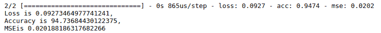

通过在每一层中添加批量归一化，我们实现了良好的准确性。让我们绘制损失和准确性图。

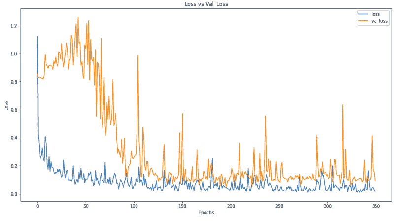

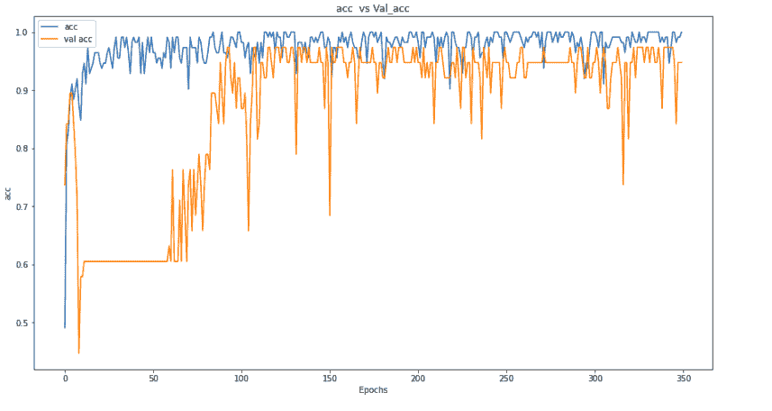

通过绘制准确性和损失，我们可以看到我们的模型在训练集上的表现仍优于验证集，但仍在提升性能。

### 结果：

这篇文章简要介绍了如何在 TensorFlow 中使用不同的技术。如果你对理论不够了解，我建议你学习 Coursera 深度学习专项课程中的第 2 和第 3 课程，以了解更多关于正则化的内容。

你还需要学习何时使用哪些技术，以及如何将不同技术结合起来，以产生真正有成效的结果。

希望现在你对如何在 TensorFlow 2 中实现不同的正则化技术有了一个概念。

**相关：**

+   [开始使用 TensorFlow 2](https://www.kdnuggets.com/2020/07/getting-started-tensorflow2.html)

+   [深度神经网络中的批量归一化](https://www.kdnuggets.com/2020/08/batch-normalization-deep-neural-networks.html)

+   [深度学习中的过拟合问题](https://www.kdnuggets.com/2019/12/fighting-overfitting-deep-learning.html)

* * *

## 我们的前三大课程推荐

 1\. [Google 网络安全证书](https://www.kdnuggets.com/google-cybersecurity) - 快速进入网络安全职业。

 2\. [Google 数据分析专业证书](https://www.kdnuggets.com/google-data-analytics) - 提升你的数据分析技能

 3\. [Google IT 支持专业证书](https://www.kdnuggets.com/google-itsupport) - 支持你的组织的 IT 需求

* * *

### 更多相关话题

+   [成为伟大的数据科学家所需的 5 项关键技能](https://www.kdnuggets.com/2021/12/5-key-skills-needed-become-great-data-scientist.html)

+   [每个初学者数据科学家应该掌握的 6 种预测模型](https://www.kdnuggets.com/2021/12/6-predictive-models-every-beginner-data-scientist-master.html)

+   [2021 年最佳 ETL 工具](https://www.kdnuggets.com/2021/12/mozart-best-etl-tools-2021.html)

+   [每个数据科学家都应该了解的三个 R 语言库（即使你使用 Python）](https://www.kdnuggets.com/2021/12/three-r-libraries-every-data-scientist-know-even-python.html)

+   [停止学习数据科学以寻找目标，并通过寻找目标来…](https://www.kdnuggets.com/2021/12/stop-learning-data-science-find-purpose.html)

+   [一项 90 亿美元的人工智能失败案例分析](https://www.kdnuggets.com/2021/12/9b-ai-failure-examined.html)
