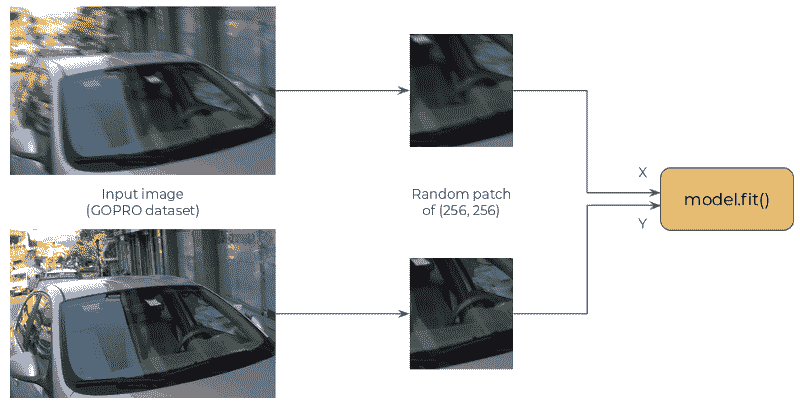
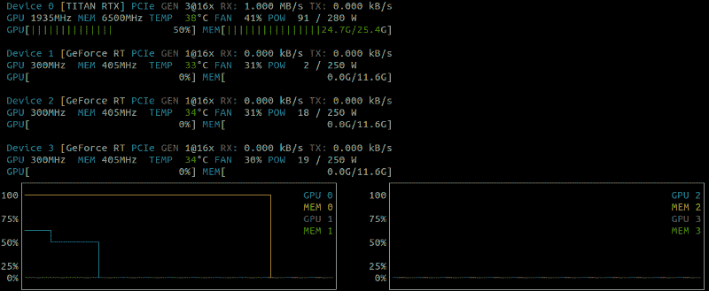
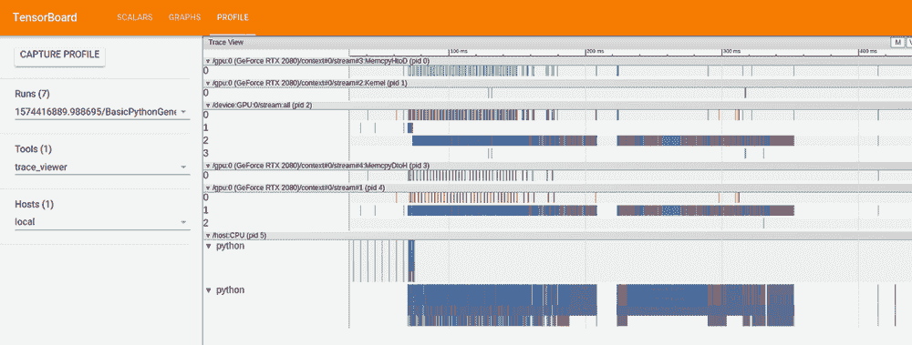
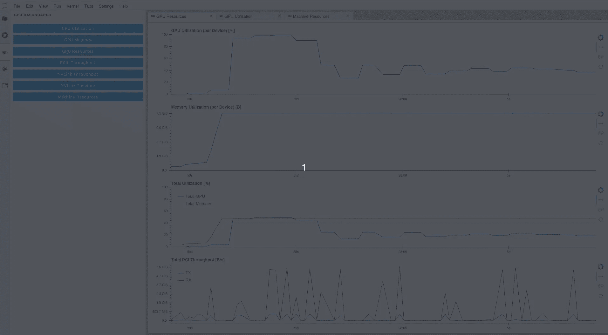
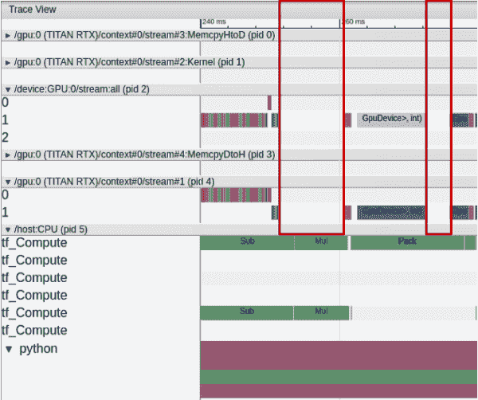
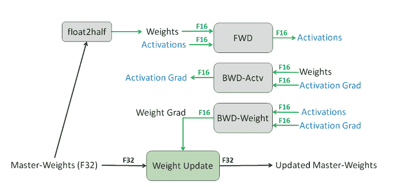
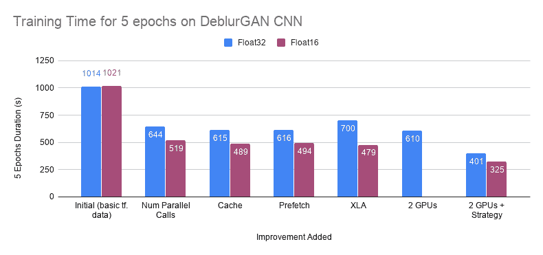

# TensorFlow 2.0 教程：优化训练时间性能

> 原文：[`www.kdnuggets.com/2020/03/tensorflow-optimizing-training-time-performance.html`](https://www.kdnuggets.com/2020/03/tensorflow-optimizing-training-time-performance.html)

评论

**由[Raphael Meudec](https://www.linkedin.com/in/raphaelmeudec)，数据科学家 @ Sicara**

本教程探讨了如何提升你的 TensorFlow 2.0 模型的训练时间性能：

+   tf.data

+   混合精度训练

+   多 GPU 训练策略

* * *

## 我们的前三大课程推荐

 1\. [谷歌网络安全证书](https://www.kdnuggets.com/google-cybersecurity) - 快速进入网络安全职业生涯。

 2\. [谷歌数据分析专业证书](https://www.kdnuggets.com/google-data-analytics) - 提升你的数据分析技能

 3\. [谷歌 IT 支持专业证书](https://www.kdnuggets.com/google-itsupport) - 为你的组织提供 IT 支持

* * *

我将所有这些技巧应用到一个自定义的图像去模糊项目中，结果令人惊讶。根据你当前的流程，你可以获得 2 到 10 倍的训练时间加速。

### 使用案例：提高图像去模糊 CNN 的 TensorFlow 训练时间

2 年前，我在[使用 GANs 在 Keras 中去模糊图像](https://www.sicara.ai/blog/2018-03-20-GAN-with-Keras-application-to-image-deblurring)上发表了一篇博客文章。我觉得将 TF2.0 的代码库传递过来理解变化和对代码的影响是一个不错的过渡。在这篇文章中，我将训练一个更简单版本的模型（仅 CNN 部分）。

模型是一个卷积网络，它接受(256, 256, 3)的模糊补丁，并预测(256, 256, 3)的对应清晰补丁。它基于 ResNet 架构，并且是完全卷积的。

### 步骤 1：识别瓶颈

为了优化训练速度，你希望你的 GPU 以 100%的速度运行。`nvidia-smi`很适合确保你的进程在 GPU 上运行，但当涉及 GPU 监控时，还有更智能的工具。因此，本 TensorFlow 教程的第一步是探索这些更好的选项。

**nvtop**

如果你使用的是 Nvidia 显卡，监控 GPU 利用率的最简单解决方案可能就是`nvtop`。可视化比`nvidia-smi`更友好，你可以随时间跟踪指标。

**TensorBoard Profiler**

只需在 TensorBoard 回调中设置`profile_batch={BATCH_INDEX_TO_MONITOR}`，TF 会添加一个关于 CPU 或 GPU 在给定批次上执行的操作的完整报告。这有助于识别你的 GPU 是否因为数据不足而在某些点停滞。

**[RAPIDS NVDashboard](https://github.com/rapidsai/jupyterlab-nvdashboard)**

这是一个 Jupyterlab 扩展，可以访问各种指标。除了 GPU，你还可以监控来自主板的元素（CPU、磁盘等）。优势在于你不必监控特定的批次，而是查看整个训练过程的性能。

在这里，我们可以很容易地发现 GPU 大部分时间运行在 40% 的速度。我只激活了计算机上的 1 个 GPU，因此总利用率约为 20%。

### 步骤 2：优化你的 tf.data 管道

首要目标是让 GPU 始终 100% 繁忙。为此，我们希望减少数据加载瓶颈。如果你使用的是 Python 生成器或 Keras Sequence，你的数据加载可能并不理想。即使使用 tf.data，数据加载仍然可能是一个问题。在我的文章中，我最初使用 Keras Sequences 加载图像。

你可以使用 TensorBoard 的性能分析功能轻松发现这一现象。GPU 在 CPU 执行多个与数据加载相关的操作时通常会有空闲时间。

从原始 Keras 序列切换到 tf.data 相对容易。数据加载的大部分操作都得到了很好的支持，唯一棘手的部分是要在模糊图像和真实图像上获取相同的补丁。

从 Keras Sequence 切换到 tf.data 可以提高训练时间。从这里，我们添加了一些小技巧，你也可以在 [TensorFlow 文档](https://www.tensorflow.org/guide/data_performance#optimize_performance) 中找到这些技巧：

+   并行化：通过添加 `num_parallel_calls=tf.data.experimental.AUTOTUNE` 参数，使所有 `.map()` 调用并行化。

+   缓存：通过在补丁选择之前缓存数据集，将加载的图像保留在内存中。

+   预取：在前一个批次结束之前开始获取元素。

数据集创建现在看起来是这样的：

这些小变化使得 5 个周期的训练时间从 1000 秒（在 RTX2080 上）下降到 616 秒（完整图表见下）。

### 步骤 3：混合精度训练

默认情况下，我们神经网络训练中使用的所有变量都存储在 float32 中。这意味着每个元素都必须编码为 32 位。[混合精度训练](https://arxiv.org/abs/1710.03740) 的核心概念是：我们不需要始终保持如此高的精度，可以在某些情况下使用 16 位。

在混合精度训练过程中，你保留了权重的 float32 版本，但在 float16 版本的权重上执行前向和后向传递。所有获取梯度的昂贵操作都是使用 float16 元素执行的。最后，你使用 float16 梯度来更新 float32 权重。训练过程中使用了损失缩放以保持训练稳定性。

通过保持 float32 权重，这个过程不会降低你模型的准确性。相反，他们声称在各种任务上有一些性能改进。

从版本 2.1.0 开始，TensorFlow 使得实现变得简单，通过添加不同的 `Policy.` 混合精度训练可以通过在模型实例化之前使用这两行代码来激活。

使用这种方法，我们可以将 5 个 epoch 的训练时间缩短到 480 秒。

### 第四步：多 GPU 策略

最后一部分讨论如何使用 TF2.0 进行多 GPU 训练。如果你不调整你的代码以适应多 GPU，你不会减少 TensorFlow 的训练时间，因为它们不会被有效利用。

执行多 GPU 训练的最简单方法是使用 `MirroredStrategy`。它会在每个 GPU 上实例化你的模型。在每一步，不同的批量数据被发送到 GPUs，这些 GPU 执行反向传播。然后，梯度被聚合以进行权重更新，更新后的值被传播到每个实例化的模型。

分布策略在 TensorFlow 2.0 中仍然相当简单。你只需要考虑将通常的批量大小乘以可用 GPU 的数量。

如果你使用 TPU，可能需要更深入地查看官方的 [Tensorflow 文档教程](https://www.tensorflow.org/api_docs/python/tf/distribute) 关于训练分布。

### 关于提升 TensorFlow 训练时间的技巧总结

所有这些步骤都导致了你模型训练时间的巨大减少。此图跟踪了每次训练管道改进后的 5 个 epoch 训练时间。希望你喜欢这个关于 TensorFlow 训练时间性能的教程。如果你有任何反馈，可以在 Twitter 上@我（@raphaelmeudec）！

tf.data、MPT 和 GPU 策略对训练时间的影响

**个人简介: [Raphael Meudec](https://www.linkedin.com/in/raphaelmeudec)** （[**@raphaelmeudec**](https://twitter.com/raphaelmeudec)）是 Sicara 的数据科学家。

[原文](https://www.sicara.ai/blog/tensorflow-tutorial-training-time)。已获许可转载。

**相关内容：**

+   使用 Keras Tuner 进行超参数调整

+   使用 TensorFlow 简单图像数据集增强

+   转移学习简化：编码强大的技术

### 更多相关内容

+   [优化 Python 代码性能：深入探讨 Python 性能分析器](https://www.kdnuggets.com/2023/02/optimizing-python-code-performance-deep-dive-python-profilers.html)

+   [优化你的 LLM 性能和可扩展性](https://www.kdnuggets.com/optimizing-your-llm-for-performance-and-scalability)

+   [使用大型语言模型时优化性能和成本的策略](https://www.kdnuggets.com/strategies-for-optimizing-performance-and-costs-when-using-large-language-models-in-the-cloud)

+   [使用 TensorFlow 和 Keras 构建和训练你的第一个神经网络](https://www.kdnuggets.com/2023/05/building-training-first-neural-network-tensorflow-keras.html)

+   [利用遗传算法优化基因](https://www.kdnuggets.com/2022/04/optimizing-genes-genetic-algorithm.html)

+   [优化数据存储：探索 SQL 中的数据类型和规范化](https://www.kdnuggets.com/optimizing-data-storage-exploring-data-types-and-normalization-in-sql)
