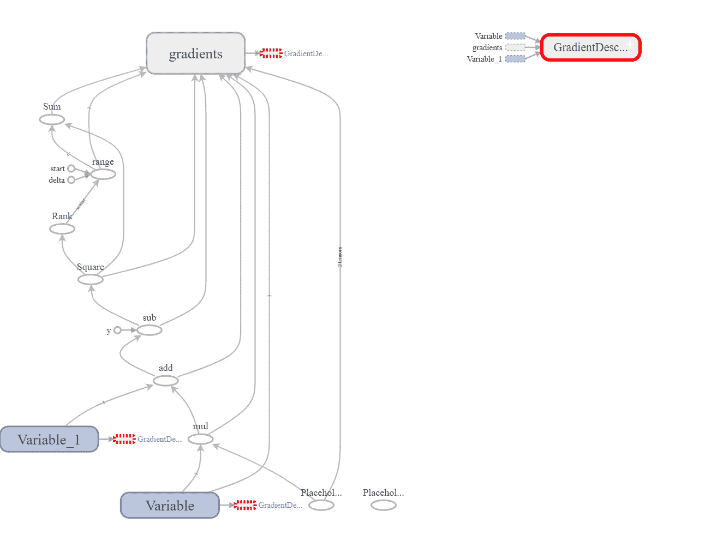

# TensorFlow：优化哪些参数？

> 原文：[`www.kdnuggets.com/2017/11/tensorflow-parameters-optimize.html`](https://www.kdnuggets.com/2017/11/tensorflow-parameters-optimize.html)


本文针对的是对 TensorFlow Core API 有基本了解的读者。

学习 TensorFlow Core API，即 TensorFlow 中的最低级 API，是开始学习 TensorFlow 的一个很好的步骤，因为它可以让你理解库的核心。以下是一个非常简单的 TensorFlow Core API 示例，其中我们创建并训练一个线性回归模型。

步骤如下：

1.  读取模型的可训练参数（在此示例中只有一个权重和一个偏置）。

1.  将训练数据读取到占位符中。

1.  创建线性回归模型函数。

1.  创建一个损失函数来评估模型的预测误差。

1.  创建一个 TensorFlow 会话。

1.  初始化可训练参数。

1.  运行会话以训练回归模型。

```py

1.  import tensorflow  
2.    
3.  #Trainable Parameters  
4.  W = tensorflow.Variable([.6], dtype=tensorflow.float32)  
5.  b = tensorflow.Variable([.2], dtype=tensorflow.float32)  
6.    
7.  #Training Data (inputs/outputs)  
8.  x = tensorflow.placeholder(dtype=tensorflow.float32)  
9.  y = tensorflow.placeholder(dtype=tensorflow.float32)  
10\.   
11\. #Linear Model  
12\. linear_model = W * x + b  
13\.  
14\. #Linear Regression Loss Function - sum of the squares  
15\. squared_deltas = tensorflow.square(linear_model - y)  
16\. loss = tensorflow.reduce_sum(squared_deltas)  
17\.   
18\. #Creating a session 
19\. sess = tensorflow.Session()  
20\.   
21\. #Initializing variables  
22\. init = tensorflow.global_variables_initializer()  
23\. sess.run(init)  
24\.   
25\. #Print the loss  
26\. print(sess.run(loss, feed_dict={ x: [1, 2, 3, 4], y: [0, 1, 2, 3]}))  
27\.   
28\. sess.close()

```

返回的损失为 53.76。存在误差，特别是对于较大的误差，意味着必须更新所用的参数。这些参数预计会自动更新，但我们可以开始手动更新，直到误差为零。

+   对于 W=0.8 和 b=0.4，损失为 3.44。

+   对于 W=1.0 和 b=0.8，损失为 12.96。

+   对于 W=1.0 和 b=-0.5，损失为 1.0。

+   对于 W=1.0 和 b=-1.0，损失为 0.0。

因此，当 W=1.0 和 b=-1.0 时，期望结果与预测结果一致，因此我们不能进一步提高模型性能。我们已达到参数的最佳值，但不是使用最佳方式。计算参数的最佳方式是自动的。

TensorFlow 中已经存在多种优化器，用于简化操作。这些优化器存在于 TensorFlow 的 API 中，例如：

+   tensorflow.train

+   tensorflow.estimator

以下是如何使用 tensorflow.train 自动更新参数的方法。

### **tensorflow.train API**

TensorFlow 提供了多种优化器，这些优化器能够自动完成之前手动计算模型参数最佳值的工作。

最简单的优化器是梯度下降法，它通过缓慢改变每个参数的值，直到达到最小化损失的值。梯度下降法根据损失对变量的导数的大小来调整每个变量。

由于计算导数的操作复杂且容易出错，TensorFlow 可以自动计算梯度。在计算梯度后，你需要自行优化参数。

但 TensorFlow 通过提供优化器，使得事情变得越来越简单，这些优化器除了优化参数外，还会计算导数。

tensorflow.train API 包含一个名为 GradientDescentOptimizer 的类，它既可以计算导数，又可以优化参数。例如，以下代码展示了如何使用 GradientDescentOptimizer 最小化损失：

```py

1.  import tensorflow  
2.    
3.  #Trainable Parameters  
4.  W = tensorflow.Variable([0.3], dtype=tensorflow.float32)  
5.  b = tensorflow.Variable([-0.2], dtype=tensorflow.float32)  
6.    
7.  #Training Data (inputs/outputs)  
8.  x = tensorflow.placeholder(dtype=tensorflow.float32)  
9.  y = tensorflow.placeholder(dtype=tensorflow.float32)  
10\.   
11\. x_train = [1, 2, 3, 4]  
12\. y_train = [0, 1, 2, 3]  
13\.   
14\. #Linear Model  
15\. linear_model = W * x + b  
16\.   
17\. #Linear Regression Loss Function - sum of the squares  
18\. squared_deltas = tensorflow.square(linear_model - y_train)  
19\. loss = tensorflow.reduce_sum(squared_deltas)  
20\.   
21\. #Gradient descent optimizer  
22\. optimizer = tensorflow.train.GradientDescentOptimizer(learning_rate=0.01)  
23\. train = optimizer.minimize(loss=loss)  
24\.   
25\. #Creating a session 
26\. sess = tensorflow.Session()  
27\.   
28\. writer = tensorflow.summary.FileWriter("/tmp/log/", sess.graph)  
29\.   
30\. #Initializing variables  
31\. init = tensorflow.global_variables_initializer()  
32\. sess.run(init)  
33\.   
34\. #Optimizing the parameters  
35\. for i in range(1000):  
36\.     sess.run(train, feed_dict={x: x_train, y: y_train})  
37\.   
38\. #Print the parameters and loss  
39\. curr_W, curr_b, curr_loss = sess.run([W, b, loss], {x: x_train, y: y_train})  
40\. print("W : ", curr_W, ", b : ", curr_b, ", loss : ", curr_loss)  
41\.   
42\. writer.close()  
43\.   
44\. sess.close()  

```

这是优化器返回的结果。它似乎自动推导出了正确的参数值，以获得最小损失。

```py

W :  [ 0.99999809] , b :  [-0.9999944] , loss :  2.05063e-11

```

使用这样的内置优化器有一些优势，而不是手动构建它。这是因为使用 TensorFlow Core API 创建这样简单的线性回归模型的代码并不复杂。但当处理更复杂的模型时情况并非如此。因此，建议使用 TensorFlow 中的高级 API 来完成经常使用的任务。

这是使用 TensorBoard (TB)可视化的前一个程序的数据流图。



但有一个非常重要的问题。**优化器是如何推导出应当改变哪些参数的？它是如何推导出我们需要优化权重（W）和偏置（b）的？**我们没有明确告诉优化器这些是它将改变的参数以减少损失，但它自己推导了出来。**那它是如何做到的？**

在第 35 行，我们运行会话并要求评估训练 Tensor。TensorFlow 会按照图节点链评估该 Tensor。在第 23 行，TensorFlow 发现要评估训练 Tensor，它需要评估 optimizer.minimize 操作。该操作将尽可能地最小化其输入参数。

追溯回来，为了评估最小化操作，它将接受一个 Tensor，即损失。因此，现在的目标是最小化损失 Tensor。但如何最小化损失？它仍然会沿着图回溯，并发现它是通过 tensorflow.reduce_sum()操作进行评估的。因此，我们现在的目标是最小化 tensorflow.reduce_sum()操作的结果。

追溯回来，这个操作是使用一个 Tensor 作为输入进行评估的，即 squared_deltas。因此，我们现在的目标是最小化 squared_deltas Tensor，而不是最小化 tensorflow.reduce_sum()操作。

沿着链回溯，我们发现 squared_deltas Tensor 依赖于 tensorflow.square()操作。因此，我们应该最小化 tensorflow.square()操作。最小化该操作将要求我们最小化其输入 Tensors，即 linear_model 和 y_train。查看这两个 Tensor，哪个可以被修改？可以修改的 Tensor 是 Variables 类型的。由于 y_train 不是 Variable 而是 placeholder，因此我们不能修改它，因此我们可以修改 linear_model 来最小化结果。

在第 15 行，linear_model Tensor 是基于三个输入计算的，即 W、x 和 b。查看这些 Tensors，只有 W 和 x 可以被改变，因为它们是变量。因此，我们的目标是最小化这两个 Tensors W 和 x。

这就是 TensorFlow 推导出要最小化损失应当最小化权重和偏置参数的方法。

**简历：[Ahmed Gad](https://www.linkedin.com/in/ahmedfgad/)** 于 2015 年 7 月获得埃及门努菲亚大学计算机与信息学院信息技术学士学位，并以优异成绩获得荣誉。由于在学院排名第一，他被推荐于 2015 年在埃及的一所学院担任助教，随后在 2016 年继续在学院担任助教及研究员。他当前的研究兴趣包括深度学习、机器学习、人工智能、数字信号处理和计算机视觉。

[原文](https://www.linkedin.com/pulse/tensorflow-what-hyperparameters-optimize-ahmed-gad/)。经许可转载。

**相关内容：**

+   TensorFlow：逐步构建前馈神经网络

+   5 个免费资源，帮助你深入理解深度学习

+   7 种用于自然语言处理的人工神经网络类型

* * *

## 我们的前 3 个课程推荐

 1\. [谷歌网络安全证书](https://www.kdnuggets.com/google-cybersecurity) - 快速迈向网络安全职业生涯。

 2\. [谷歌数据分析专业证书](https://www.kdnuggets.com/google-data-analytics) - 提升你的数据分析技能

 3\. [谷歌 IT 支持专业证书](https://www.kdnuggets.com/google-itsupport) - 支持你所在组织的 IT 需求

* * *

### 更多相关话题

+   [在 PyTorch 中调整 Adam 优化器参数](https://www.kdnuggets.com/2022/12/tuning-adam-optimizer-parameters-pytorch.html)

+   [优化和管理机器学习生命周期的十大 MLOps 工具](https://www.kdnuggets.com/2022/10/top-10-mlops-tools-optimize-manage-machine-learning-lifecycle.html)

+   [如何优化 SQL 查询以加快数据检索速度](https://www.kdnuggets.com/2023/06/optimize-sql-queries-faster-data-retrieval.html)

+   [如何优化 Dockerfile 指令以加快构建时间](https://www.kdnuggets.com/how-to-optimize-dockerfile-instructions-for-faster-build-times)

+   [TensorFlow 在计算机视觉中的应用 - 转移学习简化](https://www.kdnuggets.com/2022/01/tensorflow-computer-vision-transfer-learning-made-easy.html)

+   [Tensorflow 的“Hello World”](https://www.kdnuggets.com/2022/05/hello-world-tensorflow.html)
