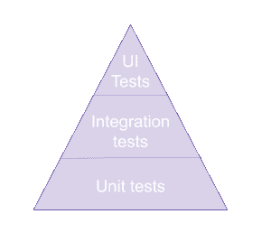
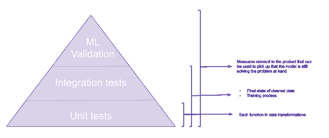

# 测试你的机器学习管道

> 原文：[`www.kdnuggets.com/2019/11/testing-machine-learning-pipelines.html`](https://www.kdnuggets.com/2019/11/testing-machine-learning-pipelines.html)

评论

**由 [Kristina Young](https://www.linkedin.com/in/kristina-georgieva/)，高级数据科学家**

说到数据产品，很多时候存在一种误解，即这些产品无法通过自动化测试。虽然由于其实验性和随机性，管道中的某些部分无法通过*传统*测试方法，但大部分管道是可以的。此外，更多不可预测的算法可以通过专门的验证过程来测试。

让我们看看传统的测试方法以及如何将这些方法应用于我们的数据/机器学习管道。

### 测试金字塔

你的标准简化测试金字塔如下所示：



这个金字塔表示了你为应用程序编写的测试类型。我们从大量的单元测试开始，测试单一功能是否与其他功能隔离。然后我们编写集成测试，检查将隔离的组件结合在一起是否按预期工作。最后，我们编写 UI 或验收测试，检查应用程序从用户的角度是否按预期工作。

在数据产品方面，金字塔并没有太大区别。我们有大致相同的层级。



请注意，UI 测试仍然会在产品中进行，但这篇博客文章关注的是与数据管道最相关的测试。

让我们更详细地了解每个部分在机器学习中的含义，并借助一些科幻作者的帮助。

### 单元测试

*“这是一个将你的想法与宇宙进行对比的系统，看看它们是否匹配” —— 艾萨克·阿西莫夫。*

数据管道中的大部分代码由数据清理过程组成。用于数据清理的每个函数都有一个明确的目标。例如，假设我们为模型选择的一个特征是前一天和当前一天之间值的变化。我们的代码可能如下所示：

```py
def add_difference(asimov_dataset):
    asimov_dataset['total_naughty_robots_previous_day'] =        
        asimov_dataset['total_naughty_robots'].shift(1)

    asimov_dataset['change_in_naughty_robots'] =    
        abs(asimov_dataset['total_naughty_robots_previous_day'] -
            asimov_dataset['total_naughty_robots'])

    return asimov_dataset[['total_naughty_robots', 'change_in_naughty_robots', 
        'robot_takeover_type']]
```

在这里，我们知道对于给定的输入，我们期望得到特定的输出，因此我们可以用以下代码来测试：

```py
import pandas as pd
from pandas.testing import assert_frame_equal
import numpy as np
from unittest import TestCase

def test_change():
    asimov_dataset_input = pd.DataFrame({
        'total_naughty_robots': [1, 4, 5, 3],
        'robot_takeover_type': ['A', 'B', np.nan, 'A']
    })

    expected = pd.DataFrame({
        'total_naughty_robots': [1, 4, 5, 3],
        'change_in_naughty_robots': [np.nan, 3, 1, 2],
        'robot_takeover_type': ['A', 'B', np.nan, 'A']
    })

    result = add_difference(asimov_dataset_input)

    assert_frame_equal(expected, result)
```

对于每个独立的功能，你应该编写一个单元测试，确保数据转换过程中的每个部分对数据产生了预期的效果。对于每个功能，你还应该考虑不同的场景（是否有条件语句？如果有，则应测试所有条件）。这些测试将作为你持续集成（CI）管道的一部分在每次提交时运行。

除了检查代码是否按预期工作外，单元测试还在调试问题时给予我们帮助。通过添加一个能够重现新发现的错误的测试，我们可以确保在我们认为错误已经修复时，该错误已经被修复，并且我们可以确保该错误不会再次发生。

最后，这些测试不仅检查代码是否按预期工作，还帮助我们记录创建功能时的期望。

### 集成测试

*因为 “无云的眼睛更好，不管它看到什么。” Frank Herbert*

这些测试旨在确定单独开发的模块在结合在一起时是否按预期工作。就数据管道而言，这些测试可以检查：

+   数据清理过程产生了适合模型的数据集

+   模型训练能够处理提供给它的数据并输出结果（确保代码在未来可以重构）

所以，如果我们拿上面的单元测试函数，并添加以下两个函数：

```py
def remove_nan_size(asimov_dataset):
    return asimov_dataset.dropna(subset=['robot_takeover_type'])

def clean_data(asimov_dataset):
    asimov_dataset_with_difference = add_difference(asimov_dataset)
    asimov_dataset_without_na = remove_nan_size(asimov_dataset_with_difference)

    return asimov_dataset_without_na
```

然后我们可以测试将*clean_data*内部的函数组合起来是否会产生预期的结果，代码如下：

```py
def test_cleanup():
    asimov_dataset_input = pd.DataFrame({
        'total_naughty_robots': [1, 4, 5, 3],
        'robot_takeover_type': ['A', 'B', np.nan, 'A']
    })

    expected = pd.DataFrame({
        'total_naughty_robots': [1, 4, 3],
        'change_in_naughty_robots': [np.nan, 3, 2],
        'robot_takeover_type': ['A', 'B', 'A']
    }).reset_index(drop=True)

    result = clean_data(asimov_dataset_input).reset_index(drop=True)

    assert_frame_equal(expected, result)
```

现在假设我们要做的下一步是将上述数据输入到逻辑回归模型中。

```py
from sklearn.linear_model import LogisticRegression

def get_reression_training_score(asimov_dataset, seed=9787):
    clean_set = clean_data(asimov_dataset).dropna()

    input_features = clean_set[['total_naughty_robots', 
        'change_in_naughty_robots']]
    labels = clean_set['robot_takeover_type']

    model = LogisticRegression(random_state=seed).fit(input_features, labels)
    return model.score(input_features, labels) * 100
```

虽然我们不知道期望值，但我们可以确保总是得到相同的值。测试这种集成对我们很有用，以确保：

+   数据可以被模型使用（每个输入都有标签，数据类型被选择的模型接受等）

+   我们能够在未来重构我们的代码，而不会破坏端到端的功能。

通过为随机生成器提供相同的种子，我们可以确保结果始终相同。所有主要的库都允许你设置种子（Tensorflow 有点特殊，因为它要求你通过 numpy 设置种子，请记住这一点）。测试可以如下所示：

```py
from numpy.testing import assert_equal

def test_regression_score():
    asimov_dataset_input = pd.DataFrame({
        'total_naughty_robots': [1, 4, 5, 3, 6, 5],
        'robot_takeover_type': ['A', 'B', np.nan, 'A', 'D', 'D']
    })

    result = get_reression_training_score(asimov_dataset_input, seed=1234)
    expected = 40.0

    assert_equal(result, 50.0)
```

这类测试不会像单元测试那样多，但它们仍会成为你 CI 管道的一部分。你会使用这些测试来检查组件的端到端功能，因此会测试更主要的场景。

### 机器学习验证

*为什么？“展现了知道错误问题答案的完美无用性。” Ursula K. Le Guin.*

现在我们已经测试了我们的代码，我们还需要测试机器学习组件是否解决了我们要解决的问题。当我们谈论产品开发时，机器学习模型的原始结果（无论基于统计方法的准确度如何）几乎从来不是期望的最终输出。这些结果通常会与其他业务规则结合，然后才会被用户或其他应用程序使用。因此，我们需要验证模型是否解决了用户的问题，而不仅仅是准确度/F1 分数/其他统计指标是否足够高。

这对我们有什么帮助？

+   它确保模型实际帮助产品解决当前的问题

    +   例如，一个将蛇咬伤分类为致命或非致命的模型，如果 20%的错误导致患者未能得到所需治疗，那么这个模型并不好。

+   确保模型产生的值在行业中是合理的

    +   例如，一个以 70%准确率预测价格变化的模型，如果最终显示给用户的价格值在该行业/市场中过低或过高，则不是一个好的模型。

+   它提供了决策记录的额外文档层次，帮助后来加入团队的工程师。

+   它以一种客户、产品经理和工程师都能理解的共同语言提供了产品中机器学习组件的可见性。

这种验证应定期进行（通过 CI 管道或 cron 作业），其结果应向组织公开。这确保数据科学组件的进展对组织可见，并确保由于更改或陈旧数据引起的问题能尽早被发现。

### 结论

*毕竟，“魔法只是我们尚未理解的科学”——阿瑟·克拉克。*

机器学习组件可以通过各种方式进行测试，带来以下优势：

+   采用数据驱动的方法，以确保代码的行为符合预期

+   确保我们能够重构和清理代码，而不破坏产品的功能

+   记录功能、决策和以前的错误

+   提供产品中机器学习组件的进展和状态的可见性

所以不要害怕，如果你有编写代码的技能，你也具备编写测试的技能，并获得上述所有优势????。

再见，谢谢你的所有测试！

**个人简介：[Kristina Young](https://www.linkedin.com/in/kristina-georgieva/)** 是 BCG Digital Ventures 的高级数据科学家。她曾在 SoundCloud 担任推荐团队的后端和数据工程师。她的以往经验包括顾问和研究员。她在过去曾担任过后端、网页和移动开发人员，涉及各种技术。

[原文](https://intothedepthsofdataengineering.wordpress.com/2019/07/18/testing-your-machine-learning-ml-pipelines/)。经许可转载。

**相关：**

+   5 步指南：使用 d6tflow 构建可扩展的深度学习管道

+   我如何在机器学习中变得更好

+   数据管道、Luigi、Airflow：你需要知道的一切

* * *

## 我们的前三个课程推荐

 1\. [Google 网络安全证书](https://www.kdnuggets.com/google-cybersecurity) - 快速进入网络安全职业生涯。

 2\. [谷歌数据分析专业证书](https://www.kdnuggets.com/google-data-analytics) - 提升你的数据分析技能

 3\. [谷歌 IT 支持专业证书](https://www.kdnuggets.com/google-itsupport) - 支持你的组织的 IT

* * *

### 更多相关话题

+   [假设测试和 A/B 测试](https://www.kdnuggets.com/hypothesis-testing-and-ab-testing)

+   [通过 Scikit-learn Pipelines 简化你的机器学习工作流程](https://www.kdnuggets.com/streamline-your-machine-learning-workflow-with-scikit-learn-pipelines)

+   [机器学习的有效测试](https://www.kdnuggets.com/2022/01/effective-testing-machine-learning.html)

+   [机器学习中训练数据和测试数据的区别](https://www.kdnuggets.com/2022/08/difference-training-testing-data-machine-learning.html)

+   [使用 DeepChecks 的机器学习测试初学者指南](https://www.kdnuggets.com/beginners-guide-to-machine-learning-testing-with-deepchecks)

+   [使用 HuggingFace Pipelines 和 Streamlit 回答问题](https://www.kdnuggets.com/2021/10/simple-question-answering-web-app-hugging-face-pipelines.html)
