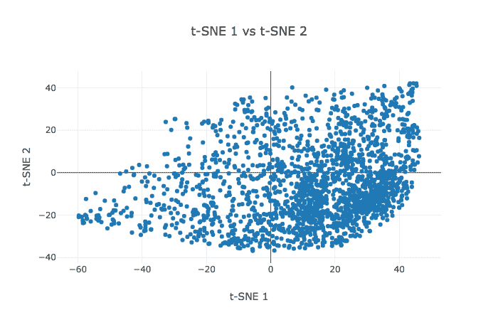

# 文本分类与嵌入可视化，使用 LSTMs、CNNs 和预训练词向量

> 原文：[`www.kdnuggets.com/2018/07/text-classification-lstm-cnn-pre-trained-word-vectors.html`](https://www.kdnuggets.com/2018/07/text-classification-lstm-cnn-pre-trained-word-vectors.html)

 评论

**由[Sabber Ahamed](https://www.linkedin.com/in/sabber-ahamed/)，计算地球物理学家和机器学习爱好者**

> **编辑注释：** 本文总结了该系列中目前已发布的 3 篇文章，而第四篇最终篇章即将发布。

在本教程中，我对[Yelp round-10 评论数据集](https://www.yelp.com/dataset/)进行了分类。这些评论包含大量可以挖掘的元数据，用于推断意义、业务属性和情感。为了简单起见，我将评论分为两类：正面或负面。星级高于三的评论被认为是正面的，而星级小于或等于 3 的评论则为负面。因此，这个问题是一个监督学习问题。为了构建和训练模型，我首先清理文本并将其转换为序列。每条评论的字数限制为 50 个单词。结果是，少于 50 个单词的短文本会用零填充，而较长的文本则会被截断。在处理完评论后，我用三种不同的方法训练了三个模型，并获得了三种词嵌入。

[**第一部分：使用 LSTM 进行文本分类并可视化词嵌入**](https://medium.com/@sabber/classifying-yelp-review-comments-using-lstm-and-word-embeddings-part-1-eb2275e4066b)

在这一部分，我构建了一个神经网络，使用 LSTM 和词嵌入在分类问题上进行训练。

网络从一个嵌入层开始。这个层允许系统将每个标记扩展为更大的向量，使得网络能够以有意义的方式表示一个词。该层的第一个参数是 20000，即我们的词汇表大小，第二个参数是 100，即嵌入的维度。第三个参数是 50，即每个评论序列的长度。

**[第二部分：使用 CNN、LSTM 进行文本分类并可视化词嵌入](https://medium.com/@sabber/classifying-yelp-review-comments-using-cnn-lstm-and-visualize-word-embeddings-part-2-ca137a42a97d)**

在这一部分，我在 LSTM 层上添加了一个额外的 1D 卷积层，以减少训练时间。

LSTM 模型表现良好。然而，训练三个 epoch 的时间非常长。加快训练速度的一种方法是通过增加“卷积”层来改进网络。卷积神经网络（CNN）起源于图像处理。它们在数据上应用“滤波器”并计算更高层次的表示。尽管 CNN 没有 LSTM 的序列处理能力，但它们在文本处理上表现出意外的好效果。

**[第三部分：使用 CNN、LSTM 和预训练 Glove 词嵌入进行文本分类](https://medium.com/@sabber/classifying-yelp-review-comments-using-cnn-lstm-and-pre-trained-glove-word-embeddings-part-3-53fcea9a17fa)**

在第三部分中，我使用与第二部分相同的网络架构，但使用预训练的 100 维 Glove 词嵌入作为初始输入。

在这一小节中，我想使用预训练的 Glove 词嵌入。它是在一个包含十亿个标记（单词）和 40 万个单词词汇的数据集上训练的。Glove 提供了包括 50、100、200 和 300 维的嵌入向量。我选择了 100 维的版本。我还希望看到模型的表现，假设学习到的单词权重没有更新。因此，我将模型的可训练属性设置为 False。

**第四部分：（尚未发布）**

在第四部分中，我使用 word2vec 学习词嵌入。

**简介：[Sabber Ahamed](https://www.linkedin.com/in/sabber-ahamed/)** 是 [xoolooloo.com](https://www.xoolooloo.com/) 的创始人。计算地球物理学家和机器学习爱好者。

**相关：**

+   自然语言处理精华：NLP 入门

+   关于神经网络和词嵌入在自然语言处理中的贡献

+   使用深度卷积神经网络检测讽刺

* * *

## 我们的前三大课程推荐

 1\. [Google 网络安全证书](https://www.kdnuggets.com/google-cybersecurity) - 快速进入网络安全职业生涯。

 2\. [Google 数据分析专业证书](https://www.kdnuggets.com/google-data-analytics) - 提升你的数据分析技能

 3\. [Google IT 支持专业证书](https://www.kdnuggets.com/google-itsupport) - 为你的组织提供 IT 支持

* * *

### 更多相关内容

+   [使用卷积神经网络（CNNs）进行图像分类](https://www.kdnuggets.com/2022/05/image-classification-convolutional-neural-networks-cnns.html)

+   [LSTM 再次崛起：扩展型 LSTM 模型挑战 Transformer 的优势](https://www.kdnuggets.com/lstms-rise-again-extended-lstm-models-challenge-the-transformer-superiority)

+   [使用 Python 自动化 Microsoft Excel 和 Word](https://www.kdnuggets.com/2021/08/automate-microsoft-excel-word-python.html)

+   [什么是文本分类？](https://www.kdnuggets.com/2022/07/text-classification.html)

+   [最佳文本分类任务架构：基准测试…](https://www.kdnuggets.com/2023/04/best-architecture-text-classification-task-benchmarking-options.html)

+   [使用 Tensorflow 训练图像分类模型指南](https://www.kdnuggets.com/2022/12/guide-train-image-classification-model-tensorflow.html)
