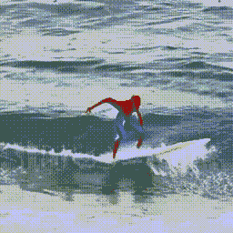

# Text-2-Video 生成：逐步指南

> 原文：[`www.kdnuggets.com/2023/08/text2video-generation-stepbystep-guide.html`](https://www.kdnuggets.com/2023/08/text2video-generation-stepbystep-guide.html)



作者提供的 GIF

# 介绍

* * *

## 我们的前 3 个课程推荐

 1\. [Google 网络安全证书](https://www.kdnuggets.com/google-cybersecurity) - 加速进入网络安全职业生涯。

 2\. [Google 数据分析专业证书](https://www.kdnuggets.com/google-data-analytics) - 提升你的数据分析技能

 3\. [Google IT 支持专业证书](https://www.kdnuggets.com/google-itsupport) - 支持你的组织 IT 方面的工作

* * *

基于扩散的图像生成模型在计算机视觉领域代表了一项革命性的突破。由包括 Imagen、DallE 和 MidJourney 在内的模型开创，这些进展展示了文本条件图像生成的卓越能力。要了解这些模型的内部工作原理，你可以阅读这篇文章。

然而，Text-2-Video 模型的开发带来了更大的挑战。目标是确保生成的每一帧之间的一致性和连贯性，并在视频的开头到结尾之间保持生成的上下文。

然而，最近在基于扩散的模型中的进展为 Text-2-Video 任务提供了有前景的前景。目前，大多数 Text-2-Video 模型都采用了对预训练的 Text-2-Image 模型进行微调的技术，集成了动态图像运动模块，并利用了 WebVid 或 HowTo100M 等各种 Text-2-Video 数据集。

在这篇文章中，我们的方法涉及使用 HuggingFace 提供的微调模型，这对于生成视频非常重要。

# 实现

## 先决条件

我们使用 HuggingFace 提供的 Diffusers 库，以及一个名为 Accelerate 的实用库，它允许 PyTorch 代码在并行线程中运行。这加速了我们的生成过程。

首先，我们必须安装所需的依赖项并导入相关模块以便我们的代码正常运行。

```py
pip install diffusers transformers accelerate torch
```

然后，从每个库中导入相关模块。

```py
import torch
from diffusers import DiffusionPipeline, DPMSolverMultistepScheduler
from diffusers.utils import export_to_video
```

## 创建管道

我们在 [HuggingFace](https://huggingface.co/damo-vilab/text-to-video-ms-1.7b) 上加载了由 [ModelScope](https://modelscope.cn/) 提供的 Text-2-Video 模型，在扩散管道中进行处理。该模型具有 17 亿参数，基于 UNet3D 架构，通过迭代去噪过程从纯噪声中生成视频。其工作过程分为三部分。模型首先从简单的英语提示中提取文本特征。然后将文本特征编码到视频潜在空间并去噪。最后，将视频潜在空间解码回视觉空间，并生成一个短视频。

```py
pipe = DiffusionPipeline.from_pretrained(
"damo-vilab/text-to-video-ms-1.7b", torch_dtype=torch.float16, variant="fp16")

pipe.scheduler = DPMSolverMultistepScheduler.from_config(
pipe.scheduler.config)

pipe.enable_model_cpu_offload()
```

此外，我们使用 16 位浮点精度来减少 GPU 的利用率。此外，还启用了 CPU 卸载功能，这可以在运行时从 GPU 中移除不必要的部分。

## 生成视频

```py
prompt = "Spiderman is surfing"
video_frames = pipe(prompt, num_inference_steps=25).frames
video_path = export_to_video(video_frames)
```

然后我们将一个提示传递给视频生成管道，该管道提供生成的帧序列。我们使用 25 次推理步骤，以便模型执行 25 次去噪迭代。较高的推理步骤数可以提高视频质量，但需要更高的计算资源和时间。

单独的图像帧随后通过扩散器的工具函数进行合成，视频被保存在磁盘上。

然后我们将一个提示传递给视频生成管道，该管道提供生成的帧序列。单独的图像帧随后通过扩散器的工具函数进行合成，视频被保存在磁盘上。

[Muhammad Arham 的最终视频](https://vimeo.com/846481462) 来自 [Muhammad Arham](https://vimeo.com/user182110512) 在 [Vimeo](https://vimeo.com) 上。

# 结论

非常简单！我们得到了一个关于蜘蛛侠冲浪的视频。虽然这是一个短的、质量不是很高的视频，但它仍然象征着这一过程的良好前景，该过程很快就能达到与图像-文本模型类似的结果。不过，测试你的创造力并与模型互动仍然非常有趣。你可以使用这个 [Colab Notebook](https://colab.research.google.com/drive/1IYe2MQZX86n3o22PR7HmSFgw54h31poZ?usp=sharing) 试一试。

**[穆罕默德·阿赫曼](https://www.linkedin.com/in/muhammad-arham-a5b1b1237/)** 是一名深度学习工程师，专注于计算机视觉和自然语言处理。他曾在 Vyro.AI 工作，负责多个生成式 AI 应用的部署和优化，这些应用达到了全球排行榜的顶端。他对构建和优化智能系统中的机器学习模型感兴趣，并相信持续改进。

### 相关话题

+   [检索增强生成：信息检索与…的结合](https://www.kdnuggets.com/retrieval-augmented-generation-where-information-retrieval-meets-text-generation)

+   [如何成为数据科学家的指南（逐步方法）](https://www.kdnuggets.com/2021/05/guide-become-data-scientist.html)

+   [如何结构化数据科学项目：逐步指南](https://www.kdnuggets.com/2022/05/structure-data-science-project-stepbystep-guide.html)

+   [使用 Python 和 Beautiful Soup 进行网页抓取的逐步指南](https://www.kdnuggets.com/2023/04/stepbystep-guide-web-scraping-python-beautiful-soup.html)

+   [逐步阅读和理解 SQL 查询的指南](https://www.kdnuggets.com/a-step-by-step-guide-to-reading-and-understanding-sql-queries)

+   [解析 DENSE_RANK()：SQL 爱好者的逐步指南](https://www.kdnuggets.com/breaking-down-denserank-a-step-by-step-guide-for-sql-enthusiasts)
