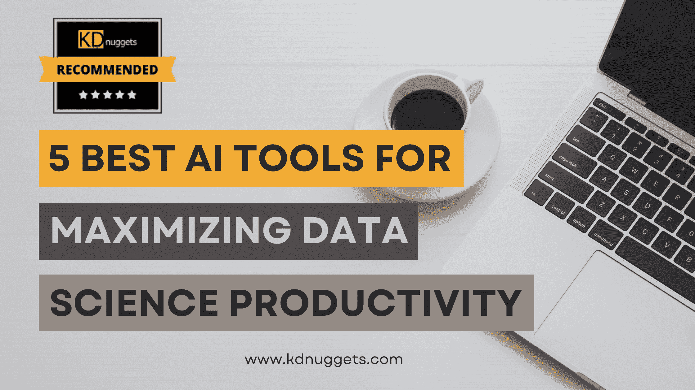

# 最大化生产力的 5 大 AI 工具

> 原文：[`www.kdnuggets.com/the-5-best-ai-tools-for-maximizing-productivity`](https://www.kdnuggets.com/the-5-best-ai-tools-for-maximizing-productivity)

效率和生产力在数据科学及处理涉及的大规模数据集时至关重要。随着这些数据集在大小和复杂性上的快速膨胀，我们用来管理和分析它们的工具不仅要跟上步伐——还要推动我们向前发展；其中最重要的就是 AI。

* * *

## 我们的前三个课程推荐

 1\. [谷歌网络安全证书](https://www.kdnuggets.com/google-cybersecurity) - 快速进入网络安全职业生涯。

 2\. [谷歌数据分析专业证书](https://www.kdnuggets.com/google-data-analytics) - 提升你的数据分析技能

 3\. [谷歌 IT 支持专业证书](https://www.kdnuggets.com/google-itsupport) - 支持你的组织的 IT 需求

* * *

虽然大多数应用程序和工具主要关注数据分析、转录和 IT 操作等方面，但 AI 领域也触及了我们的日常工作流程。现在你可以在几秒钟内合并 PDF 文件、重新排列电子表格和处理各种平凡任务。因此，当你考虑以下工具时，不仅要考虑数据科学。

在这篇文章中，我们将介绍以下 5 种多样的 AI 工具，以最大化数据科学家的生产力：

+   Assembly AI

+   DataRobot

+   H2O.ai

+   Hugging Face

+   BigPanda

让我们直接开始，来看看吧。

**[Assembly.ai](https://www.assemblyai.com/)** 被誉为转录和语音识别领域的领先解决方案之一，专注于在嘈杂环境中提供高度准确的转录。他们的 API 为开发者提供了一个可定制和灵活的框架，确保与不同平台和工具的无缝集成。

使 Assembly.ai 脱颖而出的是其对可扩展性的承诺，确保各种规模的组织都能从其功能中受益。它拥有一个混合系统，结合了深度学习能力和传统的语音识别技术，使其适用于实时和批处理任务。

除了转录功能，他们的套件还提供了多种音频处理工具，包括关键词识别和说话者标记。随着公司越来越依赖语音数据进行洞察和分析，Assembly.ai 的作用变得更加重要。他们对持续发展的承诺保证了在速度和准确性上的提升。

* * *

🔑 AssemblyAI 关键点

+   转录和语音识别

+   可定制的 API 解决方案

+   精度和可扩展性

✅ 优点

+   即使在困难的音频条件下也能提供卓越的精度

+   灵活且强大的开发者 API

+   适用于小型和大型企业

❌ 缺点

+   需要集成工作

+   对于简单的转录任务可能过于复杂

**[DataRobot](https://www.datarobot.com/)** 通过在今天的 [自动化机器学习](https://en.wikipedia.org/wiki/Automated_machine_learning)（AutoML）领域的开创性工作而声名鹊起。

其平台使数据专业人士能够快速构建、调整和部署预测模型，无需手动建模的复杂细节。用户只需上传数据集，即可获得关于最佳模型的推荐，平台自动处理特征工程和超参数调整。

其云原生架构有助于确保模型可以轻松部署到任何需要的位置。此外，关注协作，团队可以分享见解、模型和发现，从而提高生产力。

除了自动化能力外，DataRobot 强调模型的可解释性。这确保了生成的模型不仅仅是“黑箱”，其工作原理可以被理解和解释。凭借其用户友好的界面，即使是具有最少机器学习经验的人也能利用复杂算法进行数据项目。

* * *

🔑 DataRobot 关键点

+   基于云的自动化机器学习（AutoML）工具

+   模型可解释性和部署

+   用户友好的界面

✅ 优点

+   简化机器学习过程

+   强大的模型可解释性特性

+   适合新手和专家

❌ 缺点

+   对于小公司可能成本较高

+   高级用户可能会寻求更多的定制选项

**[H2O.ai](https://h2o.ai/)** 提供了一个全面的开源平台，满足各种 AI 和 机器学习需求。它支持广泛的算法，从深度学习到广义线性模型。数据科学家可以在不需要许可证或额外费用的情况下访问和实验这些算法。

H2O.ai 的真正优势在于其可扩展性，能够处理从个人计算机上的小数据集到企业级集群上的大数据分析任务。其平台与 Hadoop 和 Spark 等流行数据平台无缝集成，确保在任何环境中的一致工作流程。

此外，他们提供课程和资源来帮助用户，确保即使是对该领域陌生的人也能迅速上手。他们基于用户反馈的持续创新，确保始终满足数据科学社区不断发展的需求。

* * *

🔑 H2O.ai 关键点

+   开源 AI 平台

+   支持广泛的算法

+   可扩展性和集成能力

✅ 优点

+   由于开源性质，成本效益高

+   广泛的算法支持

+   高可扩展性和兼容性

❌ 缺点

+   对初学者可能有较陡的学习曲线

+   不如一些竞争对手用户友好

**[Hugging Face](https://huggingface.co/)** 已成为进行 [自然语言处理](https://hbr.org/2022/04/the-power-of-natural-language-processing) (NLP) 任务的首选平台。他们的 Transformers 库是 NLP 中最先进模型的宝库，使得前沿技术对开发者和数据科学家都变得可及。从聊天机器人到情感分析，他们的工具涵盖了广泛的应用领域。

积极社区的持续贡献确保 Hugging Face 始终处于 NLP 进展的最前沿。他们还提供了丰富的资源，包括各种预训练模型，使用户更容易启动他们的 NLP 项目。

除此之外，他们以社区为中心的方法意味着频繁更新，确保用户始终掌握最新的 NLP 和 LLM 技术 创新。

* * *

🔑 Hugging Face 关键点

+   自然语言处理 (NLP) 领域的领先平台

+   广泛的模型库

+   活跃的社区和频繁更新

✅ 优点

+   针对 NLP 任务的全面资源

+   强大的社区支持和贡献

+   频繁更新和不断增长的模型库

❌ 缺点

+   主要专注于 NLP，限制了多样性

+   对初学者可能有些令人不知所措

**[BigPanda](https://www.bigpanda.io/)** 提供一个利用人工智能增强 IT 操作的平台。它有效地将 IT 警报整合为高级事件，使团队能够更快地识别和 解决关键问题。通过集中化事件管理，BigPanda 提供了一个全景视图，防止了通知分散带来的混乱。

该平台还提供实时洞察，使团队能够快速了解根本原因和相关性。通过其分析，团队可以优先处理任务并预先解决潜在问题。BigPanda 无缝集成了大量 IT 系统，成为所有操作需求的核心枢纽。

* * *

🔑 BigPanda 关键点

+   人工智能驱动的 IT 操作

+   集中化事件管理

+   实时洞察和分析

✅ 优点

+   用人工智能简化 IT 操作

+   提供集中化的事件管理

+   综合的洞察和分析

❌ 缺点

+   主要服务于大规模 IT 操作

+   可能需要初始设置和集成工作

我们选择使用的工具可以在数据科学与 IT 运营的复杂交汇点上最终决定我们的生产力。

从 Assembly.ai 的精确转录能力到 BigPanda 的 IT 运维魔法，AI 工具的进步正在塑造数据科学研究人员处理和管理数据集的未来。

无论您是在深入研究 HuggingFace 的自然语言处理，还是寻求通过 DataRobot 和 H2O.ai 简化机器学习流程，市场上丰富的创新 AI 驱动解决方案都提供了大量针对不同需求的选择。

选择适合您数据科学需求的工具取决于识别自身的特定需求、潜在的预算限制以及可能的集成能力。随着 AI 工具的不断改进，时刻保持信息更新和灵活适应至关重要。

[**Nahla Davies**](http://nahlawrites.com/)是软件开发者和技术作家。在全职从事技术写作之前，她曾担任 Inc. 5,000 名体验品牌机构的首席程序员，该机构的客户包括三星、时代华纳、Netflix 和索尼。

### 更多相关主题

+   [7 款提升数据科学家生产力的 AI 工具](https://www.kdnuggets.com/2023/02/7-aipowered-tools-enhance-productivity-data-scientists.html)

+   [提升 Snowflake 生产力的 6 款顶级工具](https://www.kdnuggets.com/2023/08/top-6-tools-improve-productivity-snowflake.html)

+   [利用 ChatGPT 最大化数据分析效率](https://www.kdnuggets.com/maximizing-efficiency-in-data-analysis-with-chatgpt)

+   [2021 年最佳 ETL 工具](https://www.kdnuggets.com/2021/12/mozart-best-etl-tools-2021.html)

+   [8 款最佳 Python 图像处理工具](https://www.kdnuggets.com/2022/11/8-best-python-image-manipulation-tools.html)

+   [7 款最佳机器学习实验追踪工具](https://www.kdnuggets.com/2023/02/7-best-tools-machine-learning-experiment-tracking.html)
