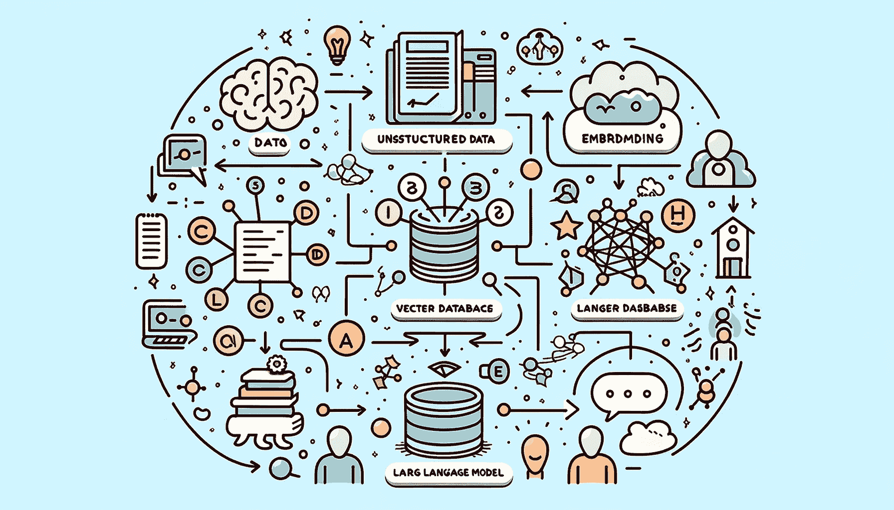
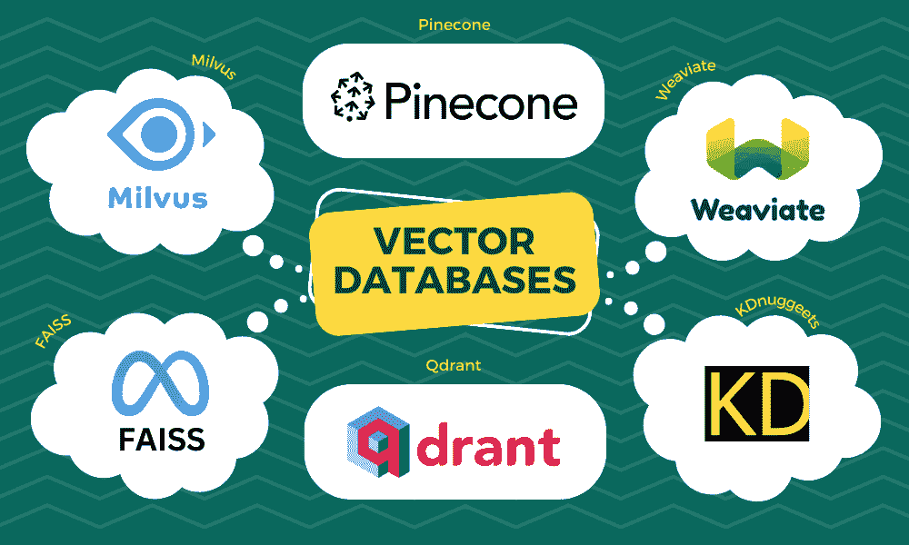

# 2024 年必试的 5 大最佳向量数据库

> 原文：[`www.kdnuggets.com/the-5-best-vector-databases-you-must-try-in-2024`](https://www.kdnuggets.com/the-5-best-vector-databases-you-must-try-in-2024)

使用 DALL-E 3 生成的图像

# 介绍

* * *

## 我们的前三大课程推荐

 1\. [Google 网络安全证书](https://www.kdnuggets.com/google-cybersecurity) - 快速进入网络安全职业生涯。

 2\. [Google 数据分析专业证书](https://www.kdnuggets.com/google-data-analytics) - 提升你的数据分析技能

 3\. [Google IT 支持专业证书](https://www.kdnuggets.com/google-itsupport) - 支持组织的 IT

* * *

向量数据库是一种专门设计用于存储和索引向量嵌入以实现高效检索和相似性搜索的数据库。它用于涉及大语言模型、生成 AI 和语义搜索的各种应用中。向量嵌入是数据的数学表示，捕捉语义信息，并允许理解模式、关系和潜在结构。

向量数据库在 AI 应用领域变得越来越重要，因为它们擅长处理高维数据和促进复杂的相似性搜索。

在这篇博客中，我们将探讨你在 2024 年必须尝试的五大向量数据库。这些数据库是根据其可扩展性、多功能性和在处理向量数据方面的表现来挑选的。

作者提供的图像

# 1\. Qdrant

Qdrant 是一个开源向量相似性搜索引擎和向量数据库，提供了一个生产就绪的服务，带有便捷的 API。你可以存储、搜索和管理向量嵌入。Qdrant 支持扩展过滤，非常适合涉及神经网络或基于语义的匹配、分面搜索等各种应用。由于它是用可靠且快速的编程语言 Rust 编写的，Qdrant 可以高效处理高用户负载。

通过使用 Qdrant，你可以构建包含嵌入编码器的完整应用程序，用于匹配、搜索、推荐等任务。它也以 Qdrant Cloud 的形式提供，这是一种完全托管的版本，包括一个免费层，提供了一个方便的方式让用户在项目中利用其向量搜索能力。

# 2\. Pinecone

Pinecone 是一个管理型向量数据库，专门设计用于解决与高维数据相关的挑战。凭借先进的索引和搜索功能，Pinecone 使数据工程师和数据科学家能够构建和部署能够高效处理和分析高维数据的大规模机器学习应用。

Pinecone 的主要特点包括一个完全托管的服务，具有高度的可扩展性，支持实时数据摄取和低延迟搜索。Pinecone 还提供与 LangChain 的集成，以支持自然语言处理应用。凭借对高维数据的专业关注，Pinecone 提供了一个优化的平台，用于部署有影响力的机器学习项目。

# 3\. Weaviate

[Weaviate](https://github.com/weaviate/weaviate) 是一个开源向量数据库，允许你存储来自你喜欢的 ML 模型的数据对象和向量嵌入，能够无缝扩展到数十亿个数据对象。使用 Weaviate，你可以获得快速的搜索速度 - 它可以在几毫秒内从数百万个对象中快速搜索十个最近邻。它提供了灵活性，可以在导入期间对数据进行向量化或上传自己的向量，并利用与 OpenAI、Cohere、HuggingFace 等平台集成的模块。

Weaviate 关注于可扩展性、复制和生产环境的安全性，从原型到大规模部署都可以胜任。除了快速的向量搜索，Weaviate 还提供推荐、摘要和神经搜索框架集成。它为各种使用案例提供了一个灵活且可扩展的向量数据库。

# 4\. Milvus

[Milvus](https://github.com/milvus-io/milvus) 是一个强大的开源向量数据库，专为 AI 应用和相似性搜索设计。它使非结构化数据搜索更加便捷，并提供了一致的用户体验，无论部署环境如何。

Milvus 2.0 是一个云原生的向量数据库，设计上将存储和计算分离，使用无状态组件以增强弹性和灵活性。根据 Apache License 2.0 发布，Milvus 在万亿向量数据集上提供毫秒级搜索，通过丰富的 API 简化了非结构化数据管理，并在应用程序中嵌入实时搜索。它具有高度的可扩展性和弹性，支持按需组件级扩展。

Milvus 结合了标量过滤和向量相似性，为混合搜索解决方案提供支持。凭借社区支持和超过 1,000 个企业用户，Milvus 提供了一个可靠、灵活和可扩展的开源向量数据库，适用于各种使用案例。

# 5\. faiss

[Faiss](https://github.com/facebookresearch/faiss)是一个开源库，用于高效的相似性搜索和密集向量的聚类，能够搜索超出 RAM 容量的大规模向量集合。它包含了多种基于 L2 距离、点积和余弦相似性的向量比较方法。一些方法如二进制向量量化允许压缩向量表示以提高可扩展性，而其他方法如 HNSW 和 NSG 使用索引来加速搜索。

Faiss 主要用 C++ 编写，但与 Python/NumPy 完全集成。关键算法可用于 GPU 执行，接受来自 CPU 或 GPU 内存的输入。GPU 实现支持 CPU 索引的快速替代，以实现更快的结果，自动处理 CPU-GPU 数据拷贝。由 Meta 的 Fundamental AI Research 团队开发，Faiss 提供了一个开源工具包，支持在大规模向量数据集上迅速进行搜索和聚类，兼容 CPU 和 GPU 基础设施。

# 结论

向量数据库正在迅速成为现代 AI 应用的重要组成部分。正如我们在这篇博客文章中探讨的那样，在 2024 年选择向量数据库时，有几种引人注目的选项可以考虑。Qdrant 提供了多功能的开源能力，Pinecone 提供了为高维数据设计的托管服务，Weaviate 专注于可扩展性和灵活性，Milvus 在各种环境中提供一致的体验，而 Faiss 通过优化算法实现高效的相似性搜索。

每个数据库根据你的使用案例和基础设施都有其自身的优势和好处。随着 AI 模型和语义搜索的不断进步，拥有合适的向量数据库来存储、索引和查询向量嵌入将是关键。你可以通过阅读 什么是向量数据库及其对 LLMs 的重要性？ 来了解更多关于向量数据库的信息。

****[Abid Ali Awan](https://www.polywork.com/kingabzpro)**** ([@1abidaliawan](https://www.linkedin.com/in/1abidaliawan)) 是一位认证的数据科学专业人士，热衷于构建机器学习模型。目前，他专注于内容创作和撰写关于机器学习和数据科学技术的技术博客。Abid 拥有技术管理硕士学位和电信工程学士学位。他的愿景是利用图神经网络为面临心理健康问题的学生打造一款 AI 产品。

### 更多相关话题

+   [Python 向量数据库与向量索引：构建 LLM 应用](https://www.kdnuggets.com/2023/08/python-vector-databases-vector-indexes-architecting-llm-apps.html)

+   [2024 年你必须尝试的 7 个端到端 MLOps 平台](https://www.kdnuggets.com/7-end-to-end-mlops-platforms-you-must-try-in-2024)

+   [2024 年你必须了解的 7 种现代 SQL 数据库](https://www.kdnuggets.com/7-modern-sql-database-you-must-know-in-2024)

+   [你必须尝试的前五款 AI 编程助手](https://www.kdnuggets.com/top-5-ai-coding-assistants-you-must-try)

+   [2024 年你可以尝试的五个免费 AI 游乐场](https://www.kdnuggets.com/5-free-ai-playgrounds-for-you-to-try-in-2024)

+   [松果向量数据库综合指南](https://www.kdnuggets.com/a-comprehensive-guide-to-pinecone-vector-databases)
