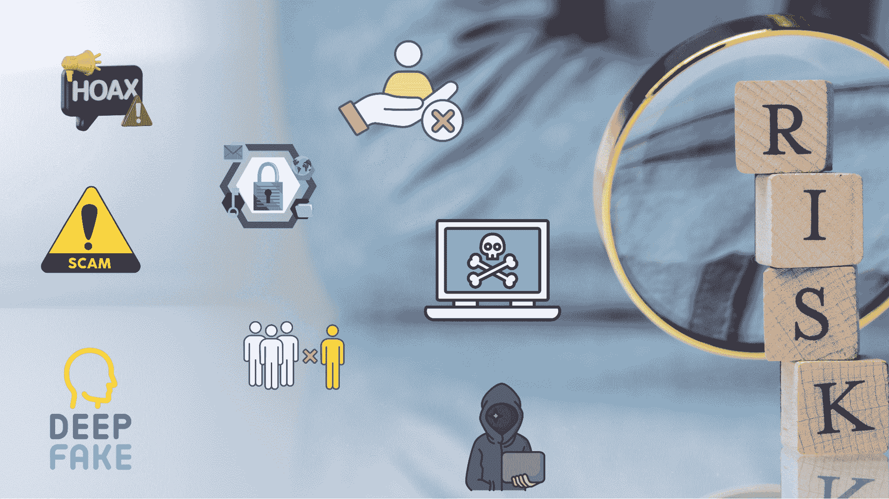
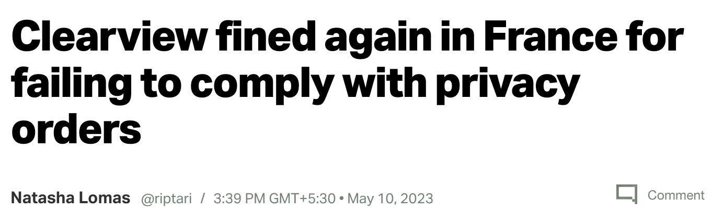
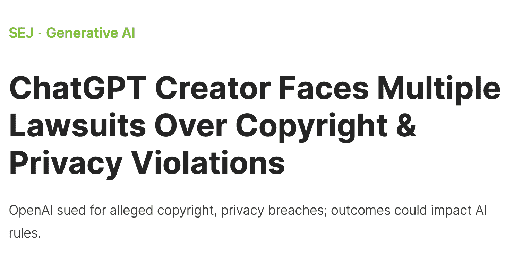

# 生成性人工智能的新伦理影响

> 原文：[`www.kdnuggets.com/the-new-ethical-implications-of-generative-artificial-intelligence`](https://www.kdnuggets.com/the-new-ethical-implications-of-generative-artificial-intelligence)

高级人工智能领域的进展速度非常快，但伴随而来的风险也同样迅猛。

目前的情况使得专家很难预测风险。

* * *

## 我们的前三大课程推荐

 1\. [谷歌网络安全证书](https://www.kdnuggets.com/google-cybersecurity) - 快速进入网络安全职业的快车道。

 2\. [谷歌数据分析专业证书](https://www.kdnuggets.com/google-data-analytics) - 提升你的数据分析能力

 3\. [谷歌 IT 支持专业证书](https://www.kdnuggets.com/google-itsupport) - 支持你的组织的 IT

* * *

尽管大多数领导者在接下来的几个月里越来越重视[生成性 AI 应用](https://hbr.org/2023/06/managing-the-risks-of-generative-ai)，但他们也对随之而来的风险持怀疑态度——例如数据安全问题和偏见结果等。

[马克·苏兹曼](https://www.gatesfoundation.org/ideas/articles/artificial-intelligence-ai-development-principles)，比尔及梅琳达·盖茨基金会的首席执行官，认为“虽然这项技术可以带来加速科学进步和提升学习成果的突破，但机遇并非没有风险。”

图片由作者提供

## 让我们从数据开始

想一想——一位著名的生成性 AI 模型创建者表示，“它[收集个人信息](https://www.indiatoday.in/technology/news/story/japan-warns-chatgpt-creator-openai-over-data-privacy-says-they-will-take-action-if-needed-2388592-2023-06-04)，如姓名、电子邮件地址和支付信息，以满足业务需要。”

近年来已显示出在没有指导框架的情况下可能出现的多种错误情况。

+   [意大利对](https://www.bbc.com/news/technology-65139406)非法收集用户个人数据表示担忧，引用了“[没有法律依据](https://www.bbc.com/news/technology-65139406) 来证明大规模收集和存储个人数据以‘训练’平台操作的算法。”

+   日本个人信息保护委员会也[发出了警告](https://www.indiatoday.in/technology/news/story/japan-warns-chatgpt-creator-openai-over-data-privacy-says-they-will-take-action-if-needed-2388592-2023-06-04)，要求在训练机器学习模型时最小化数据收集。

+   [HBR](https://hbr.org/2023/06/managing-the-risks-of-generative-ai)的行业领导者们也表达了对数据安全问题和偏见结果的担忧

由于生成式 AI 模型是在几乎所有互联网数据上进行训练的，我们只是那些神经网络层中的一部分。这强调了遵守数据隐私法规的必要性，不能在未经用户同意的情况下训练模型。

最近，有公司因通过抓取互联网自拍照来构建面部识别工具而被罚款，这导致了隐私泄露和高额罚款。

来源：[TechCrunch](https://techcrunch.com/2023/05/10/clearview-ai-another-cnil-gspr-fine/)

然而，数据安全、隐私和偏见在生成式 AI 之前就已经存在。那么，生成式 AI 应用的推出带来了什么变化？

一些现有的风险因模型的训练和部署规模而变得更加危险。让我们来了解一下。

# 规模——一把双刃剑

## 幻觉、提示注入和缺乏透明度

理解这些庞大模型的内部运作，以信任它们的回应变得更加重要。用微软的话说，这些新兴风险是因为 LLMs“被设计成生成看起来连贯且符合上下文的文本，而不是遵循事实准确性”。

因此，这些模型可能会产生误导性和不准确的回答，通常被称为幻觉。当模型对预测缺乏信心时，可能会生成不太准确或不相关的信息。

此外，提示是我们与语言模型互动的方式；现在，恶意行为者可能通过注入提示生成有害内容。

## 当 AI 出错时的问责制？

使用 LLMs 引发了有关这些模型生成的输出以及偏见输出的伦理问题，因为这种偏见在所有 AI 模型中普遍存在。

风险在高风险应用中加剧，例如在医疗保健领域——想想错误医疗建议对患者健康和生命的影响。

最重要的是，组织需要建立道德、透明和负责任的生成式 AI 开发和使用方式。

如果你对了解谁负责确保生成式 AI 正确使用感兴趣，可以考虑阅读这篇文章，文章描述了我们如何作为一个社区共同努力，使其发挥作用。

## 版权侵权

由于这些大型模型是基于全球范围的材料构建的，它们很可能涉及到创作内容——音乐、视频或书籍。

如果未经必要的[许可、署名或补偿](https://www.searchenginejournal.com/chatgpt-creator-faces-multiple-lawsuits-over-copyright-privacy-violations/490686/)使用版权数据来训练人工智能模型，则会导致版权侵权，并可能使开发者面临严重的法律问题。

图片来源于[搜索引擎期刊](https://www.searchenginejournal.com/chatgpt-creator-faces-multiple-lawsuits-over-copyright-privacy-violations/490686/)

## 深度伪造、虚假信息与操控

高概率引发大规模混乱的是深度伪造——想知道深度伪造能力可能让我们陷入什么困境吗？

它们是合成创作——文本、图像或视频，可以通过深度生成方法[数字化操控面部外观](https://en.wikipedia.org/wiki/Deepfake)。

结果？欺凌、虚假信息、恶作剧电话、报复或诈骗——这些都不符合繁荣世界的定义。

这篇文章旨在让大家意识到，人工智能是把双刃剑——它并非只有对重要举措有效的魔法，坏行为者也是其中的一部分。

这就是我们需要提高警惕的地方。

# 安全措施

以最近一段虚假视频为例，该视频突出了某政治人物退出即将到来的选举。

可能的动机是什么？——你可能会想。嗯，这种虚假信息传播如 wildfire，很快就会[严重影响选举过程的方向](https://winknews.com/2023/09/08/deepfake-video-of-gov-ron-desantis-dropping-2024-presidential-race-goes-viral-cybersecurity-expert-weighs-in/)。

那么，我们该如何避免成为这些虚假信息的受害者呢？

防御措施有很多条，让我们从最基本的开始：

+   对你周围看到的一切保持怀疑和疑虑

+   将你的默认模式调整为“它可能不是真的”，而不是对所有事物都不加怀疑。简而言之，对你周围的一切保持质疑。

+   从多个来源确认潜在可疑的数字内容

# 暂停开发是否是解决方案？

知名的人工智能研究人员和行业专家，如**约书亚·本吉奥**、**斯图亚特·拉塞尔**、**埃隆·马斯克**、**史蒂夫·沃兹尼亚克**和**尤瓦尔·赫拉利**，也表达了他们的担忧，呼吁暂停开发这些人工智能系统。

有一种强烈的恐惧感，认为在构建先进的人工智能的竞赛中，能够与生成性人工智能相媲美的技术可能会迅速失控。

# 有所进展

[微软](https://www.msn.com/en-ca/money/other/microsoft-says-it-will-protect-customers-from-ai-copyright-lawsuits/ar-AA1go5ha?ocid=msedgntp&cvid=d677c68aad4e4ed680aa1c12658ff514&ei=15)最近宣布，只要遵守安全措施和内容过滤器，它将保护其 AI 产品的购买者免受版权侵权的影响。这是一个重大缓解，并展示了对使用其产品后果负责的正确意图——这是伦理框架的核心原则之一。

这将确保作者保留他们的权利并为他们的创作获得公平的报酬。

这是朝着正确方向取得的巨大进展！关键在于它解决了多少作者的担忧。

# 接下来是什么？

到目前为止，我们已经讨论了与技术相关的关键伦理问题，以确保其正确应用。然而，从这种技术进步的成功利用中产生的一个风险是工作岗位的流失。

有一种情绪引发了对人工智能会取代我们大部分工作的恐惧。麦肯锡最近分享了一份关于未来工作形态的报告。

这个话题需要我们对工作的思维方式进行结构性改变，并值得单独讨论。因此，请关注下一篇文章，其中将讨论工作的未来以及如何在 GenAI 时代生存并蓬勃发展所需的技能！

****[Vidhi Chugh](https://vidhi-chugh.medium.com/)****是一位 AI 策略师和数字化转型领导者，致力于在产品、科学和工程的交汇点上构建可扩展的机器学习系统。她是一位屡获殊荣的创新领导者、作者和国际演讲者。她的使命是普及机器学习，并打破术语，让每个人都能参与这场变革。

### 更多相关内容

+   [辛普森悖论及其在数据科学中的影响](https://www.kdnuggets.com/2023/03/simpson-paradox-implications-data-science.html)

+   [破解量子计算：对数据科学和人工智能的影响](https://www.kdnuggets.com/breaking-down-quantum-computing-implications-for-data-science-and-ai)

+   [基于人工智能系统的不确定性量化](https://www.kdnuggets.com/2022/04/uncertainty-quantification-artificial-intelligencebased-systems.html)

+   [你应该成为一名自由职业的人工智能工程师吗？](https://www.kdnuggets.com/2021/12/ucsd-become-freelance-artificial-intelligence-engineer.html)

+   [2022 年的人工智能项目创意](https://www.kdnuggets.com/2022/01/artificial-intelligence-project-ideas-2022.html)

+   [人工智能与元宇宙](https://www.kdnuggets.com/2022/02/artificial-intelligence-metaverse.html)
