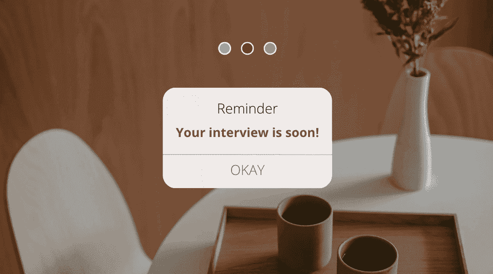

# 你需要的唯一深度学习面试准备课程

> 原文：[`www.kdnuggets.com/the-only-interview-prep-course-you-need-for-deep-learning`](https://www.kdnuggets.com/the-only-interview-prep-course-you-need-for-deep-learning)

图片由作者提供

假设你正在为数据科学、机器学习工程师、AI 工程师或研究科学家职位做准备。在这种情况下，你应该寻找优秀的资源来帮助你顺利通过面试。

* * *

## 我们的前三个课程推荐

 1\. [谷歌网络安全证书](https://www.kdnuggets.com/google-cybersecurity) - 快速进入网络安全职业生涯。

 2\. [谷歌数据分析专业证书](https://www.kdnuggets.com/google-data-analytics) - 提升你的数据分析能力

 3\. [谷歌 IT 支持专业证书](https://www.kdnuggets.com/google-itsupport) - 支持你的组织的 IT 工作

* * *

深度学习越来越受欢迎，它形成了大语言模型、生成 AI 等主题的基础，并结合了许多不同的概念。这就是为什么这个面试准备课程可能是我最近见过的最好的课程之一。

你不仅会获得深度学习的基础和经验知识，还会提升你的数据科学和机器学习技能。即使你没有准备面试，而是在学习过程中，我也会推荐这个面试准备课程！

# 深度学习面试课程

该课程分为两个部分。第一部分，视频将讲解前 50 个问题及其对应答案。在第二部分，视频将讲解剩余的 50 个问题。

总共有 100 个问题。总共需要 7.5 小时！

## 基本面试问题

你将从深度学习的基本问题开始，包括神经网络的概念、神经网络的架构、激活函数和梯度下降。这些是前 10 个问题，因此你会很快通过这些问题。

## 中级面试问题

在接下来的 20 个问题中，你将深入了解如何定义反向传播与梯度下降和交叉熵的区别。从那里，你将进一步探讨并测试你在随机梯度下降和 Hessian 等领域的技能，以及它们如何用于加速训练过程。

## 专家面试问题

最后的 20 个问题将测试你对诸如 Adam 及其在神经网络中的使用、层归一化、残差连接以及如何解决梯度爆炸等主题的知识。你还将深入了解 dropout 的概念，它如何防止过拟合、维度诅咒等。

# 愉快学习

我们希望这门课程能帮助你在即将到来的面试或学习过程中变得更有信心。复习顶级面试问题将帮助你了解重要知识点以及面试官认为的重要技能和知识。

如果你知道其他好的资源，请在评论中分享给大家！

****[Nisha Arya](https://www.linkedin.com/in/nisha-arya-ahmed/)**** 是一名数据科学家、自由职业技术作家，以及 KDnuggets 的编辑和社区经理。她特别关注提供数据科学职业建议或教程，以及围绕数据科学的理论知识。Nisha 涵盖了广泛的主题，并希望探索人工智能如何有利于人类生命的延续。作为一个热衷学习者，Nisha 寻求拓宽自己的技术知识和写作技能，同时帮助指导他人。

### 更多相关主题

+   [你成为专业数据工程师所需的唯一免费课程](https://www.kdnuggets.com/the-only-free-course-you-need-to-become-a-professional-data-engineer)

+   [你成为数据分析师所需的唯一课程](https://www.kdnuggets.com/the-only-course-you-need-to-smash-your-data-analyst-career)

+   [你成为 MLOps 工程师所需的唯一免费课程](https://www.kdnuggets.com/the-only-free-course-you-need-to-become-a-mlops-engineer)

+   [Interview Kickstart 数据科学面试课程——它有什么特别之处…](https://www.kdnuggets.com/2022/10/interview-kickstart-data-science-interview-course-makes-different.html)

+   [7 个超级备忘单助你通过机器学习面试](https://www.kdnuggets.com/2022/12/7-super-cheat-sheets-need-ace-machine-learning-interview.html)

+   [10 个备忘单助你通过数据科学面试](https://www.kdnuggets.com/2022/10/10-cheat-sheets-need-ace-data-science-interview.html)
