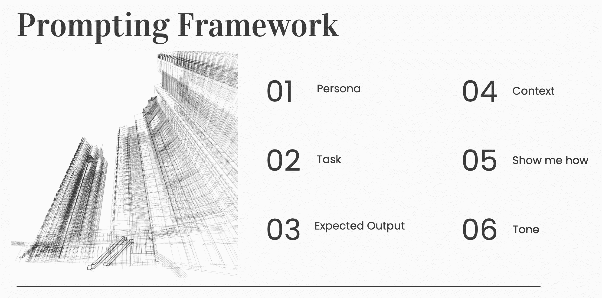

# 适用于所有用途的唯一提示框架

> 原文：[`www.kdnuggets.com/the-only-prompting-framework-for-every-use`](https://www.kdnuggets.com/the-only-prompting-framework-for-every-use)

图像由 [freestockcenter 在 Freepik](https://www.freepik.com/search?ai=excluded&format=search&last_filter=page&last_value=2&page=2&query=scaffolding&selection=1&type=photo#uuid=f8637cdd-5cbb-4e8a-a9bb-381719fa20d1) 提供

随着大型语言模型的出现，提示工程已成为一项重要技能。简而言之，提示涉及的是人类如何与机器互动。设计提示意味着有效地传达需求，以便机器的响应具有上下文相关性、相关性和准确性。

* * *

## 我们的前三大课程推荐

 1\. [谷歌网络安全证书](https://www.kdnuggets.com/google-cybersecurity) - 快速进入网络安全职业的快车道。

 2\. [谷歌数据分析专业证书](https://www.kdnuggets.com/google-data-analytics) - 提升你的数据分析技能

 3\. [谷歌 IT 支持专业证书](https://www.kdnuggets.com/google-itsupport) - 支持你的组织的 IT 需求

* * *

## 框架

本文中分享的提示工程框架显著提升了你与 AI 系统的互动。让我们通过遵循包括角色、上下文和任务在内的六步框架来学习创建强大的提示，并展示期望的输出和语气。

 作者提供的图像

## 1\. 角色

将一个角色视为你会求助于其解决特定任务的专家。角色类似，只不过这个专家现在是你正在互动的模型。将角色分配给模型相当于赋予它一个角色或身份，帮助设定任务所需的适当专业水平和视角。

示例：“作为一个在客户服务对话中进行情感分析的专家……”

现在，经过大量数据训练的模型被指示运用数据科学家在进行情感分析时的知识和视角。

## 2\. 上下文

上下文提供了背景信息和模型必须了解的任务范围。这种对情况的理解可以包括定义模型需要响应的环境的事实、过滤器或约束。

示例：“……分析通话记录以了解客户的痛点及其在客户与代理人之间通话详情中的情感”

这个上下文突出了呼叫中心数据分析的具体案例。提供上下文等同于优化问题——提供过多的上下文可能会掩盖实际目标，而提供过少则限制了模型的响应能力。

## 3\. 任务

任务是模型必须采取的具体行动。这是你的提示需要完成的全部目标。我称之为 2C——清晰且简洁，意味着模型应该能够理解期望。

示例：“……分析数据并学会从未来的对话中计算情感。”

## 4\. 向我展示如何

注意，没有免费的午餐。大型语言模型已被证明会产生幻觉，即它们倾向于产生误导性或不正确的结果。正如[Google Cloud](https://cloud.google.com/discover/what-are-ai-hallucinations)所解释的，“这些错误可能由多种因素造成，包括训练数据不足、模型的错误假设或用于训练模型的数据中的偏差。”

限制这种行为的一种方法是要求模型解释它是如何得出响应的，而不仅仅是分享最终答案。

示例：“提供简要解释，突出计算出的情感背后的词语和理由。”

## 5\. 预期输出

通常，我们需要以一种结构化且易于跟随的指定格式输出。根据用户如何获取信息，输出可以组织成列表、表格或段落的形式。

示例：“以 2 点格式分享给定的呼叫总结，包括反映情感类别的客户情感和关键词……”

## 6\. 语气

尽管指定语气通常被认为是可选的，但指定语气有助于将语言调整为目标受众。有各种语气，模型可以调整其响应，例如随意、直接、愉快等。

示例：“使用专业但易于理解的语气，尽量避免过于专业的术语。”

## 将所有内容汇总在一起

很好，我们已经讨论了提示框架的所有六个元素。现在，让我们将它们合并成一个单一的提示：

> “作为一名通过客户关怀对话进行情感分析的专家，你正在分析呼叫记录，以了解客户痛点和从客户与代理之间的呼叫细节中的情感。分析数据并学会从未来的对话中计算情感。提供简要解释，突出计算出的情感背后的词语和理由。以 2 点格式分享给定的呼叫总结，包括反映情感类别的客户情感和关键词。使用专业但易于理解的语气，尽量避免过于专业的术语。”

## 有效提示的好处

这个框架不仅为明确的请求奠定了基础，还添加了必要的背景并描述了角色，以便将响应量身定制到具体情况。要求模型展示其得出结果的过程，进一步增加了深度。

掌握提示的艺术需要实践，并且是一个持续的过程。练习和完善提示技巧使我们能够从人工智能互动中提取更多价值。

这类似于构建机器学习模型时的实验设计。我希望这个框架能为你提供一个坚实的结构，但不要觉得受限于此。将其作为基准进行进一步实验，并根据你的具体需求不断调整。

****[Vidhi Chugh](https://vidhi-chugh.medium.com/)**** 是一位人工智能战略家和数字化转型领导者，致力于在产品、科学和工程交汇处构建可扩展的机器学习系统。她是一位获奖的创新领导者、作者和国际演讲者。她的使命是让机器学习民主化，打破专业术语，让每个人都能参与到这一转型中。

### 更多相关主题

+   [揭示大型语言模型中链式思维提示的力量](https://www.kdnuggets.com/2023/07/power-chain-thought-prompting-large-language-models.html)

+   [探索思维树提示：人工智能如何通过搜索学习推理…](https://www.kdnuggets.com/2023/07/exploring-tree-of-thought-prompting-ai-learn-reason-through-search.html)

+   [利用链式密度提示解锁 GPT-4 总结功能](https://www.kdnuggets.com/unlocking-gpt-4-summarization-with-chain-of-density-prompting)

+   [提升 LLM 推理能力：揭示链式代码提示](https://www.kdnuggets.com/enhancing-llm-reasoning-unveiling-chain-of-code-prompting)

+   [3 种基于研究的高级提示技术提高 LLM 效率…](https://www.kdnuggets.com/3-research-driven-advanced-prompting-techniques-for-llm-efficiency-and-speed-optimization)

+   [成为专业数据工程师所需的唯一免费课程](https://www.kdnuggets.com/the-only-free-course-you-need-to-become-a-professional-data-engineer)
