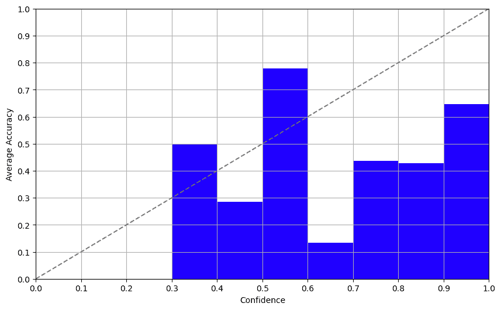
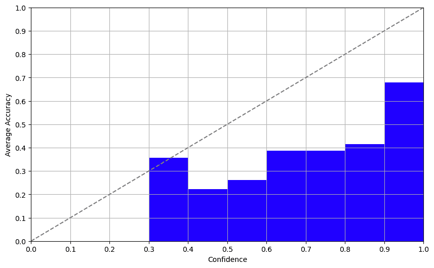

# 模型置信度的探索：你能相信黑箱吗？

> 原文：[`www.kdnuggets.com/the-quest-for-model-confidence-can-you-trust-a-black-box`](https://www.kdnuggets.com/the-quest-for-model-confidence-can-you-trust-a-black-box)

作者提供的图片

像 GPT-4 和 LLaMA2 这样的**大型语言模型（LLMs）**已经进入了[数据标注](https://example.org)的领域。LLMs 已经取得了长足的进步，现在可以进行数据标注并承担历史上由人类完成的任务。尽管使用 LLM 获取数据标签非常迅速且相对便宜，但仍然存在一个大问题，这些模型是终极的黑箱。因此，燃眉之急是：我们应该对这些 LLM 生成的标签有多少信任？在今天的文章中，我们将解开这一难题，以建立一些基本准则来评估我们对 LLM 标注数据的信任度。

* * *

## 我们的前三个课程推荐

 1\. [Google 网络安全证书](https://www.kdnuggets.com/google-cybersecurity) - 快速开启网络安全职业生涯。

 2\. [Google 数据分析专业证书](https://www.kdnuggets.com/google-data-analytics) - 提升您的数据分析技能

 3\. [Google IT 支持专业证书](https://www.kdnuggets.com/google-itsupport) - 支持您的组织 IT 需求

* * *

# 背景

下面展示的结果来自于[Toloka](http://toloka.ai)进行的一项实验，该实验使用了流行的模型和土耳其语的数据集。这不是一份科学报告，而是对可能解决该问题的方法的简要概述，以及一些关于如何确定哪种方法最适合您的应用程序的建议。

# 重大问题

在我们深入细节之前，这里有一个重大问题：我们何时可以相信由 LLM 生成的标签，何时应该保持怀疑？了解这一点可以帮助我们进行自动化数据标注，并且在客户支持、内容生成等其他应用任务中也会很有用。

**当前的情况**

那么，人们现在是如何解决这个问题的呢？有些人直接要求模型输出一个置信度分数，有些人查看模型在多次运行中的答案一致性，而另一些人则检查模型的对数概率。但是这些方法中的任何一种是否可靠呢？让我们来找出答案。

# 一般原则

什么才算一个“好的”置信度测量？一个简单的规则是置信度分数与标签的准确性之间应该存在正相关。换句话说，更高的置信度分数应该意味着更高的正确概率。您可以使用校准图来可视化这种关系，其中 X 轴和 Y 轴分别表示置信度和准确性。

# 实验及其结果

## 方法 1：自信度

自我置信度方法涉及直接询问模型关于其置信度的情况。结果还不错！虽然我们测试的 LLM 在非英语数据集上表现不佳，但自我报告的置信度与实际准确性之间的相关性相当稳固，这意味着模型对其局限性有很好的认识。我们在这里也得到了类似的结果，GPT-3.5 和 GPT-4 一样。

## 方法 2：一致性

设置较高的温度（~0.7–1.0），对同一项目进行多次标注，并分析答案的一致性，更多细节请参见这篇[论文](https://arxiv.org/abs/2305.19187)。我们用 GPT-3.5 进行过尝试，结果简直是一团糟。我们让模型多次回答同一个问题，结果总是不可预测。这种方法和让魔法 8 球提供生活建议一样可靠，不应该被信任。

## 方法 3：对数概率

对数概率带来了意外的惊喜。Davinci-003 在完成模式下返回标记的对数概率。检查这些输出后，我们得到了一个与准确性高度相关的令人惊讶的良好置信度评分。这种方法提供了一种确定可靠置信度评分的有希望的方法。

# 关键点

那么，我们学到了什么？来吧，直接了当：

1.  自我置信度：有用，但需要谨慎对待。偏差被广泛报告。

1.  一致性：尽量避免。除非你喜欢混乱。

1.  对数概率：如果模型允许你访问它们，目前看来是一个相当不错的选择。

激动人心的部分？尽管这篇[论文](https://arxiv.org/abs/2305.14975)报告这种方法过于自信，但对数概率似乎相当稳健，即使在没有微调模型的情况下。这仍然有进一步探索的空间。

# 未来方向

合理的下一步可能是找到一个结合这三种方法最佳部分的黄金公式，或者探索新的方法。因此，如果你准备接受挑战，这可能是你下一个周末的项目！

# 总结

好了，机器学习爱好者和新手们，今天的内容就到这里。记住，无论你是在进行数据标注还是构建下一个大规模对话代理——理解模型置信度至关重要。不要轻信那些置信度评分，确保做好功课！

希望你觉得这些内容有启发。下次见，继续分析数据，质疑模型。

**[伊万·扬什奇科夫](https://www.linkedin.com/in/kroniker/?originalSubdomain=de)** 是应用科学大学伍尔茨堡-施韦因富特 AI 与机器人中心的语义数据处理与认知计算教授。他还领导 Toloka AI 的数据倡导者团队。他的研究兴趣包括计算创造力、语义数据处理和生成模型。

### 相关主题更多内容

+   [天空是极限：了解 JetBlue 如何使用 Monte Carlo 和 Snowflake…](https://www.kdnuggets.com/2022/12/monte-carlo-jetblue-snowflake-build-trust-improve-model-accuracy.html)

+   [处理置信区间](https://www.kdnuggets.com/2023/04/working-confidence-intervals.html)

+   [对 AI 的信任是无价的](https://www.kdnuggets.com/2022/08/trust-ai-priceless.html)

+   [我们信任数据：数据中心 AI](https://www.kdnuggets.com/2022/10/data-trust-data-centric-ai.html)

+   [边界框深度学习：视频注释的未来](https://www.kdnuggets.com/2022/07/bounding-box-deep-learning-future-video-annotation.html)

+   [黑色星期五优惠 - 用更少的钱在 DataCamp 上掌握机器学习](https://www.kdnuggets.com/2022/11/datacamp-black-friday-deal-master-machine-learning-less-datacamp.html)
