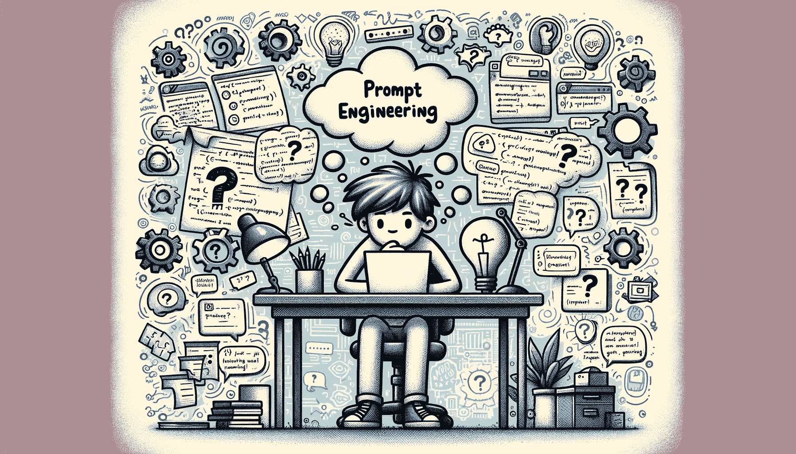

# 提示工程的兴衰：潮流还是未来？

> 原文：[`www.kdnuggets.com/the-rise-and-fall-of-prompt-engineering-fad-or-future`](https://www.kdnuggets.com/the-rise-and-fall-of-prompt-engineering-fad-or-future)

图像由 DALLE-3 生成

在不断扩展的 AI 和机器学习宇宙中，一颗新星已然崭露头角：提示工程。这个新兴领域围绕着策略性地构建输入，以引导 AI 模型生成特定的、期望的输出。

* * *

## 我们的前三名课程推荐

 1\. [谷歌网络安全证书](https://www.kdnuggets.com/google-cybersecurity) - 快速进入网络安全职业的快车道。

 2\. [谷歌数据分析专业证书](https://www.kdnuggets.com/google-data-analytics) - 提升你的数据分析技能

 3\. [谷歌 IT 支持专业证书](https://www.kdnuggets.com/google-itsupport) - 支持你的组织在 IT 领域

* * *

各种媒体已经在[大肆讨论提示工程](https://www.washingtonpost.com/technology/2023/02/25/prompt-engineers-techs-next-big-job/)，使其看起来像是理想的职业——你不需要学习编程，也不必了解深度学习、数据集等机器学习概念。你会同意这看起来好得令人难以置信，对吧？

答案实际上是既是又不是。我们将在今天的文章中详细解释原因，回溯提示工程的起源，为什么它很重要，最重要的是，为什么它并不是一个能将数百万人社会地位提升的改变人生的职业。

# 提示工程的崛起

我们都看到过这些数据——全球 AI 市场到 2030 年将[价值 1.6 万亿美元](https://youngandtheinvested.com/artificial-intelligence-statistics/)，OpenAI 正在[提供 90 万美元的薪水](https://medium.com/tech-pulse/openai-900k-total-compensation-for-senior-engineers-821fe03ed0fe)，这还不包括 GPT-4、Claude 以及各种其他 LLM 所产生的数十亿、甚至数万亿的字数。当然，数据科学家、机器学习专家以及该领域的其他高级专业人士处于前沿。

然而，2022 年改变了一切，因为 GPT-3 在公开发布的那一刻变得无处不在。突然间，普通人意识到提示的重要性以及“垃圾进，垃圾出”的概念。如果你写一个没有任何细节的草率提示，LLM 将对输出拥有完全的自由。起初这很简单，但用户很快意识到模型的真实能力。

然而，人们很快开始尝试更复杂的工作流程和更长的提示，进一步强调了巧妙编织语言的价值。自定义指令只会扩大可能性，并加速了提示工程师的崛起——一种能够运用逻辑、推理和对 LLM 行为的知识，以随心所欲地生成所需输出的专业人士。

# 提示工程：机器的语言？

在其潜力的巅峰，提示工程催生了自然语言处理（NLP）领域的显著进展。从普通的 GPT-3.5 到 Meta 的[LLaMa](https://replicate.com/blog/run-llama-locally)的特定版本，当喂入精心设计的提示时，AI 模型展示了适应各种任务的惊人灵活性。

提示工程的支持者将其视为人工智能创新的途径，展望一个通过精心设计的提示艺术无缝促进人类与人工智能互动的未来。

然而，正是提示工程的承诺激起了争议。它从人工智能系统中提供复杂、微妙甚至创造性的输出的能力并未被忽视。该领域的先知们视提示工程为解锁人工智能未开发潜力的关键，将其从计算工具转变为创作伙伴。

## 提示工程的审视

在热情的高潮中，怀疑的声音也在回响。提示工程的批评者指出其固有的局限性，认为这不过是对缺乏基本理解的人工智能系统进行复杂操作的结果。

他们认为，提示工程只是一个虚假的面纱，是对输入的巧妙编排，掩盖了人工智能固有的理解或推理能力的不足。同样，以下论点也支持他们的观点：

+   AI 模型来来去去。例如，GPT-3 中有效的方法在 GPT-3.5 中已经被修补，而在 GPT-4 中则成为实际的不可能。这难道不会使提示工程师仅仅是特定版本 LLM 的鉴赏家吗？

+   即便是最优秀的提示工程师也不真正算是‘工程师’。例如，一位 SEO 专家可以使用 GPT 插件或甚至本地运行的 LLM [来寻找反向链接机会](https://bluetree.ai/backlink-importance-and-benefits/)，或一位软件工程师可能知道如何[在编写、测试和部署代码时使用 Copilot](https://docs.github.com/en/copilot/getting-started-with-github-copilot?tool=vimneovim)。但归根结底，他们只是在执行单一任务，这在大多数情况下依赖于在某一领域的先前专长。

+   除了[硅谷偶尔的提示工程职位空缺](https://jobs.lever.co/Anthropic/e3cde481-d446-460f-b576-93cab67bd1ed)外，几乎没有对提示工程的意识，更不用说其他方面了。公司正在缓慢而谨慎地采用 LLMs，这与每项创新一样。但我们都知道，这并不会阻止炒作的浪潮。

## 提示工程的炒作

提示工程的魅力并没有免于炒作和夸张的力量。媒体叙事在称颂其优点和批评其缺陷之间摆动，常常放大成功而淡化局限性。这种二分法造成了混乱和期望膨胀，使人们相信它要么是魔法，要么完全无用，没有中间状态。

与其他科技时尚的历史相似，也提醒了技术趋势的短暂性。从曾经承诺彻底改变世界的元宇宙到折叠手机，这些技术的光辉常常随着现实未能达到早期炒作设定的高期望而黯淡。这种夸张的热情之后的幻灭模式对提示工程的长期可行性投下了疑问的阴影。

## 炒作背后的现实

剥去炒作的层层外衣，揭示出一个更为微妙的现实。技术和伦理挑战无处不在，从在多种应用中扩展提示工程的可扩展性到对可重复性和标准化的担忧。当与传统且成熟的 AI 职业相比较时，如数据科学相关的职业，提示工程的光环开始黯淡，揭示了一个虽然强大但存在显著局限性的工具。

这就是为什么提示工程如果只是一个时尚——认为任何人都可以每天与 ChatGPT 对话并获得中六位数的工作只是一个神话。当然，一些过于热情的硅谷初创公司可能在寻找提示工程师，但这并不是一个可行的职业。至少现在还不是。

同时，作为一个概念，提示工程将保持相关性，并且肯定会在重要性上不断增长。写出一个好的提示、有效使用你的令牌以及知道如何触发某些输出的技能，将在数据科学、LLMs 和整体 AI 之外发挥重要作用。

我们已经看到 ChatGPT[改变了人们学习、工作、沟通甚至组织生活的方式](https://www.sfchronicle.com/bayarea/article/ai-chatgpt-education-work-17846358.php)，因此提示技巧将变得更加相关。实际上，谁不期待用可靠的 AI 助手来自动化那些乏味的工作呢？

# 提示工程及其未来：它会超越短暂的时尚吗？

导航提示工程的复杂领域需要一种平衡的方法，这种方法既要承认其潜力，同时也要脚踏实地地面对其局限性。此外，我们还必须意识到提示工程的双关意义：

1.  以尽可能少的努力或步骤促使大型语言模型（LLMs）按照自己的意图行事的行为

1.  一个围绕上述行为的职业

所以，在未来，随着输入窗口的增多以及大型语言模型（LLMs）在创建比简单的线框图和机器人般的社交媒体文案更复杂的内容方面变得更加熟练，提示工程将成为一项必备技能。可以把它看作是如今会使用 Word 的等价物。

# 结论

总之，提示工程正处于一个十字路口，它的命运由炒作、希望和现实的交汇点所决定。它是否会巩固其在人工智能领域的地位，还是会逐渐消退成为技术潮流的历史一部分，还有待观察。然而可以确定的是，其充满争议的旅程不会很快结束，无论是好是坏。

****[Nahla Davies](http://nahlawrites.com/)****是一位软件开发人员和技术作家。在全职从事技术写作之前，她曾管理——除了其他有趣的事物——担任一家《Inc. 5000》体验品牌机构的首席程序员，该机构的客户包括三星、时代华纳、Netflix 和索尼。

### 更多相关内容

+   [为什么提示工程是一种潮流](https://www.kdnuggets.com/why-prompt-engineering-is-a-fad)

+   [有效提示工程的艺术，免费课程和…](https://www.kdnuggets.com/the-art-of-effective-prompt-engineering-with-free-courses-and-certifications)

+   [掌握生成式 AI 和提示工程：一本免费电子书](https://www.kdnuggets.com/2023/04/free-ebook-mastering-generative-ai-prompt-engineering.html)

+   [提示工程的艺术：解码 ChatGPT](https://www.kdnuggets.com/2023/06/art-prompt-engineering-decoding-chatgpt.html)

+   [一些超级酷的提示工程技巧，以提升我们的 LLM 模型](https://www.kdnuggets.com/some-kick-ass-prompt-engineering-techniques-to-boost-our-llm-models)

+   [提示工程 101：掌握有效的 LLM 沟通](https://www.kdnuggets.com/prompt-engineering-101-mastering-effective-llm-communication)
