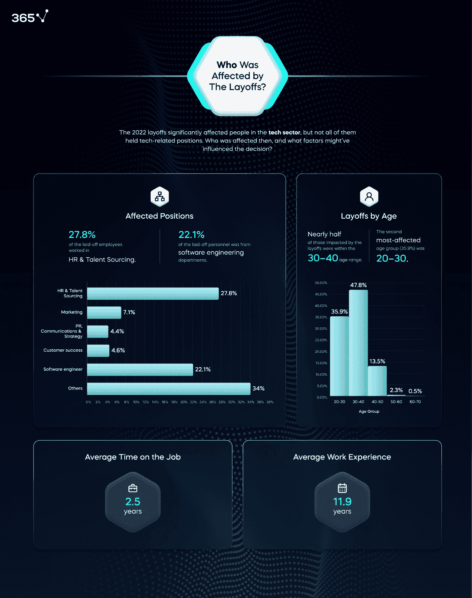

# 2024 年科技裁员激增：谁该负责？

> 原文：[`www.kdnuggets.com/the-surge-in-tech-layoffs-2024-who-to-blame`](https://www.kdnuggets.com/the-surge-in-tech-layoffs-2024-who-to-blame)

图片来源：[Unsplash](https://unsplash.com/photos/woman-in-black-long-sleeve-shirt-using-macbook-LDcC7aCWVlo?utm_content=creditShareLink&utm_medium=referral&utm_source=unsplash)

进入 2024 年一个月，我从未见过我的 LinkedIn 主页上如此多的“开放工作”标语和帖子。2023 年已经很艰难，很多公司宣布裁员，更糟的是，这些裁员相当残酷。有些人被告知“你被解雇了，再见”，而其他人甚至没有拿到应得的工资——一团糟。

* * *

## 我们的三大课程推荐

 1\. [谷歌网络安全证书](https://www.kdnuggets.com/google-cybersecurity) - 快速进入网络安全职业。

 2\. [谷歌数据分析专业证书](https://www.kdnuggets.com/google-data-analytics) - 提升你的数据分析能力

 3\. [谷歌 IT 支持专业证书](https://www.kdnuggets.com/google-itsupport) - 支持你所在组织的 IT

* * *

他们说 2024 年初总是带着剩余的 2023 年能量——所以 2024 年的裁员仍在继续。

自然地，看到科技行业裁员会让你感到非常不安。你开始怀疑自己工作的安全性，并考虑是否应该聪明地开始寻找新机会。但接着，你又想到进入另一家可能也会重组或破产的科技公司。

是的，你的脑袋可能正因为该怎么做而感到晕旋。

# 科技裁员背后的原因

根据[Crunchbase](https://news.crunchbase.com/startups/tech-layoffs/#:~:text=By%20the%20numbers,to%20a%20Crunchbase%20News%20tally.)的数据显示，截至 2024 年 1 月 19 日，美国科技行业至少裁员 2,215 人。在 2024 年全年，美国本土科技公司至少有 6,505 名员工失业，而这一年才刚刚开始！

那么到底发生了什么？

## 科技疫情

在 Covid-19 大流行期间，科技行业疯狂增长！你看到每个人和他们的狗都转行进入科技行业，薪资丰厚，福利优厚。职位左右开花，人们都喜欢这样——他们终于找到了梦想中的工作！

人们被困在家中，远程工作（WFH）成为新宠，企业也因为不再花费那么多在办公室空间、团队会议等上面而拥有了更多的资金。招聘热潮开始了，公司们喜欢他们的团队在扩展！

技术招聘热潮短暂持续，人们在 2022 年、2023 年以及现在的 2024 年都面临裁员。

[365 数据科学](https://365datascience.com/trending/who-was-affected-by-the-2022-2023-tech-layoffs/)通过数据分析探究了所有科技裁员的根本原因，结果如下：

图片来源：365 数据科学

从可视化图表中可以看出，大多数裁员发生在 HR 和人才资源部门——这并不令人惊讶，因为在某一时刻，这些部门曾因招聘热潮而极其重要。其次是软件工程师，其次是市场营销部门，依此类推。

数据还显示，在 2022-2023 年间，56%的裁员人员是女性，48%的人年龄在 30-40 岁之间，89%的人位于美国，60%的人拥有学士学位。

那么，你如何才能赢得胜利呢？

## 人工智能在接管吗？

这正是我们大家都在思考的。过去几年里，人工智能确实迅速发展，人们开始失业，这难道仅仅是巧合吗？还是说真的是这样？

以你当地的超市为例，过去几个月我见到了比以往更多的自动化自助结账机。收银区大幅减少，取而代之的是自助结账机。

如果我们回顾 365 数据科学的发现，大多数裁员发生在 HR 和人才资源部门。这些部门的许多日常任务已经被自动化技术大幅替代。公司正在整合许多工具和软件，用于处理 HR 部门的手动任务。这是否是 HR 和人才资源部门在名单上排名靠前的原因？

但这对其他部门意味着什么呢？为什么他们会被裁员？

个人认为，其他部门正在处理疫情期间科技招聘热潮的后遗症，而我们正经历经济衰退的可能性，公司在努力维持财务稳定。这意味着所有在科技招聘热潮期间聘用的员工，或那些过于昂贵的员工，都不得不被裁员。

# 我的公司会裁员吗？

如果你在科技行业工作，你可能会担心工作安全——这很正常，我理解你的担忧。但你总是可以保护自己，以下是一些方法。

如果你的公司宣布全公司招聘冻结，这通常是公司财务状况紧张或即将勉强维持运营的良好迹象。

另一个迹象是你的工作负荷。如果你发现工作负荷大幅减少，项目被取消。这是很多人最初不会注意到的，但事实是，C-suite 成员没有时间或财力启动新项目，因为他们正在努力整合公司未来的发展蓝图以及如何维持公司运营。

我敦促你对这些信息保持一些保留态度，因为这些原因可能并不完全表明公司正在经历艰难时期和裁员将要发生。这也可能意味着公司正在处理其他他们优先考虑的事务。

# 总结一下

目前对科技员工来说是个困难时期，说到这一点，我认为每位科技员工都应该提醒自己，这些科技裁员并非针对个人，而且不幸的是超出了我们的控制范围。这些裁员还包括了经验最丰富的成员，他们也被裁掉了。

如果你感到非常不确定，我建议你始终提升自己的技能，为最坏情况做好准备，并且如果你的公司出现财务困难的迹象，务必有一个备选计划。

****[尼莎·阿里亚](https://www.linkedin.com/in/nisha-arya-ahmed/)**** 是一名数据科学家、自由技术作家，以及 KDnuggets 的编辑和社区经理。她特别关注提供数据科学职业建议或教程以及数据科学的理论知识。尼莎涵盖了广泛的话题，并希望探索人工智能如何有益于人类生命的长寿。作为一个热衷的学习者，尼莎希望扩展她的技术知识和写作技能，同时帮助指导他人。

### 相关主题

+   [为什么科技行业有这么多裁员？](https://www.kdnuggets.com/2023/02/layoffs-tech.html)

+   [2024 年科技趋势：AI 突破与开发见解来自…](https://www.kdnuggets.com/2024-tech-trends-ai-breakthroughs-development-insights-oreilly-free-report)

+   [百度研究发布 2022 年十大科技趋势预测](https://www.kdnuggets.com/2022/02/baidu-research-unveils-top-10-tech-trends-forecast-2022.html)

+   [2022 年技术专家薪资简单指南](https://www.kdnuggets.com/2022/07/simple-salary-guide-tech-experts-2022.html)

+   [AI 为乌克兰是 AI HOUSE 的一个新教育项目，旨在…](https://www.kdnuggets.com/2022/08/ai-house-ai-ukraine-new-educational-project-support-ukrainian-tech-community.html)

+   [数据科学家需要专业化才能在科技寒冬中生存](https://www.kdnuggets.com/2023/08/data-scientists-need-specialize-survive-tech-winter.html)
