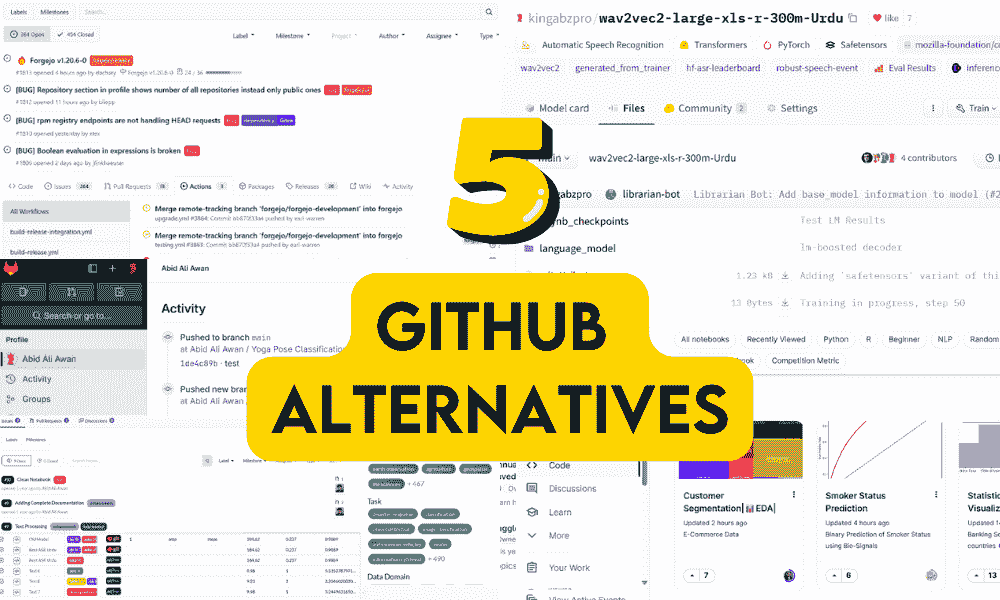
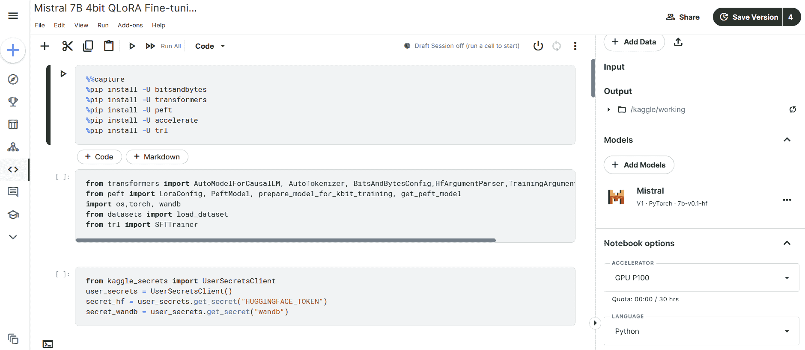
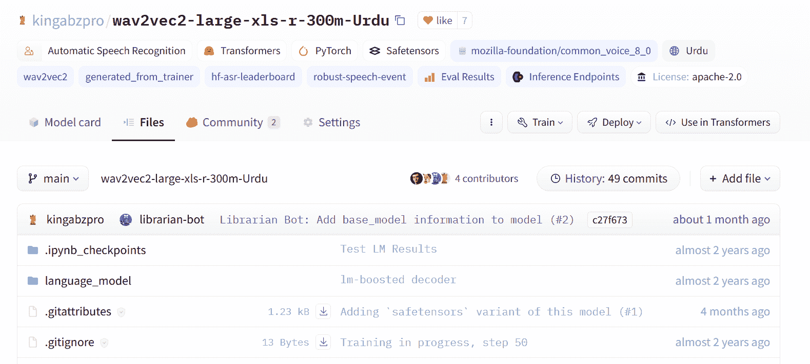
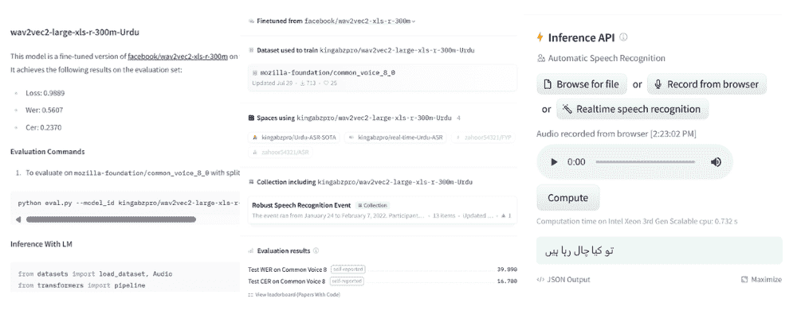
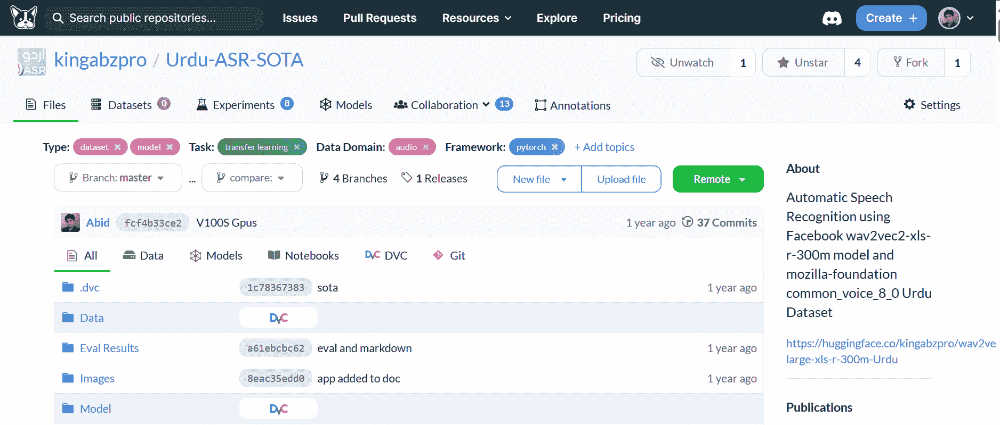
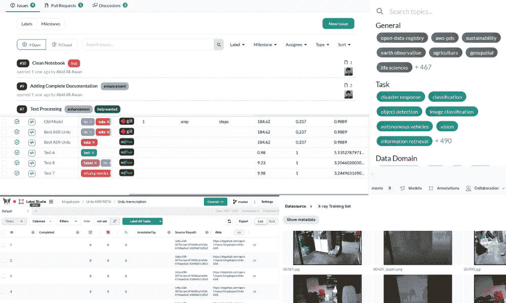
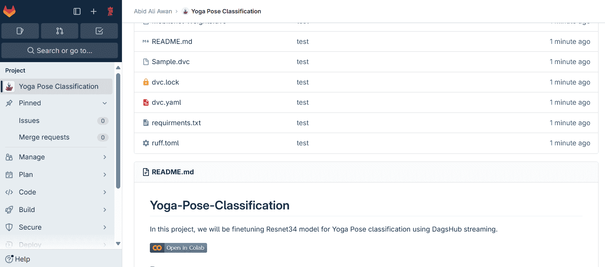
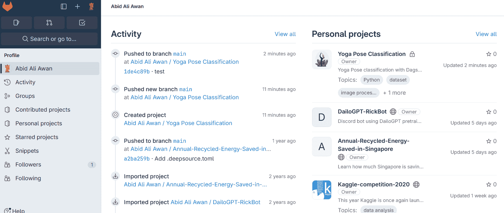
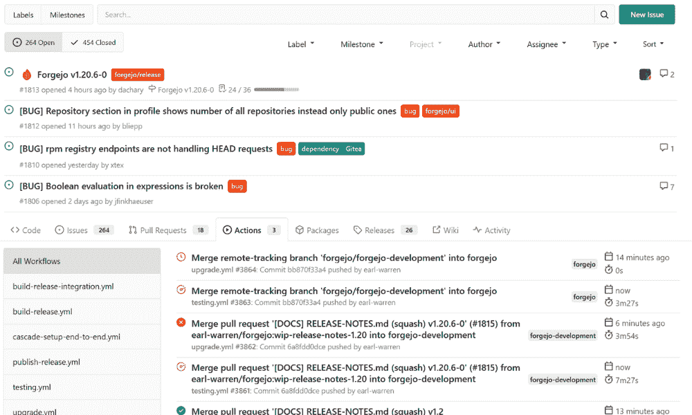

# GitHub 在数据科学项目中的前五大替代平台

> 原文：[`www.kdnuggets.com/the-top-5-alternatives-to-github-for-data-science-projects`](https://www.kdnuggets.com/the-top-5-alternatives-to-github-for-data-science-projects)

作者提供的图片

GitHub 长期以来一直是开发者，特别是数据科学社区的首选平台。它提供了强大的版本控制和协作功能。然而，数据科学家往往有独特的需求，如处理大型数据集、复杂的工作流程以及特定的协作需求，而 GitHub 可能无法完全满足这些需求。这导致了替代平台的兴起，每个平台都提供了独特的功能和优势。

* * *

## 我们的前三个课程推荐

 1\. [Google 网络安全证书](https://www.kdnuggets.com/google-cybersecurity) - 快速进入网络安全职业轨道。

 2\. [Google 数据分析专业证书](https://www.kdnuggets.com/google-data-analytics) - 提升你的数据分析技能

 3\. [Google IT 支持专业证书](https://www.kdnuggets.com/google-itsupport) - 支持你组织的 IT 需求

* * *

在这篇博客中，我们深入探讨了五个特别适合数据科学项目的 GitHub 替代平台，提供了多样的协作、项目管理以及数据和模型处理选项。

# 1\. Kaggle

[Kaggle](https://www.kaggle.com/kingabzpro)在数据科学社区中以其独特的数据科学竞赛、数据集和协作环境而闻名。

该平台提供了大量数据集的访问机会，并允许数据科学家通过竞赛在现实场景中测试他们的技能。此外，我还可以编辑、运行和分享带有输出的代码笔记本。

图片来源于 Kaggle

我已经使用 Kaggle 三年了，我非常喜欢这个平台。它让我能够在免费的 GPU 和 TPU 上快速运行深度学习项目。借助它，我通过分享我的分析报告和机器学习项目，建立了一个强大的作品集。此外，我还参与了各种数据分析和机器学习竞赛，这帮助我提升了这些领域的技能。总的来说，Kaggle 是一个极好的资源，使我在个人和职业上都得到了成长。

如果你是数据科学领域的初学者，我强烈推荐从 Kaggle 开始，而不是 GitHub。Kaggle 提供了许多免费功能，这些功能对任何数据科学项目都是必不可少的。此外，你可以向他人学习，并在一个互帮互助的社区中直接提问。

图片来自 Kaggle

# 2\. Hugging Face

[Hugging Face](https://huggingface.co/kingabzpro)迅速成为自然语言处理（NLP）和机器学习领域最新发展的中心。它通过提供大量预训练模型以及一个用于训练和分享新模型的协作生态系统而脱颖而出。此外，上传数据集和免费部署机器学习网页应用变得非常简单。

在 Hugging Face 中，模型库类似于 GitHub，包含各种类型的信息，包括文件和模型。你可以附上研究论文、添加性能指标、使用模型构建演示，或创建推理。此外，现在你还可以像在 GitHub 中一样评论和提交拉取请求。

图片来自 Hugging Face

我经常使用 Hugging Face 来部署模型、上传训练模型，并建立一个强大的机器学习组合。我已经实现了深度强化学习、多语言语音识别和大型语言模型。

这个平台主要面向社区，其一个重要特点是大部分功能是免费的。然而，如果你拥有先进的模型，甚至可以申请付费功能。这使得它成为任何希望成为 ML 工程师或 NLP 工程师的人的首选平台。

图片来自 Hugging Face

# 3\. DagsHub

[DagsHub](https://dagshub.com/kingabzpro)是一个专为数据科学家和机器学习工程师量身定制的平台，专注于管理和协作数据科学项目的独特需求。它提供了出色的工具来版本控制不仅是代码，还有数据集和 ML 模型，解决了这一领域的一个共同挑战。

该平台与流行的数据科学工具集成良好，使从其他环境的过渡变得顺畅。DagsHub 的突出特点是其社区方面，提供了一个数据科学家可以协作和分享见解的空间，对于那些希望与同行互动的人来说，这是一种特别有吸引力的选择。

图片来自 DagsHub

我非常喜欢 DagsHub，因为它在上传和访问数据和模型方面提供了用户友好的方法。DagsHub 提供了简单的 API 和 GUI，使你可以轻松上传和访问数据和模型。此外，它提供了用于实验跟踪和模型注册的 MLFlow 实例。它还提供了免费的 Label Studio 实例来标记你的数据。它是满足你所有机器学习需求的一体化平台。DagsHub 还提供了第三方集成，如 S3 桶、新遗迹、Jenkins 和 Azure blob 存储。

图片来自 DagsHub

# 4\. GitLab

[GitLab](https://gitlab.com/kingabzpro) 是所有技术专业人员的一个良好替代品。它提供强大的版本控制和协作、CI/CD、项目管理和问题跟踪、安全和合规、分析和洞察、Webhooks 和 REST API、Pages 等功能。

这个平台是开发者和数据科学家构建无缝工作流自动化的理想解决方案，从数据收集到模型部署。它还提供强大的问题跟踪和项目管理工具，这对于协调复杂的数据科学项目至关重要。

图片来自 GitLab

过去三年我一直在使用 GitLab，主要是为了熟悉这个平台并将我的静态网站从 GitHub 迁移到 GitLab。GitLab 的用户界面易于理解，并且为免费用户提供了广泛的工具。此外，你可以选择免费托管自己的 [GitLab Community Edition 实例](https://gitlab.com/rluna-gitlab/gitlab-ce)，让你对项目拥有完全的控制权。

就像 GitHub 一样，GitLab 也可以用作你的数据科学项目的作品集。你可以将所有工作上传并集中分享，它甚至拥有更好的协作工具，适用于更大更复杂的项目。即使你已经对 GitHub 满意，GitLab 也是一个你绝对应该考虑的强大平台。

图片来自 GitLab

# 5\. Codeberg

[Codeberg.org](https://codeberg.org/kingabzpro) 作为一个非营利性、社区驱动的平台，其强烈强调开源和隐私。它提供了一个简单、用户友好的界面，适合那些寻找简单直观的代码托管解决方案的用户。对于重视开源价值和数据隐私的数据科学家来说，Codeberg 是一个有吸引力的替代方案。

图片来自 Codeberg

它提供 CI/CD 解决方案、Pages、SSH 和 GPG、webhooks、第三方集成以及各种项目的协作工具，类似于 GitHub。

在安装 Librewolf 时，我发现了 Codeberg 和 Forgejo。它们提供类似 GitHub 的体验以及简化的工作流自动化。我强烈推荐尝试一下，用于托管你的项目。

图片来源于 Codeberg

# 结论

这些平台各自提供了数据科学家所需的独特功能和优势。GitLab 擅长集成的工作流管理，DagsHub 和 Hugging Face 适合机器学习项目托管和协作，Kaggle 提供互动的学习和竞赛环境，而 Codeberg 强调开源和隐私。根据具体需求，无论是高级项目管理、社区互动、专业工具还是对开源原则的承诺，数据科学家都可以在这些选项中找到适合的 GitHub 替代方案。

****[Abid Ali Awan](https://www.polywork.com/kingabzpro)**** ([@1abidaliawan](https://www.linkedin.com/in/1abidaliawan)) 是一位认证数据科学专业人士，热衷于构建机器学习模型。目前，他专注于内容创作，并撰写有关机器学习和数据科学技术的技术博客。Abid 拥有技术管理硕士学位和电信工程学士学位。他的愿景是利用图神经网络构建一款 AI 产品，帮助那些在精神疾病方面挣扎的学生。

### 更多相关内容

+   [GitHub Copilot 开源替代方案](https://www.kdnuggets.com/2021/07/github-copilot-open-source-alternatives-code-generation.html)

+   [数据科学的前 7 个 VSCode 替代方案](https://www.kdnuggets.com/top-7-alternatives-to-vscode-for-data-science)

+   [GPT-4 的 5 个免费替代方案](https://www.kdnuggets.com/top-5-free-alternatives-to-gpt4)

+   [数据协调的 5 个 Airflow 替代方案](https://www.kdnuggets.com/5-airflow-alternatives-for-data-orchestration)

+   [从这些 GitHub 仓库学习数据科学](https://www.kdnuggets.com/2022/12/learn-data-science-github-repositories.html)

+   [掌握数据科学的 10 个 GitHub 仓库](https://www.kdnuggets.com/10-github-repositories-to-master-data-science)
