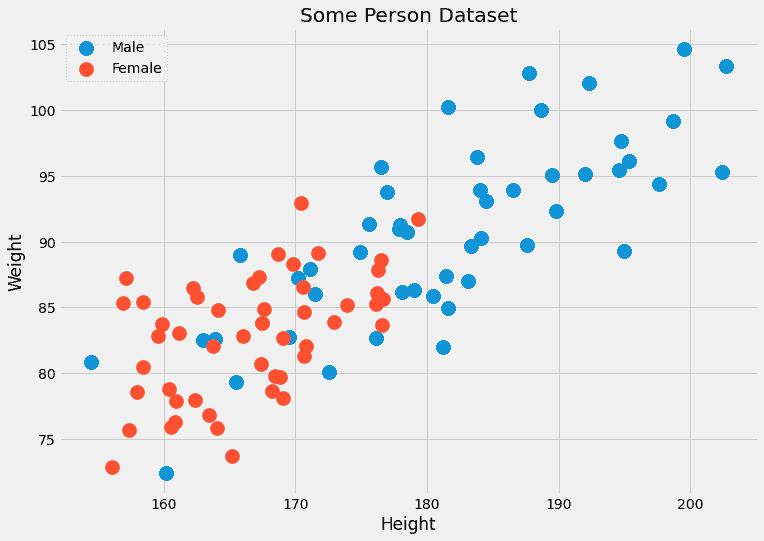
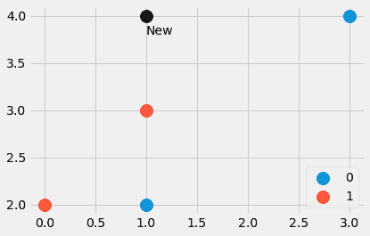
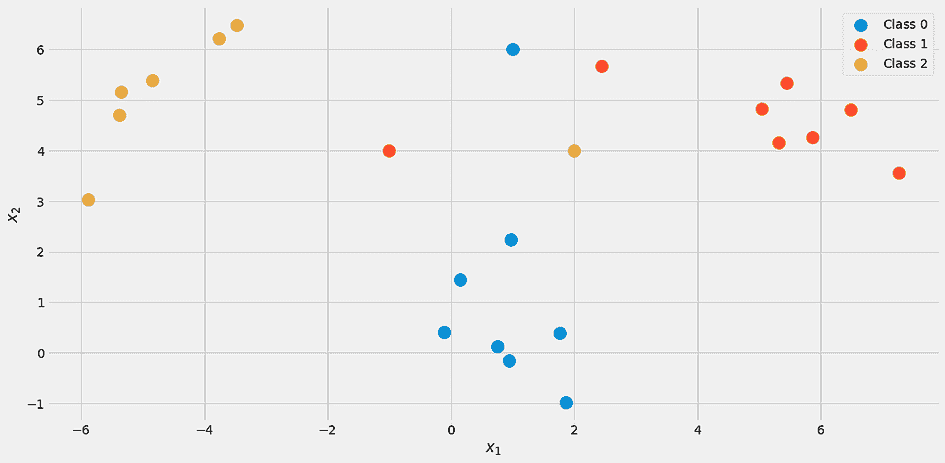
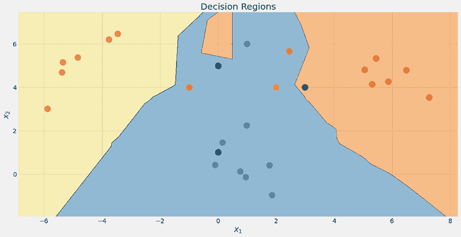
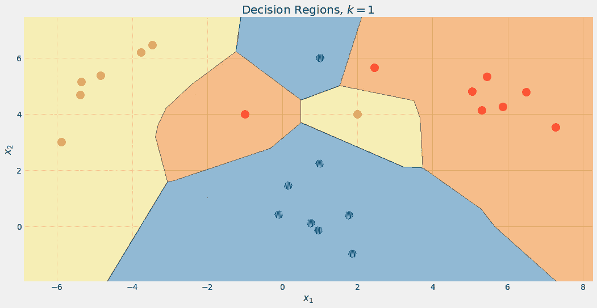
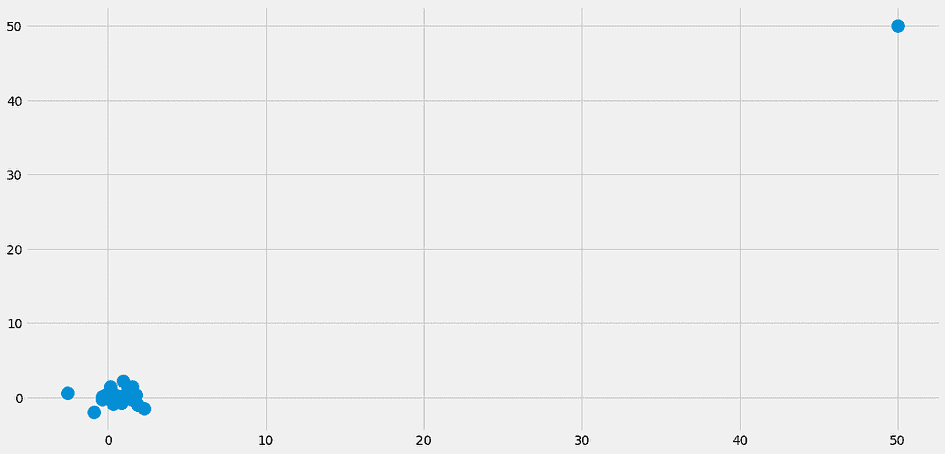

# 从理论到实践：构建 *k*-最近邻分类器

> 原文：[`www.kdnuggets.com/2023/06/theory-practice-building-knearest-neighbors-classifier.html`](https://www.kdnuggets.com/2023/06/theory-practice-building-knearest-neighbors-classifier.html)

又一天，又一个经典算法：*k*-最近邻。与[朴素贝叶斯分类器](https://towardsdatascience.com/learning-by-implementing-gaussian-naive-bayes-3f0e3d2c01b2)一样，这是一个解决分类问题的相当简单的方法。该算法直观易懂，训练时间无与伦比，这使得它成为你刚开始机器学习生涯时的一个很好的学习对象。话虽如此，做出预测的速度非常慢，尤其是对于大数据集。由于[维度灾难](https://en.wikipedia.org/wiki/Curse_of_dimensionality)，对于具有许多特征的数据集，性能也可能并不令人印象深刻。

在本文中，你将学到

+   *k*-最近邻分类器的工作原理

+   其设计原因

+   其严重缺陷的原因，以及，

+   如何使用 NumPy 在 Python 中实现它。

* * *

## 我们的前三大课程推荐

 1\. [谷歌网络安全证书](https://www.kdnuggets.com/google-cybersecurity) - 快速进入网络安全职业轨道。

 2\. [谷歌数据分析专业证书](https://www.kdnuggets.com/google-data-analytics) - 提升你的数据分析技能

 3\. [谷歌 IT 支持专业证书](https://www.kdnuggets.com/google-itsupport) - 支持你的组织 IT

* * *

由于我们将以符合 scikit-learn 的方式实现分类器，因此查看我的文章[构建你自己的自定义 scikit-learn 回归](https://towardsdatascience.com/build-your-own-custom-scikit-learn-regression-5d0d718f289)也很值得。不过，scikit-learn 的开销相当小，你应该仍然能够跟上进度。

> *你可以在*[*我的 Github*](https://github.com/Garve/TDS/blob/main/TDS%20-%20KNN.ipynb)*上找到代码。*

# 理论

该分类器的主要思想非常简单。它直接来源于分类的基本问题：

> 给定一个数据点 x，x 属于某个类别 c 的概率是多少？

在数学语言中，我们寻找条件概率 *p*(*c*|*x*)。虽然[朴素贝叶斯分类器](https://towardsdatascience.com/learning-by-implementing-gaussian-naive-bayes-3f0e3d2c01b2)尝试通过一些假设直接建模这一概率，但还有另一种直观的方法来计算这一概率——频率主义的概率观点。

## 概率的朴素观点

好的，那这现在意味着什么呢？让我们考虑以下简单示例：你掷一个六面骰子，并想要计算掷出六点的概率，即 *p*(掷到 6 点)。怎么做呢？好吧，你掷骰子 *n* 次，记录下它掷出六点的次数。如果你看到六点的次数是 *k*，你可以说看到六点的概率是 **大约 *k*/*n***。这没什么新奇的，对吧？

现在，假设我们想计算一个条件概率，例如

> p(掷到 6 点 | 掷到偶数)

你不需要[贝叶斯定理](https://en.wikipedia.org/wiki/Bayes%27_theorem)来解决这个问题。只需再次掷骰子，并忽略所有奇数的结果。这就是条件作用的方式：过滤结果。如果你掷了骰子*n*次，看到*m*个偶数，其中*k*个是六点，那么上面的概率是**大约 *k*/*m***，而不是 *k*/*n*。

## 激励 k-最近邻

回到我们的问题。我们想要计算 *p*(*c*|*x*)，其中 *x* 是包含特征的向量， *c* 是某个类别。就像骰子例子中一样，我们

+   需要大量的数据点，

+   过滤掉特征为 *x* 的数据点

+   检查这些数据点属于类别*c*的频率。

相对频率是我们对概率 *p*(*c*|*x*) 的猜测。

> 你看到这里的问题了吗？

**通常，我们没有很多具有相同特征的数据点。** 经常只有一个，可能两个。例如，想象一个数据集，其中包含两个特征：人的身高（以厘米为单位）和体重（以公斤为单位）。标签为*男性*或*女性*。因此，*x=*(*x*？， *x*？) 其中 *x*？是身高， *x*？是体重，*c* 可以取值为男性和女性。我们来看一些虚拟数据：



作者提供的图片。

由于这两个特征是连续的，拥有两个数据点，更不用说几个数据点的概率是微不足道的。

**另一个问题：** 如果我们想预测一个具有我们从未见过的特征的数据点的性别，比如 (190.1, 85.2)，会发生什么？这就是预测的实际意义。这就是为什么这种简单的方法不起作用。*k*-最近邻算法的做法如下：

> 它尝试通过具有接近 *x* 特征的数据点来逼近概率 *p*(*c*|*x*)，而不是具有**完全相同**特征的数据点。

**在某种意义上，这不那么严格。** 与其等待许多身高=182.4 和体重=92.6 的人并检查他们的性别，*k*-最近邻允许考虑*接近*这些特征的人。算法中的 *k* 是我们考虑的人数，它是一个*超参数*。

> 这些是我们或类似网格搜索的超参数优化算法需要选择的参数。它们不是由学习算法直接优化的。


图片由作者提供。

## 算法

现在我们已经拥有描述算法所需的一切。

**训练：**

1.  **组织**训练数据。预测时，这种顺序应该使我们能够为任何给定的数据点*x*提供*k*个最近点。

1.  就这样了！????

**预测：**

1.  对于一个新的数据点*x*，在组织好的训练数据中找到*k*个**最近邻**。

1.  **汇总**这些*k*个邻居的标签。

1.  输出标签/概率。

我们目前还无法实现这一点，因为我们需要填补很多空白。

+   组织意味着什么？

+   我们如何衡量接近度？

+   如何汇总？

除了*k*的值，这些都是我们可以选择的东西，不同的决策会给我们不同的算法。让我们简单一点，按以下方式回答问题：

+   组织 = 只是按原样保存训练数据集

+   接近度 = 欧几里得距离

+   汇总 = 平均

这需要一个示例。让我们再看看包含个人数据的图片。


我们可以看到，离黑点最近的*k*=5 个数据点有 4 个男性标签和 1 个女性标签。所以我们可以输出黑点对应的人实际上是 4/5=80%男性和 1/5=20%女性。如果我们希望单一类别作为输出，我们将返回男性。没问题！

现在，让我们实现它。

# 实现

最困难的部分是找到一个点的最近邻。

## 简要入门

让我们做一个小示例，展示如何在 Python 中实现这一点。我们从

```py
import numpy as np

features = np.array([[1, 2], [3, 4], [1, 3], [0, 2]])
labels = np.array([0, 0, 1, 1])

new_point = np.array([1, 4])
```



图片由作者提供。

我们创建了一个由四个数据点以及另一个点组成的小数据集。哪个点是最近的？新点应该有标签 0 还是 1？让我们找出答案。输入

```py
distances = ((features - new_point)**2).sum(axis=1)
```

给我们四个值 `distances=[4, 4, 1, 5]`，这就是从`new_point`到`features`中所有其他点的**平方**欧几里得距离。太棒了！我们可以看到点编号三是最近的，其次是点编号一和二。第四个点是最远的。

现在我们如何从数组 [4, 4, 1, 5] 中提取最近的点？`distances.argsort()` 帮助我们。结果是 [2, 0, 1, 3]，这告诉我们索引为 2 的数据点最小（即点编号三），接着是索引为 0 的点，然后是索引为 1 的点，最后是索引为 3 的点最大。

注意，`argsort`将`distances`中的前 4 个排在第二个 4 之前。根据排序算法的不同，这也可能是相反的，但在这篇介绍文章中我们不深入这些细节。

如果我们想要三个最近邻，例如，我们可以通过以下方式获得它们

```py
distances.argsort()[:3]
```

标签对应于这些最近点，通过

```py
labels[distances.argsort()[:3]]
```

我们得到[1, 0, 0]，其中 1 是最接近(1, 4)的点的标签，零是属于接下来的两个最近点的标签。

这就是我们需要的一切，让我们进入正题。

## 最终代码

你应该对代码很熟悉。唯一的新函数是`np.bincount`，用于计算标签的出现次数。请注意，我首先实现了`predict_proba`方法来计算概率。`predict`方法只是调用这个方法，并使用`argmax`函数返回概率最高的索引（即类别）。该类接受从 0 到*C*-1 的类别，其中*C*是类别的数量。

**免责声明：** 这段代码并未经过优化，仅用于教育目的。

```py
import numpy as np
from sklearn.base import BaseEstimator, ClassifierMixin
from sklearn.utils.validation import check_X_y, check_array, check_is_fitted

class KNNClassifier(BaseEstimator, ClassifierMixin):
    def __init__(self, k=3):
        self.k = k

    def fit(self, X, y):
        X, y = check_X_y(X, y)
        self.X_ = np.copy(X)
        self.y_ = np.copy(y)
        self.n_classes_ = self.y_.max() + 1

        return self

    def predict_proba(self, X):
        check_is_fitted(self)
        X = check_array(X)

        res = []
        for x in X:
            distances = ((self.X_ - x)**2).sum(axis=1)
            smallest_distances = distances.argsort()[:self.k]
            closest_labels = self.y_[smallest_distances]
            count_labels = np.bincount(
                closest_labels,
                minlength=self.n_classes_
            )

            res.append(count_labels / count_labels.sum())

        return np.array(res)

    def predict(self, X):
        check_is_fitted(self)
        X = check_array(X)

        res = self.predict_proba(X)

        return res.argmax(axis=1)
```

就这样！我们可以做一个小测试，看看它是否与 scikit-learn 的*k*-最近邻分类器一致。

## 测试代码

让我们创建另一个小数据集进行测试。

```py
from sklearn.datasets import make_blobs
import numpy as np

X, y = make_blobs(n_samples=20, centers=[(0,0), (5,5), (-5, 5)], random_state=0)
X = np.vstack([X, np.array([[2, 4], [-1, 4], [1, 6]])])
y = np.append(y, [2, 1, 0])
```

它看起来是这样的：



图片由作者提供。

使用我们的分类器，*k*=3

```py
my_knn = KNNClassifier(k=3)
my_knn.fit(X, y)

my_knn.predict_proba([[0, 1], [0, 5], [3, 4]])
```

我们得到

```py
array([[1\.        , 0\.        , 0\.        ],
       [0.33333333, 0.33333333, 0.33333333],
       [0\.        , 0.66666667, 0.33333333]])
```

**按以下方式读取输出：** 第一个点 100%属于类别 1，第二个点在每个类别中均为 33%，第三个点大约 67%属于类别 2 和 33%属于类别 3。

如果你想要具体的标签，可以尝试

```py
my_knn.predict([[0, 1], [0, 5], [3, 4]])
```

输出为[0, 0, 1]。注意，在出现平局的情况下，我们实现的模型输出的是较低的类别，因此点(0, 5)被分类为类别 0。

如果你查看这张图片，它是有意义的。但让我们借助 scikit-learn 来确认一下。

```py
from sklearn.neighbors import KNeighborsClassifier

knn = KNeighborsClassifier(n_neighbors=3)
knn.fit(X, y)

my_knn.predict_proba([[0, 1], [0, 5], [3, 4]])
```

结果：

```py
array([[1\.        , 0\.        , 0\.        ],
       [0.33333333, 0.33333333, 0.33333333],
       [0\.        , 0.66666667, 0.33333333]])
```

呼！一切看起来都很好。让我们检查一下算法的决策边界，只是因为它很好看。



图片由作者提供。

再次说明，顶部黑点并非 100%为蓝色。它是 33%蓝色、红色和黄色，但算法决定性地选择最低类别，即蓝色。

我们还可以检查不同*k*值的决策边界。



图片由作者提供。

注意，最终蓝色区域变大，因为该类别受到优待。我们还可以看到，对于*k*=1 时，边界非常混乱：模型**过拟合**。另一方面，当*k*与数据集大小相等时，所有点都用于聚合步骤。因此，每个数据点得到相同的预测：多数类别。在这种情况下，模型**欠拟合**。最佳点在两者之间，并可以通过超参数优化技术找到。

在结束之前，让我们看看这个算法有哪些问题。

# k-最近邻的缺点

问题如下：

1.  查找最近邻需要很多时间，尤其是使用我们简单的实现时。如果我们想预测新数据点的类别，就必须将其与数据集中每一个点进行比较，这很慢。有更好的方式来组织数据，使用高级数据结构，但问题仍然存在。

1.  问题 1 的后续：通常，你在更快、更强大的计算机上训练模型，然后将模型部署到较弱的机器上。例如，深度学习就是这样。但对于*k*-最近邻，训练时间很短，重的工作在预测时完成，这不是我们想要的。

1.  如果最近邻完全不接近会发生什么？那它们就没有意义了。这在特征数量较少的数据集中就可能发生，但特征更多时遇到这个问题的机会会急剧增加。这也被称为维度诅咒。可以在[this post of Cassie Kozyrkov](https://towardsdatascience.com/the-curse-of-dimensionality-minus-the-curse-of-jargon-520da109fc87)中找到很好的可视化。



特别是因为问题 2，你在实际应用中不常见到*k*-最近邻分类器。它仍然是一个你应该了解的不错算法，你也可以用于小数据集，这没有问题。但如果你有数百万个数据点和数千个特征，情况就会很严峻。

# 结论

在这篇文章中，我们讨论了*k*-最近邻分类器如何工作以及它的设计为什么有意义。它尝试使用离*x*最近的数据点尽可能准确地估计数据点*x*属于类别*c*的概率。这是一种非常自然的方法，因此这个算法通常在机器学习课程开始时教授。

> 请注意，构建一个*k*-最近邻**回归器**也非常简单。与计算类别的出现次数不同，只需对最近邻的标签取平均值即可获得预测结果。你可以自己实现这个，改动很小！

我们以一种直接的方式实现了它，模仿了 scikit-learn 的 API。这意味着你也可以在 scikit-learn 的管道和网格搜索中使用这个估计器。这是一个很大的好处，因为我们甚至有超参数*k*，你可以使用网格搜索、随机搜索或贝叶斯优化来优化。

然而，这个算法存在一些严重的问题。它不适用于大型数据集，且无法在较弱的机器上进行预测。再加上对维度诅咒的敏感性，它是一个理论上不错但仅适用于较小数据集的算法。

**[罗伯特·库布勒博士](https://www.linkedin.com/in/robert-kuebler/)** 是 METRO.digital 的数据科学家和 Towards Data Science 的作者。

[原文](https://towardsdatascience.com/understanding-by-implementing-k-nearest-neighbors-469d6f84b8a9)。转载已获许可。

### 更多相关内容

+   [分类的最近邻算法](https://www.kdnuggets.com/2022/04/nearest-neighbors-classification.html)

+   [Scikit-learn 中的 K 近邻算法](https://www.kdnuggets.com/2022/07/knearest-neighbors-scikitlearn.html)

+   [数据可视化：理论与技术](https://www.kdnuggets.com/data-visualization-theory-and-techniques)

+   [数据科学中的统计学：理论与概述](https://www.kdnuggets.com/statistics-in-data-science-theory-and-overview)

+   [理解监督学习：理论与概述](https://www.kdnuggets.com/understanding-supervised-learning-theory-and-overview)

+   [机器学习评估指标：理论与概述](https://www.kdnuggets.com/machine-learning-evaluation-metrics-theory-and-overview)
