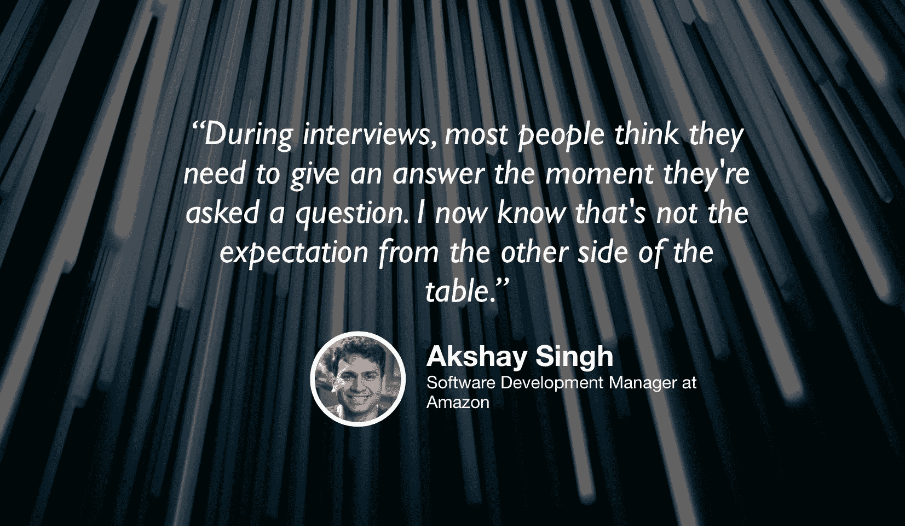

# 数据科学与数据工程之间的细微差别

> 原文：[`www.kdnuggets.com/2019/09/thin-line-between-data-science-data-engineering.html`](https://www.kdnuggets.com/2019/09/thin-line-between-data-science-data-engineering.html)

评论

*编辑注：这是“Climbing the Data Science Ladder”播客系列的第四集，由 Jeremie Harris、Edouard Harris 和 Russell Pollari 主持。他们共同经营一个名为*[*SharpestMinds*](http://sharpestminds.com/)*的数据科学辅导初创公司。你可以在下面收听播客：*

* * *

## 我们的三大课程推荐

 1\. [谷歌网络安全证书](https://www.kdnuggets.com/google-cybersecurity) - 快速进入网络安全职业生涯。

 2\. [谷歌数据分析专业证书](https://www.kdnuggets.com/google-data-analytics) - 提升你的数据分析技能

 3\. [谷歌 IT 支持专业证书](https://www.kdnuggets.com/google-itsupport) - 支持你所在组织的 IT

* * *

如果你在过去几年关注数据科学的发展，你会知道这个领域自 2010 年代初期/中期的“狂野西部”阶段以来，已经发生了很大的变化。那时，几份包含半成品建模项目的 Jupyter 笔记本就能让你在一家体面的公司找到工作，但现在情况已经发生了很大变化。

今天，随着公司们终于认识到数据科学所能带来的价值，对数据科学在生产系统中实施的重视程度越来越高。而这些实施需要能够在实时处理越来越大数据集的模型，因此，很多数据科学问题已变成工程问题。

这就是为什么我们与 Akshay Singh 坐下来讨论，他曾在亚马逊、League 和 Chan-Zuckerberg Initiative（前身为 Meta.com）工作和管理数据科学团队等多个领域。Akshay 在数据科学和数据工程的交汇处工作，并向我们讲解了数据分析与数据科学之间的细微差别、该领域的未来，以及他对那些未受到足够重视的最佳实践的看法。以下是我们的主要收获：

+   在数据工程中最容易犯的一个错误就是没有深入考虑工具的选择。你为什么使用 S3 作为数据仓库？为什么不使用 Redshift 或 BigQuery？逼迫自己理解这些问题的答案，而不是接受工具的现成配置，是一个很好的成长方式，而且如果你想给潜在雇主留下深刻印象，这一点至关重要。

+   总是要假设你现在构建的任何东西都会在一年或更短时间内被替代。生产系统不是静态的，你或其他人迟早会不得不重新审视代码库的大部分。这就是为什么学习如何使用文档字符串、使用清晰的函数和变量名称，以及理解关于内联注释的最佳实践如此重要。

+   数据会随着时间的推移发生漂移，一个在今天的数据上表现良好的模型可能在下周表现不佳。这可能由于许多因素：季节性是一个，但用户行为也可能会发生变化。Akshay 建议说，实时收集用户反馈是解决这个问题的关键：如果你发现他们的反馈意外地变得负面，构建一个警报系统，让你知道有些地方不对劲。

+   大局是需要记住的最重要的事情。很容易陷入技术问题，但伟大的数据科学家的标志是能够停下来问这个问题是否值得解决。你真的需要一个推荐系统，还是一个简单的基于规则的系统同样有效？如果你无法访问监督学习模型所需的确切训练标签，你能否拼凑出一个不错的替代品？现实世界是混乱的，通常要求你用比 Kaggle 竞赛更多的创造力来处理数据科学问题。

+   看到大局的重要性随着时间的推移只会越来越显著，因为数据科学家的工作量正通过越来越强大的工具被逐步抽象化。数据科学正慢慢地变成一种产品角色。

### [TDS 播客 — 剪辑](https://youtu.be/kA5LCMsr87w)

如果你在 Twitter 上，随时可以联系我 [@jeremiecharris](https://twitter.com/jeremiecharris)!

[原文](https://towardsdatascience.com/the-thin-line-between-data-science-and-data-engineering-2e6bd922fe35)。经许可转载。

**相关内容:**

+   关于 AI、分析、数据科学、机器学习的十大最佳播客

+   构建高效数据科学团队

+   数据工程师新手在 Google BigQuery 中的 7 个“陷阱”

### 更多相关内容

+   [数据编排：生成 AI 成功与失败的分界线…](https://www.kdnuggets.com/2024/07/astronomer/data-orchestration-the-dividing-line-between-generative-ai-success-and-failure)

+   [梦想与现实之间：生成文本与幻觉](https://www.kdnuggets.com/between-dreams-and-reality-generative-text-and-hallucinations)

+   [数据科学与命令行：免费电子书](https://www.kdnuggets.com/2022/03/data-science-command-line-free-ebook.html)

+   [数据科学的 5 种命令行工具](https://www.kdnuggets.com/2023/03/5-command-line-tools-data-science.html)

+   [数据分析师与数据科学家之间的区别是什么？](https://www.kdnuggets.com/2022/03/difference-data-analysts-data-scientists.html)

+   [机器学习中训练数据与测试数据的区别](https://www.kdnuggets.com/2022/08/difference-training-testing-data-machine-learning.html)
