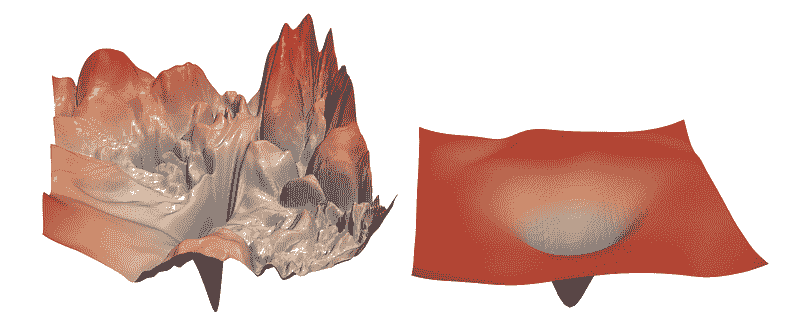
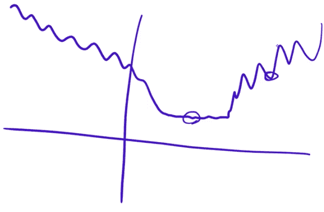
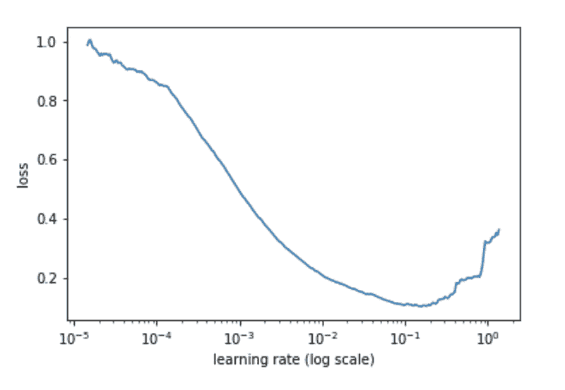
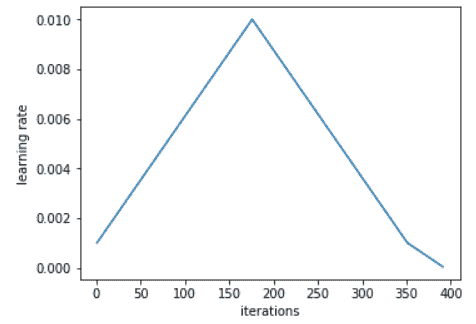
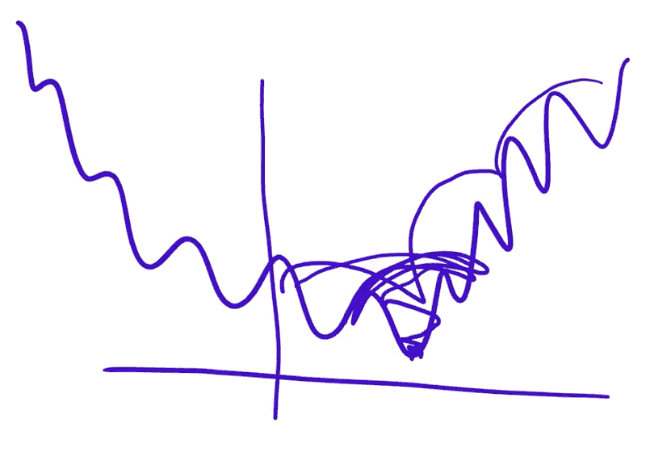

# 从 fast.ai 课程 V3 中学到的 10 个新知识

> 原文：[`www.kdnuggets.com/2019/06/things-learnt-fastai-course.html`](https://www.kdnuggets.com/2019/06/things-learnt-fastai-course.html)

 评论

**由[Raimi Bin Karim](https://www.linkedin.com/in/raimibkarim/)，AI Singapore**

大家都在谈论**fast.ai**的大规模开放在线课程（MOOC），所以我决定尝试一下他们 2019 年的深度学习课程[实用深度学习（程序员版）v3](https://course.fast.ai/)。

我一直了解一些深度学习概念/想法（我已经在这个领域待了一年，主要处理计算机视觉），但从未真正理解过一些直觉或解释。我也了解到[Jeremy Howard](https://medium.com/@jeremyphoward)、[Rachel Thomas](https://medium.com/@racheltho)和 Sylvain Gugger（关注他们的 Twitter！）是深度学习领域的影响力人物（Jeremy 有丰富的 Kaggle 竞赛经验），所以我希望从他们那里获得新的见解和直觉，并得到一些模型训练的技巧和窍门。我有很多东西要向这些人学习。

所以，我在观看视频 3 周后（我没有做任何练习 ????????????????)，写下这篇文章来将**我学到的** **新知识**进行整理与分享。当然，也有一些我一头雾水的内容，所以我做了一些额外的研究，并在这篇文章中呈现。最后，我也写了一下对这门课程的感受（剧透：我喜欢它❣️）。

**免责声明** 不同的人会有不同的学习要点，这取决于你有何种深度学习背景。此文不适合深度学习初学者，也**不是课程内容的总结**。这篇文章假设你已具备神经网络、梯度下降、损失函数、正则化技术和生成嵌入的基础知识。以下经验也很有帮助：图像分类、文本分类、语义分割和生成对抗网络。

我将我的 10 个学习要点内容组织如下：从神经网络理论，到架构，再到与损失函数（学习率、优化器）相关的内容，到模型训练（及正则化），再到深度学习任务，最终到模型可解释性。

**目录：10 个*新*知识点**

1.  通用逼近定理

1.  神经网络：设计与架构

1.  理解损失景观

1.  梯度下降优化器

1.  损失函数

1.  训练

1.  正则化

1.  任务

1.  模型可解释性

1.  附录：Jeremy Howard 谈模型复杂性与正则化

### **0. Fast.ai & 转移学习**

> “如果可以，使用转移学习[来训练你的模型]总是好的。” — Jeremy Howard

Fast.ai 等同于迁移学习，并在短时间内取得出色成果。这个课程真的名副其实。迁移学习和实验主义是 Jeremy Howard 强调的两个关键理念，以便成为高效的机器学习从业者。

### **1\. 通用逼近定理**

图片来源：[Vincentiu Solomon](https://unsplash.com/photos/ln5drpv_ImI?utm_source=unsplash&utm_medium=referral&utm_content=creditCopyText) 在 [Unsplash](https://unsplash.com/search/photos/astronomy?utm_source=unsplash&utm_medium=referral&utm_content=creditCopyText)

[通用逼近定理](https://en.wikipedia.org/wiki/Universal_approximation_theorem) 说明你可以用一个隐藏层的前馈神经网络来逼近*任何*函数。由此可见，你也可以对任何更深层的神经网络实现相同类型的逼近。

我的意思是，哇！我刚刚才知道这个，*现在*才知道。这 *是* 深度学习的基础。如果你有堆叠的仿射函数（或矩阵乘法）和非线性函数，最终得到的结果可以逼近任何函数。这是追求不同仿射函数和非线性组合的原因。这也是架构越来越深的*原因*。

### **2\. 神经网络：设计与架构**

在这一部分，我将重点介绍在课程中受到关注的架构，以及像丢弃法这样的最先进（SOTA）模型中纳入的一些设计。

+   **ResNet-50** 几乎是最先进的，因此你通常会希望在许多图像相关任务中使用它，比如图像分类和目标检测。这个架构在课程的 Jupyter 笔记本中使用得很频繁。

+   **U-net** 几乎是图像分割任务中的最先进技术。

+   对于卷积神经网络（CNNs），前几层常见使用步幅=2 的卷积。

+   DenseNet 在构建块的最终操作中使用了拼接，而 ResNet 使用了加法操作。

+   **丢弃法**

    我们随机丢弃 *激活*。直观理解：这样没有任何激活可以记住输入的任何部分。这有助于解决过拟合问题，其中模型的某一部分基本上是在学习识别特定图像，而不是特定特征或项目。还有 **嵌入丢弃**，但这一点只是略微提及。

+   **批量归一化（BatchNorm）**

    BatchNorm 做了 2 件事：（1）规范化激活值，（2）为每个规范化的激活值引入缩放和平移参数。然而，结果表明（1）不如（2）重要。在论文 [Batch Normalization 如何帮助优化？](https://t.co/mvCCL1DLYF) 中提到，“[BatchNorm] 重新参数化了底层优化问题，使其景观显著平滑。” 直观上讲：因为它现在不那么崎岖，我们可以使用更高的学习率，因此收敛更快（见图 3.1）。

### 3\. 理解损失景观

图 3.1：损失景观；左侧景观有很多凸起，右侧则是平滑的景观。来源：[`arxiv.org/abs/1712.09913`](https://arxiv.org/abs/1712.09913)

损失函数通常有崎岖和平坦区域（如果你将其可视化为二维或三维图）。看看图 3.2。如果你进入一个 *崎岖* 区域，该解决方案通常不会很好地泛化。这是因为你找到的解决方案在一个地方很好，但在其他地方不太好。但如果你在 *平坦* 区域找到了解决方案，你可能会有很好的泛化能力。这是因为你找到的解决方案不仅在一个点很好，而且在 *周围* 也很好。

图 3.2：在二维图中可视化的损失景观。截取自 course.fast.ai。以上大部分内容引自 Jeremy Howard。这是一个简单而美丽的解释。

### **4\. 梯度下降优化器**

我学到的新知识是 RMSprop 优化器充当了“加速器”。直观理解：如果你的梯度在过去几步中很小，很明显你现在需要加快一点速度。

（有关梯度下降优化器的概述，我写了一篇题为 [10 Gradient Descent Optimisation Algorithms](https://towardsdatascience.com/10-gradient-descent-optimisation-algorithms-86989510b5e9) 的文章。）

### **5\. 损失函数**

学习了 2 个新的损失函数：

1.  像素均方误差 (**Pixel MSE**)。这可以用于语义分割，这是课程内容之一，但本文没有涵盖。

1.  **特征损失 ????**。这可以用于图像恢复任务。见任务：图像生成。

### ****6\. 训练****

图片由 [Victor Freitas](https://www.pexels.com/@victorfreitas?utm_content=attributionCopyText&utm_medium=referral&utm_source=pexels) 提供，自 [Pexels](https://www.pexels.com/photo/man-about-to-lift-barbell-2261477/?utm_content=attributionCopyText&utm_medium=referral&utm_source=pexels)

本节探讨了一些调整的组合：

+   权重初始化

+   超参数设置

+   模型拟合/微调

+   其他改进

**迁移学习**

模型权重可以是（i）随机初始化的，或者（ii）通过一种称为 **转移学习** 的过程从预训练模型中转移来的。转移学习利用了预训练的权重。预训练的权重 *包含有用的信息*。

转移学习中的常见模型拟合方法如下：训练靠近输出的权重，并冻结其他层。

对于转移学习，使用 **与预训练模型相同的‘统计数据’** 是很重要的，例如，用某种偏差校正图像的 RGB 值。

**❤️ 1cycle 策略 ❤️**

这是我在这门课程中学到的最重要的知识。我一直以来对学习率掉以轻心。[找到一个好的学习率](https://sgugger.github.io/how-do-you-find-a-good-learning-rate.html) 非常重要，因为我们至少可以为梯度下降提供一个经过深思熟虑的学习率，而不是一个可能只是次优的直觉值。

Jeremy Howard 在他的代码中持续使用 `lr_finder()` 和 `fit_one_cycle()`，这让我困惑，因为它虽然效果很好，但我不知道为什么它能有效。所以我阅读了 Leslie Smith 的 [论文](https://arxiv.org/abs/1803.09820) 和 Sylvain Gugger 的 [博客文章](https://sgugger.github.io/the-1cycle-policy.html)（推荐阅读！），这就是 **1cycle** 的工作原理：

1\. 执行 **LR 范围测试**：用从小到大的（线性）学习率训练模型，从一个小值（10e-8）增加到一个大值（1 或 10）。绘制损失与学习率的图表，如下所示。

图 6.1：损失与学习率的关系。[来源： https://sgugger.github.io/how-do-you-find-a-good-learning-rate.html](https://sgugger.github.io/how-do-you-find-a-good-learning-rate.html)

2\. 选择最小和最大学习率。选择最大学习率时，查看图表并选择一个足够高的学习率，以获得较低的损失值（既不要太高也不要太低）。在这里，你可以选择 10e-2。选择最小学习率时，可以选择约低十倍的值。在这里，它是 10e-3。有关如何选择这些值的更多信息。

3\. 根据 **周期性学习率** 的周期数来拟合模型。一个周期是指你的训练过程通过从选择的最小学习率到选择的最大学习率，然后再返回到最小值的学习率。

来源： https://sgugger.github.io/the-1cycle-policy.html

那么我们为什么这样做呢？整个想法是这样的。在损失地形中，我们希望跳过凸起（因为我们不想陷入某个沟壑）。因此，在开始时增加学习率有助于模型跳出沟壑，探索函数表面，并尝试找到损失较低且区域不崎岖的地方（因为如果地形崎岖，模型会再次被推出）。这使得我们可以更快地训练模型。我们还往往会得到更具泛化能力的解决方案。

图 6.2：来自 course.fast.ai 的截图

**用于预训练模型的判别学习率**

使用超低学习率训练早期层，使用较高学习率训练后期层。这个想法是除了微小的调整外，不要剧烈改变几乎完美的预训练权重，对接近输出层的层进行更激进的训练。判别学习率是在 ULMFiT 中引入的。

**一个神奇的数字除数**

在 1cycle 拟合中，要获取最小学习率，将最大值除以 2.6⁴。这个数字适用于 NLP 任务。有关更多信息，请参见 https://course.fast.ai/videos/?lesson=4 的 33:30。

**用于超参数搜索的随机森林**

提到可以使用随机森林来搜索超参数。

**使用默认值**

使用库或实现论文代码时，使用默认超参数值，“不要做英雄”。

**针对预训练模型的模型微调**

我注意到 Jeremy 的风格：在训练最后一层之后，解冻所有层并训练所有权重。然而，这一步是实验性的，因为它可能会或可能不会提高准确性。如果没有提高，我希望你保存了最后训练的权重 ????。

**渐进式调整图像大小**

这最适用于图像相关任务。首先使用较小版本的图像进行训练。然后，使用较大版本的图像进行训练。为此，使用迁移学习将训练好的权重迁移到具有相同架构但接受不同输入大小的模型中。真是天才。

**混合精度训练**

简化版的解释是：使用*单精度*（float32）数据类型进行反向传播，但使用*半精度*（float16）进行前向传递。

### ****7\. 正则化****

照片由 [Rosemary Ketchum](https://www.pexels.com/@ketchumcommunity?utm_content=attributionCopyText&utm_medium=referral&utm_source=pexels) 提供，来源于 [Pexels](https://www.pexels.com/photo/man-wearing-black-officer-uniform-1464230/?utm_content=attributionCopyText&utm_medium=referral&utm_source=pexels)

使用**神奇的数字 0.1**作为权重衰减。如果使用过多的权重衰减，你的模型训练得不够好（欠拟合）。如果使用过少，你可能会过拟合，但没关系，因为你可以提前停止训练。

### **8\. 任务**

请注意，并非所有课程中涉及的任务都在此处提及。

+   多标签分类

+   语言建模

+   表格数据

+   协同过滤

+   图像生成

**a) 多标签分类**

我一直在想如何进行[图像]分类任务，其标签数量可能会变化，即[多标签分类](https://en.wikipedia.org/wiki/Multi-label_classification)（不要与[多类分类/多项式分类](https://en.wikipedia.org/wiki/Multiclass_classification)混淆，其相关概念是[二分类](https://en.wikipedia.org/wiki/Binary_classification)）。

没有详细说明多标签分类的损失函数如何工作。但经过搜索，我发现标签应该是多热编码的向量。这意味着每个元素必须在最终模型输出中应用 sigmoid 函数。损失函数，即输出和真实值的函数，是使用二元交叉熵来计算的，以独立地惩罚每个元素。

**b) 语言建模**

对于这个语言建模任务，我喜欢“语言模型”如何被定义（重新表述）：

> *语言模型是一个学习预测句子下一个词的模型。为了做到这一点，你需要对英语和世界知识有相当多的了解。*

这意味着你需要用大量的数据来训练模型。这部分课程介绍了**ULMFiT**，这是一个可以基于预训练（换句话说，就是迁移学习）进行重用的模型。

**c) 表格数据**

这是我第一次遇到使用深度学习处理具有分类变量的表格数据！我之前不知道可以这样做？无论如何，我们可以做的是我们可以从**分类变量中创建嵌入**。如果我没有上过这门课程，我可能不会想到这一点。稍微搜索了一下，我找到了 Rachel Thomas 写的关于[表格数据深度学习入门](https://www.fast.ai/2018/04/29/categorical-embeddings/)的帖子，介绍了这种嵌入的使用。

那么，问题是如何将(a)连续变量的向量和(b)来自分类变量的嵌入结合起来？课程中没有提到这一点，但这个 StackOverflow 的[帖子](https://datascience.stackexchange.com/questions/29634/how-to-combine-categorical-and-continuous-input-features-for-neural-network-trai)强调了三种可能的方法：

1.  2 个模型——一个用于(a)，一个用于(b)。将它们进行集成。

1.  1 个模型，1 个输入。这个输入是(a)和(b)的连接。

1.  1 个模型，2 个输入。这两个输入分别是(a)和(b)。你将这两个输入在模型内部连接起来。

**d) 协同过滤**

协同过滤是当你需要预测一个*用户*对某个*项目*的喜好程度时（在这个例子中，我们以电影评分为例）。课程中介绍了使用**嵌入**来解决这个问题。这是我第一次遇到使用深度学习的协同过滤（就像我之前对协同过滤的经验很丰富一样）！

目标是为每个用户和项目创建大小为*n*的嵌入。为此，我们随机初始化每个嵌入向量。然后，对于每个用户对电影的评分，我们将其与各自嵌入的点积进行比较，例如，使用均方误差（MSE）。接着我们进行梯度下降优化。

**e) 图像生成**

这是我学到的一些东西：

+   ‘**劣化**’用于生成数据，按我们希望的方式。这个术语我特别喜欢。

+   生成对抗网络（GANs）**讨厌** **动量**，所以将其设置为 0。

+   仅仅通过观察损失很难了解模型的表现。必须**亲自查看生成的图像**（尽管在训练结束时，判别器和生成器的损失大致应保持不变）。

+   提高生成图像质量的一种方法是在我们的损失函数中包含*感知损失*（也称为 fast.ai 中的**特征损失**）。特征损失通过取网络中间某处张量的值来计算。

### ****9. 模型可解释性****

照片由[Maria Teneva](https://unsplash.com/photos/2Wa88Py0h0A?utm_source=unsplash&utm_medium=referral&utm_content=creditCopyText)拍摄，来自[Unsplash](https://unsplash.com/search/photos/understand?utm_source=unsplash&utm_medium=referral&utm_content=creditCopyText)

在其中一节课中，Jeremy Howard 展示了一个**激活** **热图**，用于图像分类任务。这个热图显示了被“激活”的像素。这种可视化将帮助我们理解哪些特征或图像的部分导致了模型的输出???????。

### **10. 附录：Jeremy Howard 谈模型复杂度与正则化**

照片由[NEW DATA SERVICES](https://unsplash.com/photos/UO-QYR28hS0?utm_source=unsplash&utm_medium=referral&utm_content=creditCopyText)拍摄，来自[Unsplash](https://unsplash.com/search/photos/dialogue?utm_source=unsplash&utm_medium=referral&utm_content=creditCopyText)

我转录了这部分课程（第 5 课），因为直觉实在太引人入胜了❤️。这里 Jeremy 首先总结了那些认为增加模型复杂度不是解决办法的人的观点，然后改变了他们的看法，接着带他们了解[**L2 正则化**](https://en.wikipedia.org/wiki/Regularization_%28mathematics%29)。

哦，我以前学的是统计学，所以他在这方面让我措手不及????。

> 所以，如果你们中的任何人不幸地被统计学、心理学、计量经济学或类似课程的背景洗脑了，你们需要重新认识你们需要更少参数的想法，因为你们实际上需要意识到的是，你们会适应这种谎言，即你们需要更少的参数，因为这是一个方便的虚构，真实的情况是你们不希望你的函数过于复杂。而拥有更少的参数是使其不那么复杂的一种方式。
> 
> 但是如果你有一千个参数，其中 999 个参数是`1e-9`呢？或者如果有 0 呢？如果是 0，那它们实际上并不存在。或者如果它们是`1e-9`，那它们几乎也不存在。
> 
> 那么如果很多参数都非常小，我为什么不能有很多参数呢？答案是你可以。实际上，用[参数数量]来限制复杂性的做法是极其有限的。这是一个有很多问题的虚构方法，对吧？因此，如果在你脑海中复杂性是通过参数数量来衡量的，那你是完全错误的。要正确地衡量它。
> 
> 那么我们为什么在乎呢？我为什么要使用更多的参数？
> 
> 因为更多的参数意味着更多的非线性、更复杂的交互、更曲折的部分，对吧？而现实生活（损失景观）充满了曲折的部分。现实生活并不像这个[欠拟合的直线]。但我们不希望它们比必要的更加曲折，或更多地交互。
> 
> 所以我们使用大量参数，然后惩罚复杂性。
> 
> 好的，一种惩罚复杂性的方法是，正如我之前建议的那样：让我们求出参数值的总和。不过这并不完全有效，因为有些参数是正的，有些是负的，对吧？那我们可以求出参数平方的总和。
> 
> 这实际上是一个非常好的主意。
> 
> 让我们实际创建一个模型，并在损失函数中添加参数平方的总和。不过这里有一个问题。也许那个数字太大，以至于最佳的损失是将所有参数设置为 0。那样就不好了。因此，我们实际上希望避免这种情况发生。因此，不仅仅是将参数平方的总和添加到模型中，而是将其乘以我们选择的某个数字。在 fastai 中，我们选择的那个数字叫做`wd`。

你可能也想看看我的文章《L1 和 L2 正则化的直观解释》，我在[这里](https://towardsdatascience.com/intuitions-on-l1-and-l2-regularisation-235f2db4c261)解释了这两种正则化技术。

### **结论**

我真的很喜欢这门课程。以下是一些原因：

+   他们提供了直观且易于理解的解释。

+   他们用很棒的资源来补充他们的课程。

+   他们鼓励你将深度学习应用到你各自的领域中去构建事物。

+   他们似乎总是跟上有趣且新颖的出版物，并在适当的地方将它们融入 fastai 库中。

+   他们还进行大量关于深度学习的研究（请参阅：ULMFiT）。

+   他们围绕 fastai 库建立了一个社区，因此你将容易获得支持。

+   他们的技巧和窍门对 Kagglers 和以准确性为驱动的建模非常有用。

期待课程的下一部分！

**简历：[Raimi Bin Karim](https://www.linkedin.com/in/raimibkarim/)** 是 AI Singapore 的 AI 工程师

[原文](https://towardsdatascience.com/10-new-things-i-learnt-from-fast-ai-v3-4d79c1f07e33)。经许可转载。

**相关：**

+   fast.ai 深度学习第一部分完整课程笔记

+   使用 fast.ai 进行快速特征工程

+   深度学习 3 门热门课程概述

* * *

## 我们的前三名课程推荐

 1\. [谷歌网络安全证书](https://www.kdnuggets.com/google-cybersecurity) - 快速入门网络安全职业

 2\. [谷歌数据分析专业证书](https://www.kdnuggets.com/google-data-analytics) - 提升你的数据分析技能

 3\. [谷歌 IT 支持专业证书](https://www.kdnuggets.com/google-itsupport) - 支持你的组织 IT

* * *

### 更多相关内容

+   [BERT 在稀疏性下的最快速度是多少？](https://www.kdnuggets.com/2022/04/fast-bert-go-sparsity.html)

+   [使用快速克里金（FKR）加速机器学习](https://www.kdnuggets.com/2022/06/vmc-speed-machine-learning-fast-kriging.html)

+   [如何让 Python 代码运行得极快](https://www.kdnuggets.com/2021/06/make-python-code-run-incredibly-fast.html)

+   [通过快速 Python 提升你的数据科学技能！](https://www.kdnuggets.com/2022/06/manning-step-python-game-fast-python-data-science.html)

+   [Practical Deep Learning from fast.ai 回来了！](https://www.kdnuggets.com/2022/07/practical-deep-learning-fastai-2022.html)

+   [机器学习项目的简单快速数据流处理](https://www.kdnuggets.com/2022/11/simple-fast-data-streaming-machine-learning-projects.html)
