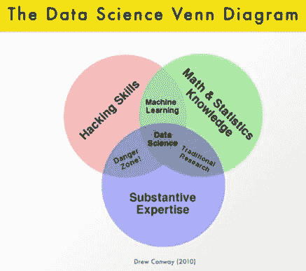

# 如何像数据科学家一样思考以成为数据科学家

> 原文：[`www.kdnuggets.com/2017/03/think-like-data-scientist-become-one.html`](https://www.kdnuggets.com/2017/03/think-like-data-scientist-become-one.html)

评论

我们都读过头条新闻——*数据科学家是最性感的工作，数量不足，薪资非常高*。这个角色被销售得非常成功，以至于数据科学课程和大学项目的数量疯狂增长。在我之前的博客文章之后，我收到了很多人询问如何成为数据科学家——哪些课程最好，应该采取哪些步骤，最快的获得数据科学工作的方式是什么？

我尝试深入思考这个问题，并回顾了我的个人经历——我怎么来到这里？我如何成为一名数据科学家？**我** 是数据科学家吗？我的经历非常复杂——我起初是一个证券分析师，在一家投资公司主要使用 Excel。随后，我逐渐转向银行业的商业智能和多个咨询项目，最终做到了真正的“数据科学”——建立预测模型，处理大数据，处理大量数据并编写代码进行数据分析和机器学习——这在早期被称为“数据挖掘”。

当数据科学的热潮开始时，我试图理解它与我迄今为止所做的有什么不同。我是否应该学习新技能，成为数据科学家，而不是一个在“分析”领域工作的人？

像每个对它着迷的人一样，我开始参加多个课程，阅读数据书籍，进行数据科学专业化（但没有完成……），大量编写代码——我想成为那张（不）著名的数据科学维恩图的中间交集中的**那一个**。我学到的现实是，这些“数据科学”独角兽（*维恩图中传奇般的人物*）很少存在，即使存在——他们通常是对这些领域都有了解的通才，但却是“样样通，样样松”。

尽管我现在认为自己是一名数据科学家——我在亚马逊领导一个极其有才华的数据科学团队，建立机器学习模型，处理“大数据”——我仍然觉得这个行业周围的混乱太多，清晰度却少得多，尤其是对于那些考虑职业转换的人。不要误解我的意思——数据科学有很多非常复杂的分支——如人工智能、机器人技术、计算机视觉、语音识别等——这些领域需要非常深厚的技术和数学知识，甚至可能需要一个……或两个博士学位。但如果你对进入一个几年前被称为商业/数据分析师的数据科学角色感兴趣——这里有四条规则帮助我进入并继续在数据科学领域生存。

**规则 1 – 确定你的优先级和动机。**

对你现在拥有的技能和你希望达到的目标要非常现实——数据科学中有很多不同类型的角色，了解并评估你当前的知识基础是很重要的。比如说，你现在在 HR 部门工作，想要换职业——学习 HR 分析！如果你是律师——了解法律行业中的数据应用。事实是，对洞察力的渴望如此巨大，以至于所有行业和业务职能都开始使用它。如果你已经有了工作，试着理解哪些方面可以通过数据优化或解决，并学习如何自己做到这一点。这将是一个渐进而漫长的转变，但你仍然会有工作，并通过实际操作进行学习。如果你是刚毕业的学生或在校生——你有一个绝佳的机会来发现自己对什么充满热情——也许是电影，也许是音乐，或者是汽车？你无法想象这些行业中雇用了多少数据科学家——他们都对自己所从事的领域充满热情。

**规则 2 – 很好地掌握基础知识。**

尽管每个数据科学领域的具体内容非常不同，但基础知识是相同的。你应该在三个领域建立扎实的基础——基本的数据分析、入门统计学和编码技能。

**数据分析。** 你应该理解并大量练习基本的数据分析技术——什么是表格，如何连接两个表格，分析以这种方式组织的数据的主要技术是什么，如何构建数据集的汇总视图并从中得出初步结论，什么是探索性数据分析，哪些可视化方法可以帮助你理解和学习数据。这是非常基础的，但相信我——掌握了这些，你将具备一项在工作中绝对必需的基本技能。

**统计学。** 同样，要非常好地掌握入门统计学——什么是均值、 медиан、何时使用其中一种而不是另一种，什么是标准差以及在什么情况下使用它没有意义，为什么平均值“欺骗”但仍然是最常用的汇总值等等。当我说“入门”时，我真的指的是“入门”。除非你是一名数学家，并计划成为一名经济计量学家，应用高级统计和计量经济学模型来解释复杂现象——否则，学习高级统计学。如果你没有数学博士学位，就慢慢来，耐心一点，扎实掌握基础统计学和概率论。

**编码。** 当然 – 学习如何编码。这是最常被提及的*陈词滥调*建议，但实际上它是一个有效的建议。你应该从学习如何使用 SQL 查询数据库开始 – 不管你信不信，大多数数据科学团队花费的时间都用于数据提取和准备，其中大量工作是用 SQL 完成的。所以打好基础– 构建你自己的小型数据库，编写一些“*select * from my_table*”的代码行，掌握 SQL 的基础知识。你还应该学习一种（开始时只学习**一种**）数据分析语言 – 无论是 R 还是 Python。两者都很出色，掌握它们确实会有所不同，因为许多（虽然不是全部）职位都要求掌握它们。首先学习你选择的语言的基础（快速提示 – 从学习 R 的 *dplyr* 和 *ggplot2* 包，或 Python 的 *pandas* 和 *Seaborn* 库开始），并学习如何用它进行数据分析。你不需要成为程序员来在这个领域取得成功，关键在于知道如何使用语言进行数据分析 – 你不必成为世界级的黑客才能获得数据科学工作。

**规则 3 – 数据科学是解决问题的过程 – 找到并解决一个问题。**

多年来我学到的一件事是，数据科学家的一个基本要求是总是提出问题和寻找问题。现在我并不建议你全天候这样做，因为你肯定会发疯，但要做好准备，成为问题解决者并不断寻找问题。你会惊讶于外面有多少可用的数据 – 也许你想分析你的支出模式，识别你的电子邮件的情感模式，或者仅仅是构建漂亮的图表来跟踪你所在城市的财务状况。数据科学家负责质疑一切 – 这个活动是否有效，有没有令人担忧的趋势，也许一些产品表现不佳应该被下架，折扣是否合理或者是否过大 – 这些问题成为假设，然后由数据科学家验证或驳回。它们是原材料，也是工作成功的关键，因为你解决的问题越多，你的工作表现就会越好。

**规则 4 – 从“做”开始，而不是计划你将来“何时”做的事情。** 这适用于任何学习行为，但在数据科学中尤其如此。确保你从学习的第一天就开始“做”。仅仅通过阅读“关于”数据科学的内容、了解它“应该”如何进行、从书中复制粘贴数据分析代码并在非常简单的数据集上运行，实际上很容易将实际学习拖延到以后，这些简单的数据集在现实世界中是不会遇到的。

在你学习的每一件事上，一定要确保将其应用到你热爱的领域。这就是魔法发生的地方 – 写下你的第一行代码并看到它失败，陷入困境而不知道接下来该做什么，寻找答案，发现许多不同的解决方案却都无效，努力构建自己的解决方案，最终跨越一个里程碑 – *“啊哈！”* 时刻。这就是实际学习发生的地方。通过实践学习是学习数据科学的唯一途径 – 你不会仅通过阅读来学会骑自行车，对吧？同样的道理，无论你学到了什么，确保你立即应用它，并用真实的数据解决实际问题。

*“如果你花太多时间思考一件事，你永远无法完成它。”* – 这句来自著名武术家布鲁斯·李的名言抓住了这篇文章的精髓。你必须应用你所学到的，并确保你犯自己的错误。

感谢阅读！订阅我的博客 [www.cyborgus.com](http://www.cyborgus.com) 并获取最新更新：

在 Facebook 上关注我的博客更新 – [`www.facebook.com/cyborguscom/`](https://www.facebook.com/cyborguscom/)

在 LinkedIn 上查找我 – [`www.linkedin.com/in/karolisurbonas/`](https://www.linkedin.com/in/karolisurbonas/)

**个人简介：** **[Karolis Urbonas](https://www.linkedin.com/in/karolisurbonas/)**，是亚马逊数据科学部负责人，是一位充满活力的数据高管，拥有建立高绩效数据科学团队和交付战略分析项目的丰富经验。他的博客地址是 [cyborgus.com](http://cyborgus.com/)。

**相关：**

+   数据科学家的思维 – 第一部分

+   如何成为数据科学家 – 第一部分

+   追求卓越的数据科学学习，而不仅仅是为了考试

* * *

## 我们的前三大课程推荐

 1\. [谷歌网络安全证书](https://www.kdnuggets.com/google-cybersecurity) - 快速进入网络安全职业道路。

 2\. [谷歌数据分析专业证书](https://www.kdnuggets.com/google-data-analytics) - 提升你的数据分析技能

 3\. [谷歌 IT 支持专业证书](https://www.kdnuggets.com/google-itsupport) - 支持你组织的 IT 需求

* * *

### 更多相关内容

+   [机器学习不像你的大脑 第一部分：神经元是慢的，……](https://www.kdnuggets.com/2022/04/machine-learning-like-brain-part-one-neurons-slow-slow-slow.html)

+   [SQL LIKE 操作符示例](https://www.kdnuggets.com/2022/09/sql-like-operator-examples.html)

+   [用这些课程构建一个类似 ChatGPT 的聊天机器人](https://www.kdnuggets.com/2023/05/build-chatgptlike-chatbot-courses.html)

+   [机器学习不像你的大脑 第二部分：感知器与神经元](https://www.kdnuggets.com/2022/05/machine-learning-like-brain-part-two-perceptrons-neurons.html)

+   [像老板一样进行 MLOps：无泪机器学习指南](https://www.kdnuggets.com/2023/06/mlops-like-boss-guide-machine-learning-without-tears.html)

+   [像专业人士一样测试：Python Mock 库的逐步指南](https://www.kdnuggets.com/testing-like-a-pro-a-step-by-step-guide-to-pythons-mock-library)
