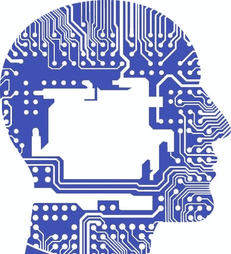
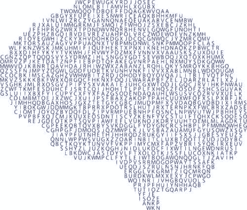

# 如何像数据科学家一样思考

> 原文：[`www.kdnuggets.com/2020/05/think-like-data-scientist-data-analyst.html`](https://www.kdnuggets.com/2020/05/think-like-data-scientist-data-analyst.html)

评论

**由 [Jo Stichbury](https://www.linkedin.com/in/jostichbury/)，自由技术写作人**

数据科学是一个新兴且不断成熟的领域，各种工作职能不断出现，从数据工程和数据分析到机器学习和深度学习。数据科学家必须结合科学、创造性和调查思维，从各种数据集中提取意义，并解决客户面临的根本挑战。

各个领域产生的数据量不断增加——从零售、交通和金融到医疗保健和医学研究。

可用计算能力的增加和人工智能的最新进展将数据科学家——那些将原始数据分析并使其有用的人员——推到了聚光灯下。

自 2016 年以来，数据科学在北美的 50 种最佳职业中排名首位，依据如收入潜力、报告的工作满意度以及 Glassdoor 上的职位空缺数量等标准。

### 像数据科学家一样思考

*图片来自 svgsilh.com*[*CC0 1.0*](https://creativecommons.org/licenses/cc0/1.0/?ref=ccsearch)

那么，成为一个数据科学家需要什么呢？[成为数据科学家](https://www.refinitiv.com/perspectives/future-of-investing-trading/wanted-data-scientists-jobs-commodity-trading/?ref=hackernoon.com)

关于成功所需技能的一些提示，我采访了 Ben Chu，他是 [Refinitiv Labs](https://www.refinitiv.com/en/labs?ref=hackernoon.com)的高级数据科学家。

Chu 在人工智能领域有背景，特别是在语言学、语义学和图形学方面，并在新加坡的 Refinitiv Labs 工作了两年。

### 保持好奇

Chu 在我们采访开始时提到，数据科学家应该像调查员一样思考。

你需要保持好奇和兴奋，提出“为什么？”。“这有点像当侦探，连接点滴，发现新的线索。”

在金融领域，数据科学家从各种数据集中提取意义，以指导客户并帮助他们做出关键决策。

数据科学家必须聚焦于客户希望解决的挑战，并从他们处理的数据中寻找线索。

从与 Chu 的交谈中，我了解到能够调整重点并考虑调查背景是多么重要。

如果完美的分析不能解决根本问题，那就没有用处。有时你需要回过头来，尝试新的方法，并重新审视你要回答的问题。其核心是 [好奇心](https://www.refinitiv.com/perspectives/future-of-investing-trading/how-to-compete-for-data-science-talent/?ref=hackernoon.com)。你需要热爱问题！

### 保持科学

数据科学家使用各种工具来管理他们的工作流程、数据、注释和代码。

“我必须非常勤奋。我需要测量和跟踪我的进展，以便在需要时进行回顾并尝试新的方向，重用先前的工作，并比较结果。”

“保持科学性很重要，要进行观察、实验并记录好进展，以便能够重复你的发现。我需要组织我的观察记录，因此我使用 Notion 作为我的主要工具，将所有的笔记、论文和可视化内容集中在一个地方。”

Chu 强调了记录不仅要涵盖他当前的调查，还要包括所有先前的发现。

“这就像是数据科学的日记。我保持良好的参考点，并在遇到类似情境时回顾它们，以指导我的下一步行动。”

### 发挥创造力

数据科学不仅仅是采用科学的方法。职位名称可能会产生误导；你不一定需要具备科学背景，但你需要能够进行创造性思考。通常，另类思维是解决挑战的关键。

“我必须在解决问题时切换科学思维，并运用创造性思维引导我探索新的和*不同的路径*，[探索新方向](https://www.refinitiv.com/perspectives/big-data/big-data-and-machine-learning-trends-to-watch-in-2020/?ref=hackernoon.com)。”

“逻辑性和科学性思维对帮助我得出结论至关重要，但发挥创造性思维同样重要：我使用成功和失败的例子作为线索来观察新的模式。这一切都与‘编码智能’有关。”

### 学会编码

*图片来源于*[*svgsilh.com*](https://svgsilh.com/?ref=hackernoon.com)

你需要扎实的编码技能，以便能够预处理不同的数据源，使用各种数据处理技术来解决噪声或不完整的数据问题。

你还需要能够创建机器学习管道，这要求你知道如何构建模型，并使用工具和框架来评估和分析其性能。

Chu 使用 Python，[就像大多数数据科学家一样](https://www.refinitiv.com/perspectives/future-of-investing-trading/the-best-python-tools-for-financial-markets/?ref=hackernoon.com)，因为 Python 提供了大量优秀的包来处理和建模数据。

实际上，Glassdoor 在 2017 年上半年对其网站上发布的 10,000 个数据科学家职位进行了抽样调查，发现三个特别的技能——Python、R 和 SQL——构成了数据科学大多数职位的基础。

Ben Chu 的团队依赖开源机器学习包，如 Tensorflow、Pytorch 和 BERT。

“我们主要使用 Confluence 作为文档工具；使用 MLFlow、Amazon Sagemaker、Scikit-Learn、Tensorflow、PyTorch 和 BERT 进行机器学习；使用 Apache Spark 在大型数据集上构建高速数据管道；使用 Athena 作为我们的数据库来存储处理后的数据。”

“我们还使用 Superset 连接数据，更方便地构建仪表板以输出图表，这使得操作更直观。”

### 不要担心‘冒名顶替综合症’。

朱目前是 Refinitiv Labs 的高级数据科学家，但他小时候想成为一名音乐家，对语言充满兴趣。“在自然语言处理领域，我需要对语言学有深入了解，特别是语义学和语言的细微差别。”

他解释说，数据科学团队需要各种技能——他和他的同事们从不同的背景中发展出了重叠的技能。

“你需要的技能将取决于你所工作的领域。例如，我需要对金融有良好的理解。

“例如，通过建立异常检测方法，数据分析正被用于减少欺诈，以检测交易数据中的欺诈‘行为’作为不规则模式。

“像我这样的数据科学家需要熟练掌握如何处理各种孤立的金融数据。了解如何组合这些数据至关重要，因为没有这种理解，我无法构建成功的模型。”

进入数据科学领域并不一定需要成为计算机科学家或数学家。没有人能在所有领域都有所有的专业知识。你可以来自法律、经济或科学背景。关键在于你的思维方式。

如果你能灵活和系统地处理问题，你将能够在使用工具、框架和数据集的过程中逐渐熟悉这些具体细节。

### 如何开始

对于那些希望提升数据科学技能的人，朱提供了一些实用的建议，尽管 COVID-19 带来了干扰，但这些建议你仍然可以轻松采纳。

你可以寻找研究社区，参加网络研讨会，并在线找到培训课程。一旦面对面的网络交流再次成为可能，朱建议你积极参与 [数据科学社区](https://developers.refinitiv.com/?ref=hackernoon.com)。

“参加 Meetups 和黑客马拉松，这将帮助你建立强大的网络，讨论你的想法，激发你的研究灵感，并解答你的问题。”

此外，请记住，数据科学领域是新兴的，仍在发展中。

*各种不同的职位名称正在出现，例如数据科学家、数据工程师和数据分析师，还有*[*机器学习和深度学习工程师*](https://www.refinitiv.com/perspectives/topic/ai-machine-learning/?ref=hackernoon.com)*。你* 可能会发现某些角色更适合你的兴趣和技能。

发掘你的好奇心和创造力，提升你的 Python 技能，进入数据科学领域吧！

本文最初发表于 [Refinitiv Perspectives](https://www.refinitiv.com/perspectives/big-data/how-to-think-like-a-data-scientist/?ref=hackernoon.com) 于 2020 年 4 月初。

**个人简介：[Jo Stichbury](https://www.linkedin.com/in/jostichbury/)** 是一名自由职业技术作家。

[原文](https://hackernoon.com/how-to-think-like-a-data-scientist-or-data-analyst-7s983yg9)。经许可转载。

**相关内容：**

+   用 NLP 发现争议

+   数据科学家的 4 种现实职业选择

+   如何在理想公司获得数据科学家职位

### 相关主题

+   [成为优秀数据科学家所需的 5 项关键技能](https://www.kdnuggets.com/2021/12/5-key-skills-needed-become-great-data-scientist.html)

+   [每个初学者数据科学家应掌握的 6 种预测模型](https://www.kdnuggets.com/2021/12/6-predictive-models-every-beginner-data-scientist-master.html)

+   [2021 年最佳 ETL 工具](https://www.kdnuggets.com/2021/12/mozart-best-etl-tools-2021.html)

+   [成功数据科学家的 5 个特征](https://www.kdnuggets.com/2021/12/5-characteristics-successful-data-scientist.html)

+   [每个数据科学家都应该了解的三个 R 语言库（即使你使用 Python）](https://www.kdnuggets.com/2021/12/three-r-libraries-every-data-scientist-know-even-python.html)

+   [停止学习数据科学以寻找目标，并寻找目标以……](https://www.kdnuggets.com/2021/12/stop-learning-data-science-find-purpose.html)
