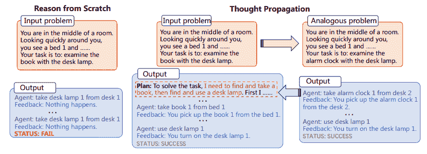

# 思维传播：大型语言模型的类比推理方法

> 原文：[`www.kdnuggets.com/thought-propagation-an-analogical-approach-to-complex-reasoning-with-large-language-models`](https://www.kdnuggets.com/thought-propagation-an-analogical-approach-to-complex-reasoning-with-large-language-models)

## 关键要点

+   思维传播（TP）是一种新颖的方法，可以提升大型语言模型（LLMs）的复杂推理能力。

+   TP 利用类比问题及其解决方案来改善推理，而不是让 LLMs 从零开始推理。

+   各种任务的实验表明，TP 在性能上显著优于基线方法，改进范围从 12% 到 15%。

* * *

## 我们的前三名课程推荐

 1\. [谷歌网络安全证书](https://www.kdnuggets.com/google-cybersecurity) - 快速进入网络安全职业轨道。

 2\. [谷歌数据分析专业证书](https://www.kdnuggets.com/google-data-analytics) - 提升你的数据分析技能

 3\. [谷歌 IT 支持专业证书](https://www.kdnuggets.com/google-itsupport) - 支持你所在组织的 IT

* * *

> TP 首先促使 LLMs 提出并解决一组与输入问题相关的类比问题。然后，TP 重用类比问题的结果，以直接得出新的解决方案或推导出知识密集型执行计划来修正从零开始获得的初始解决方案。

# 介绍

大型语言模型（LLMs）的多样性和计算能力无可否认，但它们并非没有限制。LLMs 面临的最显著且持续的挑战之一是它们的通用问题解决方法，即每遇到一个新任务时都从第一原则推理。这是有问题的，因为它允许高度的适应性，但也增加了出错的可能性，特别是在需要多步骤推理的任务中。

“从头推理”的挑战在于那些需要多步骤逻辑和推理的复杂任务。例如，如果要求 LLM 在一个互联点的网络中找到最短路径，它通常不会利用先前的知识或类比问题来寻找解决方案。相反，它会尝试孤立地解决问题，这可能导致次优结果甚至明显错误。进入[思想传播](https://arxiv.org/abs/2310.03965v2)（TP），这是一种旨在增强 LLM 推理能力的方法。TP 旨在通过允许 LLM 从类比问题及其相应解决方案的储备中汲取经验，克服 LLM 固有的局限性。这种创新的方法不仅提高了 LLM 生成解决方案的准确性，还显著增强了其处理多步骤复杂推理任务的能力。通过利用类比的力量，TP 提供了一个框架，放大了 LLM 的固有推理能力，使我们更接近实现真正智能的人工系统。

# 理解思想传播

思想传播包括两个主要步骤：

1.  首先，LLM 被提示提出并解决一组与输入问题相关的类比问题

1.  接下来，这些类比问题的解决方案被用来直接产生新的解决方案或修正初步解决方案

识别类比问题的过程使得 LLM 能够重复使用问题解决策略和解决方案，从而提升其推理能力。TP 与现有的提示方法兼容，提供了一个可泛化的解决方案，可以被纳入各种任务中，而无需进行显著的任务特定工程。

**图 1**：思想传播过程（图片来自论文）

此外，TP 的适应性不应被低估。它与现有提示方法的兼容性使其成为一个高度通用的工具。这意味着 TP 不限于任何特定类型的问题解决领域。这为任务特定的微调和优化打开了激动人心的途径，从而提升了 LLM 在广泛应用中的实用性和有效性。

# 实施思想传播

思想传播的实施可以集成到现有 LLM 的工作流程中。例如，在最短路径推理任务中，TP 可以首先解决一组更简单的类比问题，以了解各种可能的路径。然后，它会利用这些见解来解决复杂问题，从而增加找到最佳解决方案的可能性。

**示例 1**

+   **任务**：最短路径推理

+   **类比问题**：点 A 和 B 之间的最短路径，点 B 和 C 之间的最短路径

+   **最终解决方案**：考虑到类比问题的解决方案，从点 A 到 C 的最佳路径

**示例 2**

+   **任务**：创造性写作

+   **类似问题**：写一个关于友谊的短篇故事，写一个关于信任的短篇故事

+   **最终解决方案**：写一个融合友谊和信任主题的复杂短篇故事

该过程首先涉及解决这些类似问题，然后利用获得的见解来处理复杂任务。这种方法在多个任务中证明了其有效性，展示了性能指标的显著改进。

思维传播的影响超出了仅仅改善现有指标的范畴。这种提示技术有可能改变我们理解和应用大语言模型的方式。该方法强调从孤立的、原子化的问题解决转向更整体、相互关联的方法。它促使我们考虑大语言模型如何不仅从数据中学习，还从问题解决的过程本身中学习。通过不断更新对类似问题的解决方案的理解，配备思维传播的大语言模型更好地准备应对不可预见的挑战，使它们在快速变化的环境中更具韧性和适应性。

# 结论

思维传播是增强大语言模型能力的提示方法工具箱中的一项有前景的补充。通过允许大语言模型利用类似问题及其解决方案，思维传播提供了一种更细致有效的推理方法。实验验证了其有效性，使其成为提高各种任务中大语言模型性能的候选策略。思维传播最终可能代表了在寻求更强大 AI 系统中的一项重要进步。

****[马修·梅奥](https://www.kdnuggets.com/wp-content/uploads/./profile-pic.jpg)**** ([**@mattmayo13**](https://twitter.com/mattmayo13)) 拥有计算机科学硕士学位和数据挖掘研究生文凭。作为[KDnuggets](https://www.kdnuggets.com/)和[Statology](https://www.statology.org/)的管理编辑以及[Machine Learning Mastery](https://machinelearningmastery.com/)的贡献编辑，Matthew 旨在使复杂的数据科学概念变得易于理解。他的专业兴趣包括自然语言处理、语言模型、机器学习算法以及探索新兴的人工智能。他致力于在数据科学社区中普及知识。Matthew 从 6 岁起就开始编程。

### 更多相关话题

+   [揭示链式思维提示在大语言模型中的威力](https://www.kdnuggets.com/2023/07/power-chain-thought-prompting-large-language-models.html)

+   [顶级开源大语言模型](https://www.kdnuggets.com/2022/09/john-snow-top-open-source-large-language-models.html)

+   [更多免费大语言模型课程](https://www.kdnuggets.com/2023/06/free-courses-large-language-models.html)

+   [了解大语言模型](https://www.kdnuggets.com/2023/03/learn-large-language-models.html)

+   [John Snow Labs 推出的医疗专用大语言模型](https://www.kdnuggets.com/2023/04/john-snow-introducing-healthcare-specific-large-language-models-john-snow-labs.html)

+   [什么是大语言模型，它们是如何工作的？](https://www.kdnuggets.com/2023/05/large-language-models-work.html)
