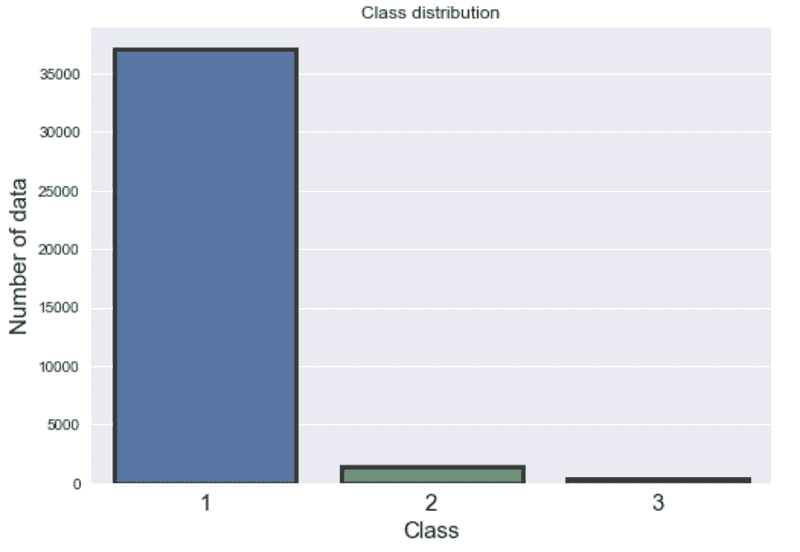
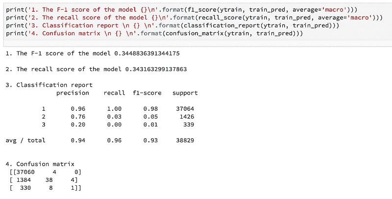
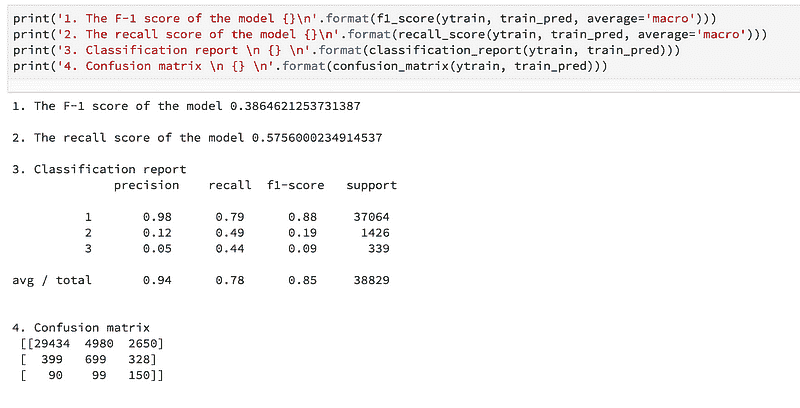
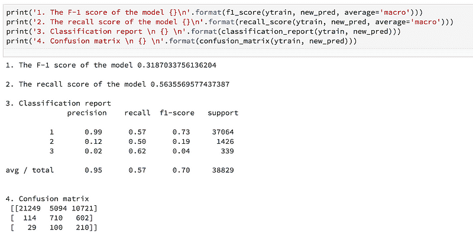

# 提升机器学习模型在不平衡数据集上的表现的三种技术

> 原文：[`www.kdnuggets.com/2018/06/three-techniques-improve-machine-learning-model-performance-imbalanced-datasets.html`](https://www.kdnuggets.com/2018/06/three-techniques-improve-machine-learning-model-performance-imbalanced-datasets.html)

 comments

**由 [Sabber Ahamed](https://www.linkedin.com/in/sabber-ahamed/)，计算地球物理学家和机器学习爱好者**


这个项目是我最近的一次“机器学习工程师”职位面试技能测试的一部分。我需要在 48 小时内完成这个项目，其中包括用 LaTeX 撰写 10 页报告。数据集具有类别且高度不平衡。这个项目的主要目标是处理数据不平衡问题。在以下小节中，我将描述我用来克服数据不平衡问题的三种技术。

*首先，让我们开始熟悉数据集：*

**数据集：** 训练数据中有三个标签 [1, 2, 3]，这使得问题成为一个多类别问题。训练数据集有 17 个特征和 38829 个数据点。而在测试数据中，有 16 个特征没有标签，并且有 16641 个数据点。训练数据集非常不平衡。大多数数据属于类别 1（95%），而类别 2 和类别 3 分别有 3.0% 和 0.87% 的数据。由于数据集没有任何空值且已进行缩放，因此我没有进行进一步处理。由于一些内部原因，我不会分享数据集，但会分享详细的结果和技术。以下图展示了数据不平衡情况。



图 1：该图展示了训练数据集中的数据不平衡情况。大多数数据属于类别 1（95%），而类别 2 和类别 3 分别有 3.0% 和 0.87% 的数据。

**算法：** 在初步观察后，我决定使用随机森林（RF）算法，因为它优于其他算法，如支持向量机、Xgboost、LightGBM 等。RF 是一种集成分类器，它使用多个这样的单棵树来进行预测。选择 RF 的原因有几点：

1.  RF 对过拟合具有鲁棒性（因此解决了单棵决策树的一个重大缺点）。

1.  参数化保持相当直观和简单。

1.  有许多成功的案例表明，随机森林算法在我们这个项目中的高度不平衡数据集上表现良好。

1.  我有该算法的先前实现经验。

为了找到最佳参数，我使用 *scikit-sklearn* 实现的 GridSearchCV 执行了指定参数值的网格搜索。更多详细信息可以在 [Github](https://github.com/msahamed/handle_imabalnce_class) 上找到。

**为了解决数据不平衡问题，我使用了以下三种技术：**

**A. 使用集成交叉验证 (CV):** 在这个项目中，我使用交叉验证来验证模型的稳健性。整个数据集被分为五个子集。在每次交叉验证中，5 个子集中有 4 个用于训练，剩下的一个用于验证模型。在每次交叉验证中，模型还会对测试数据进行预测（预测概率，而不是类别）。交叉验证结束时，我们得到了五组测试预测概率。最后，我对所有类别的预测概率取平均。模型的训练性能稳定，并且在每次交叉验证中几乎保持恒定的召回率和 F1 分数。这项技术帮助我在一次 Kaggle 竞赛中很好地预测了测试数据，我在 5355 名参赛者中排名第 25 位，属于前 1%。以下部分代码片段展示了集成交叉验证的实现：

```py
for j, (train_idx, valid_idx) in enumerate(folds):

                X_train = X[train_idx]
                Y_train = y[train_idx]
                X_valid = X[valid_idx]
                Y_valid = y[valid_idx]

                clf.fit(X_train, Y_train)

                valid_pred = clf.predict(X_valid)
                recall  = recall_score(Y_valid, valid_pred, average='macro')
                f1 = f1_score(Y_valid, valid_pred, average='macro')

                recall_scores[i][j] = recall
                f1_scores[i][j] = f1

                train_pred[valid_idx, i] = valid_pred
                test_pred[:, test_col] = clf.predict(T)
                test_col += 1

                ## Probabilities
                valid_proba = clf.predict_proba(X_valid)
                train_proba[valid_idx, :] = valid_proba
                test_proba  += clf.predict_proba(T)

            test_proba /= self.n_splits
```

**B. 设置类别权重/重要性:** 成本敏感学习是使随机森林更适合从高度不平衡数据中学习的众多方法之一。随机森林倾向于对多数类别有偏见。因此，对少数类别误分类施加高额惩罚可能会有帮助。由于这项技术已被证明能提高模型性能，我为少数类别分配了较高的权重（即，较高的误分类成本）。然后，将类别权重纳入随机森林算法中。我根据类别 1 和类别中的数据集数量之比来确定类别权重。例如，类别 1 和类别 3 的数据集数量之比约为 110，类别 1 和类别 2 的比率约为 26。之后，我稍微调整了这些数值，以在试验和错误的基础上提高模型性能。以下代码片段展示了不同类别权重的实现。

```py
from sklearn.ensemble import RandomForestClassifier
class_weight = dict({1:1.9, 2:35, 3:180})

rdf = RandomForestClassifier(bootstrap=True,
            class_weight=class_weight, 
            criterion='gini',
            max_depth=8, max_features='auto', max_leaf_nodes=None,
            min_impurity_decrease=0.0, min_impurity_split=None,
            min_samples_leaf=4, min_samples_split=10,
            min_weight_fraction_leaf=0.0, n_estimators=300,
            oob_score=False,
            random_state=random_state,
            verbose=0, warm_start=False)
```

**C. 过度预测标签而非欠预测:** 这是一种可选的技术。我应用了这种技术，因为我被要求实现。对我来说，这种方法在提高少数类别的性能方面非常有效。简而言之，该技术是对模型的误分类类别 3 给予最大惩罚，对类别 2 给予较少的惩罚，对类别 1 给予最少的惩罚。

为了实现该方法，我为每个类别调整了概率阈值。为此，我按照递增顺序设置了类别 3、类别 2 和类别 1 的概率（即，类别 3 = 0.25，类别 2 = 0.35，类别 1 = 0.50），以迫使模型过度预测类别。该算法的详细实现可以在本项目的[Github 页面](https://github.com/msahamed/handle_imabalnce_class)找到。

### 最终结果：

以下结果展示了上述三种技术如何帮助提高模型性能。

**1. 使用集成交叉验证的结果：**



**2. 使用集成交叉验证 + 类别权重的结果：**



**3\. 使用集成交叉验证 + 类别权重 + 过度预测标签的结果：**



### **结论**

由于我在实施该技术方面的经验有限，最初过度预测对我来说似乎很棘手。然而，研究该方法帮助我找到了解决问题的方法。由于时间有限，我无法专注于模型的微调和特征工程。还有许多改进模型的空间。例如，删除不必要的特征和通过特征工程添加一些额外特征。我还尝试了 LightGBM 和 XgBoost。但在这段时间里，我发现随机森林的表现优于其他算法。我们可能会尝试包括神经网络在内的其他算法来改进模型。最后，我要说的是，从这次数据挑战中，我学会了如何以良好的组织方式处理不平衡数据。

非常感谢您的阅读。完整代码可以在 [Github](https://github.com/msahamed/handle_imabalnce_class) 上找到。如果您有任何问题或这篇文章需要更正，请告诉我。

**简介: [Sabber Ahamed](https://www.linkedin.com/in/sabber-ahamed/)** 是 [xoolooloo.com](https://www.xoolooloo.com/) 的创始人。计算地球物理学家和机器学习爱好者。

[原文](https://medium.com/@sabber/working-with-highly-imbalanced-datasets-in-machine-learning-projects-c70c5f2a7b16)。已获得许可转载。

**相关：**

+   处理不平衡数据的 7 种技术

+   从不平衡类别中学习

+   处理不平衡类别、支持向量机、随机森林和决策树的 Python 实现

* * *

## 我们的前三大课程推荐

 1\. [谷歌网络安全证书](https://www.kdnuggets.com/google-cybersecurity) - 快速进入网络安全职业生涯。

 2\. [谷歌数据分析专业证书](https://www.kdnuggets.com/google-data-analytics) - 提升您的数据分析技能

 3\. [谷歌 IT 支持专业证书](https://www.kdnuggets.com/google-itsupport) - 支持您的组织的 IT

* * *

### 相关主题

+   [处理不平衡数据的 7 种技术](https://www.kdnuggets.com/2017/06/7-techniques-handle-imbalanced-data.html)

+   [KDnuggets 新闻，8 月 31 日：完整的数据科学学习路线图…](https://www.kdnuggets.com/2022/n35.html)

+   [无监督解缠表示学习在类别不平衡数据集中的应用…](https://www.kdnuggets.com/2023/01/unsupervised-disentangled-representation-learning-class-imbalanced-dataset-elastic-infogan.html)

+   [克服现实世界场景中的数据不平衡挑战](https://www.kdnuggets.com/2023/07/overcoming-imbalanced-data-challenges-realworld-scenarios.html)

+   [每位数据科学家都应该知道的三个 R 语言库（即使你使用 Python）](https://www.kdnuggets.com/2021/12/three-r-libraries-every-data-scientist-know-even-python.html)

+   [无极限：了解 JetBlue 如何利用 Monte Carlo 和 Snowflake…](https://www.kdnuggets.com/2022/12/monte-carlo-jetblue-snowflake-build-trust-improve-model-accuracy.html)
