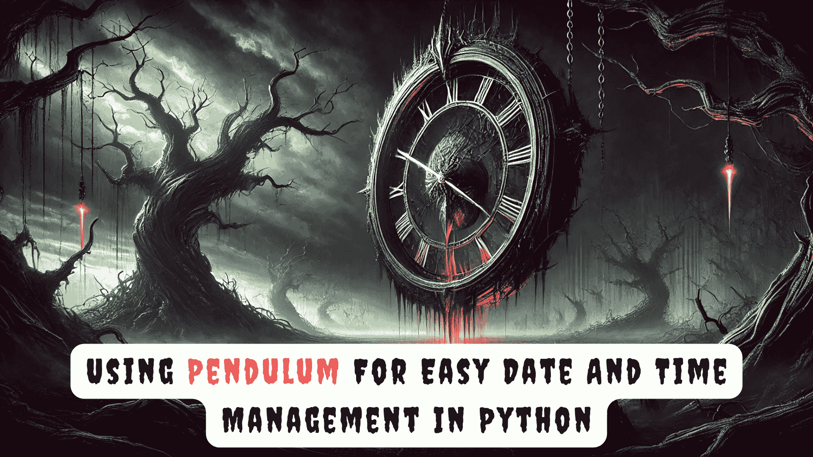

# 滴答声：在 Python 中使用 Pendulum 轻松管理日期和时间

> 原文：[`www.kdnuggets.com/tick-tock-using-pendulum-for-easy-date-and-time-management-in-python`](https://www.kdnuggets.com/tick-tock-using-pendulum-for-easy-date-and-time-management-in-python)



图片由作者提供 | DALLE-3 和 Canva

现在，很多应用程序都是时间敏感的，因此需要有效的日期和时间管理。Python 提供了许多处理此任务的库，而 Pendulum 是其中最有效的一个。

* * *

## 我们的前三大课程推荐

 1\. [Google 网络安全证书](https://www.kdnuggets.com/google-cybersecurity) - 快速进入网络安全职业生涯。

 2\. [Google 数据分析专业证书](https://www.kdnuggets.com/google-data-analytics) - 提升你的数据分析能力

 3\. [Google IT 支持专业证书](https://www.kdnuggets.com/google-itsupport) - 支持你的组织进行 IT 工作

* * *

Pendulum 继承了其父`DateTime`库，并提供了更直观的接口。该库提供了简单的 API、自动时区处理以及更高级的功能，如本地化、易读的差异、时间段和持续时间，这些在原生`DateTime`库中并不容易获得。它还提高了时区管理和日期操作的有效性和便捷性。你是否迫不及待地想了解 Pendulum 了？让我们开始吧。

## 开始使用 Pendulum

第一步是安装 Pendulum。打开你的终端并运行以下命令：

```py
pip install pendulum
```

接下来，导入库以使用它：

```py
import pendulum
```

接下来，让我们讨论 Pendulum 提供的一些最有用的功能。

#### 实例化

使用 Pendulum 创建`DateTime`对象非常简单。你可以使用`pendulum.datetime()`函数来创建你所需的对象。以下是一个简单的示例：

```py
# Create a DateTime object
dt = pendulum.datetime(year=2024, month=7, day=9, hour=12, minute=34, second=56) 
print(dt)
```

**输出：**

```py
2024-07-09 12:34:56+00:00
```

你还可以使用`now()`获取你所在地区的当前 DateTime：

```py
# Get current date and time
now = pendulum.now()
print(now)
```

**输出：**

```py
2024-07-17 20:07:20.149776+00:00
```

#### 辅助方法

辅助方法（`set()`、`on()`和`at()`）允许你修改现有`DateTime`对象的属性。它们会创建一个具有指定属性更改的新对象，而不是修改原始对象。一个快速示例可以帮助我们理解这个概念。从创建一个`DateTime`对象开始：

```py
dt = pendulum.now()
print(dt)
**# Output => 2024-07-17 20:07:20.149776+00:00**
```

现在，让我们使用`set()`方法，它允许你同时修改日期和时间：

```py
change_dt= dt.set(year=2001, month=4, hour=6, minute=7)
print(change_dt)
**# Output => 2001-04-17 06:07:20.149776+00:00**
```

另外，你可以使用`on()`来更改`DateTime`对象的日期，使用`at()`来更改时间。方法`on()`有三个必需的参数，即“年”、“月”和“日”，而方法`at()`只有一个必需的位置参数，即“小时”。

这是一个快速示例，以帮助你理解这个概念：

```py
# Using on to change the date
change_date= dt.on(year=2021,month=3,day=5)
print("Changed date:",change_date)

# Using at to change the time
change_time= dt.at(hour=5,second=50)
print("Changed time:",change_time)
```

**输出：**

```py
Changed date: 2021-03-05 20:07:20.149776+00:00
Changed time: 2024-07-17 05:00:50+00:00
```

#### 日期时间格式化

无论您需要日期、时间还是自定义格式，Pendulum 都提供了许多方法来根据任务需求格式化日期和时间。让我们通过一个示例来理解这些不同类型的格式化：

```py
dt = pendulum.now()
print("Date and Time without Formatting:", dt)

# Formatting only the date
formatted_date = dt.to_date_string()
print("Formatted Date:", formatted_date)

# Formatting only the time
formatted_time = dt.to_time_string()
print("Formatted Time:", formatted_time)

# Custom formatting
custom_format = dt.format('dddd, MMMM Do, YYYY, h:mm:ss A')
print("Custom Formatted DateTime:", custom_format)
```

**输出：**

```py
Date and Time without Formatting: 2024-07-17 20:14:58.721312+00:00
Formatted Date: 2024-07-17
Formatted Time: 20:14:58
Custom Formatted DateTime: Wednesday, July 17th, 2024, 8:14:58 PM
```

用于格式化的函数解释如下：

+   **to_date_string():** 以 YYYY-MM-DD 格式格式化日期

+   **to_time_string():** 以 24 小时格式格式化时间，例如“HH: MM: SS”格式

+   **format('dddd, MMMM Do YYYY, h: mm: ss A'):** 按如下方式格式化 DateTime 对象的自定义规格：

    +   dddd：星期几的全名，例如我们示例中的星期二

    +   MMMM：月份的全名，例如我们示例中的七月

    +   Do：带序数后缀的月份中的日期，例如我们示例中的第 16 日

    +   YYYY：年份，例如我们示例中的 2024

    +   h: mm: ss A：12 小时制格式，带 AM/PM，例如我们示例中的 7:13:23 PM

#### 本地化

本地化涉及按照特定地区和文化惯例表示日期和时间。这可以通过`format`方法的`locale`关键字或`set_locale()`方法轻松完成。让我们来探索这两种方法：

```py
dt = pendulum.now()

# Format to French
dt_french = dt.format('dddd, MMMM Do YYYY, h:mm:ss A',locale='fr')
print('French DateTime:',dt_french)

# Format to Dutch
pendulum.set_locale('nl')
dt_dutch =dt.format('dddd, MMMM Do YYYY, h:mm:ss A')
print('Dutch DateTime:',dt_dutch)
```

**输出：**

```py
French DateTime: mercredi, juillet 17e 2024, 8:17:02 PM
Dutch DateTime: woensdag, juli 17e 2024, 8:17:02 p.m.
```

#### 转换时区

Pendulum 支持时间区数据库中列出的所有时区。您可以通过一个命令轻松切换不同的时区。考虑将您所在地区的当前日期和时间转换为英国伦敦的日期和时间。可以如下所示：

```py
dt = pendulum.now()
print("Date and Time in my region:", dt)

# Convert the regional time to London's time. Follow the format in_timezone(City/Continent)
london_time = dt.in_timezone('Europe/London')
print("Date and Time in London:", london_time)
```

**输出：**

```py
Date and Time in my region: 2024-07-17 20:26:02.525060+00:00
Date and Time in London: 2024-07-17 21:26:02.525060+01:00
```

#### 加法与减法

该库提供了简单的`add()`和`subtract()`方法来计算未来和过去的日期和时间。以下是一个供您参考的示例：

```py
# Add 5 days and 2 hours
dt_future= pendulum.now().add(days=5, hours=2)
print("Adding date and time:",dt_future)

# Subtract 2 weeks and 5 minutes
dt_past = pendulum.now().subtract(weeks=2,minutes=5)
print("Subtracting date and time:",dt_past)
```

**输出：**

```py
Adding date and time: 2024-07-22 22:28:01.070802+00:00
Subtracting date and time: 2024-07-03 20:23:01.071146+00:00
```

#### 类人差异

您可以使用`diff_for_humans()`函数以人类可读的差异查看加法和减法的输出。让我们通过一个示例来深入了解这个有趣的函数。

```py
# Create a DateTime object
dt=pendulum.now()

# Subtract 2 months 
dt_past = dt.subtract(months=2).diff_for_humans()
print(dt_past)
**# Output => 2 months ago**

# Add 5 years 
dt_future= dt.add(years=5).diff_for_humans()
print(dt_future)
**# Output => in 5 years**
```

您可以通过在`diff_for_humans()`函数中设置`absolute = True`来移除单词**ago**和**in**。默认情况下，它是`False`。以下是如何操作：

```py
difference_dt=dt.add(days=2).diff_for_humans(absolute=True)
print(difference_dt)
**# Output => 2 days**
```

## 总结

总结一下，Pendulum 是一个用于日期和时间管理的有用库。该库对 Python 的原生`DateTime`库进行了许多改进，并解决了许多复杂性。我认为 Pendulum 最好的特点之一是其灵活性和高效的时区管理。您可以通过访问[Pendulum 文档](https://pendulum.eustace.io/docs/)来探索更多功能。

**[](https://www.linkedin.com/in/kanwal-mehreen1/)**[Kanwal Mehreen](https://www.linkedin.com/in/kanwal-mehreen1/)** Kanwal 是一名机器学习工程师和技术作家，对数据科学以及人工智能与医学的交集充满热情。她共同撰写了电子书《利用 ChatGPT 最大化生产力》。作为 2022 年 APAC 的 Google Generation Scholar，她倡导多样性和学术卓越。她还被认可为 Teradata 多样性科技学者、Mitacs 全球研究学者和哈佛 WeCode 学者。Kanwal 是变革的热忱倡导者，创立了 FEMCodes，以赋能女性进入 STEM 领域。**

### 更多相关主题

+   [使用 NumPy 进行日期和时间计算](https://www.kdnuggets.com/using-numpy-to-perform-date-and-time-calculations)

+   [如何在 Python 中构建日期特征](https://www.kdnuggets.com/2021/08/engineer-date-features-python.html)

+   [保持数据科学家技能更新的 5 个项目创意](https://www.kdnuggets.com/2022/07/5-project-ideas-stay-uptodate-data-scientist.html)

+   [Python 数据预处理的简单指南](https://www.kdnuggets.com/2020/07/easy-guide-data-preprocessing-python.html)

+   [用 Python 在 10 个简单步骤中构建 AI 应用](https://www.kdnuggets.com/build-an-ai-application-with-python-in-10-easy-steps)

+   [用 Python 在 7 个简单步骤中构建命令行应用](https://www.kdnuggets.com/build-a-command-line-app-with-python-in-7-easy-steps)
